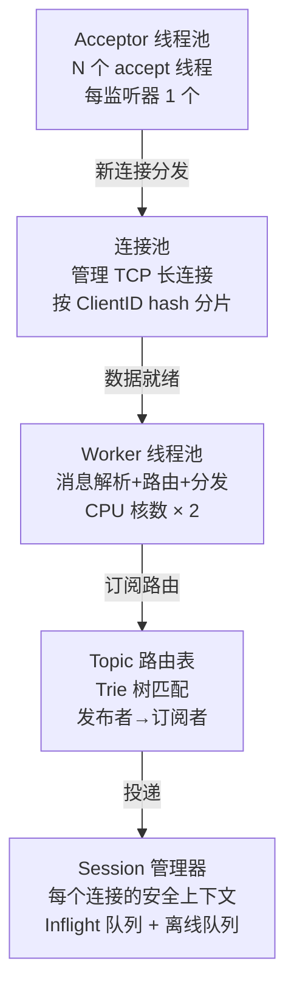
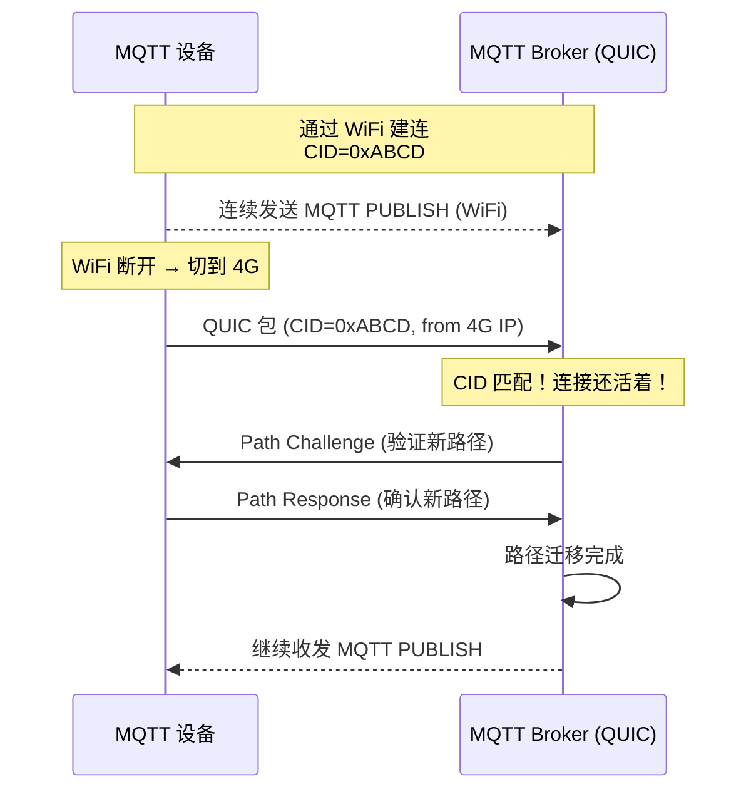

# 一、百万级 MQTT Broker 内部架构——EMQX 的设计

## 1.1 单机十万连接——"一个连接一个线程"必死

MQTT 不同于 HTTP——HTTP 是短连接（请求-响应-断连），MQTT 是**长连接**（设备上线后一直保持）。一万个设备 = 一万个 TCP 长连接。如果用"一个连接一个线程"模型，一万个线程的上下文切换就会吃掉大部分 CPU。

EMQX（开源 MQTT Broker）和 HiveMQ（商业 MQTT Broker）的共识是：**用一个或少量的 OS 线程管理海量长连接——event-driven + M:N 调度**。



**三层线程模型**：

```
① Acceptor 线程（N 个，每个监听端口 1 个）
   accept() TCP 连接 → 创建 MQTT 连接上下文 → 将 fd 注册到 epoll
   → 只有 CPU 的 1% 花在这里

② epoll + Worker 线程池（CPU 核数 × 2 个）
   每个 Worker 绑定一个 epoll 实例
   一个连接被绑定到一个 Worker 的 epoll 上（连接迁移时可能切换 Worker）
   Worker 负责：读 MQTT 消息 → 解析 → 路由 → 写回响应

③ 管理线程（定时器/监控/统计）
   超时检测（Keep Alive）、Session 清理、QoS 2 重试调度
```

**面试追问：为什么不是"一个 epoll + 所有 Worker 共享"？** 多个线程共享一个 epoll → 每次 epoll_wait 都要加锁 → 锁竞争成为瓶颈。每个 Worker 绑定自己的 epoll → Worker 之间不需要锁，只在自己的 epoll 上事件循环。

## 1.2 Session 管理——百万连接的"状态怎么存"

```
每个 MQTT 长连接在 Broker 内部对应一个 Session 对象。百万连接 = 百万个 Session 的内存管理。

Session 的存储结构：

┌──────────────────── Session 对象 ────────────────────┐
│  ClientID (固定，如 "sensor-001234")                  │
│  连接状态：CONNECTED / DISCONNECTED                    │
│  订阅列表：["/sensor/+/temperature" → QoS 1]          │
│                                                       │
│  Inflight Queue（正在投递中，等 PUBACK/PUBCOMP）：     │
│    [Msg#1(PktID=123, QoS=1), Msg#2(PktID=456, QoS=2)]│
│                                                       │
│  Offline Queue（离线期间暂存的 QoS 1/2 消息）：        │
│    [Msg#3, Msg#4, Msg#5...]                           │
│                                                       │
│  Will Message（遗嘱——设备异常断线时才发布）            │
└───────────────────────────────────────────────────────┘

内存优化：
  - 断开连接的 Session（DISCONNECTED）→ 只保留 Inflight/Offline Queue
  - 长连接 Session 的"连接上下文"尽可能小（不存 Client 的证书/配置——查共享存储）
  - 离线超过 Session Expiry 的 Session → 丢弃（mqtt5.0）或标记为 Zombie 等待手动清理（3.1.1）
```

**内存估算**：每个 Session 大约 3-10KB（取决会话中缓存的消息数量）。百万连接 = 3-10GB（活跃）+ 离线 Session 的队列。EMQX 通过 **分层存储** 解决离线队列的无限膨胀——活跃连接用内存队列，离线阶段的消息溢出到磁盘（RocksDB/Mnesia）。

## 1.3 Topic 路由—Trie 树的高效匹配

```
为什么不用 HashMap？因为 MQTT Topic 支持通配符 (+/#)

Topic 示例：
  /sensor/+/temperature    ← + 匹配任意单层
  /building/#              ← # 匹配任意多层
  /sensor/+/+/status

HashMap 要存"所有可能的通配符匹配结果"→ 实际不可能

Trie 树的解法：

         root
         /
      sensor
      /    \
    room301  +           ← "+" 匹配任意节点
    /         \
  temperature temperature
  (匹配1个客户端) (匹配所有 room 的 temperature)

Trie 树的优势：
  - 订阅时把 Topic 插入 Trie → O(N) = Topic 的层级数（通常 ≤ 5）
  - 发布时从 Trie 中找匹配的订阅者 → O(N) × 通配分（但实际层级数极少）
  - 内存占用 ≈ 所有订阅 Topic 的唯一前缀长度

EMQX 优化的 Trie 实现：每个节点用 HashMap 存子节点（不用数组，因为子节点数量不可预测）
```

## 1.4 集群横向扩展

```
EMQX 集群不是"所有节点共享一个 MQTT 连接池"——它是无主架构：

每个 EMQX 节点：
  - 独立接受 MQTT 连接（基于 ClientID hash 到不同节点）
  - 独立维护自己负责的 Session（不共享）
  - 共享的是"Topic 路由表"（通过 Mnesia/etcd 分布式同步）

跨节点的消息路由：
  ① 发布者连接节点 A → 发布到 Topic X
  ② 节点 A 查路由表 → 发现订阅了 Topic X 的设备在节点 B 上
  ③ 节点 A 通过内部 EPMD 协议把消息转发到节点 B
  ④ 节点 B 收到 → 发送给自己的本地 Subscriber

连接在集群中的分布：
  负载均衡器（L4/Nginx Stream）→ 根据 ClientID hash 或最小连接数分发 MQTT 连接
  → 设备 TCP 直连到具体的 EMQX 节点
```

---

# 二、MQTT over QUIC——TCP 的弱网问题与 QUIC 的解法

## 2.1 TCP 在 IoT 场景的三个硬伤

**硬伤 1：TCP 断连后必须重新三次握手**

```
场景：煤矿传感器把数据发到地面控制中心 → 网络突然断了 5 秒

TCP 的恢复：
  ① 旧 TCP 连接检测到超时（Keep Alive 几秒后）
  ② 设备新建 TCP 连接 → SYN → SYN-ACK → ACK = 1-RTT
  ③ TLS 1.3 握手 = 1-RTT
  ④ 发送 MQTT CONNECT → CONNACK = 1-RTT
  ⑤ 终于能发数据了 = 3-RTT 后才能恢复通信

对于间歇性弱网的 IoT 场景，3-RTT 就是 ~1 秒（4G 下 RTT ~50ms） 
→ 传感器在这 1 秒内可能产生 5-10 条数据 → 等恢复后一起重发 → 延迟敏感
```

**硬伤 2：WiFi→4G 切换时 TCP 连接一定断**

```
手机/平板/移动机器人从室内 WiFi 走到室外 4G：
  WiFi IP=192.168.1.5 → 4G IP=10.245.3.27 → 四元组变了
  → TCP 连接一定断（四元组变了）→ 必须重连
```

**硬伤 3：TCP 队头阻塞影响同连接上的多个 MQTT 流**

```
即使 MQTT 中 QoS 2 的消息在重试，同一个 TCP 上 QoS 0 的传感器数据也被阻塞
```

## 2.2 QUIC 如何解决这三个问题

```
QUIC 的 Connection ID（CID）替代 TCP 四元组：

MQTT CONNECT → QUIC 的 Connection ID = 0xABCD1234（64位随机数）
WiFi 断 → 4G 连接 → 同一个 CID 发 QUIC 包 → 服务器识别 → 连接无缝迁移！

不需要三次握手、不需要 TLS 握手、不需要 MQTT CONNECT！
切换时间 = Path Validation（1-RTT 验证新路径）+ 密钥验证 = ~50ms
对比 TCP = 3-RTT = ~150ms
```

**首次连接 vs 重连对比**：

```
首次连接（QUIC 1-RTT）：
  QUIC ClientHello (含 DH 公钥) → ServerHello (含 DH 公钥 + 证书 + 加密数据)
  总延迟：1-RTT = ~50ms（4G）

重连（QUIC 0-RTT，之前站过）：
  ClientHello (含 PSK) + MQTT CONNECT + 加密的应用数据
  → 第一个 UDP 包就携带 MQTT 业务数据！
  总延迟：0-RTT = ~0ms

对比 TCP + TLS 重连：
  3-RTT = ~150ms（4G）
```

**连接迁移**：



**0-RTT 重连场景的代码表现**：

```java
// MQTT over QUIC 的客户端连接（使用 quic-mqtt 库）
MqttClient client = new MqttClient(
    "quic://broker.example.com:8884",  // ← 协议名是 quic://
    "sensor-001"                        // ClientID
);

MqttConnectOptions options = new MqttConnectOptions();
options.setCleanSession(false);             // 持久会话
options.setSessionExpiryInterval(86400);    // 24h 超时
options.setKeepAliveInterval(60);

// 首次连接 → 1-RTT
client.connect(options);

// ... WiFi → 4G 切换 ...

// QUIC 连接自动迁移 → 不触发 MQTT 层的重连
// MQTT 的 PINGREQ 继续按 60s 间隔发送
// 应用层完全无感！
```

---

# 三、MQTT 5.0 Topic Alias——长 Topic 名字的"短链接"

## 3.1 问题：Topic 字符串本身占的带宽

```
IoT 中的一个常见 Topic：
  /factory/workshop-3/line-7/machine-42/status/temperature

这个 Topic 字符串长 52 字节。如果设备每秒发 1 条这种 Topic 的温度数据：
  一天 = 86400 × 52 = 4.3 MB 的 Topic 开销（不是数据，只是 Topic 名）
  如果用 LoRa 等按字节计费的低功耗网络 → 成本高

更糟的是 QoS 1/2 的 ACK 包（PUBACK/PUBREC）也包含 Topic → 又是 52 字节
```

## 3.2 Topic Alias 的工作原理

```
MQTT 5.0 的 Topic Alias（主题别名）：

① 首次发布（带完整 Topic + Alias）：
   PUBLISH(topic="/factory/workshop-3/line-7/machine-42/status/temperature",
           topicAlias=7, payload="25°C")
   → Broker 记住"7 = 这个长 Topic"
   → 格式：52 字节 Topic + 2 字节 Alias = 54 字节（这次反而更大）

② 后续发布（只带 Alias，不带 Topic）：
   PUBLISH(topicAlias=7, payload="25°C")  ← topic 字段为空！
   → Broker 查表"7 = 那个长 Topic"→ 路由到正确的订阅者
   → 格式：2 字节 Alias = 节省了 50 字节

③ 后续每次发布都只带 Alias → 一天节省 4.3 MB → 一年 1.5 GB
```

**双向映射**：

```
Client → Broker 的 Alias：由客户端分配和解除
  PUBLISH(topicAlias=7, topic="long/topic/name") → Broker 记下 7
  后续不用 topic → PUBLISH(topicAlias=7) 
  解除：PUBLISH(topicAlias=7, topic="") → Broker 遗忘 7

Broker → Client 的 Alias：由 Broker 分配和解除
  PUBLISH(topicAlias=3, topic="/downlink/command") → Client 记下 3
  后续 Broker 只发 PUBLISH(topicAlias=3)
```

**代码对比——用了 Alias 和没用 Alias 的区别**：

```java
// 没用 Alias：每次 PUBLISH 都带完整 Topic
mqttClient.publish("/factory/workshop-3/line-7/machine-42/status/temperature",
                   msg);
// → 每次发送 52 字节 Topic

// 用了 Alias：首次带 Topic + Alias，之后只带 Alias
mqttClient.publishWithAlias(7,
    "/factory/workshop-3/line-7/machine-42/status/temperature",
    msg);  // 首次：54 字节
mqttClient.publishWithAlias(7, null, msg);  // 后续：2 字节
```

## 3.3 Alias 的约束与最佳实践

```
Topic Alias 限制：
  - Alias ID 范围：0-65535（2 字节）
  - Client→Broker 和 Broker→Client 的 Alias 是独立的（可以用相同的 ID，井水不犯河水）
  - Alias 绑定到 MQTT 连接（连接断开 → Alias 清空 → 重连后需重新注册）
  - CONNECT 时协商最大 Alias ID（TopicAliasMaximum）

最佳实践：
  ① 最频繁推送的 Topic 分配最小的 Alias ID（节省字节）——如温度数据
  ② 一次性事件的 Topic 不用 Alias（只用一次，没机会复用）
  ③ 每个连接的 Alias 上限设为 20-50（太多 Alias 需要 Broker 内存去维护映射表）
```

---

# 四、总结

| 问题 | 解法 | 一句话 |
|------|------|--------|
| **百万连接怎么处理** | Event-driven + M:N 调度 + Worker 各自绑定 epoll | 不搞一个连接一个线程 |
| **百万 Session 放哪** | 活跃 Session 存内存 + 离线队列溢出到磁盘 | 冷热分层 |
| **Topic 路由通配符匹配** | **Trie 树** + HashMap 存子节点 | O(Topic层级数) |
| **集群消息跨节点** | 内部 EPMD 协议转发 + 共享路由表 | 无主架构 |
| **TCP 重连慢** | QUIC 1-RTT / 0-RTT 替代 TCP | 弱网的救星 |
| **WiFi→4G 断连** | QUIC CID 连接迁移 | 网络切换无感 |
| **长 Topic 占带宽** | MQTT 5.0 Topic Alias | 首次 52 字节 → 后续 2 字节 |

# 延伸阅读

**Do——动手验证：**
- 用 EMQX Docker 镜像 (`docker run -p 1883:1883 emqx/emqx`) 启动本地 Broker → 用 `mqttx` CLI 连接 → 模拟 1000 个设备同时发布消息 → 通过 EMQX Dashboard 观察连接数和消息吞吐
- 用 Wireshark 抓 MQTT 5.0 的 CONNACK 包 → 查看 Topic Alias Maximum 协商字段
- 用 `quic-mqtt` 库连接支持 QUIC 的 MQTT Broker（EMQX 5.0+ 支持 QUIC listener）

**Todo——深入方向：**
- EMQX 的 `$events` 内置主题——客户端上下线、消息投递、会话创建都可以被订阅和监控
- MQTT 的 Shared Subscription 在 EMQX 中的负载均衡策略（round_robin / sticky / hash）
- 用 eBPF 追踪 MQTT Broker 的内核态网络处理——对比 TCP 和 QUIC 的包路径差异

*本文参考资料：*
- EMQX 官方文档: Architecture & Performance Tuning
- HiveMQ 官方文档: Scaling MQTT Brokers
- RFC 9000: QUIC
- MQTT 5.0 规范: Topic Alias (Section 3.3.2)
