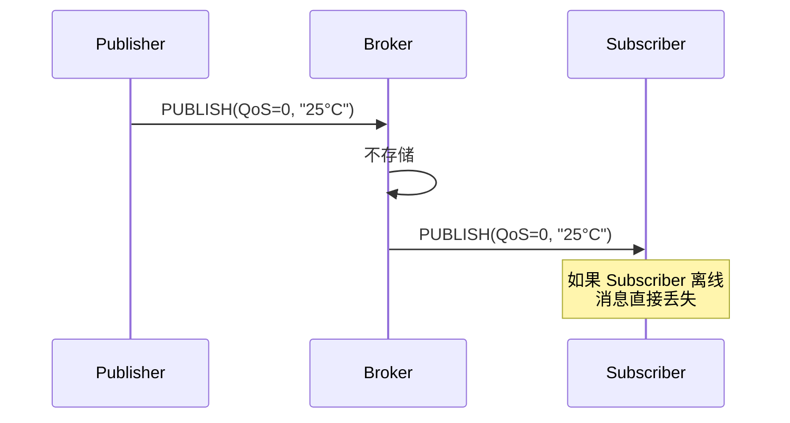
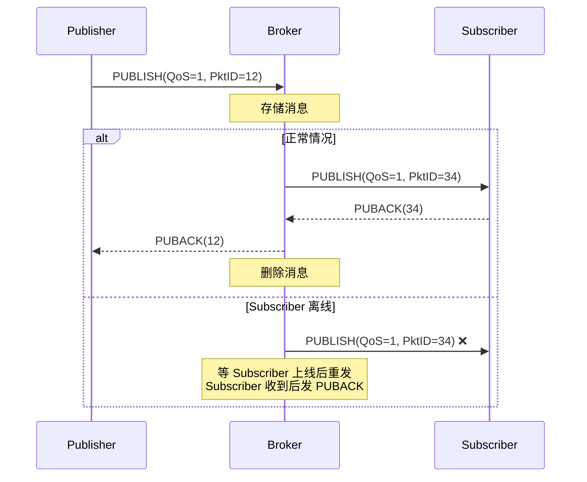
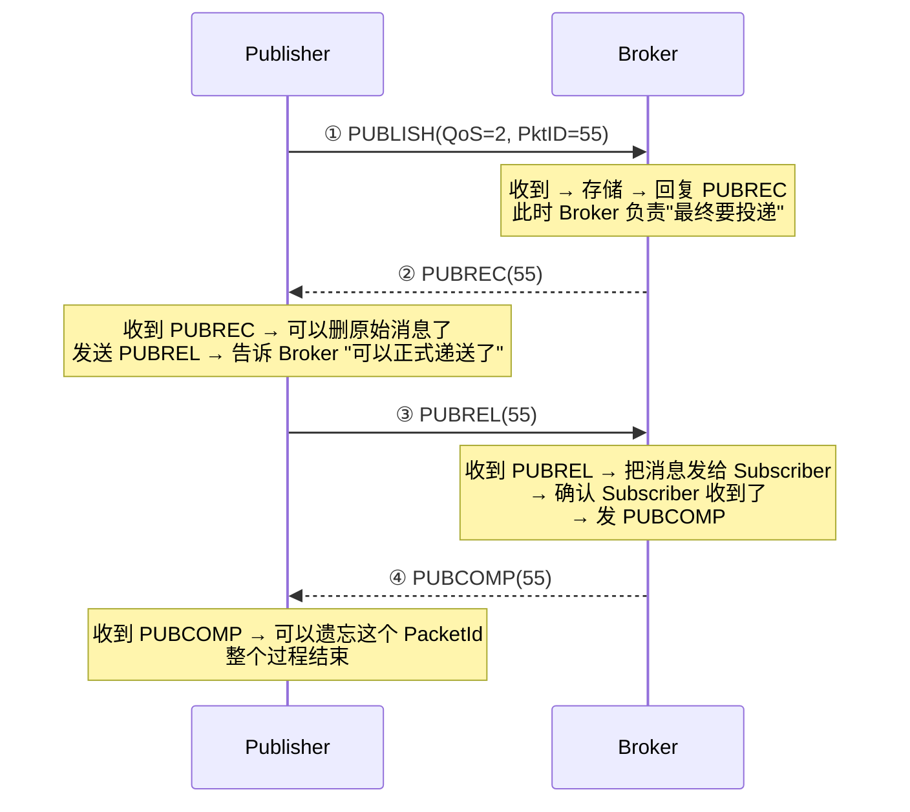

# 历史背景——为石油管道上的卫星链路而设计

1999 年，IBM 的 Andy Stanford-Clark 和 Arcom 的 Arlen Nipper 需要一个协议来监控穿越沙漠的石油管道。管道上的传感器通过**极昂贵的卫星链路**与监控中心通信——带宽按字节计费，延迟高，连接不稳定。HTTP 的一来一回、XML 的冗余标签、每个请求要新建 TCP 连接——这些在卫星链路上是不可接受的。

他们设计了 MQTT（Message Queuing Telemetry Transport）——一个**为了在不可靠网络上实现极低带宽消耗的发布-订阅协议**。这个设计目标决定了 MQTT 的三个核心特征：

1. **二进制协议，最小帧头只有 2 字节**（HTTP 的请求头动辄 500 字节+）
2. **发布-订阅解耦收发方**（生产者和消费者不需要知道对方的存在）
3. **三级 QoS 按需选择**（你可以为了速度牺牲可靠性，也可以为了可靠性牺牲速度）
4. **长连接 + 心跳 + 遗嘱**（设备离线能被立即感知）

这三个特性不是"MQTT 顺手支持的功能"，而是被 1999 年的卫星链路逼出来的设计强制。

---

# 一、MQTT 的发布-订阅模型——彻底解耦

HTTP 是"请求-响应"模型——客户端问，服务器答。MQTT 是"发布-订阅"——生产者不知道消费者是谁，消费者不知道生产者是谁。中间通过 **Topic（主题）** 解耦：

```
温度传感器 A（Publisher）→ 发布到 topic: building/room-301/temperature
温度传感器 B（Publisher）→ 发布到 topic: building/room-302/temperature
监控大屏（Subscriber）  → 订阅 topic: building/+/temperature  ← 同时收到 A 和 B 的数据
空调控制器（Subscriber） → 订阅 topic: building/room-301/temperature ← 只订阅自己负责的房间

解耦的程度：
  - 空间解耦：生产者和消费者不需要知道对方的 IP 或 ID
  - 时间解耦：生产者发布时消费者可以离线（Broker 缓存直到消费者上线）
  - 同步解耦：生产者的发送速率和消费者的消费速率互不影响（Broker 做缓冲）
```

## 1.1 Topic 的通配符——两个就够了

```
/building/room-301/temperature  ← 三个层级，"building" + "room-301" + "temperature"

单层通配符 (+)：
  订阅 building/+/temperature → 匹配 room-301、room-302... 不匹配 room-301/sub-room
  → 只匹配一个层级

多层通配符 (#)：
  订阅 building/room-301/# → 匹配 room-301 下所有层级
  → 匹配 building/room-301/temperature、building/room-301/humidity、building/room-301/light/1

限制：只能用在一个 topic 的最后一段 "building/#/temperature" ← 不合法
```

---

# 二、MQTT 帧结构——最小 2 字节

## 2.1 Fixed Header（固定头，必须） — 2-5 字节

```
┌─────────────────────────────────────────────────────────────┐
│ Byte 1 │ 7 6 5 4 │ 3 2 1 0 │                               │
│        │ 消息类型  │ 标志位   │                               │
├────────┼──────────┼─────────┼───────────────────────────────┤
│ Byte 2 │  剩余长度（Remaining Length, 1-4 字节变长编码）     │
├────────┴──────────┴─────────────────────────────────────────┤
│ Variable Header（可变头，部分包类型需要）                     │
├─────────────────────────────────────────────────────────────┤
│ Payload（载荷，部分包类型需要）                               │
└─────────────────────────────────────────────────────────────┘

剩余长度（Remaining Length）的编码：

  值                            编码（变长）
  0-127                         1 字节  (0xxxxxxx)
  128-16383                     2 字节  (1xxxxxxx)(0xxxxxxx)
  16384-2097151                 3 字节
  2097152-268435455             4 字节
  
  → 协议中可以表达最大 256MB 的包，但实际中绝大部分 < 1KB
  → 小包只需要 1 字节能描述剩余长度——节省字节
```

## 2.2 消息类型——就 14 种，简洁为上

| 类型值 | 消息 | 方向 | 作用 |
|--------|------|------|------|
| 1 | CONNECT | C→B | 连接请求 |
| 2 | CONNACK | B→C | 连接确认 |
| 3 | PUBLISH | 双向 | 发布消息 |
| 4 | PUBACK | 双向 | QoS 1 发布确认 |
| 5 | PUBREC | 双向 | QoS 2 发布已接收（第一步） |
| 6 | PUBREL | 双向 | QoS 2 发布释放（第二步） |
| 7 | PUBCOMP | 双向 | QoS 2 发布完成（第三步） |
| 8 | SUBSCRIBE | C→B | 订阅请求 |
| 9 | SUBACK | B→C | 订阅确认 |
| 10 | UNSUBSCRIBE | C→B | 取消订阅 |
| 11 | UNSUBACK | B→C | 取消订阅确认 |
| 12 | PINGREQ | C→B | 心跳请求 |
| 13 | PINGRESP | B→C | 心跳响应 |
| 14 | DISCONNECT | C→B | 断开通知 |

---

# 三、QoS 三级——MQTT 可靠性模型的核心

MQTT 的 QoS 不是服务端设的，而是**每条消息独立指定**的——发布者发布一条消息时，指定这条消息用几级 QoS。同一 Topic 上的不同消息可以有不同的 QoS。

## 3.1 QoS 0：至多一次（发出去就不管了）

```
Publisher → PUBLISH(QoS=0) → Broker → PUBLISH(QoS=0) → Subscriber

特点：
  - 没有 ACK，没有重试
  - 消息可能丢失（如果网络断了或 Subscriber 离线）
  - 最快，最节省带宽，最省电

适用：高频传感器数据（温度、湿度）→ 偶丢失一两条数据不影响趋势
```



## 3.2 QoS 1：至少一次（收到确认才停）

```
Publisher → PUBLISH(QoS=1, PacketId=123) → Broker → PUBLISH(QoS=1, PacketId=456) → Subscriber
Broker → PUBACK(123) → Publisher       ← 确认收到
Subscriber → PUBACK(456) → Broker      ← 确认收到

重试机制：
  - Publisher 发了 PUBLISH → 等 PUBACK → 没等到 → 重发 PUBLISH(DUP=1, PacketId 相同)
  - Broker 收到重发的 PUBLISH → 检查 PacketId → 已处理过 → 去重 → 回 PUBACK
  - 但可能递送多次！(因为 Broker 在发 PUBACK 之后、Subscriber 在发 PUBACK 之前断电 → Subscriber 重启后收到重发的消息 → 重复)
```



**DUP 标志位的作用**：重发的消息 DUP=1 → 接收方检查 PacketId → 如果已经处理过 → 回 PUBACK 但不重复递送（去重）。

## 3.3 QoS 2：恰好一次（四次握手保证不丢不重）

```
Publisher → PUBLISH(QoS=2, PacketId=123) → Broker → PUBREC(123) → Publisher
Publisher → PUBREL(123) → Broker → PUBCOMP(123) → Publisher

→ 四次握手，消息一定被 Broker 处理只有一次
→ Broker → Subscriber 亦然，另有四步独立握手

代价：四次握手 + 两次存储 = 最慢、最多字节、最耗电
```



**QoS 2 的两个关键去重点**：

```
① Broker 收到 PUBLISH(PktID=55) 后，如果之前已存储 PktID=55？
   → 这是重发 → 不回 PUBREC，等原来流程走完 → 回 PUBCOMP
   
② Publisher 收到 PUBCOMP(55) 后，如果之前没收到 PUBREC？
   → 它不会发 PUBREL → 陷入不一致状态 → 等待重连后 Broker 重新发 PUBREC

PacketId 在"每个 MQTT 连接"中唯一——新连接后 PacketId 可以重复使用
```

## 3.4 三级 QoS 对比——一张表选型

| | QoS 0 | QoS 1 | QoS 2 |
|------|-------|-------|-------|
| **可靠度** | 至多一次 | **至少一次** | **恰好一次** |
| **重试** | 无 | 重发 + DUP 去重 | 四次握手 + 两次去重检查 |
| **交互次数** | 1 次 | 2 次 | 4 次 |
| **适合** | 传感器高频上报 | **设备控制指令** | 支付/计费/锁开关 |
| **典型数据** | 温度/湿度/加速度传感器 | 开灯/关机/设温度 | 门锁开锁/电子支付 |

**生产建议**：大多数 IoT 场景 QoS 1 最合适——控制的可靠性有保障，比 QoS 2 省一半的网络交互。QoS 2 保留给"这条指令一定不能重复执行"的场景（如"打开保险柜"——重复一次可能变成"关上"）。

---

# 四、会话保持——设备离线后再上线，消息不会丢

## 4.1 Clean Session = false 与 = true 的区别

```
MQTT 3.1.1：

Clean Session = false（持久会话）：
  设备断线 → Broker 不删 session（保留 QoS 1/2 离线消息）
  设备重新连接 → 拿到离线期间的所有 QoS 1/2 消息
  设备重新连接 → 自动恢复"曾经订阅过的 Topic"（不需要重新 SUBSCRIBE）

Clean Session = true（新会话）：
  设备断线 → Broker 删除 session → 所有离线消息丢失
  设备重新连接 → 没有旧的订阅 → 需要重新 SUBSCRIBE
```

```java
// 设备端的 MQTT 连接参数
MqttConnectOptions options = new MqttConnectOptions();
options.setCleanSession(false);  // ← 持久会话！离线消息不丢
options.setClientId("sensor-001"); // ← 必须固定的 ClientId
options.setKeepAliveInterval(60);  // ← 心跳间隔 60s
```

## 4.2 Session 中的消息缓存

```
Broker 为每个持久会话维护两个消息队列：

① 待发送队列（Inflight）：正在发给 Subscriber 但还没收到 PUBACK/PUBCOMP 的消息
② 离线队列（Offline Store）：Subscriber 离线期间 Broker 暂存的 QoS 1/2 消息
   → 设备重新上线 → 一次性推送离线队列中的所有消息

消息顺序保证：
  - 同一个 Topic 的消息按 Broker 接收顺序递送（FIFO）
  - 不同 Topic 的消息不保证顺序（各自独立的队列）
```

## 4.3 MQTT 5.0 的改进——Session Expiry

```
MQTT 3.1.1 的问题：Clean Session=false 的 session 永远存在
  → 设备再也不上来了 → Broker 无限缓存离线消息 → 内存泄漏！

MQTT 5.0 的 Session Expiry：
  CONNECT 时设 sessionExpiryInterval=86400（秒）= 24 小时
  → 设备离线 24 小时后还没重连 → Broker 删掉 session → 离线消息丢弃
  → 不需要手动"清理僵尸 session"
```

---

# 五、遗嘱消息——设备死了，我得知道

## 5.1 遗嘱消息的生命周期

```
设备在 CONNECT 时设一条 Will Message（遗嘱）：
  遗嘱 Topic: sensor/sensor-001/status
  遗嘱 Payload: {"status": "offline"}
  遗嘱 QoS: 1
  遗嘱 Retain: true

Broker 收到 CONNECT → 记录遗嘱

设备正常断线（发 DISCONNECT）：
  → Broker 不发布遗嘱（"设备主动说再见，不是突然死了"）

设备异常断线（Keep Alive 超时、网络断、进程 crash）：
  → Broker 发布遗嘱到 sensor/sensor-001/status
  → 告诉所有订阅这个 Topic 的客户端 "sensor-001 离线了"
```

**遗嘱消息是 IoT 中"设备在线状态检测"的基石**——不需要 App 轮询 "设备还在吗"，也不需要额外的定时心跳检测。设备自身通过 MQTT 连接的生命周期来表达在线/离线，Broker 负责在设备异常断连时发布遗嘱。

---

# 六、保留消息——最新到的人也能看到"当前状态"

```
普通消息：发布后只送给"当时在线的 Subscriber"——晚到的人看不到

保留消息（Retained Message = true）：
  Publisher → PUBLISH(topic=room/301/temperature, payload="25°C", retained=true)
  → Broker 存储这条消息（一个 Topic 只保留最新一条）
  → 任何时候新的 Subscriber 订阅 room/301/temperature
  → Broker 立刻向这个新 Subscriber 发送 "25°C"

这就是"迟到的人也能看到最新状态"——不需要 Publisher 为了给新人发而重发
```

**Retained 与 Will 的组合——设备状态的最佳实践**：

```
设备上线：
  → PUBLISH(sensor-001/status, "online", retained=true)
  → 之后的任何 Subscriber 订阅 sensor-001/status → 立刻得到 "online"

设备设好遗嘱：
  → CONNECT 时 willTopic=sensor-001/status, willPayload="offline", willRetained=true

设备异常断线 → Broker 用遗嘱覆盖 retained 消息 → "offline"
  → 新 Subscriber 订阅 → 看到 "offline"
```

---

# 七、MQTT 5.0——"解决的是企业级部署问题"

MQTT 3.1.1（2014）是当前最广泛使用的版本。MQTT 5.0（2019）不是"MQTT 2.0"，而是**在 3.1.1 的基础上增加了企业级部署需要的特性**：

| 新特性 | 含义 | 解决了什么问题 |
|--------|------|-------------|
| **Session Expiry** | 持久会话自动过期 | 僵尸 session 不再永远占用 Broker 内存 |
| **Reason Code** | CONNACK/PUBACK/SUBACK 都带原因码 | "为什么被拒绝？"——如 0x87=Not authorized、0x8F=Quota exceeded |
| **Shared Subscriptions** | 多个 Consumer 共享同一个 Topic 的负载均衡 | `$share/group1/sensor/+/temperature`—Consumer1 和 Consumer2 各收到一半消息 |
| **Message Expiry** | 消息自动过期（TTL） | "这条指令 30 秒内没收到就别送了"——避免过时的控制指令 |
| **User Properties** | 自定义键值对附在消息和 ACK 上 | 追踪消息经过的设备、网关——不需要修改 Payload |
| **Topic Alias** | Topic 字符串用整数别名替代 | 首次发完整 Topic，之后用别名→长 Topic 名节省带宽 |
| **Flow Control** | Broker 可以告诉 Client 放慢发送速率 | 防止客户端把 Broker 打爆——流控 |
| **Request-Response** | 在消息中嵌入响应 Topic | "发到这个 Topic 去，我等着"——请求-响应模式 |

---

# 八、MQTT vs CoAP vs HTTP——三种 IoT 协议选型

| | MQTT | CoAP | HTTP/1.1 |
|------|------|------|---------|
| **设计目标** | 低带宽 + 不可靠网络 + 发布订阅 | 受限设备（内存/KB级）+ REST 模式 | 通用 Web API |
| **传输协议** | **TCP**（长连接） | **UDP**（省开销） | TCP（短连接或 keep-alive） |
| **最小帧头** | 2 字节 | 4 字节 | ~500 字节（典型） |
| **通信模式** | 发布-订阅 + 请求-响应(5.0) | **REST 风格** + 观察(Observe) | 请求-响应 |
| **QoS** | 0/1/2 三级 | 0/1 两级（可确认/不可确认） | 无内置 QoS |
| **消息大小** | 最大 256MB（实际一般 < 1KB） | **限制为 IP 包大小**（通常 < 1KB） | 无限制 |
| **心跳** | Keep Alive（应用层 PINGREQ/PINGRESP） | 无应用层心跳 | 无（依赖 TCP keep-alive） |
| **安全** | TLS/SSL | DTLS | TLS/SSL |
| **适用** | **物联网平台、智能家居、工业传感器** | 极度受限设备（RAM < 10KB）、电池供电 | Web API、云端交互 |

---

# 九、总结

| 概念 | 一句话 | 为什么需要 |
|------|--------|-----------|
| **Broker** | 发布订阅的消息中介 | 彻底解耦生产者和消费者 |
| **Topic + 通配符** | `/sensor/+/temperature` | 灵活的主题匹配 + 两个通配符 |
| **QoS 0** | 不确认不重试 | 高频传感器数据 |
| **QoS 1** | 确认 + 重试 | **设备控制指令的标准选择** |
| **QoS 2** | 四次握手 + 两层去重 | 不能重复执行的指令 |
| **Clean Session=false** | 断线不丢订阅和消息 | 设备离线→上线无缝恢复 |
| **Will Message** | 设备异常断线时 Broker 代发遗嘱 | 设备在线状态检测的核心机制 |
| **Retained Message** | 新订阅者能看到最新一条消息 | 新设备/App 看到当前状态 |

# 延伸阅读

**Do——动手验证：**
- 用 Mosquitto（`docker run -p 1883:1883 eclipse-mosquitto`）搭建本地 MQTT Broker → 用 `mosquitto_sub` 和 `mosquitto_pub` 验证 QoS 0/1/2 和 Retained 消息
- 写一段 Java 代码（Paho Client）连接 → 发布 QoS 1 消息 → 模拟网络断开 → 观察重连后的 Session 恢复
- 在 Wireshark 中抓 MQTT 包：`mqtt` 过滤器 → 看 PUBLISH/PUBACK/PUBREC/PUBREL/PUBCOMP 的 PacketId 变化

**Todo——深入方向：**
- EMQX / HiveMQ 的 Broker 内部架构——百万级 MQTT 连接的 Broker 如何设计
- MQTT over QUIC——用 QUIC 替代 TCP 实现 0-RTT 重连和连接迁移
- MQTT 5.0 的 Topic Alias——在长 Topic 名称场景下的带宽节省效果

*本文参考资料：*
- MQTT 3.1.1 规范: OASIS Standard (2014)
- MQTT 5.0 规范: OASIS Standard (2019)
- Eclipse Mosquitto 官方文档
- Eclipse Paho Java Client 文档
