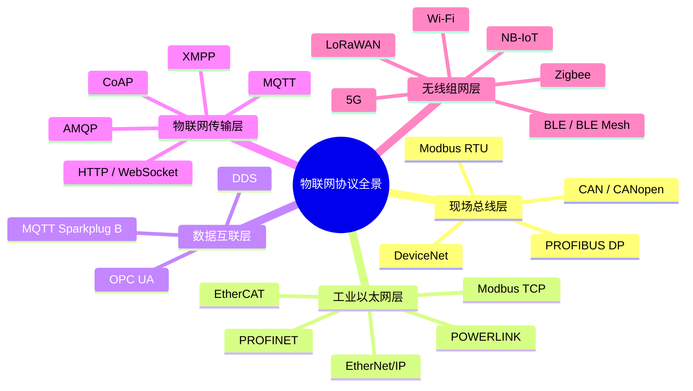
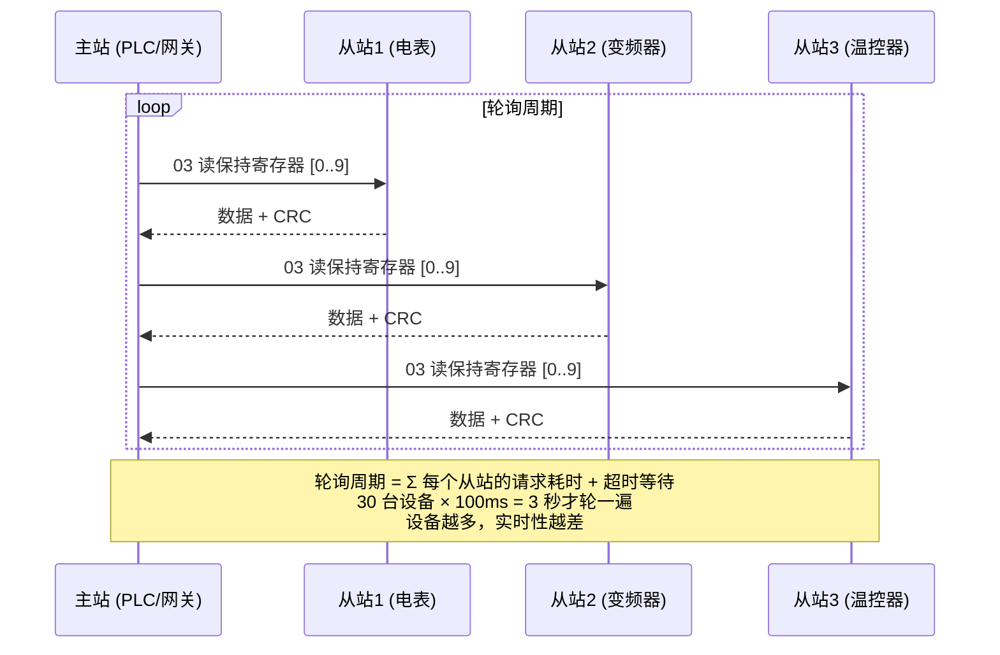
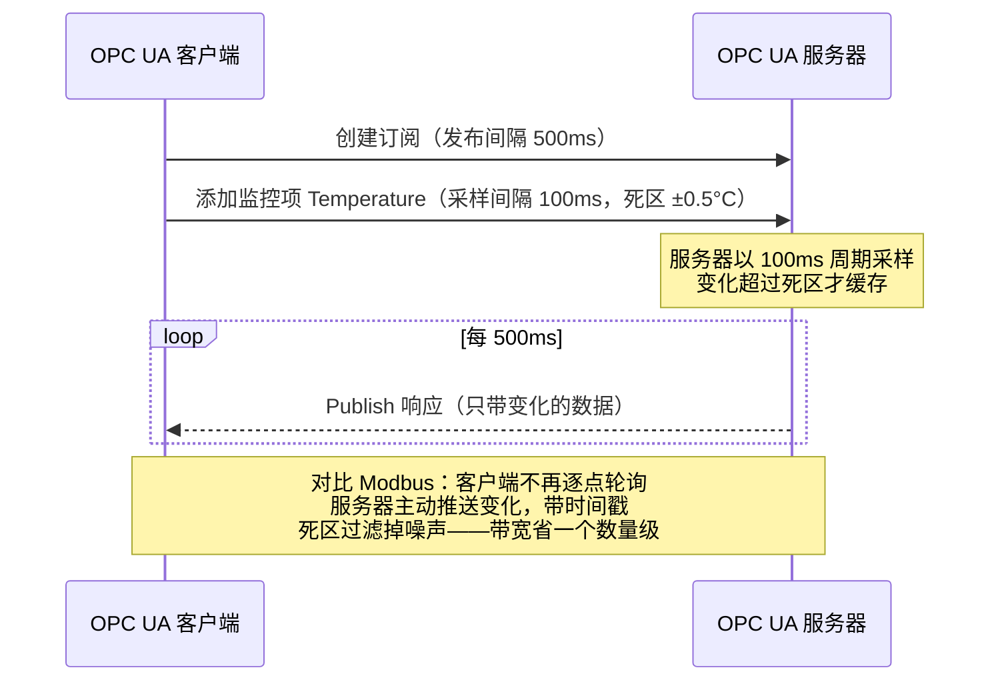
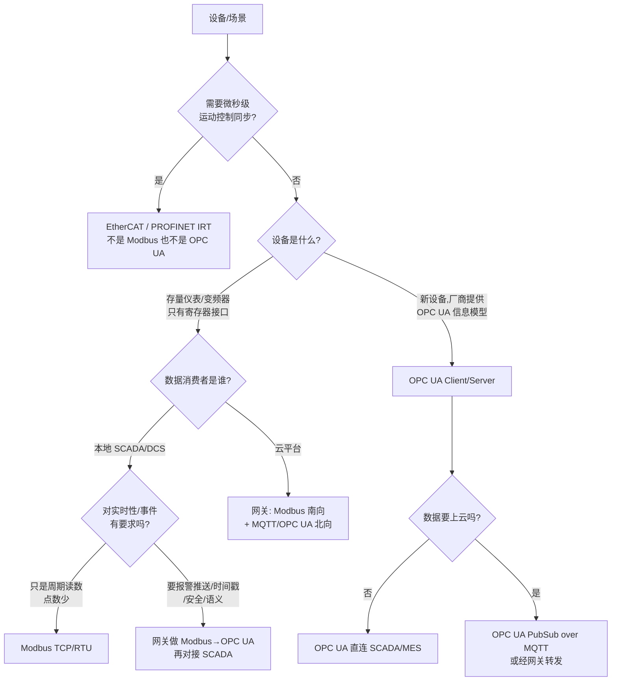
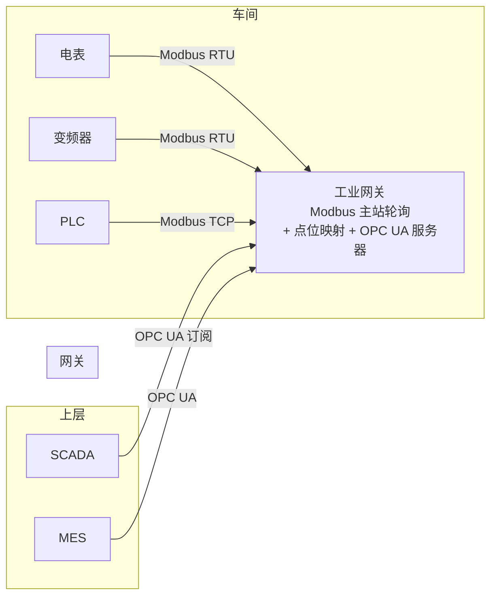

# 历史背景——两条工业协议演进路线

物联网协议不是一个"协议"，而是**四代技术叠加出来的协议栈**。理解 Modbus 和 OPC UA 的选型，先要理解它们各自站在协议演进的哪一层。

```
1979  Modbus（Modicon）           ← 第一代：现场总线，解决"怎么把数据从设备里读出来"
1986  CAN（Bosch）               ← 车载/嵌入式现场总线
1994  PROFIBUS DP                ← 现场总线黄金年代（DeviceNet、CC-Link 同期）
1996  OPC Classic（OPC DA/AE）   ← 第二代：Windows 上的数据交换标准，基于 COM/DCOM
2000  EtherNet/IP                ← 第三代：工业以太网（PROFINET、EtherCAT、PowerLink 同期）
2006  OPC UA 规范发布             ← 第四代：平台无关、安全、语义化的工业数据标准
2013  MQTT 3.1.1（OASIS）        ← IoT 轻量传输协议标准化
2014  CoAP（RFC 7252）           ← 受限设备的 REST
2016  OPC UA PubSub 规范         ← OPC UA 拥抱 MQTT/UDP 发布订阅
2019  Sparkplug B（Eclipse）     ← MQTT 之上的工业载荷规范
```

两条路线：

- **Modbus 路线**：从 1979 年活到今天，靠的是**极简**——设备商实现成本为零，存量设备以千万计。它的定位从未变过：**把寄存器里的数读出来、写进去**。
- **OPC UA 路线**：从 1996 年 OPC Classic 的 Windows 泥潭里爬出来，靠的是**建模**——数据不再是一堆寄存器编号，而是带类型、带关系、带方法的**对象**。它的定位是：**让不同厂商的设备说同一种语言，并且安全地说**。

选型问题的本质不是"Modbus 好还是 OPC UA 好"，而是**你的设备处于什么年代、你的数据要流向哪里、谁在消费这些数据**。

---

# 一、常见物联网协议全景——五层梳理

面试高频问题是"说几个物联网协议"，但零散地背名字没有意义。按**网络位置**分层梳理，一张图建立坐标系：



## 1.1 现场总线层——"设备内部和设备之间的总线"

这一层解决的是**一个车间里，控制器和传感器/执行器之间怎么连线**。

| 协议 | 物理层 | 特点 | 典型场景 |
|------|--------|------|----------|
| Modbus RTU | RS-485 | 主从轮询，极简，无安全 | 仪表、变频器、PLC 之间 |
| CAN / CANopen | 双绞线 | 多主、仲裁、抗干扰强 | 汽车、电梯、工程机械 |
| PROFIBUS DP | RS-485 | 周期通信 + 诊断，西门子生态 | 西门子 PLC 与分布式 IO |

共同点：**周期轮询 + 主从结构 + 无安全机制**，设计前提是"工厂网络是物理隔离的"。

## 1.2 工业以太网层——"实时性要求催生的以太网变种"

标准以太网（TCP/IP）的 CSMA/CD 冲突、栈处理延迟，无法满足运动控制 **微秒级等时同步**的要求，于是各厂商魔改以太网：

| 协议 | 实时性 | 技术手段 | 生态 |
|------|--------|----------|------|
| EtherCAT | 100μs 级 | 集束帧 + 硬件转发，主站单口 | 倍福，运动控制霸主 |
| PROFINET IRT | 250μs-1ms | 专用 ASIC + 时隙调度 | 西门子 |
| EtherNet/IP | 1-10ms | 标准以太网 + CIP 协议 | 罗克韦尔/AB |
| Modbus TCP | 10-100ms 级 | 标准 TCP 502 端口 | 通用仪表 |

注意 **Modbus TCP 在这里是"伪实时"**：它只是把 RTU 的帧塞进 TCP 报文，轮询机制没变，做不了运动控制，但胜在"标准以太网就能跑"。

## 1.3 数据互联层——"OT 数据走向 IT 世界的桥"

这一层是工业 4.0 的核心，解决**数据从车间向上流动**的问题：

- **OPC UA**：信息建模 + 安全 + 客户端/服务端，工业数据的"USB 接口"
- **MQTT Sparkplug B**：规定 MQTT Topic 命名和 Payload 格式的工业规范（`spBv1.0/组名/消息类型/节点名`），让不同厂商的 MQTT 设备能互相理解
- **DDS**：以数据为中心、无 Broker 的点对点发布订阅，QoS 策略极丰富，用于军工、自动驾驶、机器人

## 1.4 物联网传输层——"设备到云"

- **MQTT**：发布订阅、QoS 三级、遗嘱消息、极小帧头（2 字节）——长连接上报场景的事实标准（本专栏已有专文拆解）
- **CoAP**：UDP 上的"轻量 HTTP"，CON/NON 消息、Observe 订阅模式、DTLS 加密，用于**资源受限设备**（RAM 几十 KB 的传感器）
- **AMQP**：企业级消息路由，Exchange/Binding 模型，用于设备数据进入企业内部消息系统
- **HTTP/WebSocket**：Web 集成、固件下载，OT 世界偶尔为之

## 1.5 无线组网层——"最后一公里"

| 协议 | 距离 | 速率 | 功耗 | 场景 |
|------|------|------|------|------|
| BLE / BLE Mesh | 10-100m | 1-2Mbps | 极低 | 穿戴、近场、智能家居 |
| Zigbee | 10-100m | 250kbps | 低 | 家庭/楼宇自组网 |
| LoRaWAN | 2-15km | 0.3-50kbps | 极低 | 表计、农业、园区广覆盖 |
| NB-IoT | 蜂窝覆盖 | 数十 kbps | 极低 | 运营商级抄表、井盖 |
| Wi-Fi | 100m | 百 Mbps | 高 | 视频类、室内设备 |
| 5G | 蜂窝覆盖 | Gbps 级 | 高 | AGV、车联网、远程驾驶 |

**分层结论**：Modbus 和 OPC UA 都不属于"物联网传输层"——它们是**工业 OT 协议**。一个 IoT 平台工程师最常见的架构是：**南向 Modbus（接存量设备）+ 北向 OPC UA/MQTT（接 IT 系统）**。理解了这个坐标系，选型才有锚点。

---

# 二、Modbus 深度拆解——极简主义的胜利与代价

## 2.1 数据模型——只有四种表

Modbus 的"信息模型"简单到粗暴：设备内部就是四张**寄存器表**，外界只能按"表名 + 偏移量"访问：

| 表 | 类型 | 大小 | 访问 | 典型用途 |
|----|------|------|------|----------|
| Coils（线圈） | bit | 1 bit | 读/写 | 开关量输出、继电器 |
| Discrete Inputs（离散输入） | bit | 1 bit | 只读 | 开关量输入、按钮 |
| Input Registers（输入寄存器） | word | 16 bit | 只读 | 模拟量输入（温度、压力） |
| Holding Registers（保持寄存器） | word | 16 bit | 读/写 | 参数、设定值、输出 |

```
一个变频器的点表（工程师拿到的就是这种 Excel）：

  地址       含义           类型          缩放
  ─────────────────────────────────────────────
  40001      运行频率       Holding Reg   ÷100 (Hz)
  40002      输出电流       Input Reg     ÷10  (A)
  40003      故障码         Input Reg     枚举
  40005      启动/停止      Coil          bit
  ...

问题：这个"点表"存在哪里？——存在工程师的 Excel 和脑袋里。
设备本身不知道 40001 是"频率"——它只知道那是第 0 号保持寄存器。
```

**这就是 Modbus 最大的软肋：数据无语义**。同一份寄存器数据，在 A 厂的变频器里是频率，在 B 厂的变频器里可能是电流。集成商每接一个新设备，就要翻一遍该厂的点表手册。

## 2.2 帧结构——RTU 与 TCP

**Modbus RTU（串口）**——最紧凑的现场帧：

```
┌──────────┬──────────┬──────────┬──────────┐
│ 地址 1B  │ 功能码 1B │  数据 N   │ CRC16 2B │
└──────────┴──────────┴──────────┴──────────┘
从站地址 1-247（0=广播，248-255 保留）
帧与帧之间以 ≥3.5 字符时间的静默间隔分隔
```

**Modbus TCP**——把 PDU 塞进 TCP（端口 502），前面加 7 字节 MBAP 头：

```
┌──────────────────────────────┬──────────────────────────────────┐
│         MBAP 头 (7B)          │            PDU（与 RTU 相同）     │
├────────┬────────┬───────┬────┼──────────┬───────────────────────┤
│事务 ID │协议 ID │长度 2B│单元│ 功能码 1B │        数据            │
│ 2B     │ 2B(0)  │       │ID 1B│          │                       │
└────────┴────────┴───────┴────┴──────────┴───────────────────────┘
  ↑ 请求/响应配对用（可以并发多个请求，靠事务 ID 对应）
```

MBAP 头里的**事务 ID（Transaction Identifier）**是 TCP 版的关键改进：RTU 是严格一问一答（半双工、发完等响应），TCP 理论上可以多个请求在途。但**多数设备实现仍然是串行处理**，所以这个能力经常形同虚设。

## 2.3 功能码——八个就够用一辈子

```
01 Read Coils            读线圈         05 Write Single Coil      写单个线圈
02 Read Discrete Inputs  读离散输入     06 Write Single Register   写单个寄存器
03 Read Holding Regs     读保持寄存器   15 Write Multiple Coils    写多个线圈
04 Read Input Regs       读输入寄存器   16 Write Multiple Regs     写多个寄存器

一次读取上限：约 125 个寄存器（250 字节 PDU 限制）→ 数据量大时要分批轮询
```

没有的功能：**事件上报、断点续传、时间戳、安全认证**。设备出了故障，Modbus 没有"报警主动上报"——主站只能靠加快轮询频率来"猜"。

## 2.4 主从轮询模型——一切的根源



轮询模型推导出三个硬伤：

1. **实时性反比于设备数**：串行一问一答，N 台设备轮一遍 = N × 单次耗时。50 台设备、每台 50ms，数据新鲜度就是 2.5 秒。
2. **超时是常态**：从站故障/掉线时，主站要等满超时时间（典型 500ms-3s）才能继续——**一台坏设备拖慢整个网络**。
3. **无主动上报**：报警只能靠轮询"撞见"。等主站轮到这个设备，事故可能已经发生几秒了。

## 2.5 安全——裸奔的协议

Modbus 协议层面**没有任何安全机制**：

- 无认证：任何能连上 502 端口的人都能读寄存器、写寄存器
- 无加密：明文传输，抓包即点表
- 无完整性：TCP 校验和只管传输错误，不管篡改

Shodan 上常年能搜到数万个暴露在公网的 Modbus TCP 设备（502 端口）。2010 年震网病毒攻击伊朗核设施的路径之一就是写 PLC 寄存器。**"工厂网络物理隔离"是 Modbus 安全的唯一假设——这个假设在 IT/OT 融合时代正在失效**。

---

# 三、OPC UA 深度拆解——为互操作和安全而生

## 3.1 从 OPC Classic 的泥潭说起

1996 年，OPC 基金会推出 OPC Classic，让 SCADA 软件能统一读不同厂商设备的数据。但它建在 **COM/DCOM** 上：

```
问题清单（OPC Classic 时代的集成商噩梦）：
  ✗ 只支持 Windows
  ✗ DCOM 跨机器通信要配防火墙、权限，集成商闻之色变
  ✗ 无安全模型（DCOM 的安全配置是玄学）
  ✗ 数据还是"点表"——ItemID 是字符串，无语义
```

2006 年 OPC UA 规范发布（2010 年成为 IEC 62541 标准），核心是**推倒重来**：

| 维度 | OPC Classic | OPC UA |
|------|-------------|--------|
| 平台 | Windows | 任何（有 ANSI C 栈，可跑在单片机） |
| 通信 | DCOM | UA TCP / HTTPS / WebSocket / MQTT / UDP |
| 安全 | 依赖 DCOM 配置 | 内置：证书、签名、加密、用户认证 |
| 数据 | 点表（无语义） | 信息模型（对象、类型、关系） |
| 传输模型 | 请求响应 | 请求响应 + 订阅推送 + PubSub |

## 3.2 信息模型——OPC UA 的灵魂

OPC UA 的 AddressSpace 是一个**由节点组成的图**，节点之间有引用关系：

```
设备对象
└─ "Boiler1"（NodeId = ns=2;s=Boiler1，类型：BoilerType）
   ├─ 引用 HasComponent → "Temperature"（变量节点，数据类型 Double，单位 °C）
   ├─ 引用 HasComponent → "Pressure"（变量节点）
   ├─ 引用 HasComponent → "Status"（变量节点，枚举：Running/Fault/Idle）
   └─ 引用 HasComponent → "Start()"（方法节点——可以"调用"，不只是读写！）

客户端连上来第一件事：Browse（浏览）——把整个地址空间走一遍，
自己发现"这台设备有什么数据、什么类型、什么单位、能调什么方法"。
```

对比 Modbus 的"40001 是啥？查点表"——OPC UA 是**自描述**的：数据类型（Double 还是 Int16）、单位、量程、工程语义（这个变量是温度不是压力）、甚至设备的关系层级，全部内建在地址空间里。**集成一个新设备不需要点表手册**，客户端自动发现。

**方法（Method）调用**是另一个代差：Modbus 只能读/写寄存器，OPC UA 可以在服务端**执行函数**——"开始标定"、"重启设备"、"下发配方"——请求响应模型天然支持命令语义。

## 3.3 服务集与订阅模型

```
OPC UA 的服务集（按功能分组）：
  Discovery      发现服务器、获取端点
  SecureChannel  建立安全通道（证书交换、会话）
  Session        会话管理、用户认证（匿名/用户名密码/证书）
  NodeManagement 浏览地址空间、增删节点
  View           浏览、读取、写入、调用方法
  Subscription   订阅数据变化和事件 ← 关键！
  MonitoredItem  监控项：采样间隔、过滤、死区
```

**订阅模型解决了 Modbus 轮询的实时性硬伤**：



关键设计：

- **采样间隔 vs 发布间隔**分离：采样快、发布慢，中间由服务器聚合
- **死区过滤**：温度波动 ±0.5°C 以内不上报，过滤传感器噪声
- **带时间戳**：每个值带 SourceTimestamp，事后追溯知道"这个值是什么时候产生的"——Modbus 读到的值只有"主站读到的那一刻"，数据产生时间不可知
- **事件订阅**：报警不是"值变了"，而是"事件发生了"（带严重度、确认状态）——这才是真正的告警机制

## 3.4 安全模型——工业数据交换的及格线

```
安全通道（SecureChannel）：
  1. 建立 TCP 连接（默认 4840 端口）
  2. 交换 X.509 证书，互相验证
  3. 协商安全策略（SecurityPolicy）：
     None / Basic256Sha256 / Aes128Sha256RsaOaep / Aes256Sha256RsaPss
  4. 协商出的对称密钥用于消息签名 + 加密
  → 每一条消息都有签名（防篡改）和加密（防窃听）

用户认证（Session）：
  匿名 / 用户名+密码 / X.509 证书
  → 认证与加密分层：先建安全通道，再做用户认证

授权：
  地址空间节点可以设访问权限（谁能读、谁能写、谁能调方法）
```

## 3.5 传输与 Profile——从单片机到云

OPC UA 规范里定义了 **Profile（能力等级）**，不同资源量的设备实现不同子集：

| Profile | 资源 | 能力 | 目标设备 |
|---------|------|------|----------|
| Nano Embedded | RAM ~10KB 级 | 只有读取，无安全 | 传感器 |
| Micro Embedded | RAM ~100KB 级 | 读取+安全 | 仪表、阀门 |
| Embedded | 中端 MCU | 读写+方法+订阅 | 变频器、PLC |
| Standard | 通用 CPU | 全功能 | 服务器、网关 |

传输栈也从单一 TCP 扩展到四种，其中 **PubSub 是 2016 年后最重要的演进**：

```
Client/Server 模式（请求响应 + 订阅）：
  UA TCP（二进制，最快，4840 端口）
  HTTPS（SOAP/XML）
  WebSocket

PubSub 模式（发布订阅，2016 新增）：
  UADP over UDP（车间内多播，一发布多订阅）
  UADP over MQTT（数据直接上云！）
  UADP over AMQP
  → 解决 Client/Server 的连接爆炸问题：
    1000 台设备各连一个 SCADA 是 1000 条连接；
    PubSub 下设备只管往 Topic 发，谁要谁订。
```

**OPC UA over MQTT 的意义**：把 OPC UA 的语义化数据模型 + MQTT 的云端友好传输结合起来——设备端用 OPC UA 建模，数据通过 MQTT Topic 直接进云平台（AWS IoT Greengrass、Azure IoT 均支持此模式）。这是工业数据上云的主流路线之一。

## 3.6 OPC UA 的代价

- **复杂**：规范 14 卷、数千页。实现一个全功能栈是数年工程——所以商业 SDK（UA-.NET、Prosys、Unified Automation）不便宜，免费栈（open62541、UA-Java）功能有取舍
- **资源**：完整安全栈对 MCU 有要求，不像 Modbus 几 KB RAM 就能跑
- **实时性**：标准 OPC UA 不是硬实时协议（做不了运动控制），实时场景靠配套规范（OPC UA FX / TSN）
- **学习成本**：信息建模（Companion Spec、建模规范）有门槛

---

# 四、Modbus vs OPC UA——全方位对比矩阵

| 维度 | Modbus | OPC UA |
|------|--------|--------|
| 诞生 | 1979 | 2006（IEC 62541:2010） |
| 模型 | 主从，一问一答 | C/S + 订阅推送 + PubSub |
| 数据模型 | 四张寄存器表，无语义 | 对象图，类型/单位/关系/方法 |
| 数据发现 | 人工查点表（Excel） | 自动 Browse，自描述 |
| 实时性 | 轮询周期 = N × 单次耗时 | 订阅推送 + 死区过滤 + 时间戳 |
| 事件/报警 | 无（靠轮询撞） | 事件订阅、Alarm & Conditions |
| 命令下发 | 写寄存器（间接） | Method 调用（原生语义） |
| 安全 | 无 | 证书 + 签名 + 加密 + 用户认证 |
| 跨厂商互操作 | 靠约定（点表对齐） | 靠规范（信息模型 + Companion Spec） |
| 资源占用 | 极低（几 KB RAM） | 中等起（Nano Profile 也要 ~10KB） |
| 实现成本 | 一天写个从站 | 数年写个栈（一般买 SDK） |
| 存量设备 | 千万级 | 快速增长的较新设备 |
| 标准 | Modbus 组织（事实标准） | IEC 62541（国际标准） |
| 硬实时 | 否 | 否（需 TSN/FX 配套） |

一句话总结差异：**Modbus 是一张"寄存器点表"的读写协议，OPC UA 是一套"对象模型"的信息交换平台**。前者解决"通"，后者解决"懂"。

---

# 五、选型决策——一张决策树加三条铁律

## 5.1 决策树



## 5.2 三条铁律

**铁律一：存量 Modbus 设备没有"选型"问题，只有"接不接"问题。** 现场 90% 的仪表、变频器、电表只提供 Modbus 接口——你不可能因为 OPC UA 更先进就把设备换了。真正的问题永远是：**用谁做南向采集、数据往哪送**。

**铁律二：选型看"谁消费数据"，不看"谁产生数据"。**

```
数据消费者 → 协议选择
────────────────────────────────────────────
SCADA/DCS（工控组态软件）   → Modbus 或 OPC UA 均可（组态软件两者都支持）
MES/ERP（企业信息系统）     → OPC UA（需要语义：这个变量是什么）
云平台（AWS/Azure/自建）    → MQTT（原生、省带宽、好接入）
另一家厂商的设备/系统       → OPC UA（互操作的唯一标准答案）
```

**铁律三：安全要求是硬分水岭。** 只要数据出车间（哪怕只是跨防火墙到办公室），Modbus 明文 + 无认证就不可接受。要么选 OPC UA 的安全通道，要么给 Modbus 套 VPN/专线——**没有"裸 Modbus 出车间"这个选项**。

## 5.3 高频面试问答

**Q：Modbus TCP 和 Modbus RTU 的区别？**
A：物理层和组帧不同——RTU 走 RS-485 串口（地址+功能码+数据+CRC16），TCP 走以太网 502 端口（MBAP 头 7 字节 + PDU，去掉 CRC 因为 TCP 层已有校验）。PDU 相同，主从轮询机制相同。

**Q：OPC UA 比 Modbus 好在哪？为什么没取代它？**
A：好在信息模型（自描述语义 vs 点表）、订阅推送（事件驱动 vs 轮询）、安全（证书加密 vs 裸奔）、互操作（国际标准 vs 事实约定）。没取代的原因：Modbus 极简、免费、存量巨大、资源占用极低——大量简单仪表永远只需要"读寄存器"。

**Q：OPC UA 能做实时控制吗？**
A：标准 OPC UA 不行，它是信息交换层协议，不是等时同步总线。实时控制需要 EtherCAT/PROFINET 等工业以太网；OPC UA 与 TSN 结合（OPC UA FX）是面向未来的方案，但落地有限。

**Q：为什么很多方案是 Modbus 转 OPC UA，而不是直接上 OPC UA？**
A：因为设备是 Modbus 的，消费方要 OPC UA 的语义。网关做两件事：协议转换（Modbus 轮询 → OPC UA 地址空间）+ **语义补全**（把点表里的 40001 映射成 `Boiler1.Temperature`，补上类型和单位）。注意：网关只能补语义，**补不了数据产生时间**——Modbus 数据的时间戳是网关读到的时间，这是混合架构的固有误差。

---

# 六、落地实践——混合架构的三种典型形态

## 6.1 形态一：纯车间监控（Modbus 直连）

```
PLC/SCADA ──Modbus TCP──→ 仪表/变频器（车间内，物理隔离网段）
```

- 数据不出车间、点数少、周期读数 → **Modbus 就是最优解**，加 OPC UA 纯属自找复杂度
- 唯一注意：设备多时算好轮询周期，超时参数（500ms 起步）要针对网络调整，坏设备要能自动摘除

## 6.2 形态二：Modbus 南向 + OPC UA 北向（工业网关）



这是**最主流的工业现场形态**。网关内部的关键设计：

```
1. 点位配置：40001 → "Boiler1.Temperature"（映射表，来自设备点表）
2. 轮询策略：按重要性分快/慢组
   - 快组（报警相关）：200ms 轮询
   - 慢组（统计量）：5s 轮询
   - 慢组轮询用掉的时间让给快组——轮询带宽是稀缺资源
3. 变化检测：轮询到的值没变 → 不推送给订阅者（省上游带宽）
4. 时间戳策略：明确标注 "SourceTimestamp = 网关读到的时间"，
   不能伪装成设备产生时间
5. 断线处理：从站超时 → 置 Quality=Bad，而不是保留旧值假装正常
   （OPC UA 的 StatusCode 机制比 Modbus 的"读到旧值"诚实得多）
```

## 6.3 形态三：全链路 OPC UA + 云端

```
新设备（OPC UA 原生）──UA TCP──→ 边缘网关 ──MQTT/OPC UA PubSub──→ 云
                        ↑
                SCADA/MES 也直接订阅网关（UA TCP 一条链路服务多个消费者）
```

- 新项目、新设备优先选 OPC UA 原生的型号——**买设备时就解决集成问题**
- 云端段用 MQTT 而非 UA TCP：MQTT 对云网络（NAT、防火墙、断线重连）友好，且云端已有完整生态
- OPC UA PubSub over MQTT 保留了信息模型的语义，比"把数据再拍平成 JSON 点表"进云高一档

## 6.4 常见误区

```
✗ "OPC UA 比 Modbus 实时"           → 传输上订阅推送更及时，但都不是硬实时总线
✗ "上了 OPC UA 就不需要点表了"      → 原生 OPC UA 设备才自描述；网关转出来的
                                      地址空间，语义是网关工程师手工填的
✗ "Modbus 过时了"                   → 存量最大的工业协议，新仪表今天还在出厂
✗ "网关就是协议转换"                → 网关真正值钱的是语义建模、轮询调度、
                                      质量状态管理，协议转换只是最后一步
```

---

# 总结

```
选型坐标：
  设备层   Modbus：极简读寄存器，存量设备的唯一语言
           EtherCAT/PROFINET：运动控制的等时同步（另一个赛道）
  互联层   OPC UA：语义化、安全、订阅推送——跨厂商互操作的标准答案
  云端     MQTT（可选 Sparkplug B 或 OPC UA PubSub 载荷）

决策公式：
  数据不出车间 + 点数少 + 无安全要求        → Modbus
  跨系统集成 + 要语义 + 要事件 + 要安全     → OPC UA
  存量 Modbus 设备 → 上层消费               → 网关：南向 Modbus，北向 OPC UA/MQTT
  上云                                      → MQTT，载荷选 Sparkplug B 或 OPC UA PubSub

一个合格架构师的答案不是"选 A 还是选 B"，
而是"南向 Modbus、北向 OPC UA、云端 MQTT"——
在协议全景坐标系里，让每一层用最适合它的协议。
```
