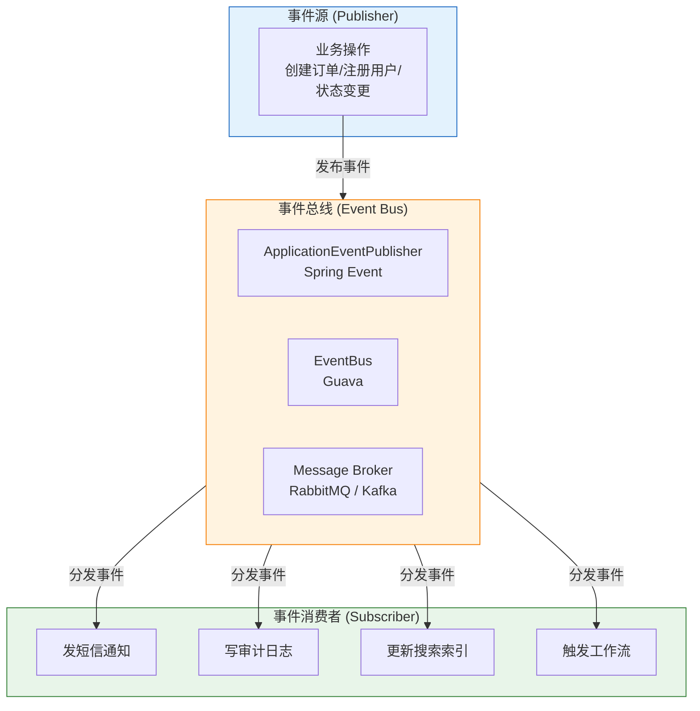

---

# 一、为什么需要事件驱动？

## 1.1 从紧耦合到松耦合

```java
// 紧耦合——创建订单的同时，显式调用各种下游服务
@Service
public class OrderService {

    @Autowired private SmsService smsService;         // 发短信
    @Autowired private AuditService auditService;     // 审计日志
    @Autowired private SearchService searchService;   // 更新搜索索引
    @Autowired private CouponService couponService;   // 发优惠券

    public Order createOrder(OrderDTO dto) {
        // ① 创建订单（核心逻辑）
        Order order = orderRepository.save(dto.toOrder());

        // ② 发短信通知
        smsService.send(order.getPhone(), "订单已创建");

        // ③ 写审计日志
        auditService.log("CREATE_ORDER", order.getId());

        // ④ 更新搜索索引
        searchService.index(order);

        // ⑤ 发放首单优惠券
        if (dto.isFirstOrder()) {
            couponService.issueNewUserCoupon(order.getUserId());
        }

        return order;  // 主流程 10ms + 附属操作 800ms = 总耗时 810ms
    }
}
```

**问题：**
- `OrderService` 依赖了 4 个本不该关心的服务——职责过重
- 主流程的响应时间被附属操作拖慢（短信可能 500ms）
- 新增一个附属操作就得改 `OrderService`——违反开闭原则 (OCP)

```java
// 松耦合——事件驱动
@Service
public class OrderService {
    @Autowired private ApplicationEventPublisher publisher;

    @Transactional
    public Order createOrder(OrderDTO dto) {
        Order order = orderRepository.save(dto.toOrder());
        publisher.publishEvent(new OrderCreatedEvent(this, order));
        // 主流程返回，不关心谁在监听——总耗时 = 10ms
        return order;
    }
}

// 监听者各自独立，互不感知
@Component
public class SmsListener {
    @EventListener
    public void handleOrderCreated(OrderCreatedEvent event) {
        smsService.send(event.getOrder().getPhone(), "订单已创建");
    }
}
```

---

# 二、观察者模式——事件驱动的设计基础

```java
// 经典观察者模式 (JDK 1.0)
// Observable（被观察者）+ Observer（观察者），但设计有缺陷（类继承而非接口）

// 现代写法——事件三要素：
// ① 事件对象（承载数据）
public class OrderCreatedEvent extends ApplicationEvent {
    private final Order order;
    public OrderCreatedEvent(Object source, Order order) {
        super(source);
        this.order = order;
    }
    public Order getOrder() { return order; }
}

// ② 发布者（产生事件触发）
publisher.publishEvent(new OrderCreatedEvent(this, order));

// ③ 监听者（响应事件）
@EventListener
public void handleOrderCreated(OrderCreatedEvent event) { ... }
```

---

# 三、Spring Event——最轻量的事件驱动

## 3.1 同步 vs 异步

```java
// 默认：同步执行——监听者在发布者的同一个线程中执行
publisher.publishEvent(event);
// → EventListener 执行完毕 → publishEvent 才返回
// 如果 listener 抛异常 → publisher 收到异常
// 如果 publisher 在事务中 → listener 也在事务中

// 异步执行——监听者在独立线程中执行
@Configuration
@EnableAsync  // 开启异步支持
public class AsyncConfig {
    @Bean
    public TaskExecutor taskExecutor() {
        ThreadPoolTaskExecutor executor = new ThreadPoolTaskExecutor();
        executor.setCorePoolSize(5);
        executor.setMaxPoolSize(20);
        executor.setQueueCapacity(100);
        executor.initialize();
        return executor;
    }
}

@Component
public class AsyncListener {
    @EventListener
    @Async  // ← 异步执行
    public void handle(OrderCreatedEvent event) {
        // 现在这个 listener 在异步线程池中执行
        // 不阻塞 publisher
        // 不在 publisher 的事务中——事务已提交
    }
}
```

**同步 vs 异步的选型：**

| | 同步 Event | 异步 Event |
|------|----------|-----------|
| **执行线程** | 发布者线程 | 线程池独立线程 |
| **事务** | 在同一事务中 | 不在同一事务 |
| **异常** | 会传播到发布者 | 被异步线程吞掉（需自定义 error handler） |
| **适用场景** | 与主流程事务强一致的操作 | 非关键附属操作（通知、日志、搜索索引） |

## 3.2 事务事件——事务提交后才执行

```java
// @TransactionalEventListener：只在事务提交/回滚后才触发

@Component
public class TransactionalListener {

    @TransactionalEventListener(phase = TransactionPhase.AFTER_COMMIT)
    public void handleAfterCommit(OrderCreatedEvent event) {
        // 事务提交后才执行——保证数据已经持久化
        // 典型场景：发 MQ 消息、发通知——避免事务还没提交就发出去
    }

    @TransactionalEventListener(phase = TransactionPhase.AFTER_ROLLBACK)
    public void handleAfterRollback(OrderCreatedEvent event) {
        // 事务回滚后的补偿逻辑
    }

    @TransactionalEventListener(phase = TransactionPhase.BEFORE_COMMIT)
    public void handleBeforeCommit(OrderCreatedEvent event) {
        // 事务提交前的最后检查
    }
}
```

**关键场景：为什么需要 AFTER_COMMIT？**

```java
// ❌ 错误做法——事务还没提交就发消息
@Transactional
public void createOrder(OrderDTO dto) {
    orderRepository.save(order);
    rabbitTemplate.send("order.queue", order);  // ← 发了消息但事务可能回滚！
}  // 如果 commit 失败 → 消息已经发出 → 下游消费到一个不存在的订单

// ✅ 正确做法——事务提交后再发
@Transactional
public void createOrder(OrderDTO dto) {
    orderRepository.save(order);
    publisher.publishEvent(new OrderCreatedEvent(this, order));  // 事件在事务内
}

@TransactionalEventListener(phase = TransactionPhase.AFTER_COMMIT)
public void sendToMQ(OrderCreatedEvent event) {
    rabbitTemplate.send("order.queue", event.getOrder());  // 事务已提交才发消息
}
```

## 3.3 事件的顺序控制

```java
// 多个 listener 监听同一事件 → 用 @Order 控制执行顺序
@Component
public class AuditListener {
    @EventListener
    @Order(1)  // 最先执行
    public void handle(OrderCreatedEvent event) {
        auditService.log("CREATE_ORDER", event.getOrder().getId());
    }
}

@Component
public class SmsListener {
    @EventListener
    @Order(2)  // 第二执行
    public void handle(OrderCreatedEvent event) {
        smsService.send(...);
    }
}
```

---

# 四、Guava EventBus——无注解的轻量解耦

```java
// Guava EventBus 不需要注解、不需要 ApplicationEvent 继承

// ① 定义事件（普通 POJO）
public class OrderCreatedEvent {
    private final Order order;
    public OrderCreatedEvent(Order order) { this.order = order; }
    public Order getOrder() { return order; }
}

// ② 定义监听者（普通类，不需要实现任何接口）
public class OrderEventListener {
    @Subscribe  // Guava 的注解
    public void onOrderCreated(OrderCreatedEvent event) {
        smsService.send(...);
    }

    @Subscribe
    public void onOrderCreatedForAudit(OrderCreatedEvent event) {
        // 同一个监听者可以有多个处理方法
        auditService.log(...);
    }
}

// ③ 注册与发布
EventBus eventBus = new EventBus("order-bus");
eventBus.register(new OrderEventListener());  // 注册监听者
eventBus.post(new OrderCreatedEvent(order));  // 发布事件（同步）

// ④ 异步 EventBus
AsyncEventBus asyncBus = new AsyncEventBus(Executors.newFixedThreadPool(5));
asyncBus.register(new OrderEventListener());
asyncBus.post(new OrderCreatedEvent(order));  // 异步分发

// ⑤ DeadEvent——无监听者时的回调
eventBus.register(new Object() {
    @Subscribe
    public void onDeadEvent(DeadEvent dead) {
        log.warn("事件无监听者: {}", dead.getEvent());
    }
});
```

**Spring Event vs Guava EventBus：**

| | Spring Event | Guava EventBus |
|------|-------------|---------------|
| **Spring 集成** | 原生 | 需手动配置 |
| **事件类型** | 必须继承 ApplicationEvent | POJO 即可 |
| **异步支持** | @Async | AsyncEventBus |
| **异常处理** | @EventListener 自带 error handler | SubscriberExceptionHandler |
| **事务集成** | @TransactionalEventListener | 无（自己处理） |
| **监听者注册** | 自动（@Component 扫描） | 手动 `register()` |
| **适用场景** | Spring 项目内事件通信 | 非 Spring 项目或通用库 |

---

# 五、消息队列——跨进程的事件驱动

## 5.1 事件驱动架构的三个级别

```
Level 1：进程内事件
  工具：Spring Event / EventBus
  特点：同步/异步，不持久化，重启丢失
  场景：同一个 JVM 内部的组件解耦

Level 2：轻量消息队列
  工具：RabbitMQ / Redis Pub-Sub
  特点：跨进程，可持久化，确认机制
  场景：微服务之间的异步通信

Level 3：大规模事件流
  工具：Kafka / Pulsar
  特点：高吞吐，持久化，可重放，分区有序
  场景：事件溯源、实时数据管道、CDC (Change Data Capture)
```

## 5.2 从 Spring Event 升级到 MQ

```java
// 第一步：定义通用的 MQ 消息体
public class OrderMessage {
    private String messageId;    // 幂等 ID
    private String type;         // ORDER_CREATED / ORDER_CANCELLED
    private Long orderId;
    private Long userId;
    private LocalDateTime timestamp;
    private String payload;      // JSON 序列化的详情
}

// 第二步：事务事件监听者 → 发 MQ
@Component
public class OrderEventToMQBridge {
    @Autowired private RabbitTemplate rabbitTemplate;

    @TransactionalEventListener(phase = TransactionPhase.AFTER_COMMIT)
    public void onOrderCreated(OrderCreatedEvent event) {
        OrderMessage msg = OrderMessage.from(event.getOrder());
        rabbitTemplate.convertAndSend("order.exchange", "order.created", msg);
    }
}

// 第三步：MQ 消费者
@Component
public class OrderMessageConsumer {
    @RabbitListener(queues = "order.created.queue")
    public void onMessage(OrderMessage msg) {
        // 处理消息（发短信、更新搜索...）
    }
}
```

## 5.3 Kafka 事件流——可重放的时间线

```java
// Kafka 把事件当作不可变的事实，永久存储

// 生产者
@Service
public class OrderEventProducer {
    @Autowired private KafkaTemplate<String, OrderEvent> kafka;

    public void send(OrderEvent event) {
        kafka.send("order-events",            // topic
            String.valueOf(event.getOrderId()), // key (相同 key 进同一分区，保证顺序)
            event);                             // value
    }
}

// 消费者——从特定位置消费
@KafkaListener(topics = "order-events", groupId = "search-updater")
public void updateSearchIndex(OrderEvent event, 
                              @Header(KafkaHeaders.OFFSET) long offset) {
    // 每个消费者组独立维护 offset——这就构成了事件溯源的基础
    // group "search-updater" 从 offset 1000 消费
    // group "notifier" 从 offset 950 消费（历史也可以重放）
}
```

---

# 六、事件驱动的工程设计考量

## 6.1 最终一致性

```
紧耦合（同步调用）：
  createOrder() → updateInventory() → sendNotification()
  要么全成功，要么全失败（同一事务或分布式事务）
  但：性能差、扩展难

事件驱动（异步解耦）：
  createOrder() → publish Event → return
    → (异步) updateInventory
    → (异步) sendNotification
  主流程快速返回，附属操作最终完成（"最终一致性"）
  但：需要处理失败重试、补偿、幂等
```

## 6.2 幂等性——事件可能被重复消费

```java
// 消息可能因重试而重复投递 → 消费者必须幂等

@RabbitListener(queues = "order.created.queue")
public void onMessage(OrderMessage msg) {
    // 方案一：唯一键去重
    String idempotentKey = msg.getMessageId();  // 唯一消息 ID
    if (processedCache.putIfAbsent(idempotentKey, "1")) {
        // 没处理过 → 处理
        doProcess(msg);
    } else {
        // 已处理过 → 跳过
        log.info("重复消息，跳过: {}", idempotentKey);
    }
}

// 方案二：数据库唯一约束
// INSERT INTO notification_log (order_id, type) VALUES (?, ?)
// 利用 UNIQUE(order_id, type) 保证一个订单只发一次通知
```

## 6.3 事件的版本管理

```java
// 事件 schema 会演进 → 需要处理兼容性
public class OrderEvent {
    private int schemaVersion;  // 当前版本
    // v1 的字段
    private Long orderId;
    // v2 新增字段 → 消费者要能处理老版本消息
    private String channel;  // 订单来源渠道
    // v3 废弃字段 → 保留但不赋值，消费者不能崩
}
```

---

# 七、选型决策

| 场景 | 推荐方案 | 理由 |
|------|---------|------|
| **同一 Spring 服务内解耦** | Spring Event + `@TransactionalEventListener` | 零依赖，事务集成最佳 |
| **非 Spring 项目 / 通用库** | Guava EventBus | POJO 事件，无需 Spring 依赖 |
| **微服务异步通信、低吞吐** | RabbitMQ | 稳定，路由灵活，确认机制完善 |
| **高吞吐事件流、事件溯源、CDC** | Kafka | 高吞吐，持久化，可重放，分区有序 |
| **Redis 已有的项目** | Redis Pub/Sub | 简单，但消息不持久化 |
| **简单异步，不需要 MQ** | `@Async` + Spring Event | 比 MQ 简单，但同进程 |

**反模式——不该用事件的场景：**
- 主流程强依赖该操作的返回结果（应该同步调用）
- 事务性操作（两个操作必须在同一事务 → 用同步 + 本地事务）
- 简单的一对一调用（别为了解耦而解耦——直接调就行）

---

# 总结

```
事件驱动的核心价值：

对发布者而言：
  → 我不关心谁在听、听多少、听完做什么
  → 我只需要发布"这件事发生了"
  → 主流程轻量，职责单一

对消费者而言：
  → 我不关心是谁发的、什么时候发的
  → 我只需要处理"这件事发生了"
  → 独立演化，独立部署

对系统而言：
  → 组件之间松耦合，各自独立开发、测试、部署
  → 新需求只需新增 listener，不动发布者
  → 自然形成了异步、最终一致性的架构
```

事件驱动不是银弹——它带来了最终一致性的复杂度（重试、幂等、补偿、监控）。但当你面对一个不断膨胀的 Service 时，从"发布一条事件"开始拆解，常常是最自然的第一步。
