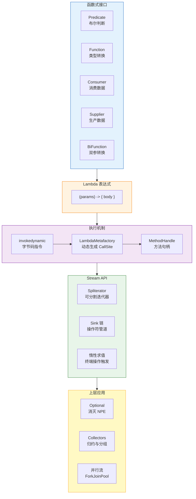

---

# 一、Lambda 表达式——Java 函数式编程的入口

## 1.1 Lambda 不是匿名内部类

这是最常见也最重要的纠正——**Lambda 表达式不是匿名内部类的语法糖**。两者的实现机制完全不同。

```java
// 匿名内部类
Runnable r1 = new Runnable() {
    @Override
    public void run() {
        System.out.println("匿名内部类");
    }
};

// Lambda 表达式
Runnable r2 = () -> System.out.println("Lambda");
```

**编译结果对比：**

| | 匿名内部类 | Lambda 表达式 |
|------|----------|-------------|
| **编译产物** | 生成独立的 `.class` 文件 (`XX$1.class`) | 不生成 class 文件 |
| **类加载** | 每次 new 都会触发类加载 | 首次执行时通过 `invokedynamic` 动态生成 |
| **内存占用** | 独立的 class 常驻 Metaspace | 按需生成，可被 GC 回收 |
| **this 引用** | 指向内部类实例本身 | 指向外部类实例 |
| **底层实现** | 纯粹的类继承/接口实现 | `invokedynamic` + `LambdaMetafactory` + `MethodHandle` |

## 1.2 invokedynamic 如何生成 Lambda

`invokedynamic` 是 JDK 7 引入的字节码指令，JDK 8 因 Lambda 才大规模使用。它的核心思想是：**把方法分派的逻辑从 JVM 中剥离，交给引导方法 (Bootstrap Method) 决定**。

```java
// 源码
Consumer<String> printer = s -> System.out.println(s);

// 编译后字节码中的 invokedynamic 指令：
// invokedynamic #2  0  accept:()Ljava/util/function/Consumer;
//   BootstrapMethods:
//     0: #37 REF_invokeStatic java/lang/invoke/LambdaMetafactory.metafactory:
//        (Lookup, String, MethodType, MethodType, MethodHandle, MethodType)CallSite
```

**LambdaMetafactory.metafactory() 的执行流程：**

```
① invokedynamic 指令首次执行
    ↓
② JVM 查找 BootstrapMethods 属性表，找到 metafactory
    ↓
③ metafactory 被调用，参数包括：
    - lookup: 调用者的访问上下文
    - invokedName: 函数式接口的方法名 ("accept")
    - invokedType: 函数式接口类型 (Consumer)
    - samMethodType: 函数式接口唯一抽象方法的签名 (void(Object))
    - implMethod: Lambda 体的 MethodHandle (指向 System.out::println)
    - instantiatedMethodType: 实例化后的方法类型
    ↓
④ metafactory 内部：
    - 用 ASM 动态生成一个实现 Consumer 接口的类
    - 这个类的 accept 方法直接调用 System.out.println
    - 创建该类的实例
    - 包装为 MethodHandle
    ↓
⑤ 返回一个 ConstantCallSite（常量调用点），内部持有 MethodHandle
    ↓
⑥ 后续调用直接走 MethodHandle.invokeExact()
    → 没有反射开销，接近直接调用的性能
```

> 这就是 Lambda 性能优于匿名内部类的根本原因——MethodHandle 的 `invokeExact()` 是 JVM 内置的快速路径，性能接近 `invokevirtual`，而匿名内部类多了一层 `invokeinterface` + vtable 查找。

## 1.3 Lambda 的 this 语义

```java
public class Outer {
    private String name = "Outer";

    public void test() {
        // 匿名内部类：this 指向内部类自身
        Runnable r1 = new Runnable() {
            private String name = "Inner";
            @Override
            public void run() {
                System.out.println(this.name);  // 输出 "Inner"——内部类的字段
                System.out.println(Outer.this.name);  // 输出 "Outer"
            }
        };
        r1.run();

        // Lambda：this 指向外部类的实例
        Runnable r2 = () -> {
            System.out.println(this.name);  // 输出 "Outer"——Lambda 没有自己的 this
            // System.out.println(Outer.this.name);  // 编译错误！Lambda 中不能用 Outer.this
        };
        r2.run();
    }
}
```

**Lambda 没有创建新的作用域**——它是词法作用域（lexical scoping），`this` 就是包围它的方法的 `this`。这一点和匿名内部类完全不同。

---

# 二、函数式接口体系——java.util.function

JDK 8 在 `java.util.function` 包中定义了 43 个函数式接口，但核心只有 5 类：

```java
// ① Predicate<T> —— 断言/过滤
// T → boolean
@FunctionalInterface
interface Predicate<T> {
    boolean test(T t);
    default Predicate<T> and(Predicate<? super T> other) { ... }
    default Predicate<T> or(Predicate<? super T> other) { ... }
    default Predicate<T> negate() { ... }
    static <T> Predicate<T> isEqual(Object targetRef) { ... }
}

// 使用
list.stream()
    .filter(u -> u.getAge() > 18)           // Predicate
    .filter(((Predicate<User>) u -> u.isVip()).negate())  // NOT vip
    .collect(toList());

// ② Function<T, R> —— 转换/映射
// T → R
@FunctionalInterface
interface Function<T, R> {
    R apply(T t);
    default <V> Function<V, R> compose(Function<? super V, ? extends T> before) { ... }
    default <V> Function<T, V> andThen(Function<? super R, ? extends V> after) { ... }
    static <T> Function<T, T> identity() { return t -> t; }
}

// 使用
list.stream()
    .map(User::getName)    // Function<User, String>
    .map(String::length)   // Function<String, Integer>
    .collect(toList());

// ③ Consumer<T> —— 消费/副作用
// T → void
@FunctionalInterface
interface Consumer<T> {
    void accept(T t);
    default Consumer<T> andThen(Consumer<? super T> after) { ... }
}

// 使用
list.forEach(System.out::println);  // Consumer

// ④ Supplier<T> —— 生产/懒加载
// () → T
@FunctionalInterface
interface Supplier<T> {
    T get();
}

// 使用
String name = Optional.ofNullable(user)
    .map(User::getName)
    .orElseGet(() -> "匿名用户");  // Supplier，延迟计算

// ⑤ BiFunction<T, U, R> —— 双参数转换
// (T, U) → R
@FunctionalInterface
interface BiFunction<T, U, R> {
    R apply(T t, U u);
}

// 使用
Map<String, Integer> map = new HashMap<>();
map.computeIfAbsent("key", k -> k.length());  // BiFunction
```

**类型变体一览：**

| 返回 void | 返回 T | 返回 boolean |
|----------|--------|-------------|
| Consumer&lt;T&gt; | Function&lt;T,R&gt; | Predicate&lt;T&gt; |
| BiConsumer&lt;T,U&gt; | BiFunction&lt;T,U,R&gt; | BiPredicate&lt;T,U&gt; |
| IntConsumer | IntFunction&lt;R&gt; | IntPredicate |
| LongConsumer | LongFunction&lt;R&gt; | LongPredicate |
| DoubleConsumer | DoubleFunction&lt;R&gt; | DoublePredicate |
| — | IntToLongFunction / ToIntFunction | — |

---

# 三、Stream API——声明式的数据管道

## 3.1 惰性求值的本质

```java
// 这段代码不会执行任何真正的过滤/映射操作：
Stream<String> stream = users.stream()
    .filter(u -> {
        System.out.println("filter: " + u.getName()); // ← 不会打印！
        return u.getAge() > 18;
    })
    .map(u -> {
        System.out.println("map: " + u.getName());    // ← 不会打印！
        return u.getName();
    });

// 只有调用终端操作时，整个管道才开始执行：
List<String> result = stream.collect(toList());  // ← 现在才真正开始计算
```

**惰性求值的实现机制——Sink 链：**

```
users.stream()
    .filter(...)         → 返回 StatelessOp 包装的 Stream，记录 filter 操作
    .map(...)            → 返回 StatelessOp 包装的 Stream，记录 map 操作
    .limit(10)           → 返回 SliceOps 包装的 Stream，记录 limit 操作
    .collect(toList())   → 终端操作！触发整个管道的求值
```

**终端操作触发后：**
a. 各阶段的操作被包装成 `Sink` 对象，按逆序串联为链：`limit → map → filter → source`
b. `Spliterator` 遍历源数据
c. 数据从 source 端 push 进 Sink 链：`Spliterator → filter sink → map sink → limit sink → collector`
d. 每个 Sink 完成自己的逻辑后再传给下游 Sink

`limit(10)` 的意义在于——一旦 count 达到 10，它会直接停止从上游 pull 数据，后续元素根本不会被 filter/map 处理。

## 3.2 Stream 操作分类

| 操作类型 | 方法 | 特点 |
|---------|------|------|
| **中间-无状态** | `filter`, `map`, `flatMap`, `peek` | 不依赖其他元素，单独处理 |
| **中间-有状态** | `distinct`, `sorted`, `limit`, `skip` | 需要窗口或全局排序 |
| **终端-短路** | `findFirst`, `findAny`, `anyMatch`, `allMatch`, `noneMatch` | 满足条件立即返回，不处理全量 |
| **终端-非短路** | `forEach`, `collect`, `reduce`, `count`, `max`, `min`, `toArray` | 必须处理全量数据 |

**有状态 vs 无状态的本质区别：**
- `filter` 处理元素时只需要当前元素的值——无状态
- `distinct` 需要记住"已经见过哪些元素"——有状态（内部有 HashSet）
- `sorted` 需要看到所有元素才能排序——有状态（内部全量缓存）

## 3.3 Spliterator——Stream 的底层引擎

`Spliterator`（Splitable Iterator，可分割迭代器）是 Stream 并行执行的基础：

```java
public interface Spliterator<T> {
    boolean tryAdvance(Consumer<? super T> action);  // 单个元素迭代
    Spliterator<T> trySplit();                        // 分割为两个 Spliterator
    long estimateSize();                              // 估算剩余元素数
    int characteristics();                            // 特性标记(ORDERED/SIZED/SUBSIZED/...)
}
```

**ForkJoinPool 的并行流程：**
1. 源数据的 Spliterator 调用 `trySplit()` 不断二分
2. 每个子 Spliterator 提交到 ForkJoinPool 的不同线程处理
3. 各子结果最后合并（reduce/collect 等终端操作负责）

```java
// 并行流的 ForkJoin 本质
users.parallelStream()           // Spliterator 二分
    .filter(u -> u.getAge() > 18)  // 每个子 Spliterator 独立过滤
    .map(User::getName)            // 每个子 Spliterator 独立映射
    .collect(toList());            // 合并子结果
```

**注意**：`parallelStream()` 使用公共 ForkJoinPool (`ForkJoinPool.commonPool()`)，默认线程数 = CPU 核数 - 1。对于 IO 密集任务，自定义线程池或用 `CompletableFuture` 更合适。

## 3.4 Collectors——归约的瑞士军刀

```java
// ① 聚合函数
users.stream().collect(Collectors.counting());                         // 计数
users.stream().collect(Collectors.summingInt(User::getAge));           // 求和
users.stream().collect(Collectors.averagingInt(User::getAge));          // 平均值
IntSummaryStatistics stats = users.stream()
    .collect(Collectors.summarizingInt(User::getAge));                 // 全统计

// ② 分组
Map<String, List<User>> byCity = users.stream()
    .collect(Collectors.groupingBy(User::getCity));                    // 一级分组
Map<String, Map<String, List<User>>> byCityAndGender = users.stream()
    .collect(Collectors.groupingBy(User::getCity,
                 Collectors.groupingBy(User::getGender)));             // 二级分组

// ③ 分区（bool 分组）
Map<Boolean, List<User>> adults = users.stream()
    .collect(Collectors.partitioningBy(u -> u.getAge() >= 18));

// ④ 自定义归约
String names = users.stream()
    .collect(Collectors.mapping(User::getName,
                 Collectors.joining(",", "[", "]")));                  // "[Alice,Bob,Charlie]"

// ⑤ collectingAndThen——归约后再转换
ImmutableList<User> immutable = users.stream()
    .collect(Collectors.collectingAndThen(Collectors.toList(),
                 ImmutableList::copyOf));
```

---

# 四、Optional——消灭 NPE 的函数式工具

```java
// Optional 不是一个通用容器，它是一个"可空的返回值"
// 最佳实践：只作为方法返回值使用，不要用于字段或方法参数

// ① 创建
Optional<String> opt1 = Optional.of("hello");       // 非 null
Optional<String> opt2 = Optional.ofNullable(val);   // 可为 null
Optional<String> opt3 = Optional.empty();           // 空

// ② 链式转换
String city = Optional.ofNullable(user)
    .map(User::getAddress)       // Function: User → Address
    .map(Address::getCity)       // Function: Address → String
    .filter(c -> !c.isEmpty())   // Predicate
    .orElse("未知城市");

// ③ 消费与异常
Optional.ofNullable(user)
    .ifPresent(u -> sendEmail(u.getEmail()));   // Consumer

User u = userRepo.findById(id)
    .orElseThrow(() -> new NotFoundException("用户不存在：" + id));

// ④ orElse vs orElseGet 的性能陷阱
String name1 = Optional.ofNullable(user)
    .map(User::getName)
    .orElse(getDefaultName());   // ← getDefaultName() 会立即执行！
                                  //   即使 user 不为 null 也执行了（浪费）

String name2 = Optional.ofNullable(user)
    .map(User::getName)
    .orElseGet(() -> getDefaultName()); // ← Supplier 惰性求值
                                        //   只有 user 为 null 时才执行

// ⑤ flatMap 处理嵌套 Optional
// 场景：方法返回 Optional，链式调用会变成嵌套 Optional
Optional<String> city = Optional.ofNullable(user)
    .flatMap(u -> u.getAddressOptional())  // flatMap 把 Optional<Optional<String>> 拍平
    .flatMap(a -> a.getCityOptional());
```

**Optional 的反模式（不要这样做）：**

```
// ❌ 不要作为字段
class User {
    private Optional<String> name;  // 序列化/equals 都有坑
}

// ❌ 不要作为方法参数
void process(Optional<String> param) {}  // 调用方被迫包装

// ❌ 不要用 isPresent + get 代替 null 判断
if (opt.isPresent()) { return opt.get(); }
// → 直接 orElse / map 就完了

// ❌ 不要在集合中存 Optional
List<Optional<String>> list;  // 用 null 或 sentinel value
```

---

# 五、方法引用——Lambda 的简写

```
四种形式：

① 静态方法引用    ClassName::staticMethod     → x → ClassName.staticMethod(x)
② 实例方法引用    instance::method            → x → instance.method(x)
③ 类方法引用      ClassName::instanceMethod   → (x, y) → x.method(y)
④ 构造器引用      ClassName::new              → x → new ClassName(x)
```

```java
// 第三种的微妙之处
List<String> words = Arrays.asList("hello", "world");
words.stream()
    .map(String::toUpperCase)   // ← 无参方法！等价于 s -> s.toUpperCase()
    .forEach(System.out::println);

// 对比：
// String::toUpperCase    → 接受 1 个 String → (String s) → s.toUpperCase()
// System.out::println    → 接受 1 个 Object → (Object o) → System.out.println(o)
```

---

# 六、性能与避坑

**Stream 一定比 for 循环快吗？** 不是。

| 场景 | 推荐 | 原因 |
|------|------|------|
| 百级别元素 | for 循环 | Stream 有栈帧和装箱开销 |
| 千~万级别 | 差别不大 | 选可读性更好的 |
| 十万+ 且有复杂操作 | parallelStream (CPU密集) | Spliterator 并行化优势明显 |
| 包装类型 Stream | 换为 `IntStream`/`LongStream` | 避免 `Integer.intValue()` 装箱开销 |

```java
// ❌ 慢：Stream<Integer> 有装箱
list.stream().mapToInt(Integer::intValue).sum();

// ✅ 快：直接用 IntStream
IntStream.of(1, 2, 3).sum();
```

**Stream 常见陷阱：**
- `peek` 不是调试工具——它可能因为优化被跳过（例如 `count()` 不触发 `peek`）
- `Stream` 只能消费一次——用完就关闭了
- `parallelStream` 中使用非线程安全集合——`ArrayList:add` 会丢数据
- `findFirst` 在并行流中性能很差——检查 ordering 的开销大

---

# 总结

```
函数式编程在 Java 中的三层结构：

第一层（API）：Lambda + 方法引用 + 函数式接口
    → 让"行为"像"数据"一样传递

第二层（管道）：Stream + Optional
    → 声明式的处理流程，惰性求值

第三层（机制）：invokedynamic + MethodHandle + LambdaMetafactory
    → 高性能的动态方法分派
```

Java 的函数式编程不是要替代 OOP，而是**补充**——用纯函数处理数据流、用 OOP 组织领域模型。两者的融合才是现代 Java 的编程范式。
