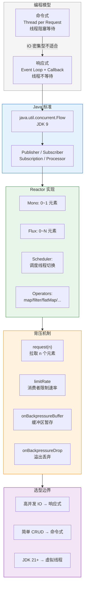
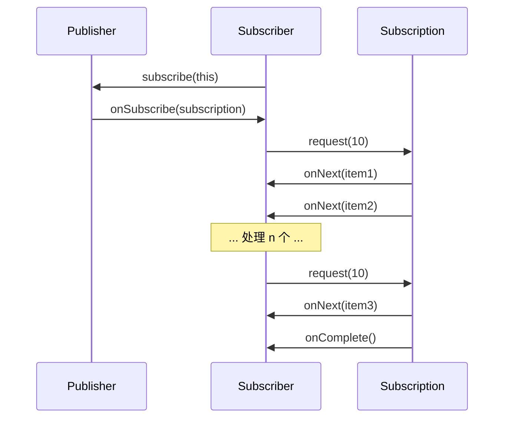
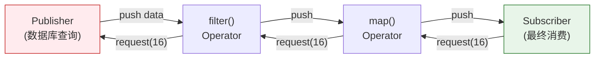

---

# 一、为什么需要响应式编程？

## 1.1 阻塞模型的困境

```
传统 Spring MVC（Tomcat）：

每个请求占用一条线程
    → 线程执行 SQL 查询 → 线程阻塞等待数据库返回（100ms）
        → 线程处理结果 → 线程执行 HTTP 调用 → 线程阻塞等待下游返回（200ms）
            → 线程返回响应 → 线程归还池

问题：
  Tomcat 线程池 = 200 条线程
  每请求占用时间 ≈ 300ms（其中 200ms 在阻塞等待）
  QPS 上限 = 200 / 0.3 ≈ 667
  再加机器？线程已满，新请求在排队
```

线程在等待 IO 期间**什么都不做**——光占着栈内存（每条线程 ~1MB）。如果并发请求超过线程池大小，后面的请求全部排队，延时飙升。

## 1.2 响应式的思路：线程不等人

```
WebFlux（Netty Event Loop）：

每个请求不独占线程
    → 发起异步 SQL 查询 → 注册回调 → 线程立即去处理其他请求
        → SQL 返回 → EventLoop 收到通知 → 线程继续处理这个请求
            → 发起异步 HTTP → 注册回调 → 线程又去处理别的
                → HTTP 返回 → EventLoop 再次通知 → 组装响应

结果：
  一台机器跑在 Netty 2×CPU 核数 的 IO 线程上
  能支撑数万并发连接，因为线程几乎不阻塞
```

**核心转变：** 从"线程等数据"变成"数据来了通知线程"。

---

# 二、Java 9 Flow API——响应式规范

JDK 9 在 `java.util.concurrent.Flow` 中定义了四个核心接口，作为响应式编程的 JVM 标准——实现了 Reactive Streams 规范：

```java
// ① Publisher——数据的生产者
@FunctionalInterface
interface Publisher<T> {
    void subscribe(Subscriber<? super T> subscriber);
}

// ② Subscriber——数据的消费者
interface Subscriber<T> {
    void onSubscribe(Subscription subscription);  // 订阅建立
    void onNext(T item);                          // 收到一条数据
    void onError(Throwable throwable);            // 出错
    void onComplete();                            // 数据完结
}

// ③ Subscription——背压控制器
interface Subscription {
    void request(long n);   // 消费者说"我能处理 n 条，发过来"
    void cancel();          // 取消订阅
}

// ④ Processor——既是 Publisher 又是 Subscriber（数据转换中间件）
interface Processor<T, R> extends Subscriber<T>, Publisher<R> {}
```

**交互流程：**



**关键设计：** `onSubscribe → request(n) → onNext×n → request(m) → onNext×m → ...`

消费者每次 `request(n)` 都明确告诉生产者"我还能处理 n 个"——这就是**背压 (Backpressure)** 的协议基础。生产者不能比消费者快。

---

# 三、Project Reactor——Spring 选中的响应式实现

Spring WebFlux 选择 Reactor 作为底层响应式库。Reactor 的核心是两个类型：

## 3.1 Mono 和 Flux

```java
// Mono<T> —— 0 或 1 个元素的异步序列
Mono<User> user = userRepository.findById(id);  // 返回 1 个 User 或空
Mono<Void> done = userRepository.save(user);    // 只关心完成与否
Mono<User> fromCallable = Mono.fromCallable(() -> fetchUser(id)); // 包装阻塞调用
Mono<User> error = Mono.error(new RuntimeException());           // 错误信号
Mono<User> empty = Mono.empty();                                   // 空信号

// Flux<T> —— 0 到 N 个元素的异步序列
Flux<User> all = userRepository.findAll();       // 返回 0~N 个 User
Flux<Integer> range = Flux.range(1, 10);         // 1,2,...,10
Flux<Long> interval = Flux.interval(Duration.ofSeconds(1)); // 每秒发射一个递增数字
Flux<Integer> fromArray = Flux.fromArray(new Integer[]{1, 2, 3});
```

## 3.2 操作符——数据流的声明式编排

```java
// ① 转换操作（无状态）
Flux<User> adults = userRepository.findAll()
    .filter(u -> u.getAge() >= 18)               // 过滤
    .map(User::getName)                           // 1:1 转换
    .flatMap(name -> fetchOrdersByName(name))     // 1:N 转换（拍平）
    .concatMap(name -> fetchOrdersByName(name));  // flatMap 的顺序保证版

// ② 组合操作
Mono<User> user = ...;
Mono<Address> address = ...;
Mono<String> result = user.zipWith(address)      // 等两个都完成
    .map(tuple -> tuple.getT1().getName() + " lives in " + tuple.getT2().getCity());

// ③ 错误处理
Flux<User> result = userRepository.findAll()
    .onErrorReturn(User.ANONYMOUS)               // 出错时返回默认值
    .onErrorResume(e -> fetchFromCache())         // 出错时切换数据源
    .retry(3)                                     // 出错重试 3 次
    .timeout(Duration.ofSeconds(5));              // 5 秒超时

// ④ 条件操作
Flux<User> cached = users.defaultIfEmpty(createDefaultUser());
Mono<Boolean> hasAdmin = users.any(u -> u.getRole() == ADMIN);
```

**关键区分——flatMap vs concatMap vs flatMapSequential：**

| 操作符 | 并发度 | 顺序保持 | 适用场景 |
|--------|--------|---------|---------|
| `flatMap` | 并发请求 | 乱序（谁先返回谁先推送） | 不关心顺序 |
| `concatMap` | 串行（一个完成才下一个） | 严格原序 | 必须保持顺序 |
| `flatMapSequential` | 并发请求 | 输出按原序排队 | 要并发也要顺序 |

## 3.3 Scheduler——线程调度模型

```java
// Reactor 的线程切换依赖 Scheduler
Flux.range(1, 100)
    .subscribeOn(Schedulers.parallel())  // ↓ 上游（数据源）在并行线程池执行
    .publishOn(Schedulers.boundedElastic())  // ↓ 下游（后续操作）在弹性线程池执行
    .map(this::heavyProcessing)
    .subscribe();

// subscribeOn：影响"订阅触发"时在哪个线程执行 → 影响上游
// publishOn：影响"后续操作"在哪个线程执行 → 影响下游
```

**Reactor 内置 Scheduler：**

| Scheduler | 线程池类型 | 用途 |
|-----------|----------|------|
| `Schedulers.parallel()` | 固定大小 = CPU 核数 | CPU 密集型计算 |
| `Schedulers.boundedElastic()` | 有界弹性（默认 cap=10×CPU核数） | IO 密集型（旧的 `elastic()` 已废弃） |
| `Schedulers.single()` | 单线程 | 需要全局顺序的事件处理 |
| `Schedulers.immediate()` | 当前线程 | 测试或不需要切换时 |

**subscribeOn 和 publishOn 的线程切换想象图：**

```
原始线程 (main)
    ↓ .subscribeOn(Schedulers.parallel())
上游操作 (parallel-1)          ← 数据源、filter 等在这个线程
    ↓ .publishOn(Schedulers.boundedElastic())
下游操作 (boundedElastic-2)    ← map、处理等在这个线程
    ↓
订阅者 (可能在 main 线程或 subscribe() 所在线程)
```

---

# 四、背压——响应式最核心的工程价值

## 4.1 没有背压会怎样？

```
生产者每秒产出 10000 条 → 消费者每秒只能处理 1000 条
    → 消费者内存爆满 → GC 频繁 → 响应变慢 → 内存溢出
```

## 4.2 Reactor 的背压策略

```java
// ① request(n) —— 消费者控制速率（默认策略）
// Reactor 内部，下游 operator 会按需调用 upstream.request(n)
// 开发者通常不需要手动处理，但可以显式设置预取数量：

users.limitRate(20);  // 每次最多从上游请求 20 个元素（默认预取 75%）

// ② onBackpressureBuffer —— 生产者太快时先缓存
users.onBackpressureBuffer(     // 溢出时存入缓冲区
    256,                        // 最大缓存大小
    item -> log.warn("丢弃: {}", item),  // 缓冲区满时的丢弃回调
    BufferOverflowStrategy.DROP_OLDEST  // 丢弃策略
);

// ③ onBackpressureDrop —— 溢出的直接丢弃
users.onBackpressureDrop(item -> log.warn("丢弃: {}", item));

// ④ onBackpressureLatest —— 只保留最新的
users.onBackpressureLatest();  // 缓冲区只有 1 个，新的替换老的

// ⑤ onBackpressureError —— 溢出时直接报错
users.onBackpressureError();
```

## 4.3 背压是如何传递的



每个操作符既是上游的 Subscriber，也是下游的 Publisher。当终端 Subscriber 调用 `request(n)` 时，这个信号沿着操作链**反向传导**回源 Publisher。这就是 Reactor 的"背压传播"。

---

# 五、WebFlux——Spring 的响应式 Web 栈

```java
@RestController
@RequestMapping("/users")
public class UserController {

    @Autowired private UserRepository userRepository;

    @GetMapping("/{id}")
    public Mono<User> getUser(@PathVariable Long id) {      // 返回 Mono，不阻塞
        return userRepository.findById(id);
    }

    @GetMapping
    public Flux<User> listUsers() {                         // 返回 Flux
        return userRepository.findAll()
            .filter(u -> u.getAge() > 18)
            .map(u -> {
                u.setName(u.getName().toUpperCase());        // immutable 更好，这里只是示意
                return u;
            })
            .take(20);                                      // 只取前 20 条
    }

    @PostMapping
    @ResponseStatus(HttpStatus.CREATED)
    public Mono<User> createUser(@RequestBody User user) {
        return userRepository.save(user)
            .doOnSuccess(u -> log.info("创建用户: {}", u.getId()));
    }
}
```

**WebFlux 中 Controller 方法直接返回 Mono/Flux，Spring 框架负责订阅它们**——你不需要手动 `subscribe()`。

## 响应式全栈一致性

```java
// Controller → Service → Repository 全链路 Mono/Flux
// 好处：没有任何线程阻塞，整个请求在一个 EventLoop 线程完成调度

// Repository (ReactiveMongoRepository / R2DBC)
public interface UserRepository extends ReactiveCrudRepository<User, Long> {
    Flux<User> findByCity(String city);  // 方法名直接查询
}

// Service
@Service
public class UserService {
    public Mono<UserDTO> getUserWithOrders(Long userId) {
        return userRepository.findById(userId)
            .flatMap(user -> orderRepository.findByUserId(userId)
                .collectList()                               // Flux→Mono<List>
                .map(orders -> UserDTO.from(user, orders))
            );
    }
}
```

---

# 六、响应式 vs 虚拟线程——选型边界

JDK 21 虚拟线程让响应式不再是唯一的异步方案：

```java
// 传统：必须用 CompletableFuture 或 Reactor 来异步化
public CompletableFuture<UserDTO> getUserAsync(Long id) {
    return CompletableFuture
        .supplyAsync(() -> userRepo.findById(id))
        .thenCombine(
            CompletableFuture.supplyAsync(() -> orderRepo.findByUserId(id)),
            UserDTO::new
        );
}

// 虚拟线程：用同步代码写异步效果，平台线程不阻塞
public UserDTO getUser(Long id) throws InterruptedException {
    var userFuture = executor.submit(() -> userRepo.findById(id));
    var ordersFuture = executor.submit(() -> orderRepo.findByUserId(id));
    return new UserDTO(userFuture.get(), ordersFuture.get());
    // 虚拟线程在 get() 时出让平台线程，IO 完成后再调度回来
}
```

**选型矩阵：**

| 维度 | 响应式 (Reactor/WebFlux) | 虚拟线程 (JDK 21+) |
|------|-------------------------|-------------------|
| **学习曲线** | 陡峭（思维转变大） | 平缓（同步代码不变） |
| **调试体验** | 差——堆栈是操作符链 | 好——堆栈就是调用链 |
| **背压控制** | 原生支持，精细控制 | 无内置背压（可用 Semaphore） |
| **高并发连接数** | 极高（Event Loop） | 高（Carrier Thread + mount/unmount） |
| **数据库驱动** | 需要 R2DBC（不成熟） | 任何 JDBC 驱动（自动 pin） |
| **CPU 密集型** | 差（Event Loop 被占） | 不相关（平台线程直接执行） |
| **团队要求** | 全员理解响应式范式 | 只需升级 JDK |
| **适合场景** | 网关/代理/MQ Consumer | 传统 CRUD 业务 |

**一个务实观点：** 如果今天你在选型，团队还没有投入响应式——先考虑虚拟线程。响应式的不可替代优势只有两个：**精细的背压控制** 和 **极高的单机连接数**（网关、代理、IoT Broker 等场景）。

---

# 七、常见陷阱

```java
// ① 不要在 map 中调用阻塞 API
Flux<User> users = userRepository.findAll()
    .map(user -> {
        String city = geoService.lookup(user.getIp()); // ← 阻塞！EventLoop 线程被卡住
        user.setCity(city);
        return user;
    });
// 正确做法：
users.flatMap(user -> Mono.fromCallable(() -> geoService.lookup(user.getIp()))
    .subscribeOn(Schedulers.boundedElastic())   // 把阻塞调用放到弹性线程池
    .map(city -> { user.setCity(city); return user; })
);

// ② 忘记订阅
Mono<User> user = userRepository.findById(1L);   // 只是声明，什么都没执行！
user.map(u -> { sendEmail(u); return u; });       // 还是声明！
// 必须 subscribe 或 framework 自动 subscribe

// ③ subscribe 前没有任何事情发生
// Reactor 是惰性的——subscribe 才触发上游开始发射数据

// ④ flatMap 中的并发度失控
Flux.range(1, 1000)
    .flatMap(id -> fetchExternalApi(id));  // ← 1000 个并发请求同时发出
// 正确做法：
Flux.range(1, 1000)
    .flatMap(id -> fetchExternalApi(id), 10);  // 限制并发度 = 10
```

---

# 总结

```
响应式解决的问题：
  在有限的线程资源下，承载海量的 IO 等待型并发连接

响应式的代价：
  思维转变大、调试困难、数据库驱动不成熟、团队培训成本高

响应式的不可替代之处：
  精细的背压控制 + 极高的单机连接数

虚拟线程的冲击：
  大部分 CRUD 场景不需要响应式了
  但网关/代理/IoT Broker 等场景仍然是响应式的主场
```
