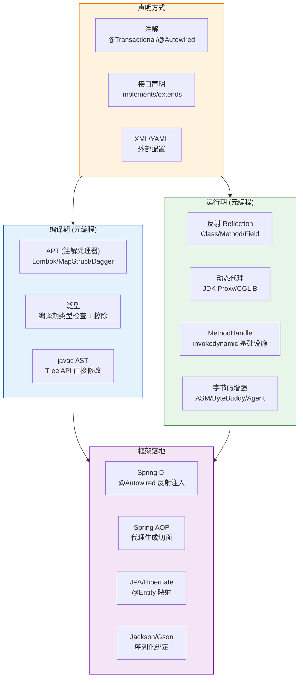
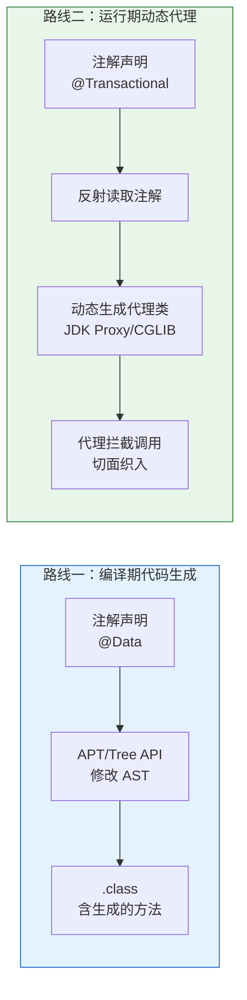

---

# 一、声明式编程——只声明意图，不关心实现

## 1.1 什么是声明式？

**命令式（Imperative）：告诉计算机每一步怎么做**

```java
// 我要一个18岁以上用户的名字列表
List<String> result = new ArrayList<>();
for (User u : users) {
    if (u.getAge() > 18) {
        result.add(u.getName());
    }
}
Collections.sort(result);
```

**声明式（Declarative）：只声明我要什么结果**

```java
// 我要成年人名字列表，按字母序
List<String> result = users.stream()
    .filter(u -> u.getAge() > 18)
    .map(User::getName)
    .sorted()
    .toList();
```

Java 中的声明式主要通过三种途径实现：

| 途径 | 示例 | 实现原理 |
|------|------|---------|
| **注解** | `@Autowired`, `@Transactional`, `@Entity` | APT（编译期）或反射（运行期） |
| **接口声明** | `implements UserService`, `extends JpaRepository<T,ID>` | 动态代理 + 字节码增强 |
| **外部配置** | `application.yml`, XML, properties | 框架在启动时解析并注入 |

## 1.2 注解——Java 声明式的核心载体

```java
// 声明式事务 —— 一个注解替代几十行事务管理代码
@Transactional(readOnly = true, propagation = Propagation.REQUIRED)
public User getUser(Long id) {
    return userRepository.findById(id).orElseThrow();
}
// 等价于（命令式）：
// Connection conn = null;
// try {
//     conn = ds.getConnection();
//     conn.setAutoCommit(false);
//     conn.setReadOnly(true);
//     User user = userRepository.findById(id).orElseThrow();
//     conn.commit();
//     return user;
// } catch (Exception e) {
//     if (conn != null) conn.rollback();
//     throw e;
// } finally {
//     if (conn != null) conn.close();
// }
```

**元注解体系：**

```java
@Retention(RetentionPolicy.RUNTIME)   // 保留到运行时——反射可读取
@Retention(RetentionPolicy.CLASS)     // 保留到 class 文件——APT 可处理，反射不可读
@Retention(RetentionPolicy.SOURCE)    // 仅源码——APT 处理完就丢弃

@Target(ElementType.TYPE)             // 只能加在类上
@Target(ElementType.METHOD)           // 只能加在方法上

@Inherited                             // 子类继承父类的注解
@Documented                            // javadoc 中出现
@Repeatable                            // 可重复标注（JDK 8）
```

---

# 二、注解处理 (APT) —— 编译期元编程

## 2.1 APT 的工作原理

APT（Annotation Processing Tool）是 javac 编译流程中的一个标准环节：

```
源码 .java
  ↓ 词法分析 + 语法分析
AST (JCTree)
  ↓ 注解处理器 round 1 → 可能生成新源码
  ↓ javac 发现新源码，再来一轮
AST (JCTree)
  ↓ 注解处理器 round 2
  ↓ ...直到没有新生成的文件
  ↓ 语义分析 → 解语法糖 → 字节码生成
.class
```

**自定义一个标准的注解处理器：**

```java
@SupportedAnnotationTypes("com.example.Builder")
@SupportedSourceVersion(SourceVersion.RELEASE_17)
@AutoService(Processor.class)  // 自动注册到 META-INF/services
public class BuilderProcessor extends AbstractProcessor {

    @Override
    public boolean process(Set<? extends TypeElement> annotations,
                           RoundEnvironment roundEnv) {
        for (Element element : roundEnv.getElementsAnnotatedWith(Builder.class)) {
            // 读取注解信息
            TypeElement typeElement = (TypeElement) element;

            // 生成新的 Java 源文件
            String className = typeElement.getSimpleName() + "Builder";
            String packageName = processingEnv.getElementUtils()
                .getPackageOf(typeElement).toString();

            JavaFileObject builderFile = processingEnv.getFiler()
                .createSourceFile(packageName + "." + className);

            try (Writer writer = builderFile.openWriter()) {
                writer.write("// 生成的 Builder 类...");
            }
        }
        return true;  // 我处理完了，不需要后续 processor 再处理
    }
}
```

**APT 的局限：** 标准 APT 只能**生成新文件**（`Filer.createSourceFile()`），不能修改已有类的源码。这就是为什么 Lombok 用了非标准 API——直接通过 `javac` 的内部 Tree API 修改 AST 节点。

**Lombok 如何突破限制：**

```
标准 APT:  注解 → 读取注解信息 → 生成新 Java 文件
Lombok:    注解 → 读取注解信息 → 绕进 javac 内部 → 直接修改当前类的 AST 节点
                  ↓
          @Data → AST 中插入 getter/setter/toString/equals/hashCode 节点
                  ↓
          后续 javac 流程照常（语义分析→字节码生成）——就好像源码本来就有这些方法
```

这是 Lombok "魔法"的真正实现——它修改的不是 .class 文件，也不是在类加载时做手脚，而是**在编译期直接修改了 javac 的语法树**。因为用的是非标准 API，javac 升级可能导致兼容性问题。

---

# 三、泛型——编译期类型安全的元编程

## 3.1 泛型擦除

```java
// 源码
List<String> strings = new ArrayList<>();
strings.add("hello");
String s = strings.get(0);

// 编译后字节码等价于：
List strings = new ArrayList();   // 类型参数被擦除！
strings.add("hello");
String s = (String) strings.get(0);  // 编译器自动插入了 checkcast
```

**不是所有泛型信息都丢失了：**

```java
// 类签名上的泛型保留在 Signature 属性中
public class Box<T extends Number> {
    private List<T> items;  // Signature 属性保留了 List<T> 的完整泛型签名

    public <E> E transform(T input) {
        // Method 的 Signature 属性保留了 <E extends Object> (E)(T) 的签名
        return null;
    }
}

// 反射可以读到的泛型：
Class<Box> clazz = Box.class;
TypeVariable<?>[] params = clazz.getTypeParameters(); // [T extends Number]

Field field = clazz.getDeclaredField("items");
Type genericType = field.getGenericType();             // List<T>

Method method = clazz.getMethod("transform", Number.class);
Type[] paramTypes = method.getGenericParameterTypes(); // [T]
Type returnType = method.getGenericReturnType();       // E

// 读不到的：局部变量的泛型
List<String> local = new ArrayList<>(); // 局部变量的泛型信息完全擦除，字节码中没有
```

## 3.2 泛型的边界与通配符

```java
// PECS 原则：Producer Extends, Consumer Super

// Producer: 只从里面读 → ? extends T
void readOnly(List<? extends Number> numbers) {
    Number n = numbers.get(0);   // ✅ 读出来是 Number
    // numbers.add(1);           // ❌ 不能写入——不知道具体是什么 Number 子类
}

// Consumer: 只往里面写 → ? super T
void writeOnly(List<? super Integer> list) {
    list.add(1);                 // ✅ Integer 是任何 ? super Integer 的子类
    // Integer i = list.get(0);  // ❌ 不能读出具体类型——可能是 Number
}

// 既要又要 → 不用通配符
void both(List<Integer> list) {
    list.add(list.get(0));  // ✅
}
```

---

# 四、反射——运行期元编程

## 4.1 反射的性能代价

```java
// 直接调用
User user = new User();
user.setName("Alice");           // 直接调用，~1ns

// 反射调用
Class<?> clazz = Class.forName("com.example.User");
Object instance = clazz.getDeclaredConstructor().newInstance();
Method method = clazz.getDeclaredMethod("setName", String.class);
method.invoke(instance, "Alice"); // 反射调用，首次 ~1000ns，JIT 优化后 ~5-10ns
```

**反射为什么慢：**

| 开销来源 | 说明 |
|----------|------|
| 访问检查 | 每次 invoke 都检查 `setAccessible(true)` 的合法性 |
| 类型转换 | 参数 `Object[]` 需要装箱/拆箱 + 类型检查 |
| 方法查找 | Method 对象的 invoke 内部需要查找方法表 |
| 内联困难 | JIT 编译器难以对反射调用做内联优化 |

**JDK 优化——Inflation 机制：**
- 前 15 次反射调用：Native 实现（JNI），慢
- 第 16 次开始：生成 `MethodAccessor` 委托类（纯 Java字节码），可以被 JIT 内联
- 阈值可通过 `-Dsun.reflect.inflationThreshold=0` 设为 0（跳过 JNI 直接走字节码）

## 4.2 反射的工程用法

```java
// ① Spring 依赖注入的核心
for (Field field : clazz.getDeclaredFields()) {
    if (field.isAnnotationPresent(Autowired.class)) {
        field.setAccessible(true);
        Object bean = applicationContext.getBean(field.getType());
        field.set(instance, bean);  // 反射写入字段值
    }
}

// ② 序列化框架 (Jackson/Gson)
// @JsonProperty → 反射读 Method → 反射调 getter/setter

// ③ 单元测试中访问私有方法
Method method = target.getClass().getDeclaredMethod("privateMethod");
method.setAccessible(true);
method.invoke(target);
```

---

# 五、MethodHandle——反射的现代化替代

## 5.1 MethodHandle vs 反射

```java
// 反射
Method method = String.class.getDeclaredMethod("length");
int len1 = (int) method.invoke("hello");

// MethodHandle
MethodHandles.Lookup lookup = MethodHandles.lookup();
MethodType type = MethodType.methodType(int.class);  // 返回值 int，无参数
MethodHandle mh = lookup.findVirtual(String.class, "length", type);
int len2 = (int) mh.invokeExact("hello");
```

**核心区别：**

| | 反射 (Reflection) | MethodHandle |
|------|-----------------|-------------|
| **类型检查** | 运行时（`invoke` 返回 Object） | `invokeExact` 编译期类型签名检查 |
| **访问控制** | 每次调用检查 `setAccessible` | 只在 `lookup.findXxx()` 时检查一次 |
| **方法签名** | 不透明 Object 参数 | MethodType 精确描述 |
| **JIT 内联** | 困难（需要 escape analysis 穿透） | 容易——MethodHandle 是 JVM 的第一类公民 |
| **性能** | 慢（但 inflation 后有优化） | 接近直接调用（~1.5-3x） |
| **用途** | 框架基础设施 | invokedynamic/Lambda 的实现基础设施 |

**MethodHandle 的四类方法查找：**

```java
Lookup lookup = MethodHandles.lookup();

// ① 静态方法
MethodHandle mh1 = lookup.findStatic(Math.class, "abs",
    MethodType.methodType(int.class, int.class));
int result1 = (int) mh1.invokeExact(-5);  // 5

// ② 虚方法（跟 invokevirtual 一样走 vtable）
MethodHandle mh2 = lookup.findVirtual(String.class, "length",
    MethodType.methodType(int.class));
int result2 = (int) mh2.invoke("hello");  // 5 —— invoke 允许类型转换
// int result2x = (int) mh2.invokeExact((String)"hello");  // invokeExact 必须类型严格匹配

// ③ 构造器
MethodHandle mh3 = lookup.findConstructor(ArrayList.class,
    MethodType.methodType(void.class, int.class));
@SuppressWarnings("unchecked")
ArrayList<String> list = (ArrayList<String>) mh3.invoke(16);

// ④ getter/setter
MethodHandle getter = lookup.findGetter(User.class, "name", String.class);
String name = (String) getter.invoke(user);
```

## 5.2 MethodHandle 的 invokeExact vs invoke

```java
MethodHandle mh = lookup.findVirtual(String.class, "length",
    MethodType.methodType(int.class));

// invokeExact：参数和返回值类型必须 100% 匹配 MethodType
int len1 = (int) mh.invokeExact("hello");         // ✅ 完全匹配
int len2 = (int) mh.invokeExact((Object) "hello"); // ❌ 抛出 WrongMethodTypeException

// invoke：允许类型适配（asType）
int len3 = (int) mh.invoke("hello");               // ✅ invoke 内部做 asType
int len4 = (int) mh.invoke((Object) "hello");       // ✅ invoke 自动适配
```

`invokeExact` 更快（无类型转换开销），但要求签名全等。`invoke` 宽松但多一层 `asType()`。

---

# 六、声明式 vs 元编程——两条路线的本质



| | 编译期代码生成 | 运行期动态代理 |
|------|-------------|-------------|
| **代表** | Lombok, MapStruct, Dagger | Spring AOP, Hibernate, MyBatis |
| **性能** | 零运行时开销 | 有代理层开销 |
| **灵活性** | 编译期确定，无法根据运行态变化 | 可根据运行时状态动态决策 |
| **调试** | 生成的代码可见（class 中有），但源码中没有 | 堆栈中多一层 invoke 调用 |
| **实现复杂度** | 高——需侵入 javac 或写代码生成器 | 中——成熟的代理框架即可 |
| **适用场景** | 重复的机械代码（getter/setter/Builder/mapper） | 横切关注点（事务/缓存/日志/权限） |

---

# 总结

```
Java 声明式编程的完整链路：

① 你写一个 @Transactional → 声明意图
② Spring 启动时用反射扫描到这个注解 → 元编程识别
③ Spring 判断是否需要动态代理 → 元编程决策
④ 如果需要，用 JDK Proxy 或 CGLIB 生成代理类 → 元编程执行
⑤ 调用时代理拦截 → 织入事务逻辑（begin/commit/rollback）→ 目标方法真正执行

声明式让你关注"做什么"，元编程负责"怎么做"
```

实际上，**Spring 本身就是一个巨大的元编程框架**——DI 容器用反射类对象创建和装配，AOP 用动态代理织入切面逻辑，Boot 自动配置用条件注解 + APT 生成 `spring.factories`。理解声明式和元编程，就是理解 Spring 的骨架。
