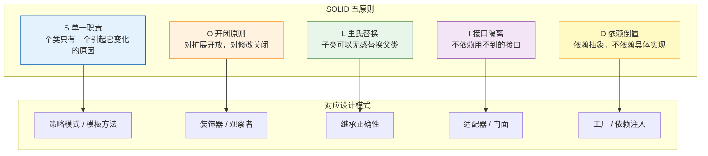
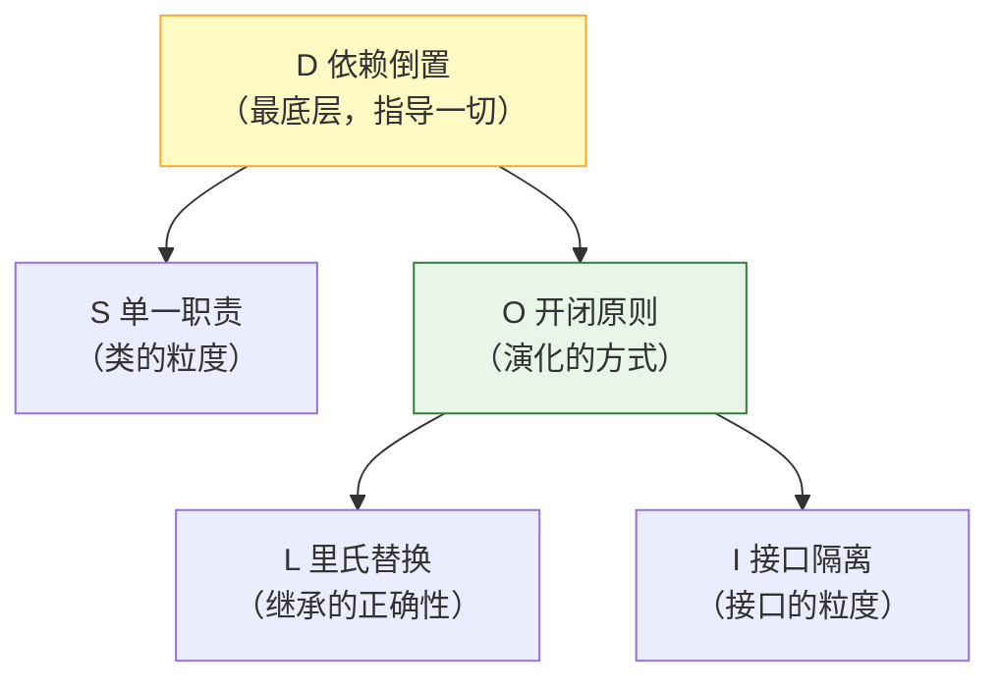

---

# 零、SOLID 解决什么问题？

SOLID 是 Robert C. Martin（Bob 大叔）在 2000 年左右提出的五个面向对象设计原则。这五个原则回答的是同一个问题：**什么样的代码结构能让"需求变更"的成本最小？**

需求变更时，糟糕的设计会让你改动一处牵动全身——改了 A 类，B 类编译失败，C 类的测试挂掉。好的设计让变更的影响范围可控。SOLID 就是为此服务的五条军规。

**一个重要提醒**：SOLID 是原则，不是法律。过度应用（比如每个原则都严格到极致）会导致类的爆炸和无意义的抽象层。正确的用法是**把它们当作代码审查的"异味探测器"**——看到违反原则的代码，知道它将来会以什么方式变坏。

---

# 一、S——单一职责原则（Single Responsibility Principle）

## 1.1 定义

> 一个类应该只有一个引起它变化的原因。

"职责"= "变化的原因"。如果两个不同的需求都会修改同一个类，这个类就有两个职责。

## 1.2 违反的代码——你写过这样的 Service 吗

```java
// ❌ 违反 SRP：一个类干了四件事
public class UserService {
    
    public User getUser(Long id) { ... }          // ① 查询用户
    
    public void register(User user) { ... }        // ② 注册用户（业务逻辑）
    
    public void sendWelcomeEmail(User user) {      // ③ 发邮件（通知逻辑）
        EmailSender.send(user.getEmail(), "Welcome!");
    }
    
    public void logAudit(String action, User user) { // ④ 审计日志
        AuditLogger.log(action, user.getId());
    }
}
```

**这个类的四个变化原因**：

| 变化 | 谁要求改 | 后果 |
|------|---------|------|
| 用户模型加字段 | 产品说"注册要收集手机号" | 改 UserService |
| 邮件模板换文案 | 运营说"欢迎邮件换风格" | 改 UserService |
| 审计日志格式调整 | 安全合规说"日志要脱敏" | 改 UserService |
| 查询逻辑优化 | 性能组说"查询要加缓存" | 改 UserService |

四个团队的需求都改同一个文件 → 频繁的 merge 冲突 + 无法并行开发 + 测试范围无限扩大。

## 1.3 重构后的代码

```java
// ✅ 每个类一个职责
public class UserService {
    private final EmailService emailService;
    private final AuditService auditService;
    
    public User getUser(Long id) { ... }
    
    public void register(User user) {
        // 业务逻辑
        userRepository.save(user);
        // 委托给其他职责的类
        emailService.sendWelcomeEmail(user);
        auditService.logAudit("REGISTER", user.getId());
    }
}

public class EmailService {
    public void sendWelcomeEmail(User user) { ... }  // 只管发邮件
}

public class AuditService {
    public void logAudit(String action, Long userId) { ... }  // 只管审计
}
```

## 1.4 常见误区：SRP ≠ "一个类只能有一个方法"

```
❌ 误解：把 SRP 推到极致 → 每个类只有一个方法 → 类爆炸
✅ 正解：SRP 的粒度是"变化原因"，不是"方法数量"

判断标准：
  "这个类的每个方法，是否服务于同一个变化原因？"
  
  UserService.getUser + UserService.register
  → 都是"用户业务规则"的变化 → 同一职责 ✓

  UserService.sendWelcomeEmail
  → 是"通知策略"的变化 → 不同职责 ✗
```

---

# 二、O——开闭原则（Open-Closed Principle）

## 2.1 定义

> 软件实体（类、模块、函数）应该对扩展开放，对修改关闭。

即：新需求来了，应该**新增代码**而不是**修改已有代码**。修改已有代码的风险是破坏已经过测试的稳定逻辑。

## 2.2 违反的代码——每加一种支付方式都要改 if-else

```java
// ❌ 违反 OCP：每加一种支付方式，都要修改这个类
public class PaymentService {
    
    public void pay(String type, BigDecimal amount) {
        if (type.equals("ALIPAY")) {
            // 支付宝支付逻辑
            alipayClient.pay(amount);
        } else if (type.equals("WECHAT")) {
            // 微信支付逻辑
            wechatClient.pay(amount);
        } else if (type.equals("BANK_CARD")) {
            // 银行卡支付逻辑
            bankClient.pay(amount);
        }
        // 需求：支持 Apple Pay？
        // → 只能再 else if → 修改了已测试的代码 → 回归测试范围扩大
    }
}
```

**问题链条**：加 Apple Pay → 改 PaymentService → 所有已有支付方式的回归测试都要跑 → 上线风险随支付方式数量线性增长。

## 2.3 重构后的代码——策略模式

```java
// ✅ 符合 OCP：新支付方式 = 新增一个类，不改已有代码
public interface PaymentStrategy {
    void pay(BigDecimal amount);
}

public class AlipayStrategy implements PaymentStrategy {
    @Override
    public void pay(BigDecimal amount) { alipayClient.pay(amount); }
}

public class WechatStrategy implements PaymentStrategy {
    @Override
    public void pay(BigDecimal amount) { wechatClient.pay(amount); }
}

public class ApplePayStrategy implements PaymentStrategy {  // ← 新增类
    @Override
    public void pay(BigDecimal amount) { applePayClient.pay(amount); }
}

// 使用方
public class PaymentService {
    private final Map<String, PaymentStrategy> strategies;
    
    public PaymentService(List<PaymentStrategy> strategyList) {  // Spring 自动注入所有实现
        this.strategies = strategyList.stream()
            .collect(Collectors.toMap(s -> s.getClass().getSimpleName(), s -> s));
    }
    
    public void pay(String type, BigDecimal amount) {
        strategies.get(type + "Strategy").pay(amount);
    }
}
```

**新增支付方式 = 新增一个类 + 改配置。已有代码零改动。**

## 2.4 OCP 与 Spring 的天然契合

Spring 的生态几乎是"为了 OCP 而生"的：

| Spring 机制 | 如何支持 OCP |
|------------|-------------|
| `@Component` 扫描 | 新增实现类 → 自动注册，无需改工厂代码 |
| `List<Interface>` 注入 | 自动收集接口的所有实现 |
| `@ConditionalOnProperty` | 通过配置切换实现，不改代码 |
| Spring Boot Starter 自动装配 | 引入新依赖 → 自动装配新能力，业务代码零改动 |
| `BeanPostProcessor` | 扩展点：不改 Spring 核心代码，通过注册后处理器增强行为 |

```java
// Spring 中最典型的 OCP 案例：自定义一个 BeanPostProcessor
@Component
public class TimingBeanPostProcessor implements BeanPostProcessor {
    @Override
    public Object postProcessBeforeInitialization(Object bean, String beanName) {
        // 给所有 bean 加计时代理
        // Spring 核心代码零改动，通过扩展点增强
        return bean;
    }
}
```

---

# 三、L——里氏替换原则（Liskov Substitution Principle）

## 3.1 定义

> 子类对象必须能够替换其父类对象被使用，且程序的行为不发生改变。

Barbara Liskov 在 1987 年提出的原始定义更精确：

> 如果对每个类型 T1 的对象 o1，都有类型 T2 的对象 o2，使得以 T1 定义的所有程序 P 在所有的对象 o1 都代换成 o2 时，程序 P 的行为没有变化，那么类型 T2 是类型 T1 的子类型。

大白话：**子类可以扩展父类的功能，但不能改变父类原有的功能契约**。

## 3.2 违反的代码——正方形不是矩形

这是 LSP 最经典的例子：

```java
// ❌ 违反 LSP：Square 不能安全替换 Rectangle
public class Rectangle {
    protected int width;
    protected int height;
    
    public void setWidth(int width) { this.width = width; }
    public void setHeight(int height) { this.height = height; }
    public int getArea() { return width * height; }
}

public class Square extends Rectangle {
    @Override
    public void setWidth(int width) {
        this.width = width;
        this.height = width;  // ← 正方形的约束：宽高必须相等
    }
    
    @Override
    public void setHeight(int height) {
        this.width = height;  // ← 改变了父类的行为契约
        this.height = height;
    }
}

// 使用方：假设是 Rectangle，结果行为错误
public void resize(Rectangle r) {
    r.setWidth(5);
    r.setHeight(10);
    assert r.getArea() == 50;  // ✓ 对 Rectangle 成立
}

resize(new Rectangle());  // ✓ 面积 = 50
resize(new Square());     // ✗ 面积 = 100！断言失败！
// Square 替换 Rectangle 后，程序行为变了 → 违反 LSP
```

**数学上"正方形是矩形"是对的，但 OOP 中 `Square extends Rectangle` 是错的**——因为正方形的"宽高独立可变"这个契约不成立。继承关系不是"is-a 的语义判断"，而是"行为契约的包含关系"。

## 3.3 Java 标准库中遵守 LSP 的例子

```java
// ✓ 遵守 LSP：ArrayList 可以无感替换 List
List<String> list = new ArrayList<>();
list.add("a");

List<String> linkedList = new LinkedList<>();
linkedList.add("a");
// 所有接受 List 的代码，用 ArrayList 或 LinkedList 行为一致
```

```java
// ✓ 遵守 LSP：子类只强化，不弱化契约
public interface Reader {
    int read() throws IOException;  // 契约：可能抛 IOException
}

public class StringReader extends Reader {
    @Override
    public int read() {  // 不抛 IOException = 强化契约（允许的）
        ...
    }
}
```

## 3.4 违反 LSP 的典型信号

| 信号 | 示例 | 说明 |
|------|------|------|
| 子类方法抛父类没有的异常 | 子类 `withdraw()` 抛 `InsufficientFundsException`，父类不抛 | 调用方按父类写代码 → 运行时炸 |
| 子类把父类方法变成空实现 | `class Penguin extends Bird { fly() { /* 企鹅不会飞 */ } }` | 调用方以为会飞 |
| 子类要求更严的前置条件 | 父类 `withdraw(any)`，子类要求 `amount > 100` | 替换后调用方传 50 → 失败 |
| 使用 `instanceof` 判断子类 | `if (animal instanceof Dog) ((Dog) animal).bark();` | 说明父类抽象不够，需要具体类型 |
| 子类依赖父类实现细节 | 子类重写方法但必须调用 `super.xxx()` 才能工作 | 继承链的脆弱性 |

**出现 instanceof 分支，往往是 LSP 违反的报警器**：

```java
// ❌ 调用方被迫知道具体类型
public void makeSound(Animal animal) {
    if (animal instanceof Dog) {
        ((Dog) animal).bark();
    } else if (animal instanceof Cat) {
        ((Cat) animal).meow();
    }
}

// ✅ 正确：把行为放到父类抽象中
public abstract class Animal {
    public abstract void makeSound();
}
public void makeSound(Animal animal) {
    animal.makeSound();  // 多态，不需要 instanceof
}
```

---

# 四、I——接口隔离原则（Interface Segregation Principle）

## 4.1 定义

> 客户端不应该被迫依赖它不使用的方法。

一个臃肿的接口应该被拆分成多个更小、更具体的接口，这样实现类和调用方都只关心自己需要的方法。

## 4.2 违反的代码——"万能接口"

```java
// ❌ 违反 ISP：一个接口什么都干
public interface Worker {
    void writeCode();      // 程序员
    void design();         // 架构师
    void manageTeam();     // 经理
    void fixPrinter();     // 运维
    void answerPhone();    // 客服
}

// 实现类被迫实现自己用不到的方法
public class Programmer implements Worker {
    @Override public void writeCode() { /* 真正实现 */ }
    @Override public void design() { /* 用不到，空实现 */ }
    @Override public void manageTeam() { /* 用不到，空实现 */ }
    @Override public void fixPrinter() { /* 用不到，空实现 */ }
    @Override public void answerPhone() { /* 用不到，空实现 */ }
}
```

**问题**：
1. 实现类被迫写空方法（代码噪音）
2. 调用方通过 Worker 接口能调到不该调的方法（如让程序员修打印机）
3. 接口任何一处变化，所有实现类都要重新编译

## 4.3 重构后的代码

```java
// ✅ 接口按职责拆分
public interface Coder {
    void writeCode();
}

public interface Designer {
    void design();
}

public interface Manager {
    void manageTeam();
}

// 实现类只实现自己需要的接口
public class Programmer implements Coder {
    @Override
    public void writeCode() { ... }
}

public class TechLead implements Coder, Manager {  // 技术负责人：写码+带人
    @Override public void writeCode() { ... }
    @Override public void manageTeam() { ... }
}
```

## 4.4 Java 标准库的接口隔离范例

```java
// ✓ JDK 遵守 ISP：把"可读"和"可写"拆成两个接口
public interface Readable { int read(...); }       // 只读
public interface Appendable { Appendable append(...); }  // 只写

// StringBuilder 既读又写 → 同时实现两个接口
public final class StringBuilder implements Serializable, CharSequence, Appendable { }

// 而 Reader 只实现 Readable
public abstract class Reader implements Readable, Closeable { }

// 调用方：
public void readFrom(Readable source) { ... }  // 只需要读 → 只依赖 Readable
// 不需要为了读一个东西而依赖 Appendable 的写方法
```

**另一个例子——Spring 的 Aware 接口族**：

```java
// ✓ Spring 把"感知"能力拆成 14 个独立接口
public interface BeanFactoryAware { void setBeanFactory(BeanFactory bf); }
public interface ApplicationContextAware { void setApplicationContext(ApplicationContext ctx); }
public interface EnvironmentAware { void setEnvironment(Environment env); }

// 每个 Aware 只暴露一个需要感知的能力
// Bean 需要什么感知能力，就实现对应的 Aware
// 而不是一个巨大的 SpringContextAware 包含所有 setter
```

## 4.5 ISP 与 SRP 的区别

```
SRP（单一职责）问的是："这个类变化的原因有几个？"
ISP（接口隔离）问的是："调用方被迫依赖了多少用不到的方法？"

SRP 作用于类 → 一个类只做一件事
ISP 作用于接口 → 一个接口只服务一类调用方

两者方向相同（都是"拆小"），但关注点不同：
SRP 从"实现方"角度（我怎么组织代码）
ISP 从"调用方"角度（我怎么使用代码）
```

---

# 五、D——依赖倒置原则（Dependency Inversion Principle）

## 5.1 定义

> 高层模块不应该依赖低层模块，两者都应该依赖抽象。
> 抽象不应该依赖细节，细节应该依赖抽象。

这是 SOLID 中最重要、影响最深远的一条——它是 Spring 整个 IoC 容器设计哲学的来源。

## 5.2 违反的代码——高层依赖低层

```java
// ❌ 违反 DIP：OrderService（高层）直接依赖 MySQLOrderRepository（低层）
public class OrderService {
    private MySQLOrderRepository repository = new MySQLOrderRepository();
    //                    ↑ 具体类！写死了数据库实现
    
    public Order getOrder(Long id) {
        return repository.findById(id);
    }
}

public class MySQLOrderRepository {
    public Order findById(Long id) {
        // JDBC 查 MySQL 的具体实现
    }
}
```

**问题**：
1. 换数据库（MySQL → PostgreSQL）→ 必须改 OrderService
2. 单元测试 OrderService → 必须连真实 MySQL → 无法快速测试
3. OrderService 和 MySQL 的具体实现耦合 → 无法独立演化

## 5.3 重构后的代码——依赖抽象

```java
// ✅ 符合 DIP：高层和低层都依赖 OrderRepository 接口
public interface OrderRepository {           // 抽象
    Order findById(Long id);
}

public class MySQLOrderRepository implements OrderRepository {  // 低层实现抽象
    @Override
    public Order findById(Long id) { ... }
}

public class OrderService {                  // 高层依赖抽象
    private final OrderRepository repository;
    
    public OrderService(OrderRepository repository) {  // 构造器注入
        this.repository = repository;
    }
}
```

```
依赖方向反转：

违反 DIP 时：OrderService → MySQLOrderRepository（高层指向低层）
遵守 DIP 时：OrderService → OrderRepository ← MySQLOrderRepository
             （双方都指向抽象，箭头方向"倒置"了）
```

## 5.4 DIP 的三层实现机制——从手工到框架

**第一层：构造器注入（手工）**

```java
// 组装依赖（组合根 Composition Root）
OrderRepository repo = new MySQLOrderRepository();
OrderService service = new OrderService(repo);
```

**第二层：工厂模式**

```java
public class RepositoryFactory {
    public static OrderRepository createOrderRepository() {
        return new MySQLOrderRepository();  // 只有工厂知道具体实现
    }
}
```

**第三层：Spring IoC 容器（工业级方案）**

```java
@Service
public class OrderService {
    private final OrderRepository repository;
    
    @Autowired
    public OrderService(OrderRepository repository) {  // Spring 自动注入实现
        this.repository = repository;
    }
}

@Repository
public class MySQLOrderRepository implements OrderRepository { ... }
// Spring 扫描到 OrderRepository 的唯一实现 → 自动注入
// 将来换成 PostgreSQLOrderRepository → 只改配置，OrderService 零改动
```

## 5.5 依赖倒置 vs 依赖注入——被混淆的两个概念

| | 依赖倒置（DIP） | 依赖注入（DI） |
|------|--------------|-------------|
| 是什么 | **设计原则**（思想） | **实现手段**（技术） |
| 回答什么 | "代码应该怎么组织依赖关系" | "依赖怎么传给对象" |
| 关系 | DI 是实现 DIP 的一种方式 | 不用 DI 也能实现 DIP（工厂/Service Locator） |

```java
// 不用 DI 也可以实现 DIP：用 Service Locator
public class OrderService {
    public Order getOrder(Long id) {
        OrderRepository repo = ServiceLocator.get(OrderRepository.class);
        return repo.findById(id);
    }
}
// 这遵守了 DIP（依赖抽象），但没有用 DI（自己主动查找依赖）
// 只是 Service Locator 被认为是一种反模式（依赖隐藏在方法内部，测试困难）
```

---

# 六、五大原则的关系——它们是一个整体



| 原则 | 一句话 | 违反时的症状 | 对应的设计模式 |
|------|--------|------------|--------------|
| **S** | 一个类只有一个变化原因 | 一个类 500 行，改任何需求都要动它 | 门面、组合 |
| **O** | 加功能不改老代码 | 每加一个类型就多一个 if-else | 策略、装饰器、观察者、模板方法 |
| **L** | 子类能无感替换父类 | instanceof 判断、空实现方法、子类抛新异常 | 正确使用继承 |
| **I** | 不依赖用不到的接口 | 实现类一堆空方法 | 适配器、接口拆分 |
| **D** | 依赖抽象不依赖具体 | new 具体类、无法写单元测试 | 工厂、依赖注入 |

**一个最常见的面试追问："这五个原则互相矛盾吗？"**

```
回答：不矛盾，但需要平衡。常见张力：

① SRP vs 开闭原则：
   拆太细（SRP 极致）→ 类爆炸 → 维护反而困难
   拆太少 → 每次变更都要改大类 → 违反开闭

② 接口隔离 vs 依赖倒置：
   接口拆太细 → 依赖注入的接口数量爆炸
   接口太大 → 回到"万能接口"的泥潭

平衡的标准：用"变化频率"和"使用方"做切割线
  - 变化频率相同的代码放一起（SRP 的"变化原因"）
  - 按调用方的需要切接口（ISP 的"客户端"）
```

---

# 七、实战：用 SOLID 审查一段代码

```java
// 审查目标：电商系统的订单处理代码
public class OrderProcessor {
    
    public void process(Order order) {
        // ① 校验订单
        if (order.getItems().isEmpty()) {
            throw new IllegalArgumentException("empty order");
        }
        
        // ② 计算价格
        BigDecimal total = BigDecimal.ZERO;
        for (Item item : order.getItems()) {
            total = total.add(item.getPrice());
        }
        order.setTotal(total);
        
        // ③ 持久化
        jdbcTemplate.update("INSERT INTO orders ...", order);
        
        // ④ 发通知
        if (order.getType().equals("VIP")) {
            smsSender.send(order.getPhone(), "VIP 订单已受理");
        } else {
            emailSender.send(order.getEmail(), "订单已受理");
        }
        
        // ⑤ 写日志
        logger.info("order processed: " + order.getId());
    }
}
```

**SOLID 审查结果**：

| 原则 | 违反点 | 重构方案 |
|------|--------|---------|
| **S** | 校验/计价/持久化/通知/日志五个职责 | 拆为 Validator / PricingService / Repository / Notifier |
| **O** | `if VIP → SMS else → Email`：新增通知渠道要改代码 | NotificationStrategy 接口 + 策略模式 |
| **D** | 直接依赖 `jdbcTemplate` 和具体发送器 | 依赖 `OrderRepository` / `Notifier` 抽象 |
| **L** | 不明显（无继承） | — |
| **I** | 不明显（无接口） | — |

**重构后的骨架**：

```java
public class OrderProcessor {
    private final OrderValidator validator;
    private final PricingService pricingService;
    private final OrderRepository repository;
    private final NotificationService notificationService;  // 内部用策略模式

    public void process(Order order) {
        validator.validate(order);                    // S: 单一职责
        order.setTotal(pricingService.calculate(order));
        repository.save(order);
        notificationService.notify(order);            // O: 新增渠道=新增策略类
    }
}
```

---

# 八、总结

```
SOLID 的记忆与理解：

S — 类只做一件事（变化原因唯一）
O — 加功能，不加 if（扩展点设计）
L — 子类不是"像"父类，是"是"父类（行为契约）
I — 接口按调用方切（不给用不到的方法）
D — 依赖抽象，不依赖 new（可测试性的基础）

实践心法：
1. 先写"能用"的代码，再问自己"哪里违反 SOLID"
2. 违反 S/O/D 的代价最大（最影响长期维护）
3. L/I 更多是代码审查时的检查项
4. 原则用于判断，不是教条——过度设计比违反原则更糟
5. SOLID 的最终检验标准：单元测试写起来痛苦吗？
   写测试痛苦 → 依赖太具体（D 违反）→ 类太大（S 违反）
```

---

# 延伸阅读

**Do——动手验证：**
- 找出你项目中最"胖"的一个 Service 类（>300 行），数一数它有几个"变化原因"，尝试按 SRP 拆分
- 找出代码中最大的 if-else 链（>5 个分支），用策略模式 + Map 重构，对比重构前后的行数和测试数
- 检查代码中的 `instanceof` 使用——每一处都可能是 LSP 违反的信号

**Todo——深入方向：**
- 设计模式与 SOLID 的完整映射表（23 种 GoF 模式分别服务哪个原则）
- DDD 战术设计（Entity/Value Object/Aggregate）与 SOLID 的关系
- 六边形架构（端口-适配器）是 DIP 的架构级实现
- 测试驱动开发（TDD）如何反过来强化 SOLID 的设计

*本文参考资料：*
- Robert C. Martin, "Design Principles and Design Patterns" (2000)
- Robert C. Martin, "Clean Architecture"——第 7-11 章
- Barbara Liskov, "Data Abstraction and Hierarchy" (1987)
- 《Head First 设计模式》——第 1-2 章（策略模式/观察者模式与 SOLID 的关系）
