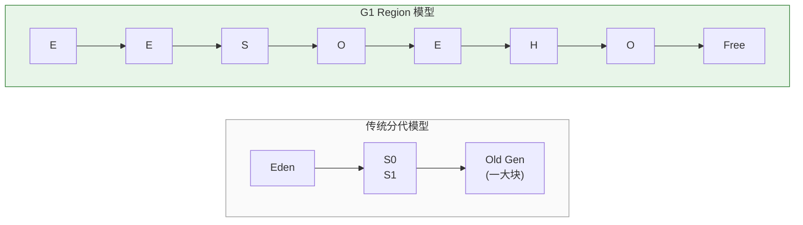
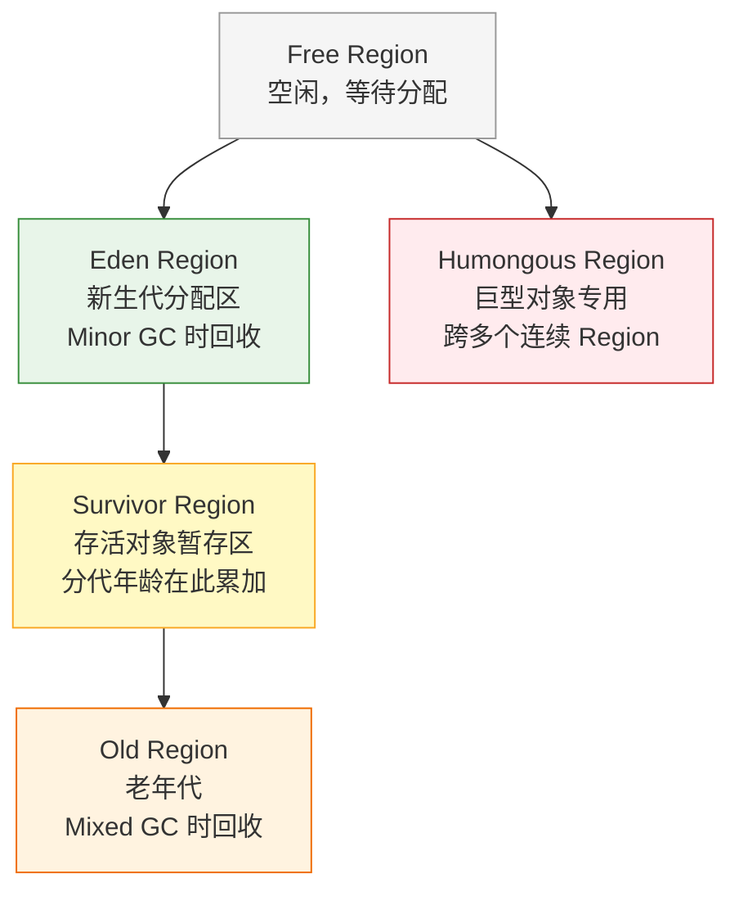
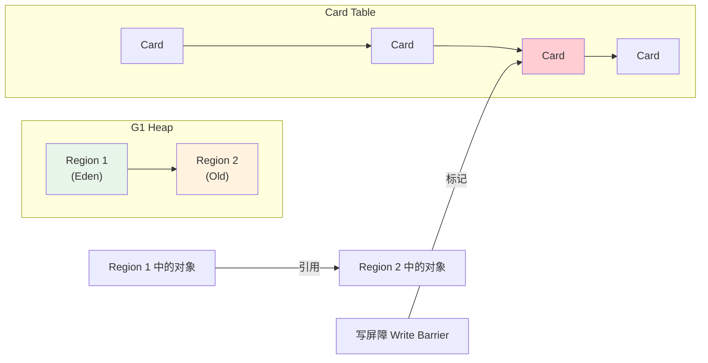
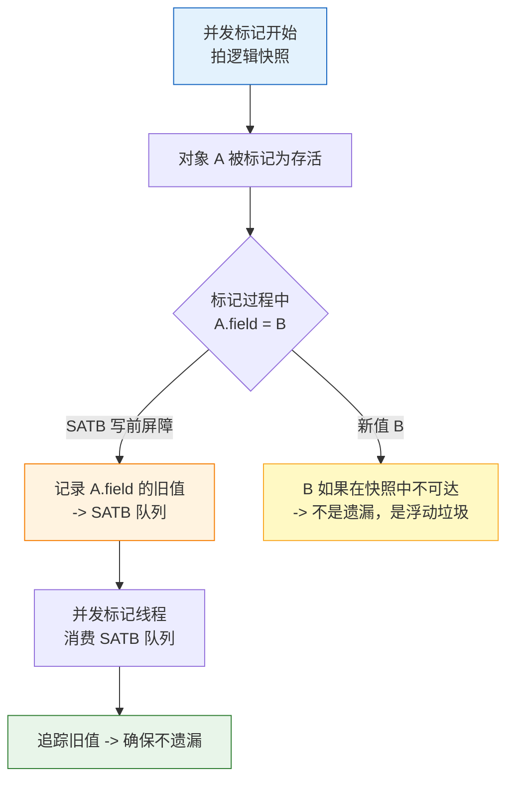
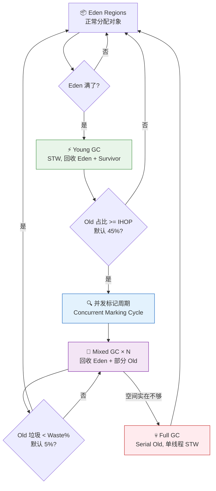
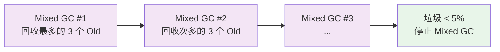
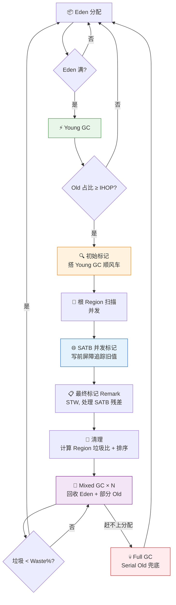

---

# 一、为什么需要 G1？——从 CMS 的废墟上站起来

## 1.1 CMS 的三个致命伤

在 G1 出现之前，CMS（Concurrent Mark Sweep）是低停顿 GC 的门面。但随着堆越来越大（从 4GB 涨到 32GB+），CMS 的三大硬伤暴露无遗：

| 致命伤 | 现象 | 根因 |
|--------|------|------|
| **内存碎片** | 老年代像瑞士奶酪，明明有空闲却分配失败 | 标记-清除，从不整理 |
| **Concurrent Mode Failure** | 并发清理赶不上分配速度 | 老年代满前没完成回收 |
| **浮动垃圾** | 本轮 GC 清不掉的垃圾积压到下一轮 | 并发清理期间新生垃圾无法回收 |

这三个问题最终都导向同一个噩梦：**退化为 Serial Old 单线程 Full GC**，停顿从毫秒级跳到分钟级。

## 1.2 G1 的设计目标

G1（Garbage First）从设计之初就奔着取代 CMS 去的：

> **在 `-XX:MaxGCPauseMillis` 这个硬目标下，尽可能多地回收垃圾。宁可少收，不能超时。**

这不是一个"低延迟收集器"，而是一个**可预测停顿的收集器**。ZGC/Shenandoah 才是低延迟的终极形态——G1 追求的是 **可控**。

---

# 二、Region——G1 的物理基石

## 2.1 棋盘化：把堆切成等大的格子

G1 之前，堆是**连续的三大块**：Eden、Survivor、Old，边界固定。G1 把这个模型推翻了：



**核心规则**：

- 堆被均分为大小相等的 Region（默认约 2048 个）
- Region 大小由 `-XX:G1HeapRegionSize` 控制（1MB ~ 32MB，必须是 2 的幂）
- Region 的**角色是动态可变**的：本轮是 Eden，下轮回收后可能变成 Free，再下一轮可能变成 Old

## 2.2 四种 Region 角色



## 2.3 Humongous Object（巨型对象）

当一个对象大小**超过单个 Region 的 50%**，G1 将其视为巨型对象：

- 分配在**连续的 Humongous Region** 中
- 巨型对象的回收只能发生在**老年代回收阶段**（Mixed GC 或 Full GC）
- 如果 Humongous Region 数量过多且无法及时回收→ 提前触发 Full GC

**实战建议**：

- 如果应用频繁分配大对象（如大 byte[] 缓存），调大 `-XX:G1HeapRegionSize`（如 16MB 或 32MB），让更多对象能放进单个 Region
- 必要时增加 `-XX:G1ReservePercent`（默认 10%），预留空间防晋升失败

---

# 三、RSet 与 Card Table——跨 Region 引用的高速公路

## 3.1 问题：分而治之的代价

G1 每次只回收部分 Region（CSet）。但问题是：我要回收 Region A，怎么知道有没有其他 Region 的对象引用了 A 中的对象？如果**全堆扫描**，那跟不分区的 GC 没区别了。

**答案：Remembered Set（RSet）**。

> RSet 的核心思想：每个 Region 维护一份 RSet，记录"**谁指向了我**"（points-into-me），而不是"我指向了谁"。

## 3.2 Card Table：RSet 的底层基建



**工作流程**：

1. **Card**：堆被切分为 512 字节的 Card（比 Region 更细的粒度）
2. **Card Table**：一个全局字节数组，每个 Card 对应一个 byte，标记该 Card 是否"脏了"
3. **写屏障**（Write Barrier）：每次引用赋值（`a.field = b`），JIT 插入一小段代码，将对应的 Card 标记为 dirty
4. **Refinement 线程**：异步消费 dirty card → 更新对应 Region 的 RSet

## 3.3 RSet 的三层存储结构

RSet 不是简单的一张表，而是**三级粒度**的自适应结构：

| 层级 | 粒度 | 说明 |
|------|------|------|
| **Sparse**（稀疏） | 直接记录 Card 索引 | 初始状态，跨区引用少时用位图 |
| **Fine**（细粒度） | 每 Card 对应一个 bit | 跨区引用增多时自动升级 |
| **Coarse**（粗粒度） | 每 Region 对应一个 bit | 跨区引用非常多时退化为粗粒度，避免 RSet 膨胀 |

**关键优化**：RSet 的更新是**异步**的——写屏障只标记 Card 为 dirty，真正更新 RSet 的工作由 Refinement 线程在后台完成。

> 这个设计让写屏障极快（只写一个字节），把复杂计算推迟到后台。代价是：并发标记阶段需要处理积压的 dirty card 队列。

---

# 四、SATB——G1 的并发标记之眼

## 4.1 为什么 CMS 的增量更新不够用？

CMS 使用**增量更新**（Incremental Update）算法：标记过程中如果出现新的引用赋值，就把新引用记录下来，等并发标记结束后重新扫描。

这个算法的问题：**复杂**。什么需要重新扫、什么不需要，状态机很难保证正确性。CMS 历史上因为标记遗漏导致的 bug 不计其数。

G1 选择了另一条路：**SATB（Snapshot-At-The-Beginning）**。

## 4.2 SATB 的核心逻辑

> **在并发标记开始时，给堆上的所有存活对象拍一个逻辑快照。标记过程中新分配的对象，一律算存活。标记过程中被修改的引用，保留旧值用于追踪。**



**一句话总结 SATB**：

- 标记开始时活着的对象 → **肯定能标记到**（不漏标）
- 标记过程中新产生的垃圾 → **本轮不回收**（多标 = 浮动垃圾）

## 4.3 SATB 写前屏障（Pre-Write Barrier）

SATB 的实现依赖于**写前屏障**，JIT 会在每次引用赋值前插入这段逻辑：

```
// Java 代码：
obj.field = newValue;

// JIT 编译后等价于：
if (concurrent_marking_is_active) {
    if (obj.field != null) {
        satb_enqueue(obj.field);   // ← 记录旧值
    }
}
obj.field = newValue;              // ← 真正的赋值
```

**为什么是"写前"而不是"写后"？** 因为我们需要的是**赋值前的旧值**——这个旧引用指向的对象在快照中是存活的，我们不能弄丢它。

## 4.4 SATB 的取舍：宁愿多标，绝不漏标

| | SATB（G1） | 增量更新（CMS） |
|------|-----------|----------------|
| **漏标风险** | 极低（逻辑简单） | 存在（状态机复杂） |
| **浮动垃圾** | 较多（快照后死亡对象全部多标） | 较少 |
| **写屏障开销** | 写前屏障 | 写后屏障 |
| **正确性保证** | 保守但安全 | 精确但复杂 |

SATB 的本质是**用浮动垃圾换正确性**。多标的垃圾等下轮 Mixed GC 回收即可，漏标则直接导致对象被错误回收 → 应用崩溃。

---

# 五、G1 GC 的完整周期——四种 GC 轮番登场



## 5.1 Young GC——高频轻量回收

- **触发条件**：Eden Region 被填满
- **回收范围**：所有 Eden Region + Survivor Region
- **过程**：标记 → 复制存活对象到新的 Survivor Region 或晋升到 Old Region
- **STW**：停顿时间与年轻代 Region 数量成正比，通常很快（几十毫秒）

Young GC 时还会干一件额外的事：**扫描 GC Roots，顺便完成并发标记的初始标记阶段**。这叫"搭顺风车"（piggyback）。

## 5.2 并发标记周期——G1 最复杂的阶段

触发条件：老年代使用率达到 **IHOP**（Initiating Heap Occupancy Percent，默认 45%）。

| 阶段 | 是否 STW | 干什么 |
|------|----------|--------|
| **① 初始标记** Initial Mark | ✅ STW | 扫描 GC Roots，标记直接可达对象。**搭 Young GC 的顺风车** |
| **② 根区域扫描** Root Region Scan | ❌ 并发 | 扫描 Survivor Region（因为它们引用的 Old 对象需要被标记） |
| **③ 并发标记** Concurrent Mark | ❌ 并发 | 全堆 SATB 追踪，与业务线程并发跑 |
| **④ 最终标记** Remark | ✅ STW | 处理 SATB 队列中的残余引用 + 引用处理（弱引用、虚引用等） |
| **⑤ 清理** Cleanup | ✅ STW | 计算每个 Old Region 的存活对象比例，按垃圾多少排序，回收全空的 Region |

**IHOP 自适应**：`-XX:+G1UseAdaptiveIHOP`（默认开启）会根据实际 GC 统计动态调整触发阈值，避免设置过小（频繁并发标记）或过大（来不及标记完）。

## 5.3 Mixed GC——G1 的灵魂

并发标记完成后，G1 知道哪些 Old Region 垃圾最多。接下来就是 **Mixed GC**：

```
Mixed GC 回收范围 = 全部 Eden Region + 全部 Survivor Region + 选中的部分 Old Region
```

为什么要混合回收、而不是只回收 Old Region？因为 Young GC 本身就要发生、也需要 STW，不如趁机多回收几个 Old Region，**合并 STW**。

**Mixed GC 分多次执行**：

- `-XX:G1MixedGCCountTarget`（默认 8）：一个并发标记周期后的 Mixed GC 最多连续执行 8 次
- `-XX:G1HeapWastePercent`（默认 5%）：当 Old Region 的垃圾占比低于 5%，停止 Mixed GC，没必要再回收
- 每次 Mixed GC 选多少 Old Region → 由**停顿预测模型**决定



## 5.4 Full GC——最后的保险丝

当出现以下情况，G1 退化为 **Serial Old 单线程 Full GC**：

- Mixed GC 回收速度赶不上新对象分配速度（类似 CMS 的 CMF）
- Humongous 对象找不到连续 Region
- 晋升老年代时空间不够（Promotion Failure）

**Full GC 是 G1 最不想看到的**——单线程标记-整理，停顿时间秒级起步。调优 G1 的核心目标就是**避免 Full GC**。

---

# 六、停顿预测模型——G1 的调度大脑

## 6.1 模型如何工作

G1 维护一本"历史账本"：每次 GC 记录回收了多少 Region、花了多少时间。

> **衰减平均（Decaying Average）**：越近的 GC 数据权重越高，越远的数据权重指数衰减。

给定 `-XX:MaxGCPauseMillis`（比如 200ms），模型反推：
> "根据最近的回收效率，200ms 内我大概能回收 N 个 Region。"

这 N 个 Region 就是本轮 Mixed GC 的**回收上限**。

## 6.2 预测不准的典型场景

| 场景 | 原因 |
|------|------|
| Region 的垃圾比例剧烈变化 | 模型基于历史，对突变响应滞后 |
| Humongous 对象分配打乱布局 | 连续 Region 分配不可预测 |
| 应用负载突然改变 | 业务高峰和低谷的回收效率完全不同 |

**应对**：不要死磕 `MaxGCPauseMillis`，把它设成一个**合理的范围**（100~200ms），给模型留出缓冲。

---

# 七、关键参数调优锦囊

## 7.1 核心参数速查

| 参数 | 默认值 | 建议 |
|------|--------|------|
| `-XX:+UseG1GC` | — | JDK 9+ 不需要，已是默认 |
| `-XX:MaxGCPauseMillis` | 200 | **核心参数**，非不要设得太小（50ms 以下几乎不可能） |
| `-XX:G1HeapRegionSize` | 堆/2048 | 大堆用大 Region（16/32MB），小堆用小 Region（1/2/4MB） |
| `-XX:InitiatingHeapOccupancyPercent` | 45 | 降低（30~35）可提早标记，减少 CMF 风险 |
| `-XX:G1MixedGCCountTarget` | 8 | 提高可让 Mixed GC 更细碎（每次回收更少的 Old），降低则每次更激进 |
| `-XX:G1HeapWastePercent` | 5 | 调高可减少 Mixed GC 次数，代价是多留一点垃圾 |
| `-XX:G1ReservePercent` | 10 | 预留空间给晋升对象，频繁 Promotion Failed 时调高到 15 |
| `-XX:+ParallelRefProcEnabled` | false | **强烈建议开启**，并行处理引用对象，显著降低 Remark 停顿 |

## 7.2 常见问题诊断

| 症状 | 可能原因 | 排查方向 |
|------|----------|----------|
| Full GC 频繁 | Mixed GC 来不及回收 | 降低 IHOP，提早触发标记 |
| Young GC 停顿过长 | Eden Region 太多 | 调小 `MaxGCPauseMillis` |
| Remark 停顿过长 | 引用处理慢 | 开启 `+ParallelRefProcEnabled` |
| Humongous 分配失败 | Region 太小 | 增大 `G1HeapRegionSize` |
| To-space exhausted | Survivor/Old 没空间 | 增加 `G1ReservePercent` |

## 7.3 GC 日志分析（JDK 11+）

```bash
# 输出 GC 日志（推荐格式）
-Xlog:gc*=info:file=gc.log:time,level,tags:filecount=10,filesize=10M

# 分析工具
# 1. 在线：https://gceasy.io （拖入 gc.log 即可）
# 2. 本地：GCViewer
# 3. JDK 自带：jstat -gcutil <pid> 1000
```

**看 GC 日志的三个关键指标**：
1. Full GC 的次数和停顿时间
2. Mixed GC 的回收效率（回收了多少 Old Region，花了多少时间）
3. Humongous 对象的分配次数

---

# 八、总结：一张图走完 G1



> **G1 的核心哲学：不追求一次回收干净，只追求每次回收都在预期的时间内。** 这是它与 CMS、Parallel 最本质的区别。Region 让它能"按需裁剪"回收范围，SATB 让它能安全地并发标记，Mixed GC 让它能在可预测的停顿内逐步消化老年代垃圾。

---

# 附：与系列其他文章的关联

| 文章 | 与 G1 的关联 |
|------|-------------|
| [GC 算法演进史](/posts/jvm/gc算法演进史：为什么每个时代需要不同的垃圾回收器/) | G1 是"大数据时代"的代表 GC，前有 CMS 后有 ZGC |
| [Java 对象全生命周期](/posts/jvm/java对象生命周期/) | 对象在 Eden → Survivor → Old 的分代晋升，正是 G1 Region 回收的路径 |
| [JVM 逃逸分析深度拆解](/posts/jvm/jvm内存模型深度拆解/) | 逃逸分析让对象不分配在堆，从源头减少了 G1 的 GC 压力 |

---

*本文测试环境：JDK 11 / JDK 17 / JDK 21，HotSpot 64-Bit Server VM。G1 的行为在不同 JDK 版本间持续优化，JDK 8 的 G1 已不建议生产使用。*
