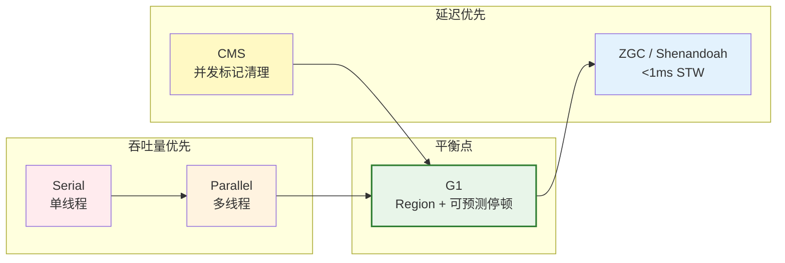
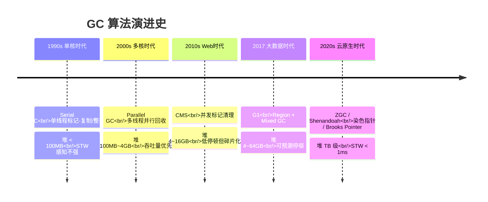

---

## 文章定位

本文是 JVM 系列的**总览篇**——把 GC 算法的演进放在一条历史时间线上，讲清楚每个 GC 为什么出现、解决了什么、又带来什么新问题。

```
系列结构：
  ┌─────────────────────────────────────────────┐
  │  GC算法演进史  ← 本文（总览/历史线）            │
  │  ┌──────────┬──────────┬──────────────────┐ │
  │  │ 逃逸分析  │ 对象生命  │  G1 核心原理      │ │
  │  │ (JIT)    │ (分代晋升) │  (Region+SATB)   │ │
  │  └──────────┴──────────┴──────────────────┘ │
  └─────────────────────────────────────────────┘
```

---

# 一、引子：从一行 `new` 到一次 GC，中间隔了半个世纪

## 1.1 垃圾回收不是 Java 的专利
- Lisp（1959）就发明了 GC，但那个年代没人关心停顿——程序都是批处理的
- Java 把 GC 带进主流，也把**停顿**带进了用户体验

## 1.2 全文主线：每个时代的 GC 都在回答同一个问题

> 如何在「吞吐量」和「停顿时间」之间做取舍？

| 时代 | 典型场景 | 核心矛盾 | 催生的 GC |
|------|----------|----------|-----------|
| 单核时代 | 桌面应用、小服务器 | 堆小、线程少，GC 不是瓶颈 | Serial |
| 多核时代 | 后台批处理、计算密集 | 堆变大了，单线程 GC 跑不动 | Parallel |
| Web 时代 | 在线服务、响应延迟敏感 | 用户等不了 10 秒 Full GC | CMS |
| 大数据时代 | 堆 10GB~100GB、微服务 | CMS 碎片化严重，Full GC 不可控 | G1 |
| 云原生时代 | 堆 TB 级、容器化、弹性伸缩 | STW 超过 1ms 就影响 SLA | ZGC / Shenandoah |

---

# 二、Serial GC——单核王朝的朴素解法

## 2.1 工作方式
- **单线程**做所有事：标记 → 复制(Eden) / 整理(Old)
- **全程 STW**：GC 期间整个应用冻结

## 2.2 为什么当年够用？
- CPU 单核，多线程 GC 反而有上下文切换开销
- 堆很小（几十 MB），STW 感知不强
- Client 模式下依然是 HotSpot 的默认选择

## 2.3 致命短板
- 堆只要超过 100MB，停顿就到了秒级
- 多核 CPU 来了，Serial 一个线程干活，其他核围观

---

# 三、Parallel GC——多核时代，吞吐量就是正义

## 3.1 核心改进
- **多线程并行**回收新生代（Parallel Scavenge）+ 老年代（Parallel Old）
- 仍然**全程 STW**，但多个 GC 线程一起干，时间缩短 N 倍

## 3.2 设计哲学：吞吐量优先
- `-XX:MaxGCPauseMillis` 是个"软目标"，超了就超了
- 衡量标准是：**GC 时间 / 总运行时间 ≤ 1%**
- 适合：后台计算、定时批处理、不在乎单次停顿

## 3.3 阿喀琉斯之踵
- Full GC 时间随堆大小**线性增长**
- 一个 100GB 堆的 Parallel Full GC → 几分钟停顿
- Web 服务要扛 QPS，等不了

---

# 四、CMS——低停顿的第一次革命

## 4.1 破局思路：让 GC 和业务并发跑
- 最耗时的**标记阶段与用户线程并发执行**
- 只在**初始标记**和**重新标记**两个短阶段 STW

## 4.2 CMS 的七个阶段（一句话版）


## 4.3 三大命门（为什么被废了）
- **内存碎片**：标记-清除不整理 → 老年代变成瑞士奶酪 → 碎片化严重时退化为 Serial Old Full GC
- **Concurrent Mode Failure**：并发清理赶不上分配速度 → 退化为 Serial Old Full GC
- **浮动垃圾**：并发清理期间新产生的垃圾只能等下一轮

## 4.4 CMS 的历史贡献
- 第一个证明"GC 不一定非得全程 STW"的收集器
- 启发了后续所有并发收集器（G1、ZGC 都站在 CMS 的肩膀上）

---

# 五、G1——可预测停顿的工程奇迹

## 5.1 思维范式转移：从"全部回收"到"按收益回收"
- 不再试图一次性回收整个堆
- 每次只回收**垃圾最多的 Region**（Garbage First）

## 5.2 核心创新速览

| 创新 | 解决了什么问题 |
|------|----------------|
| **Region 分区** | 堆不再按代物理隔离，而是均分为等大 Region |
| **SATB 并发标记** | 比 CMS 的增量更新更简洁、更安全 |
| **Mixed GC** | 每次只回收少量 Old Region，停顿可控 |
| **停顿预测模型** | 根据历史数据动态计算本次能回收多少 Region |

## 5.3 G1 相对 CMS 的质变
- **无碎片**：Mixed GC 本质是标记-复制/整理，内存永远是紧凑的
- **可预测**：`MaxGCPauseMillis` 是硬目标，达不到就少收点
- **自适应**：`-XX:+UseAdaptiveIHOP` 自动调整并发标记触发时机

## 5.4 G1 的边界
- 堆超过 32GB（压缩指针关闭）→ Region 数量暴涨 → RSet 开销指数上升
- STW 仍然在几十毫秒量级 → 对延迟极其敏感的场景还是不够

---

# 六、ZGC / Shenandoah——让 STW 低于 1ms

## 6.1 终极目标：STW 时间不随堆增长
- 读屏障（Load Barrier）+ 染色指针（Colored Pointers）→ 并发移动对象
- 几乎所有工作都并发，STW 只做**根扫描**和**少量清理**

## 6.2 染色指针（Colored Pointer）——ZGC 的法宝
- 64 位指针里偷出几个 bit → 标记对象状态（标记0/标记1、重映射、已释放）
- 优点：不需要额外对象头 → 移动对象时只需改指针颜色，不用 Stop-The-World
- 代价：指针可寻址范围缩小（JDK 21 已支持 4TB 堆的染色指针变体）

## 6.3 Shenandoah 的 Brooks Pointer 路线
- ZGC 用指针染色，Shenandoah 用对象头加一个转发指针（Brooks Pointer）
- 路线不同，目标相同：STW 和堆大小解耦

## 6.4 为什么还不默认选 ZGC？
- 吞吐量代价：读屏障遍布每条引用访问路径 → ~5-10% 吞吐量损失
- 内存开销：染色指针 → 每根引用多占几个 bit
- G1 对 90% 场景已经足够好

---

# 七、一张图：GC 演进的五十年



---

# 八、选型速查：你的应用该用哪个 GC？

| 场景 | 推荐 GC | 理由 |
|------|---------|------|
| 桌面 GUI（<100MB 堆） | **Serial** | 单线程切换成本最低 |
| 后台批处理（吞吐量唯一指标） | **Parallel** | GC 停顿无所谓，总体时间最短 |
| Web 服务（堆 4~32GB，Java 8） | **CMS（退役）→ G1** | G1 无碎片，停顿可预测 |
| Web 服务（堆 >32GB，JDK 11+） | **G1** | JDK 9+ 默认，持续优化中 |
| 微服务 / 低延迟交易（堆 <16GB） | **G1** | 够用，团队也熟悉 |
| 对延迟极度敏感（p99 <1ms） | **ZGC** | STW <1ms，但吞吐量要打 9 折 |
| 容器环境（堆 100MB~2GB） | **G1** 或 **Serial** | 小堆场景 Serial 反而比 G1 快 |
| 数据分析 / 流处理（堆 100GB+） | **ZGC** 或 **G1**（调优后） | ZGC 不惧大堆，G1 需精心调参 |

---

# 九、总结：每个 GC 都是时代的答案

> **没有银弹。每个 GC 都是为了那个具体时代的硬件条件和业务需求，在吞吐量和延迟之间找到的最优解。**

- **Serial**：单核时代，简单就是快
- **Parallel**：多核时代，并行就是生产力
- **CMS**：Web 时代，并发标记打开新世界
- **G1**：大数据时代，可预测停顿是刚需
- **ZGC/Shenandoah**：云原生时代，毫秒级延迟决定服务生死

G1 是当前的 **黄金平衡点**——吞吐量损失不大，停顿又可控。ZGC 是未来的趋势，但还需要更多时间沉淀。

---


*本文参考资料：*
- 周志明《深入理解 Java 虚拟机（第 3 版）》——第 2 章（内存区域）、第 3 章（GC）、第 8 章（类加载）、第 11-12 章（后端编译与优化）
- Oracle HotSpot Runtime Overview: https://openjdk.org/groups/hotspot/docs/RuntimeOverview.html
- JSR-133 (Java Memory Model and Thread Specification): https://jcp.org/en/jsr/detail?id=133
- OpenJDK Wiki - Synchronization: https://wiki.openjdk.org/display/HotSpot/Synchronization
- JEP 189: Shenandoah / JEP 304: Garbage Collector Interface / JEP 333: ZGC

# 附：JVM 系列索引

| 文章 | 内容定位 | 与本文关系 |
|------|----------|----------|
| [GC 算法演进史](/posts/jvm/gc算法演进史：为什么每个时代需要不同的垃圾回收器/) | **总览**：五十年 GC 历史线 | ← 你在这里 |
| [JVM 逃逸分析深度拆解](/posts/jvm/jvm内存模型深度拆解/) | 不逃逸对象 → 栈上分配，无需 GC | 逃逸分析为 GC 减负 |
| [Java 对象全生命周期](/posts/jvm/java对象生命周期/) | 对象从创建到回收的全流程 | 对象如何在各 GC 算法中被回收 |
| [G1 GC 核心原理](/posts/jvm/g1-gc核心原理：region、satb、mixed-gc全解析/) | G1 的 Region、SATB、Mixed GC 详解 | 大数据时代的 GC 代表 |

*本文是对 HotSpot GC 算法演进史的宏观梳理。想深入某个收集器的实现细节，请参阅系列中对应的专题文章。*
