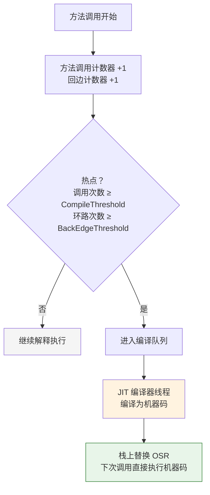
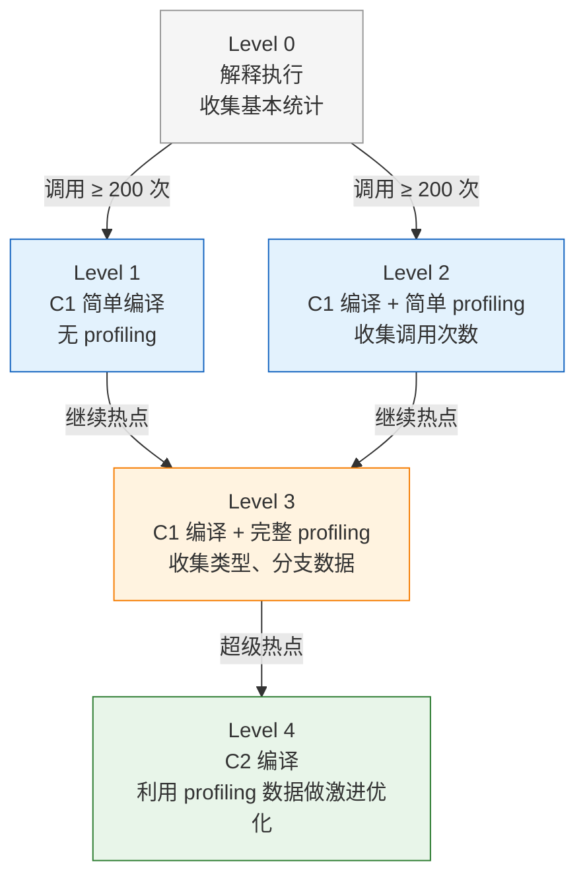
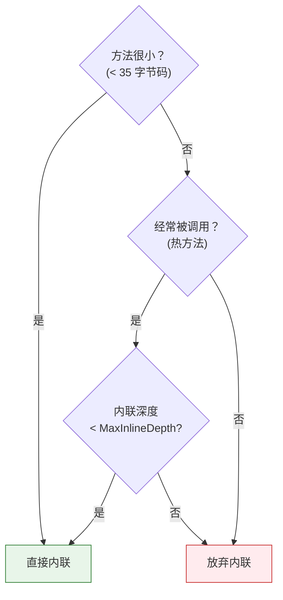
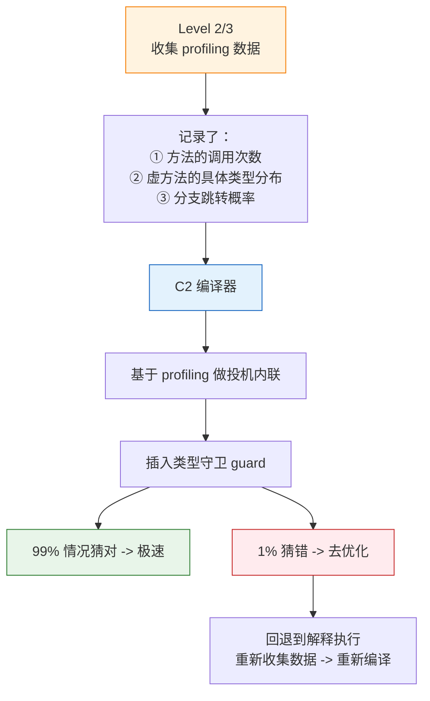
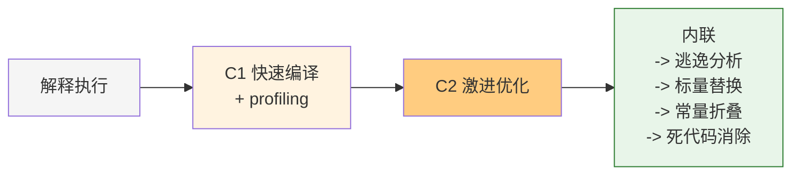

---

# 一、为什么 Java 要先"解释"再"编译"？

## 1.1 编译与解释的古老争论

| | AOT 编译（C/C++/Go） | 解释执行（早期 JVM） |
|------|---------------------|---------------------|
| **启动** | 编译慢（几分钟），运行快 | 启动快，但每条指令都要翻译 |
| **优化** | 编译时一次性优化 | 无法做深度优化 |
| **跨平台** | 需要重新编译 | 一次编译，到处运行 |

Java 的选择：**两个都要**——先解释执行保证快速启动，再把热点代码**动态编译**成机器码。

## 1.2 JIT 的核心洞察

> 程序 80% 的执行时间花在 20% 的代码上（热点代码）。只需编译那 20%，就能获得接近 AOT 的性能。



---

# 二、分层的意义——为什么需要两个编译器？

## 2.1 C1 与 C2 的分工

HotSpot 内置了**两个 JIT 编译器**：

| | C1（Client Compiler） | C2（Server Compiler） |
|------|----------------------|----------------------|
| **编译速度** | 快（统计信息少） | 慢（收集大量运行时数据） |
| **优化激进程度** | 保守（简单优化） | 激进（深层内联、逃逸分析...） |
| **代码质量** | 中等 | 最高 |
| **适用阶段** | 启动阶段，第一次热点 | 稳定运行阶段，超级热点 |

## 2.2 五层编译模型

从 JDK 8 开始，HotSpot 引入了**分层编译**（Tiered Compilation）：



**关键参数**：

```bash
# 分层编译（JDK 8+ 默认开启）
-XX:+TieredCompilation

# 五个编译阈值
-XX:CompileThreshold=10000        # Level 4 阈值
-XX:Tier3InvocationThreshold=200  # Level 2 入口
-XX:Tier4InvocationThreshold=5000 # Level 4 入口
```

---

# 三、内联（Inlining）——JIT 最强大的优化

## 3.1 什么内联？

```java
// 优化前
public int calculate(int x) {
    return square(x) + 1;  // 方法调用，创建栈帧
}
private int square(int n) {
    return n * n;
}

// JIT 内联后（等价机器码）
public int calculate(int x) {
    return x * x + 1;   // square 的代码被"粘贴"到调用处
}
```

**收益**：
- 消除了方法调用的开销（创建栈帧、参数压栈、跳转）
- 为后续优化打开大门（常量折叠、逃逸分析、死代码消除都要靠内联铺路）

## 3.2 内联的判断逻辑

JIT 不会无脑内联所有方法。它会计算"性价比"：



**核心参数**：

```bash
-XX:MaxInlineSize=35          # 最大内联字节码大小
-XX:MaxInlineDepth=9          # 最大内联深度
-XX:FreqInlineSize=325        # 热点方法的内联上限
-XX:+PrintInlining            # 打印内联决策（诊断用）
```

## 3.3 内联的连锁反应

```java
// 原始代码
public int compute(int x) {
    Point p = new Point(x, 2);   // ① new 对象
    return p.distance();          // ② 方法调用
}

// 内联 distance() 后
public int compute(int x) {
    Point p = new Point(x, 2);
    return Math.sqrt(p.x * p.x + p.y * p.y);  // distance 内联进来
}

// 内联 Point 构造器 + 逃逸分析（p 不逃逸）
public int compute(int x) {
    int px = x;       // 构造器内联 → 标量替换
    int py = 2;
    return Math.sqrt(px * px + py * py);  // p 对象消失了
}

// 常量折叠（py=2 是常量）
public int compute(int x) {
    return Math.sqrt(x * x + 4);  // 2*2 编译时计算
}
```

> 一行 `return p.distance()` 被 JIT 从"创建对象 + 方法调用"优化成了"纯数学计算"。**内联是这道多米诺骨牌的第一张。**

## 3.4 哪些情况 JIT 无法内联？

| 场景 | 原因 |
|------|------|
| **虚方法**（`invokevirtual`） | 编译时不知道实际类型 |
| **超大方法** | 超过 `MaxInlineSize`，不值得 |
| **深度递归** | 内联深度超过 `MaxInlineDepth` |
| **反射调用** | 编译时不知道调用目标 |
| **C1 已编译** | C1 的优化能力有限 |

**虚方法的部分补救**：JIT 会**投机内联**——假设它为最常见类型，插入类型检查（`guard`）。如果后续调用类型变了 → **去优化**（Deoptimization），回退到解释执行。

---

# 四、分层编译 + 内联的协同效应

## 4.1 Profiling 数据决定内联策略



这就是 Java **"先慢后快"** 的根源：解释执行 → 收集数据 → C1 编译 → 收集更多数据 → C2 激进优化。整个预热期都是在为 C2 的终极优化收集弹药。

## 4.2 去优化（Deoptimization）

当 C2 的投机假设被打破：

```java
// JIT 假设：list 总是 ArrayList
void process(List<String> list) {
    for (String s : list) {  // ← JIT 内联了 ArrayList.iterator()
        ...
    }
}

// 运行时：传入 LinkedList → 类型守卫失败 → 去优化
// → 抛弃已编译的机器码 → 回到解释执行
// → 重新收集数据 → 可能重新编译（这次用虚调用，不内联）
```

**去优化不是 Bug**——它是 JIT 敢做投机优化的底气。只要能回退，就能大胆猜。

---

# 五、实操：如何观测 JIT 行为？

## 5.1 打印编译信息

```bash
# 打印每次 JIT 编译
-XX:+PrintCompilation

# 打印内联决策树（极其详细，定位性能瓶颈）
-XX:+PrintInlining

# 输出示例：
# @ 27   java.util.ArrayList::add (29 bytes)   inline (hot)
#   @ 6   java.util.ArrayList::ensureCapacity   inline (hot)
#     @ 15  java.lang.Math::min                 inline (hot)
```

## 5.2 JITWatch

[JITWatch](https://github.com/AdoptOpenJDK/jitwatch) 是分析 JIT 行为的利器：

```bash
# 生成 JIT 日志
-XX:+UnlockDiagnosticVMOptions
-XX:+TraceClassLoading
-XX:+LogCompilation
-XX:LogFile=hotspot.log
```

导出的 `hotspot.log` 丢进 JITWatch，能看到每段代码的内联树、逃逸分析结果、寄存器分配情况。

---

# 六、对写代码的启示

| 启示 | 原因 |
|------|------|
| **方法尽量短小** | 短方法更容易被内联（< 35 字节码） |
| **避免过深的调用链** | C2 内联深度默认只 9 层 |
| **单态优于多态** | 虚方法只有一个实现类 → JIT 能投机内联 |
| **不要过早优化** | JIT 靠运行时数据做决策；静态猜往往不如 JIT 动态猜 |
| **微服务场景更要预热** | 短生命周期 Pod 可能在 C2 编译前就重启了 |

---

# 七、总结



> **JIT 编译不是魔法——它是"解释→C1→C2"三层递进的工程智慧。内联是所有优化的前提，没有内联就没有逃逸分析、没有标量替换、没有锁消除。理解分层编译和内联，就理解了 Java 高性能的底层密码。**

---


*本文参考资料：*
- 周志明《深入理解 Java 虚拟机（第 3 版）》——第 2 章（内存区域）、第 3 章（GC）、第 8 章（类加载）、第 11-12 章（后端编译与优化）
- Oracle HotSpot Runtime Overview: https://openjdk.org/groups/hotspot/docs/RuntimeOverview.html
- JSR-133 (Java Memory Model and Thread Specification): https://jcp.org/en/jsr/detail?id=133
- OpenJDK Wiki - Synchronization: https://wiki.openjdk.org/display/HotSpot/Synchronization
- JEP 189: Shenandoah / JEP 304: Garbage Collector Interface / JEP 333: ZGC

# 附：JVM 系列索引

| 文章 | 与 JIT 的关联 |
|------|-------------|
| [JIT 编译器的分层编译与内联优化](/posts/jvm/jit编译器的分层编译与内联优化/) | ← 你在这里 |
| [JVM 逃逸分析深度拆解](/posts/jvm/jvm内存模型深度拆解/) | 逃逸分析依赖内联扩大分析范围 |
| [Java 对象全生命周期](/posts/jvm/java对象生命周期/) | JIT 优化可减少堆分配→减少 GC 压力 |
| [G1 GC 核心原理](/posts/jvm/g1-gc核心原理：region、satb、mixed-gc全解析/) | JIT 和 GC 共同决定 Java 性能 |
| [GC 算法演进史](/posts/jvm/gc算法演进史：为什么每个时代需要不同的垃圾回收器/) | JIT 优化 + GC 选型 = 性能调优双引擎 |
