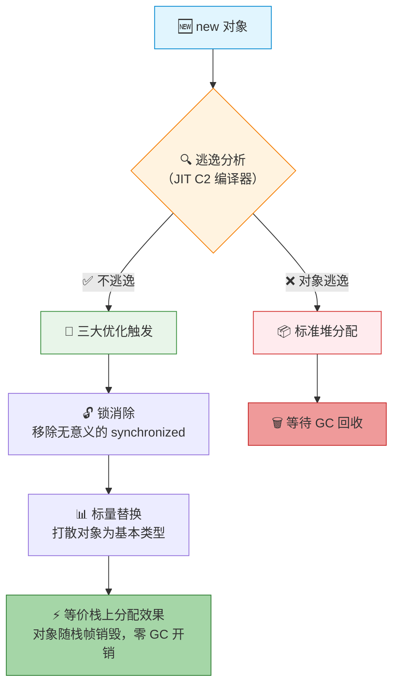
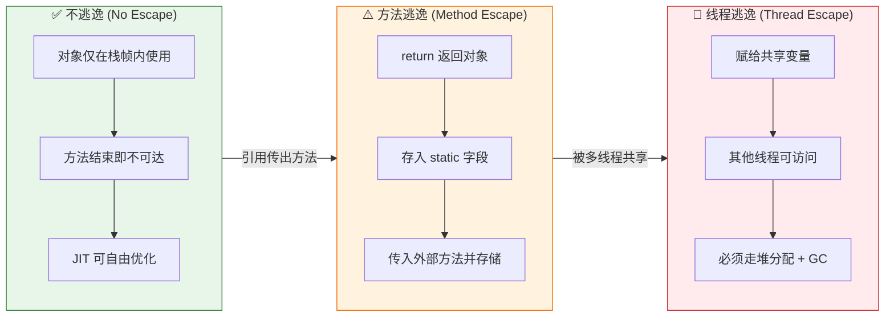
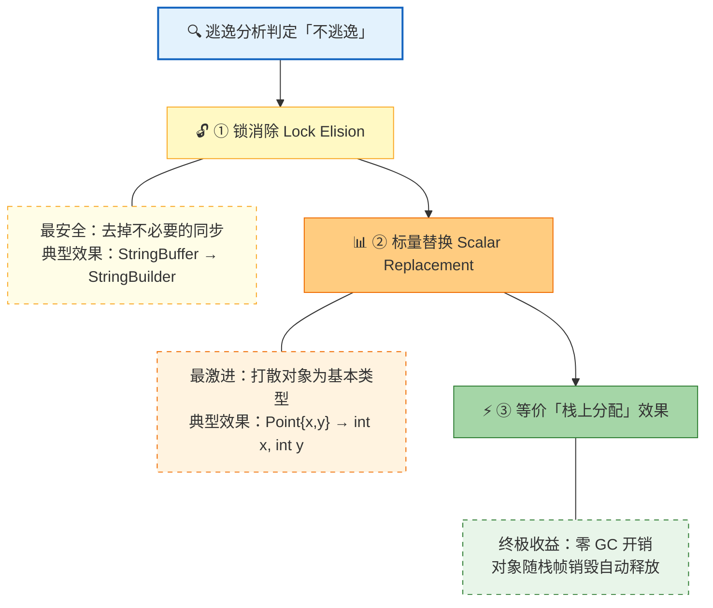
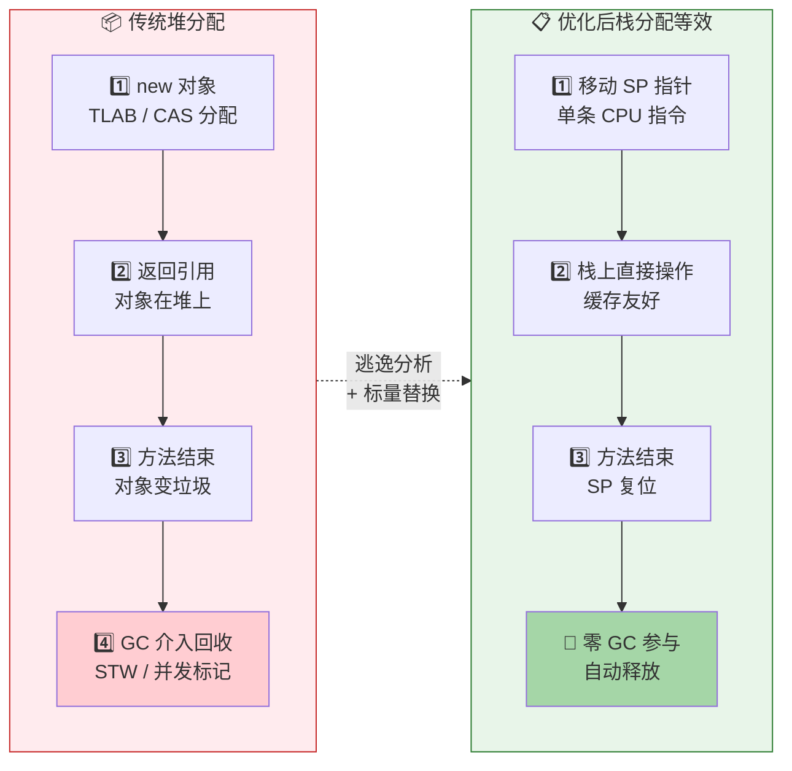
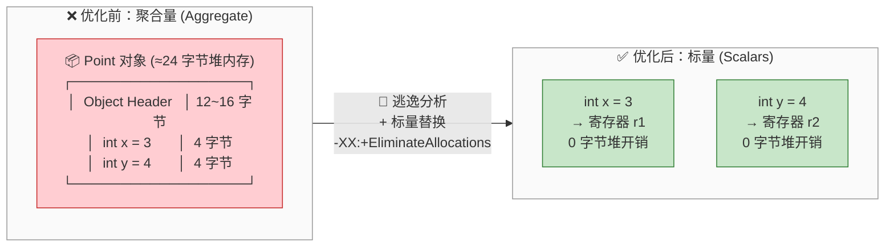
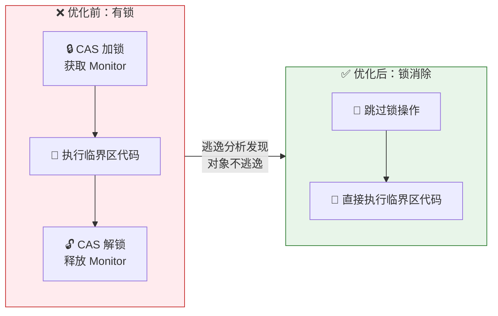
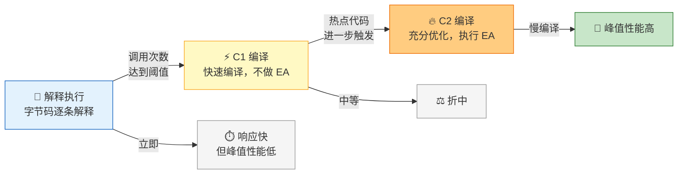

# 一、什么是逃逸分析（Escape Analysis）？

## 1.1 逃逸定义

**逃逸分析**（Escape Analysis）是 JVM 即时编译器（JIT Compiler）的一项静态代码分析技术：它判断一个对象在**创建它的方法**之外是否会被其他方法或线程访问到。如果对象的引用“逃”出了它的创建作用域，我们就说这个对象发生了**逃逸**。

用一个生活化的比喻来理解：

> 你在家里做了一个三明治。如果你只在厨房吃掉它，三明治就「没有逃逸」。如果你把三明治递给客厅的朋友，它就「逃逸到了方法外部」。如果你把三明治放在门口让外卖小哥取走，它就「逃逸到了线程外部」。

在 JVM 的世界里，每个 `new` 出来的对象都默认分配在堆（Heap）上，堆是线程共享的，分配和回收都需要复杂的同步和 GC 介入。但如果编译器能证明某个对象**不会逃逸**，那它就可以对这个对象施展一系列激进的优化——这正是逃逸分析存在的价值。



## 1.2 逃逸的两种级别

JVM 将逃逸划分为两个级别：

| 级别 | 英文 | 含义 | 示例 |
|------|------|------|------|
| **方法逃逸** | Method Escape | 对象的引用被传递到当前方法之外（如作为返回值、传入其他方法并存储到全局状态） | 方法返回一个新对象、对象被存入 static 字段 |
| **线程逃逸** | Thread Escape | 对象的引用被另一个线程访问到 | 对象被赋给一个共享变量（被其他线程读取）、对象被传入 `synchronized` 块并被其他线程使用 |



```java
public class EscapeExample {

    // 1️⃣ 不逃逸 — 对象仅在方法内使用，不对外暴露
    public int noEscape(int x, int y) {
        Point p = new Point(x, y);       // p 只在当前栈帧中存活
        return p.distance();             // 方法结束后 p 即不可达
    }

    // 2️⃣ 方法逃逸 — 对象作为返回值返回给调用者
    public Point methodEscape(int x, int y) {
        return new Point(x, y);          // 对象逃逸到调用方
    }

    // 3️⃣ 线程逃逸 — 对象被赋值给 static 字段，其他线程可见
    private static Point globalPoint;

    public void threadEscape(int x, int y) {
        globalPoint = new Point(x, y);   // 任何线程都能访问到
    }
}
```

**逃逸分析的核心洞察**：一个对象如果能被证明只存活在某个方法的栈帧中（即既不方法逃逸也不线程逃逸），那它的生命周期就等同于该次方法调用——这意味着编译器可以用**栈分配**替代**堆分配**，省去 GC 的开销。

---

# 二、基于逃逸分析的 JVM 三大优化神器

当逃逸分析确认一个对象不会逃逸后，JIT 编译器会依次尝试三个层级的优化。它们是递进的——每一种优化都比前一种更”激进”。



## 2.1 栈上分配（Stack Allocation）

### 原理

正常流程下，Java 对象在堆上分配，由 GC 负责回收。如果逃逸分析确认对象不会逃逸，JIT 可以将其直接分配在**栈帧**上——对象随方法调用诞生，随方法返回自动销毁，完全绕过堆和 GC。



### 收益

- **零 GC 压力**：栈上的对象随栈帧弹出而自动释放，不参与任何 GC 周期
- **分配极快**：栈分配仅仅是移动栈指针（SP），只需一条 CPU 指令。对比之下，堆分配需要在线程本地分配缓冲区（TLAB）中找空闲位置，或走 CAS 竞争
- **缓存友好**：栈内存的访问模式天然符合 CPU cache line 的局部性原理

### 重要澄清：HotSpot 的实现方式

这里有一个很多文章都写错的细节：**HotSpot JVM 并没有真正实现“把完整对象分配在栈上”**。HotSpot 实际走的是下面要讲的 **标量替换（Scalar Replacement）** 路径——它把对象打散成成员变量，直接在栈或寄存器中操作。真正的“对象整体栈上分配”目前更多存在于理论和其他 JVM 实现（如 GraalVM 的某些实验配置）中。

> 所以正确的认知是：逃逸分析 → 标量替换，效果等价于“栈上分配”，但实现方式不同。

## 2.2 标量替换（Scalar Replacement）

### 什么是标量（Scalar）？

**标量**是指不可再分解的基本数据单元。在 Java 中，原始类型（int、long、double、reference 等）是标量；对象（Object）是**聚合量**（Aggregate），因为它由多个标量字段组合而成。

### 替换过程

当逃逸分析判定一个对象不逃逸后，JIT 可以把这个对象”打散”：



编译器不再分配一个完整的 `Point` 对象，而是直接分配两个 `int`。这样一来：

- **无对象头开销**：HotSpot 中每个对象头至少占 12 字节（64 位 JVM 开启压缩指针）到 16 字节，标量替换后这笔开销归零
- **可进一步优化**：标量可以放进寄存器，参与 JIT 的其他优化（常量折叠、死代码消除、循环不变量外提等）
- **内存访问减少**：无需通过对象引用间接寻址，直接访问栈位置或寄存器

### 代码示例

```java
// 优化前：标准的 Point 对象
public int calc() {
    Point p = new Point(3, 4);   // 堆分配一个 Point 对象
    return p.x * p.x + p.y * p.y; // 通过引用访问字段
}

// 逃逸分析 + 标量替换后，JIT 将其等价变换为：
public int calc() {
    int x = 3;                    // 标量，可能放寄存器
    int y = 4;                    // 标量，可能放寄存器
    return x * x + y * y;         // 纯寄存器运算
}
```

### 触发条件

标量替换需要同时满足：
1. `-XX:+DoEscapeAnalysis`（默认开启）
2. `-XX:+EliminateAllocations`（默认开启）
3. 对象不被方法外部的任何代码路径访问到
4. 对象不是 `finalize()` 方法的接收者（`finalize` 需要 GC 感知）

## 2.3 锁消除（Lock Elision）

### 问题场景

我们在写线程安全的代码时，经常会给局部对象加锁——但很多时候这个对象只在当前线程的方法内使用，锁完全是多余的：

```java
public String buildMessage(String name) {
    // StringBuffer 是线程安全的，每个 append 都加了 synchronized
    StringBuffer sb = new StringBuffer();  // sb 永远不会被其他线程看到！
    sb.append("Hello, ");
    sb.append(name);
    sb.append("!");
    return sb.toString();
}
```

`synchronized` 的加锁/解锁在现代 JVM 中已经很快（偏向锁、轻量级锁），但**快不等于免费**。每次加锁至少涉及一次 CAS 操作，这对 CPU 流水线是有影响的。

### 优化原理

逃逸分析发现 `sb` 对象不会逃逸出当前线程，于是 JIT 直接把所有 `synchronized` 块消除——相当于运行时把 `StringBuffer` 退化成了 `StringBuilder`（非线程安全版本）。



### 相关参数

| 参数 | 默认值 | 含义 |
|------|--------|------|
| `-XX:+DoEscapeAnalysis` | true | 开启逃逸分析 |
| `-XX:+EliminateLocks` | true | 开启锁消除 |

---

# 三、代码实战：逃逸与非逃逸的直观对比

> 以下测试建议在 **JDK 8+** 下运行，使用 `-XX:+PrintGC` 观察 GC 行为。为了让 JIT 充分编译，测试循环需要足够的预热次数。

## 3.1 典型逃逸场景

### 场景一：返回新对象 → 方法逃逸

```java
public class EscapeDemo {

    static class Box {
        private int value;
        Box(int v) { this.value = v; }
        int get() { return value; }
    }

    // ❌ 逃逸：Box 对象作为返回值，逃逸到调用方
    public static Box createBox_escape(int v) {
        Box b = new Box(v);
        return b;  // b 逃逸了！
    }

    // ✅ 不逃逸：只取字段值返回，对象不对外暴露
    public static int createBox_noEscape(int v) {
        Box b = new Box(v);
        return b.get();  // b 不逃逸，可被标量替换
    }

    public static void main(String[] args) {
        // 预热
        for (int i = 0; i < 10_000; i++) {
            createBox_escape(i);
            createBox_noEscape(i);
        }

        // 测试：1 亿次调用
        long start = System.nanoTime();
        long sum = 0;
        for (int i = 0; i < 100_000_000; i++) {
            sum += createBox_escape(i).get();
        }
        long escapeTime = System.nanoTime() - start;

        start = System.nanoTime();
        for (int i = 0; i < 100_000_000; i++) {
            sum += createBox_noEscape(i);
        }
        long noEscapeTime = System.nanoTime() - start;

        System.out.println("逃逸版本耗时:  " + escapeTime / 1_000_000 + " ms");
        System.out.println("非逃逸版本耗时: " + noEscapeTime / 1_000_000 + " ms");
        System.out.println(sum); // 防止 Dead Code Elimination 把循环优化掉
    }
}
```

### 场景二：赋值给成员/静态字段 → 线程逃逸

```java
public class ThreadEscapeDemo {

    static class Data { /* 大型对象 */ }

    private Data field;           // 实例字段 — 可能被其他线程通过该对象访问
    private static Data global;   // 静态字段 — 全局可见，必然线程逃逸

    // ❌ 线程逃逸：赋值给实例字段
    public void escapeToField() {
        field = new Data();       // this.field 可能被其他线程读到
    }

    // ❌ 线程逃逸：赋值给静态字段
    public static void escapeToGlobal() {
        global = new Data();      // 任何线程都能看到
    }
}
```

### 场景三：作为参数传入「可能对外存储」的方法

```java
public void maybeEscape(Object o) {
    someCollection.add(o);        // 编译器无法分析 someCollection 的后续行为 → 保守判定逃逸
}
```

**注意**：如果一个方法内部仅仅读取参数而不存储，编译器可能通过**内联（Inlining）**进一步分析。方法内联是逃逸分析的放大器——内联得越深，编译器能看到的作用域越大，“不逃逸”的判定就越宽。

## 3.2 典型非逃逸场景

### 场景一：纯计算对象

```java
public class NoEscapeDemo {

    static class Complex {
        double re, im;
        Complex(double r, double i) { re = r; im = i; }
        Complex add(Complex o) { return new Complex(re + o.re, im + o.im); }
        double abs() { return Math.sqrt(re * re + im * im); }
    }

    // ✅ 不逃逸：两个临时对象都只在方法内使用
    public static double magnitude(double a, double b, double c, double d) {
        Complex c1 = new Complex(a, b);   // 不逃逸 → 标量替换
        Complex c2 = new Complex(c, d);   // 不逃逸 → 标量替换
        return c1.add(c2).abs();          // add() 返回的临时对象也不逃逸
    }
}
```

### 场景二：局部 StringBuilder/StringBuffer

```java
// ✅ StringBuffer 完全在方法内使用 → 不逃逸 → 锁消除 + 标量替换
public static String concatLocal(List<String> items) {
    StringBuffer sb = new StringBuffer();  // 线程安全但没用上
    for (String item : items) {
        sb.append(item);                   // synchronized → 被消除
    }
    return sb.toString();
}

// ✅ 更好的写法：直接用 StringBuilder（也是不逃逸）
public static String concatLocalBetter(List<String> items) {
    StringBuilder sb = new StringBuilder();
    for (String item : items) {
        sb.append(item);
    }
    return sb.toString();
}
```

> 在逃逸分析开启的情况下，`concatLocal`（StringBuffer）和 `concatLocalBetter`（StringBuilder）的执行性能几乎相同——锁消除抹平了差异。但这不代表你可以无脑用 `StringBuffer`：当对象**确实**逃逸时，锁就是真开销。

### 场景三：Lambda 捕获的对象

```java
// ✅ 不逃逸：Runnable 中的对象仅被当前线程的 lambda 引用
public void processLocal() {
    int[] data = new int[100];           // 不逃逸
    Runnable task = () -> {
        for (int i = 0; i < data.length; i++) {
            data[i] = i * i;             // data 虽然被 lambda 捕获，但 task 没逃逸
        }
    };
    task.run();                          // 在当前线程执行，不提交给其他线程
}
```

但如果把 `task` 提交给线程池——那就逃逸了：

```java
// ❌ 逃逸：lambda 提交给线程池 → data 被另一个线程访问
executorService.submit(task);            // data 发生线程逃逸
```

---

# 四、避坑指南：逃逸分析不是万能药

## 4.1 逃逸分析的性能成本

逃逸分析本身**不是免费的午餐**。它的成本体现在两个方面：

### ① 编译时间开销

逃逸分析是一个**过程间分析（Inter-procedural Analysis）**：编译器需要遍历方法调用图（Call Graph），追踪对象的引用传递路径。方法调用链越深、分支越多，分析的时间就呈指数级增长。

JVM 对此的策略是**分层编译（Tiered Compilation）**：
- **C1 编译器**（Client Compiler）：快速编译，不做逃逸分析
- **C2 编译器**（Server Compiler）：充分编译，才做逃逸分析

这也是为什么 JVM 需要预热（Warm-up）——只有当方法被调用足够多次（达到 `-XX:CompileThreshold` 阈值）后，C2 才会介入。



这就是 JVM「先慢后快」的根源——C2 编译耗时但优化彻底（包括逃逸分析），所以启动阶段性能平平，预热充分后性能飙升。

### ② 并非所有“不逃逸”都能被识别

逃逸分析是**保守的**（Conservative）：如果编译器无法**100% 确定**对象不逃逸，它就按“逃逸”处理。以下情况会让逃逸分析失效：

```java
// 场景A：分支过于复杂
public void complexBranch(Object o, boolean flag) {
    if (flag) {
        cache.put("key", o);      // 这条路径上 o 会逃逸
    }
    // 另一条路径上 o 不逃逸
    // → 编译器保守判定：o 逃逸
}

// 场景B：反射调用
public void viaReflection() {
    Object obj = new Data();
    Method m = SomeClass.class.getDeclaredMethod("handler");
    m.invoke(obj);                // 编译器完全无法分析 → 判定逃逸
}

// 场景C：JNI 调用
public native void nativeMethod(Object o);  // 编译器无法分析 native 代码 → 判定逃逸
```

### ③ 逃逸对象太多时，分析收益递减

如果你的应用本身就是“对象大量逃逸到多处复用”的模式（比如典型的 Web 应用，请求对象贯穿整个处理链），那逃逸分析基本帮不上忙——编译器会发现几乎所有对象都逃逸了，白白做了分析。

## 4.2 为什么没有绝对的“栈上分配”？

如 2.1 节所述，**HotSpot 至今没有实现严格意义上的“对象整体分配到栈”**。原因有几点：

### ① JVM 规范的限制

《Java 虚拟机规范》并没有规定对象必须在堆上分配，但也**没有定义栈上对象的行为语义**。比如：
- `Object.hashCode()` 的默认实现通常与对象地址关联（虽然 HotSpot 用的是随机数）
- `System.identityHashCode()` 期望返回“同一对象”的稳定标识
- `wait()/notify()` 机制天然依赖于对象在堆上的存在

如果 HotSpot 把一个对象分配在栈上，这些语义会出现微妙的差异——而 Java 对兼容性的要求是**极高的**。

### ② 标量替换已经覆盖了主要收益

在大多数“不逃逸”的场景里，我们真正需要的并不是对象本身，而是对象的**字段值**。标量替换把这个部分做到了极致——字段直接变成了寄存器里的值，比“栈上的完整对象”还要快。

### ③ 栈空间有限

每个线程的栈大小是有限的（默认 1MB 左右）。如果放任大量对象在栈上分配，稍有不慎就会 `StackOverflowError`——堆上的 `OutOfMemoryError` 通常更容易排查。

---

# 五、总结与 JVM 参数锦囊

## 核心结论

| 要点 | 说明 |
|------|------|
| **逃逸分析是什么** | JIT 编译器判断对象是否会在创建作用域之外被使用 |
| **两个级别** | 方法逃逸（传出方法外）、线程逃逸（被其他线程访问） |
| **三大优化** | 锁消除 → 标量替换 → 等价效果“栈上分配” |
| **HotSpot 实现** | 并未真正做栈上分配，而是通过标量替换达到同样效果 |
| **不是万能药** | 保守分析、编译开销、对重度逃逸场景无效 |

## JVM 参数锦囊

### 逃逸分析相关

```bash
# 关闭逃逸分析（用于对比测试）
-XX:-DoEscapeAnalysis

# 关闭标量替换（用于对比测试）
-XX:-EliminateAllocations

# 关闭锁消除（用于对比测试）
-XX:-EliminateLocks
```

### 观测与诊断

```bash
# 打印逃逸分析结果（JDK 8 可用，需要 debug 版 JVM 或 hsdis）
-XX:+UnlockDiagnosticVMOptions
-XX:+PrintEscapeAnalysis
-XX:+PrintEliminateAllocations

# 查看 JIT 编译产生的方法
-XX:+PrintCompilation

# 查看内联情况（内联是逃逸分析的放大器）
-XX:+PrintInlining

# 查看生成的汇编代码（需要 hsdis 插件）
-XX:+UnlockDiagnosticVMOptions
-XX:+PrintAssembly
```

### 实战建议

```bash
# 标准高性能配置（这些选项在 JDK 8+ 都是默认值，无需显式设置）
-XX:+DoEscapeAnalysis        # 默认开启
-XX:+EliminateAllocations    # 默认开启
-XX:+EliminateLocks          # 默认开启

# 如果确定应用是 CPU 密集型且大量使用局部对象，
# 可以适当增加内联阈值，提高逃逸分析覆盖面
-XX:MaxInlineSize=50         # 默认 35（字节码大小）
-XX:FreqInlineSize=400       # 默认 325
```

## 写在最后

逃逸分析是现代 JVM 最精巧的优化之一。它告诉我们一个反直觉的事实：**有些对象根本不需要“对象”**。编译器替你拆掉了不必要的抽象，把字段直接变成了寄存器里的值——这正是 Java“先慢后快”（预热后性能飙升）的重要原因之一。

理解逃逸分析不是为了手写 JVM 参数（多数情况下默认配置就是最优解），而是为了写出**对编译器友好的代码**：尽量缩小对象的作用域、避免不必要的全局状态、让对象的生命周期清晰可判。做到这些，JIT 自然会还你一份性能惊喜。

---

*本文测试环境：JDK 8 / JDK 17 / JDK 21，HotSpot 64-Bit Server VM。不同 JVM 实现（如 OpenJ9、GraalVM）的行为可能不同。*
