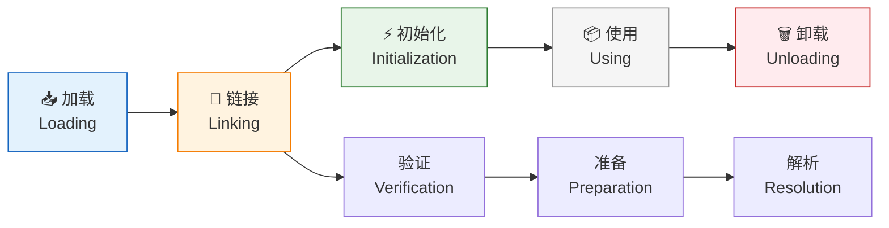
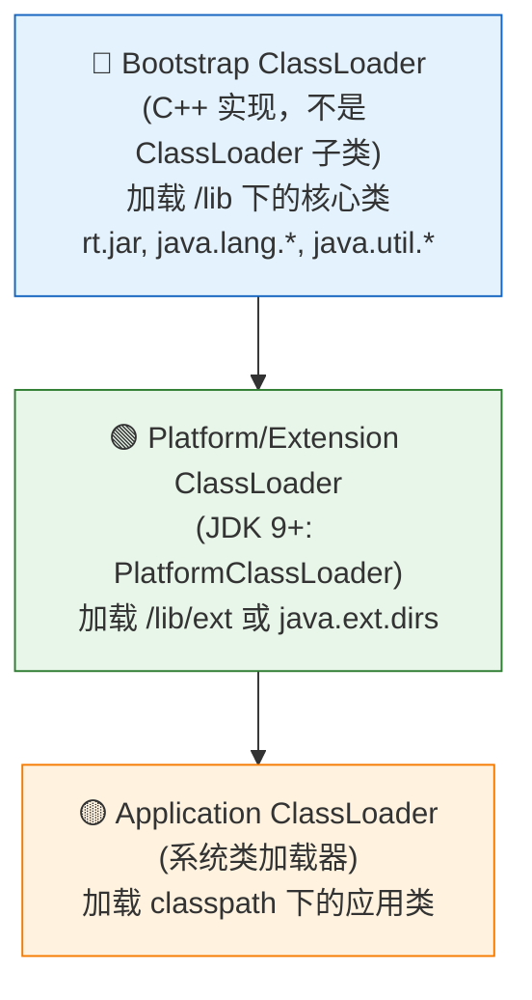
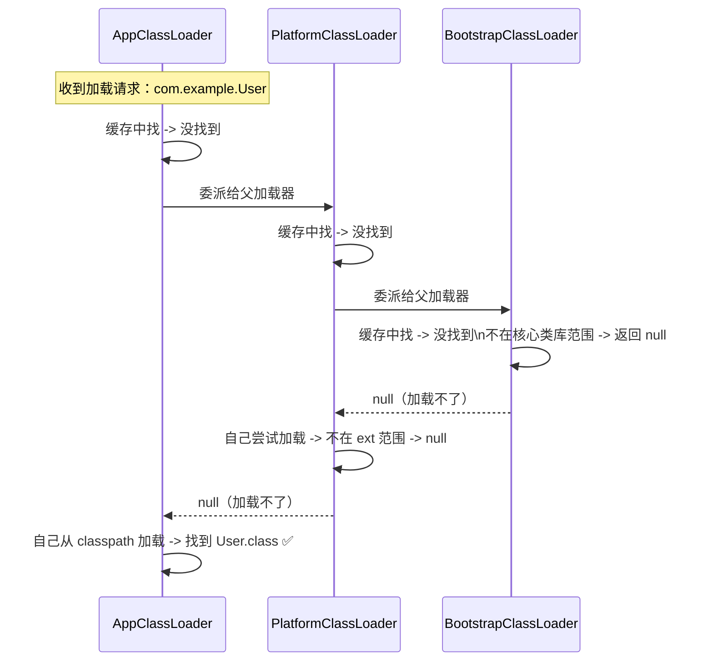
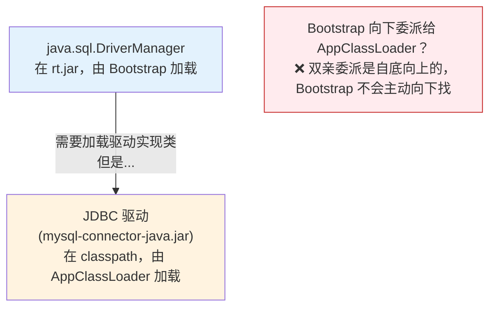
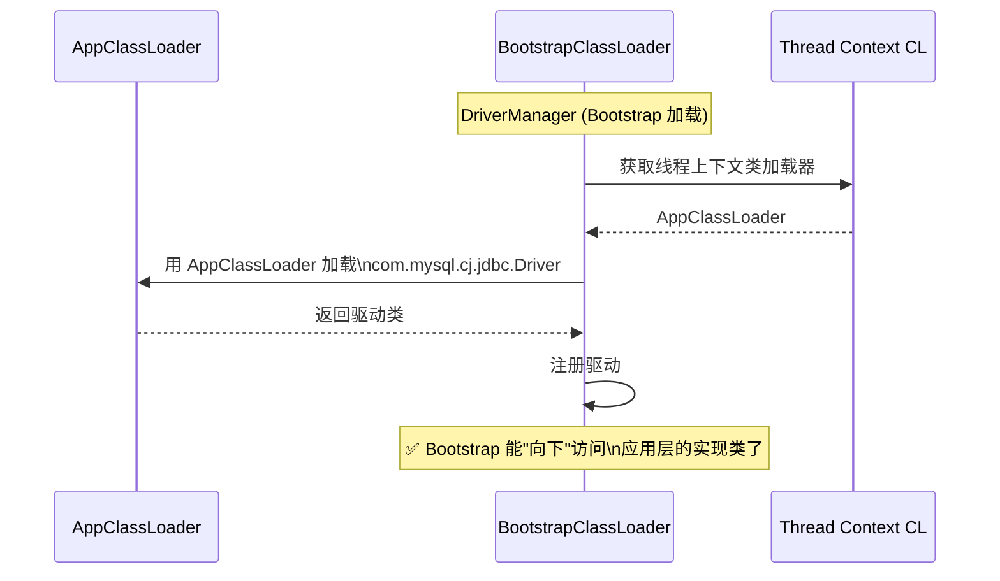
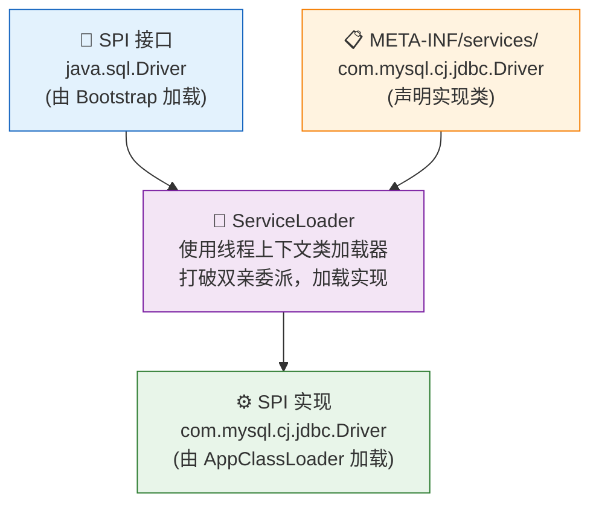
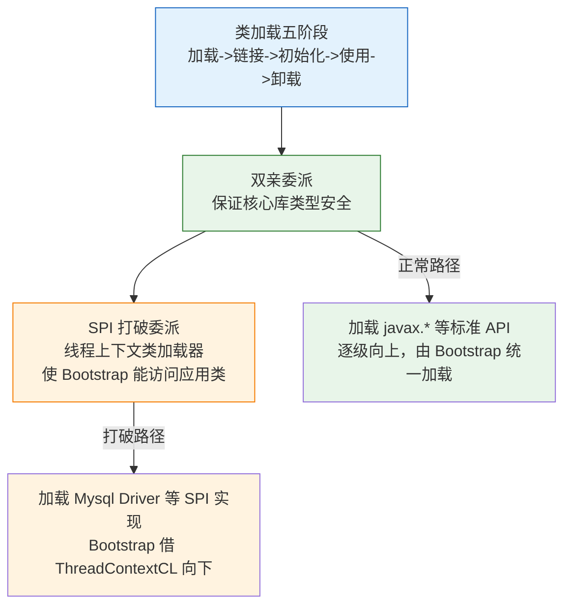

---

# 一、类加载的五个阶段

## 1.1 加载（Loading）

JVM 不关心 Class 文件从哪来——文件系统、网络、运行时生成、ZIP 包都行。**加载**阶段只做三件事：

1. 通过全限定类名找到 Class 文件的字节流
2. 将字节流解析为方法区的运行时数据结构
3. 在堆上创建一个 `java.lang.Class` 对象作为方法区数据的入口

## 1.2 链接（Linking）——三个阶段

| 阶段 | 做什么 | 举例 |
|------|--------|------|
| **验证** Verification | 检查 Class 文件格式、字节码语义、符号引用合法性 | 检查魔数 `0xCAFEBABE`，检查 final 类是否被继承 |
| **准备** Preparation | 为**静态变量**分配内存并赋零值 | `static int x = 10` → 此阶段 x = 0（非 final） |
| **解析** Resolution | 将常量池中的**符号引用**替换为**直接引用** | `String` → 指向方法区中 `java/lang/String` 的内存地址 |

> 准备阶段 `static final int X = 10` 直接赋 10（编译时常量），普通 `static int y = 10` 赋 0。

## 1.3 初始化（Initialization）

执行 `<clinit>()` 方法——**静态变量赋值 + 静态代码块**，按代码顺序执行。JVM 保证 `<clinit>()` 在多线程环境下的执行安全（加锁，只执行一次）。

---

# 二、类加载器的层级结构

## 2.1 三个核心类加载器



## 2.2 验证类加载器的存在

```java
public class ClassLoaderDemo {
    public static void main(String[] args) {
        // 应用类加载器
        ClassLoader app = ClassLoaderDemo.class.getClassLoader();
        System.out.println(app);  // sun.misc.Launcher$AppClassLoader
        
        // 平台类加载器 (JDK 9+)
        System.out.println(app.getParent());  // PlatformClassLoader
        
        // 启动类加载器 (C++ 实现，Java 层返回 null)
        System.out.println(app.getParent().getParent());  // null
        
        // String 由 Bootstrap 加载 → null
        System.out.println(String.class.getClassLoader());  // null
    }
}
```

---

# 三、双亲委派模型——Java 安全的基石

## 3.1 什么是双亲委派？



**核心逻辑**（`ClassLoader.loadClass()` 简化版）：

```java
protected Class<?> loadClass(String name, boolean resolve) {
    // ① 检查是否已加载
    Class<?> c = findLoadedClass(name);
    if (c != null) return c;
    
    // ② 委派父加载器
    if (parent != null) {
        c = parent.loadClass(name, false);
    } else {
        c = findBootstrapClassOrNull(name);
    }
    if (c != null) return c;
    
    // ③ 父加载不了 → 自己加载
    return findClass(name);
}
```

## 3.2 为什么需要双亲委派？

**核心目的：保证核心库的类型安全。**

```
如果没有双亲委派：
  有人在 classpath 放了一个 java.lang.String.class（恶意代码）
  → 应用加载器直接加载了这个"假的 String"
  → 所有依赖 String 的代码都被污染
  → JVM 安全模型被攻破

有了双亲委派：
  加载 java.lang.String 的请求 → 逐级委派 → Bootstrap 发现已有
  → 返回 JDK 自带的 String → 恶意版本永不加载
```

> 双亲委派不是一种"必须遵守的技术约束"，而是一种**推荐的代码组织模式**。它保证了 Java 核心类库的唯一性——同一个类在全 JVM 中只有一个。

## 3.3 全盘负责委托机制

一个类加载器加载类 A 时，A 依赖的其他类也由这个加载器去加载（委派给父加载器）。这保证了**同一个上下文中类型的一致性**。

---

# 四、打破双亲委派——三种"叛逆"场景

## 4.1 JDBC 4.0 的困境



**矛盾**：`DriverManager` 被 Bootstrap 加载，但 JDBC 驱动类被 AppClassLoader 加载。Bootstrap 加载的类想要使用 AppClassLoader 加载的类，双亲委派是**单向向上**的，Bootstrap 无法"向下"加载。

## 4.2 线程上下文类加载器——SPI 的救星

Java 引入了**线程上下文类加载器**（Thread Context ClassLoader）：

```java
// DriverManager 内部（简化版）
static {
    // 获取当前线程的上下文类加载器（默认 = 应用类加载器）
    ClassLoader cl = Thread.currentThread().getContextClassLoader();
    
    // 用上下文类加载器去加载驱动实现类
    ServiceLoader<Driver> loader = ServiceLoader.load(Driver.class, cl);
    for (Driver d : loader) {
        registerDriver(d);  // 注册驱动
    }
}
```



> 线程上下文类加载器默认就是应用类加载器，相当于在双亲委派链上**开了个后门**——Bootstrap 可以借这个后门去加载应用层的 SPI 实现。

## 4.3 SPI（Service Provider Interface）机制全景



**SPI 打破双亲委派的流程**：

1. 定义接口（如 `java.sql.Driver`），由 Bootstrap 加载
2. 实现方将实现类全限定名写入 `META-INF/services/` 文件
3. `ServiceLoader` 读取配置文件 → 获取线程上下文类加载器 → 加载实现类
4. → Bootstrap 代码调用到了 App 层的实现类

**常见的 SPI 场景**：

| SPI 接口 | 实现 | 所在模块 |
|----------|------|---------|
| `java.sql.Driver` | MySQL/PostgreSQL 驱动 | classpath |
| `javax.xml.parsers.SAXParserFactory` | Xerces 实现 | jre/lib |
| `java.nio.channels.spi.SelectorProvider` | 平台特定实现 | JDK 内部 |
| `SLF4J` → Logback/Log4j2 | 日志实现 | classpath |

## 4.4 另外两种"打破"场景

| 场景 | 原理 | 代表 |
|------|------|------|
| **OSGi 模块化** | 每个 Bundle 有自己的类加载器，网状委派而非树状 | Eclipse, Apache Felix |
| **Tomcat 类加载** | 每个 WebApp 独立类加载器，隔离不同应用的类 | `WebappClassLoader` |

---

# 五、类加载器的四个重要方法

| 方法 | 职责 | 注意事项 |
|------|------|---------|
| `loadClass(String)` | 实现双亲委派逻辑 | 核心方法，**不建议覆盖** |
| `findClass(String)` | 自定义加载逻辑 | 自定义 ClassLoader 时覆盖此方法 |
| `defineClass(byte[], int, int)` | 将字节流转为 Class 对象 | 父类工具方法 |
| `resolveClass(Class)` | 触发链接阶段 | 可选调用 |

**自定义类加载器的正确姿势**：

```java
public class MyClassLoader extends ClassLoader {
    @Override
    protected Class<?> findClass(String name) {  // ← 只覆盖 findClass
        byte[] bytes = loadClassBytes(name);      // 自定义加载逻辑
        return defineClass(name, bytes, 0, bytes.length);  // 交父类转换
    }
    // ⚠️ 不要覆盖 loadClass() — 会破坏双亲委派
}
```

---

# 六、实战问题

## 6.1 `ClassNotFoundException` vs `NoClassDefFoundError`

```java
// ClassNotFoundException：反射动态加载时找不到类
Class.forName("com.mysql.cj.jdbc.Driver");  // jar 没引入 → 抛异常

// NoClassDefFoundError：编译时有，运行时找不到（Error 不是 Exception）
// 场景：编译时依赖了某个类，但运行时 jar 冲突/版本不匹配
```

## 6.2 同一个类被两个加载器加载 → 两个不同的 Class

```java
// 同一个 ClassLoader 加载的同一个类 → 全 JVM 唯一
// 不同 ClassLoader 加载的同一个类 → 两个"不同"的 Class

// 判断两个类是否相等：同一个 ClassLoader + 同一个全限定名
// class1.equals(class2) 为 false → ClassCastException 可能
```

---

# 七、总结



> **双亲委派不是铁律，而是设计选择**。它的存在是为了安全（核心库不被篡改），SPI 打破它是为了灵活（核心库能调用扩展实现）。理解"什么时候遵循、什么时候打破"才是类加载机制的真正精髓。

---


*本文参考资料：*
- 周志明《深入理解 Java 虚拟机（第 3 版）》——第 2 章（内存区域）、第 3 章（GC）、第 8 章（类加载）、第 11-12 章（后端编译与优化）
- Oracle HotSpot Runtime Overview: https://openjdk.org/groups/hotspot/docs/RuntimeOverview.html
- JSR-133 (Java Memory Model and Thread Specification): https://jcp.org/en/jsr/detail?id=133
- OpenJDK Wiki - Synchronization: https://wiki.openjdk.org/display/HotSpot/Synchronization
- JEP 189: Shenandoah / JEP 304: Garbage Collector Interface / JEP 333: ZGC

# 附：JVM 系列索引

| 文章 | 与类加载的关联 |
|------|-------------|
| [类加载机制全景](/posts/jvm/类加载机制全景——双亲委派模型与spi打破委派的设计理由/) | ← 你在这里 |
| [JVM 逃逸分析深度拆解](/posts/jvm/jvm内存模型深度拆解/) | 类加载为 JIT 提供可优化的类型信息 |
| [JIT 编译器的分层编译与内联优化](/posts/jvm/jit编译器的分层编译与内联优化/) | 虚方法内联依赖类加载后 profiling 的类型分布 |
| [Java 对象全生命周期](/posts/jvm/java对象生命周期/) | 对象的创建始于类的加载和初始化 |
| [G1 GC 核心原理](/posts/jvm/g1-gc核心原理：region、satb、mixed-gc全解析/) | 类卸载是 GC 的一部分 |
| [GC 算法演进史](/posts/jvm/gc算法演进史：为什么每个时代需要不同的垃圾回收器/) | 总览 |
