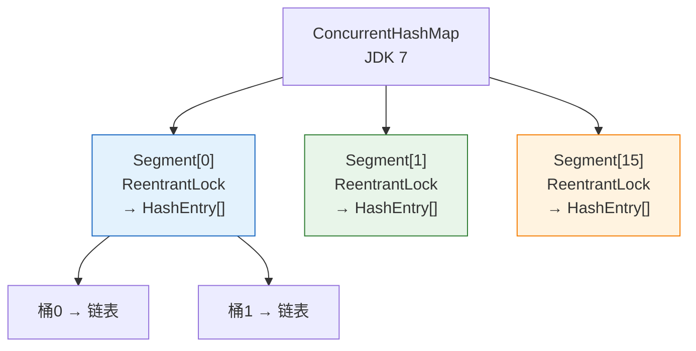
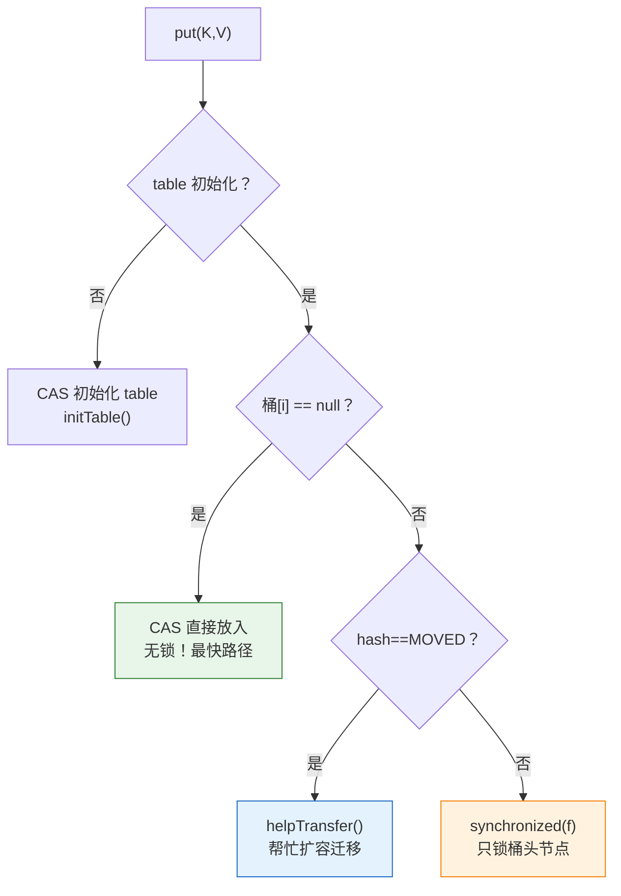
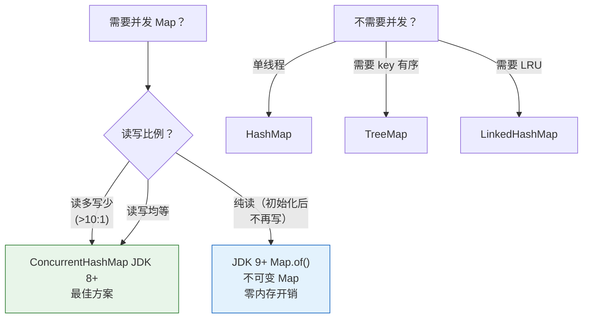

# 一、HashMap 会死循环，Hashtable 会锁死——ConcurrentHashMap 解决了什么？

[JDK 7 HashMap 的环形链表](/posts/java集合/hashmap-并发死循环jdk-7-头插法的致命-bug-复盘/) 告诉我们并发用 HashMap 会导致 CPU 100%。那用 `Hashtable` 或 `Collections.synchronizedMap()` 呢？

```java
// Hashtable：所有方法加 synchronized
public synchronized V put(K key, V value) { ... }
public synchronized V get(Object key) { ... }
```

问题：**一个线程在读，其他所有线程都不能读、不能写。** 对于读多写少的缓存场景，这完全是浪费——多个线程完全可以同时读。

**ConcurrentHashMap 的核心设计目标：** 读操作完全不需要加锁（无锁读），写操作只锁最小的必要范围（细粒度锁）。这个目标在 JDK 7 和 JDK 8 中用了两种截然不同的方案。

---

# 二、JDK 7——Segment 分段锁

## 2.1 数据结构

JDK 7 的 ConcurrentHashMap 把整个哈希表分成 **多个 Segment**，每个 Segment 是一把独立的 `ReentrantLock`：

```java
// JDK 7 ConcurrentHashMap
final Segment<K,V>[] segments;  // 默认 16 个 Segment

static final class Segment<K,V> extends ReentrantLock {
    transient volatile HashEntry<K,V>[] table;  // Segment 内部的哈希表
    transient int count;                         // Segment 内元素计数
    transient int modCount;                      // 结构性修改计数
}
```



**分段锁的核心思想**：把竞争分散到多把锁上。16 个 Segment = 理想情况下 16 个线程可以同时写（各写各的 Segment），读操作完全不需要锁（`HashEntry` 的 value 是 `volatile`）。

## 2.2 put 操作的完整流程

```java
// JDK 7 ConcurrentHashMap.put
public V put(K key, V value) {
    int hash = hash(key);
    // 1. 定位 Segment
    int j = (hash >>> segmentShift) & segmentMask;
    Segment<K,V> seg = segmentAt(segments, j);
    // 2. 在 Segment 内执行 put
    return seg.put(key, hash, value, false);
}

// Segment.put
V put(K key, int hash, V value, boolean onlyIfAbsent) {
    lock();  // 只锁当前 Segment！
    try {
        // 和 HashMap 类似的链表操作
        int index = (tab.length - 1) & hash;
        HashEntry<K,V> first = tab[index];
        for (HashEntry<K,V> e = first; e != null; e = e.next) {
            if (e.hash == hash && key.equals(e.key)) {
                V old = e.value;
                e.value = value;
                return old;
            }
        }
        // 插入新节点（头插法，但在此 Segment 的锁内是安全的）
        tab[index] = new HashEntry<>(hash, key, value, first);
        count++;
    } finally {
        unlock();
    }
}
```

## 2.3 get 操作——完全无锁

```java
// JDK 7 ConcurrentHashMap.get
public V get(Object key) {
    int hash = hash(key);
    // 1. 定位 Segment（通过 volatile 读 segments 数组）
    Segment<K,V> seg = segmentFor(hash);
    // 2. 在 Segment 的 table 中查找（table 是 volatile）
    HashEntry<K,V>[] tab = seg.table;
    for (HashEntry<K,V> e = tab[(tab.length-1) & hash]; e != null; e = e.next) {
        if (e.hash == hash && key.equals(e.key)) {
            V v = e.value;
            if (v != null) return v;
            // 如果 value 是 null（可能正在被修改）→ 加锁重新读
        }
    }
    return null;
}
```

**关键设计**：`HashEntry.value` 和 `HashEntry.next` 都是 `volatile` 的。这保证了读线程不需要加锁就能看到写线程的最新修改。

## 2.4 Segment 数量的权衡

```java
// 构造函数指定 concurrencyLevel（并发级别）
new ConcurrentHashMap<>(16,    // initialCapacity
                        0.75f, // loadFactor
                        16);   // concurrencyLevel → 决定 Segment 数量

// Segment 数 = 大于等于 concurrencyLevel 的最小的 2 的幂
// concurrencyLevel=16 → 16 个 Segment
// concurrencyLevel=17 → 32 个 Segment
```

| concurrencyLevel | Segment 数 | 写并发度 | 内存成本 |
|-----------------|-----------|---------|---------|
| 16（默认） | 16 | 16 个线程同时写 | 16 个 ReentrantLock + 16 个 table |
| 64 | 64 | 64 个线程同时写 | 内存开销 ×4，但大多数 Segment 可能空着 |
| 256 | 256 | 256 | 每个 Segment 都有一把 ReentrantLock → 内存浪费 |

**设置原则**：`concurrencyLevel` 应设为预估的**最大并发写线程数**，而不是总线程数。对于缓存场景（读占 95%），默认 16 通常足够。

---

# 三、JDK 8——为什么不继续用分段锁了？

## 3.1 分段锁的三大陷阱

JDK 7 的分段锁方案运行了十年，暴露了三个问题：

**问题 1：锁粒度不够细**。一个 Segment 内有多个桶。即使两个线程操作不同的桶，只要它们在同一个 Segment 中，就要竞争同一把锁。

**问题 2：内存浪费**。每个 Segment 都有一把 `ReentrantLock`（包含一个 AQS 同步器），加上自己的 `HashEntry[]` 数组、`count`、`modCount` 等。即使该 Segment 中只有几个元素，这些元数据一个也不能少。

**问题 3：无法伸缩到超大规模**。Segment 数在构造时固定，不能扩容。如果实际并发度远超 Segment 数，锁竞争会严重。

## 3.2 JDK 8 的决定——彻底抛弃分段锁

JDK 8 做了两个关键决定：

1. **数据结构对齐 HashMap**：`Node<K,V>[] table` + 链表/红黑树——不再有 Segment
2. **锁的粒度降到桶级别**：只对发生冲突的那个桶的头节点加 `synchronized`

为什么敢用 `synchronized`？因为 JDK 8 对 `synchronized` 做了重大升级——锁升级（偏向锁→轻量级锁→重量级锁）。在竞争不激烈时，`synchronized` 只做一次 CAS（偏向锁/轻量级锁），性能和 `ReentrantLock` 几乎相同，且语法更简洁、JVM 可以自动优化（锁粗化、锁消除）。

## 3.3 核心实现——一个 put 的四种路径

```java
// JDK 8 ConcurrentHashMap.putVal——四种情况，四种策略
final V putVal(K key, V value, boolean onlyIfAbsent) {
    for (Node<K,V>[] tab = table;;) {  // 自旋
        Node<K,V> f; int n, i, fh;
        
        if (tab == null || (n = tab.length) == 0)
            // 情况 ①：table 未初始化 → CAS 初始化
            tab = initTable();
        
        else if ((f = tabAt(tab, i = (n - 1) & hash)) == null) {
            // 情况 ②：桶为空 → CAS 直接放入，不加锁！
            if (casTabAt(tab, i, null, new Node<>(hash, key, value, null)))
                break;
        }
        
        else if ((fh = f.hash) == MOVED)
            // 情况 ③：正在扩容 → 当前线程帮忙迁移（helpTransfer）
            tab = helpTransfer(tab, f);
        
        else {
            // 情况 ④：桶不为空 → synchronized 锁桶头
            V oldVal = null;
            synchronized (f) {  // 只锁这个桶的头节点！
                if (tabAt(tab, i) == f) {  // 双重检查
                    if (fh >= 0) {         // 链表
                        // 遍历 + 尾插（和 HashMap 一样）
                    } else if (f instanceof TreeBin) {  // 红黑树
                        // 红黑树插入
                    }
                }
            }
        }
    }
    // 计数 + 检查是否需要扩容
    addCount(1L, binCount);
    return null;
}
```



## 3.4 无锁读的实现

JDK 8 的读和 JDK 7 一样完全无锁：

```java
public V get(Object key) {
    Node<K,V>[] tab; Node<K,V> e, p; int n, eh; K ek;
    int h = hash(key);
    if ((tab = table) != null && (n = tab.length) > 0 &&
        (e = tabAt(tab, (n - 1) & h)) != null) {
        if ((eh = e.hash) == h) {
            if ((ek = e.key) == key || (ek != null && key.equals(ek)))
                return e.val;                  // 桶头就是 → 直接返回
        }
        else if (eh < 0)
            return (p = e.find(h, key)) != null ? p.val : null;  // 红黑树查找
        while ((e = e.next) != null) {
            if (e.hash == h && ((ek = e.key) == key || key.equals(ek)))
                return e.val;
        }
    }
    return null;
}
```

**无锁读的保证**：`Node.val` 和 `Node.next` 都是 `volatile`，保证了并发写入对读线程的可见性。`tabAt` 通过 `Unsafe.getObjectVolatile` 读取数组元素，保证了数组元素的可见性。

---

# 四、size 计数——从锁全表到分散 CAS

## 4.1 JDK 7：锁所有 Segment 求和

```java
// JDK 7: 要拿精确大小，得锁住所有 Segment
public int size() {
    for (;;) {
        // 不加锁快速尝试两次
        long sum = 0;
        for (Segment seg : segments) sum += seg.count;
        // 如果两次结果相同 → 没有并发修改 → 返回
        // 如果不同 → 加锁全部 Segment → 重新求和
    }
}
```

`size()` 在并发场景下可能需要对所有 16 个 Segment 加锁——这是一个全局操作。

## 4.2 JDK 8：CounterCell 分散计数（LongAdder 的思想）

```java
// JDK 8: 借鉴了 LongAdder 的设计
private transient volatile long baseCount;           // 基础计数
private transient volatile CounterCell[] counterCells;  // 分散单元格

final long sumCount() {
    CounterCell[] as = counterCells;
    long sum = baseCount;
    if (as != null) {
        for (CounterCell a : as) {
            if (a != null) sum += a.value;
        }
    }
    return sum;
}

// 每次 put 成功 → addCount
// → 先 CAS baseCount
// → CAS 失败（有竞争） → 落到 CounterCell 数组
// → 不同线程通过 ThreadLocalRandom.probe 哈希到不同的 CounterCell
```

**核心思想**：让竞争分散到多个计数器上。类似于高并发场景下，不要让所有人排一个队，而是开多个窗口。`LongAdder` 和 `Striped64` 是 Doug Lea 为 Java 8 并发包提供的核心基础设施。

---

# 五、helpTransfer——多线程协作扩容

JDK 8 的另一个重大创新：扩容不由单个线程独自完成，而是**所有访问到该表的线程都帮忙迁移**：

```java
// 当 put 线程发现 table 的某个桶的 hash == MOVED
// → 说明有线程正在扩容
// → 当前线程加入迁移工作，而不是空等

final Node<K,V>[] helpTransfer(Node<K,V>[] tab, Node<K,V> f) {
    // ForwardingNode 指向 nextTable（扩容的目标表）
    ForwardingNode<K,V> fwd = (ForwardingNode<K,V>) f;
    // 获取待迁移的桶区间
    int nextBound = transferIndex;
    // 参与迁移：将 [nextBound-stride, nextBound) 的桶迁移到 nextTable
    transfer(tab, nextTab);
    return nextTab;  // 返回新表
}
```

这意味着在扩容期间：
- 旧表被逐渐迁移到新表（分步迁移，不是一次性）
- 已迁移的桶挂一个 `ForwardingNode`，指向新表
- 读请求遇到 `ForwardingNode` → 直接到新表读
- 写请求遇到 `ForwardingNode` → 先去新表写（同时帮忙迁移更多桶）

这个设计让扩容从"全局暂停"变成了"分布式搬运"。

---

# 六、JDK 7 vs JDK 8 全面对比

| 维度 | JDK 7 | JDK 8 | 
|------|-------|-------|
| **数据结构** | Segment[] + HashEntry[] | Node[] + 链表/红黑树（对齐 HashMap） |
| **锁机制** | `ReentrantLock`（每个 Segment 一把） | CAS + `synchronized`（每个桶头） |
| **锁粒度** | Segment（16~65536 个） | **桶**（成千上万个） |
| **读操作** | 无锁（volatile 读） | 无锁（volatile 读） |
| **写操作** | `lock()` 整个 Segment | CAS 空桶 / `synchronized(f)` 非空桶 |
| **扩容** | Segment 内独立 rehash | **多线程协作迁移**（helpTransfer） |
| **size** | 锁全部分段求和 | `baseCount + CounterCell[]`（LongAdder 思想） |
| **红黑树** | 不支持 | 支持（≥8 树化） |
| **内存** | 每个 Segment 有 ReentrantLock + 元数据 | 无额外锁对象（synchronized 用对象头） |

---

# 七、选型决策——我该用哪个？



**两条铁律：**

1. **任何并发场景 → ConcurrentHashMap**。不要用 HashMap + 手动同步，不要用 Hashtable，不要用 Collections.synchronizedMap。
2. **不需要并发的场景 → HashMap**。ConcurrentHashMap 在高并发下有额外开销（CAS 自旋），单线程场景下 HashMap 更快。

---

# 八、总结

ConcurrentHashMap 的两次重构反映了 Java 并发编程思想的进化：

```
JDK 5: 引入 ConcurrentHashMap（分段锁） → "并发是特殊的，需要专门的数据结构"
JDK 7: 分段锁成熟稳定 → "细粒度锁 + 无锁读 = 高性能并发"
JDK 8: 放弃分段锁，拥抱 CAS+synchronized → "synchronized 已经足够快，锁粒度可以更细"
```

核心设计原则（两次重构都没有动摇的）：

| 原则 | JDK 7 实现 | JDK 8 实现 |
|------|----------|----------|
| **读无锁** | `volatile` 保证可见性 | `volatile` + `Unsafe.getObjectVolatile` |
| **写细粒度锁** | 锁 Segment | 锁桶头（CAS 或 synchronized） |
| **原子操作 CAS 优先** | Segment 内部用 CAS | CAS 初始化、CAS 空桶插入 |
| **计数分散** | 每个 Segment 独立 count | baseCount + CounterCell[] |

> **延伸阅读**：[CopyOnWriteArrayList](/posts/java集合/copyonwritearraylist读写分离的并发安全容器/) 是另一种"读无锁"的并发容器，适用于读多写少但不需要 key-value 映射的场景。
