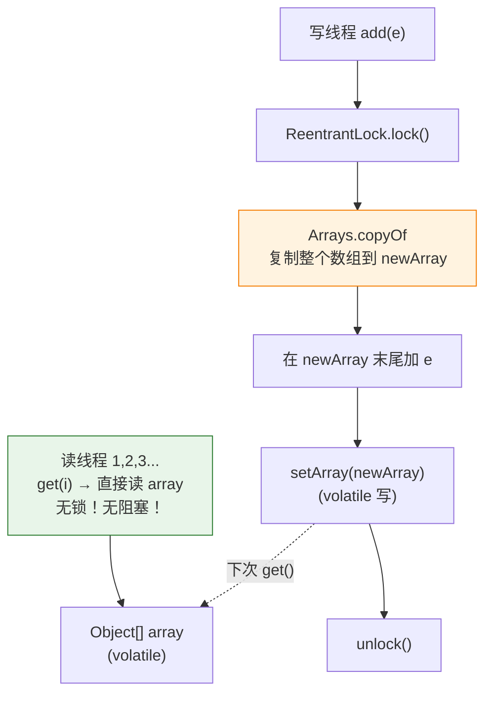

# 一、事件监听器列表——为什么不用 ArrayList + synchronized？

一个典型的 GUI 应用或微服务框架中，事件监听器列表有以下特征：

- **注册/注销**：在启动时或极少情况下发生（写少）
- **遍历触发**：每次事件发生时都要遍历全部监听器（读极多）
- **读写比**：可能达到 100,000:1

如果用 `Collections.synchronizedList(new ArrayList<>())`：

```java
// 每次事件触发 → 锁住整个列表 → 阻塞所有其他读线程
synchronized (mutex) {
    for (Listener l : list) l.onEvent(event);  // 可能有几百个监听器
}
```

在高频事件场景下（如股票行情推送、日志监控），这把锁成为瓶颈。`CopyOnWriteArrayList` 的设计哲学：**读操作完全不阻塞，写操作付出复制整个数组的代价**。

---

# 二、核心机制——写时复制（Copy-On-Write）

## 2.1 数据结构

```java
public class CopyOnWriteArrayList<E> implements List<E> {
    private transient volatile Object[] array;     // volatile 保证读可见性
    final transient ReentrantLock lock = new ReentrantLock();  // 只保护写
    
    final Object[] getArray() { return array; }
    final void setArray(Object[] a) { array = a; }  // volatile 写
}
```

## 2.2 读——完全无锁

```java
public E get(int index) {
    return elementAt(getArray(), index);  // getArray() 是 volatile 读
}

static <E> E elementAt(Object[] a, int index) {
    return (E) a[index];  // 直接数组访问，没有锁
}
```

**为什么不需要锁？** `array` 是 `volatile` 的，写操作完成后 `setArray(newArray)` 对读线程立即可见。读线程拿到的是写操作之前的旧数组或之后的新数组——但永远不会是"正在修改中的数组"。

## 2.3 写——锁 + 复制 + 替换

```java
public boolean add(E e) {
    final ReentrantLock lock = this.lock;
    lock.lock();                              // ① 写互斥锁
    try {
        Object[] elements = getArray();
        int len = elements.length;
        Object[] newElements = Arrays.copyOf(elements, len + 1);  // ② 复制整个数组
        newElements[len] = e;                 // ③ 在新数组上修改
        setArray(newElements);                // ④ volatile 写 → 读线程立即可见
        return true;
    } finally {
        lock.unlock();
    }
}
```



**核心代价**：每次写操作都是 O(N) 的全量数组复制。这就是为什么 COW 只适用于**写极少**的场景。

---

# 三、迭代器——快照不变性

```java
public Iterator<E> iterator() {
    return new COWIterator<>(getArray(), 0);  // 获取当前数组的快照
}

static final class COWIterator<E> implements ListIterator<E> {
    private final Object[] snapshot;  // 迭代期间不会变！
    private int cursor;
    
    public boolean hasNext() {
        return cursor < snapshot.length;  // 即使外部写操作换了新数组，snapshot 不变
    }
    
    public E next() {
        if (!hasNext()) throw new NoSuchElementException();
        return (E) snapshot[cursor++];
    }
    
    // ❌ 不支持 remove/set/add
    public void remove() { throw new UnsupportedOperationException(); }
    public void set(E e) { throw new UnsupportedOperationException(); }
    public void add(E e) { throw new UnsupportedOperationException(); }
}
```

**为什么不支持 `remove()`？**

不是技术上做不到，而是设计上的约束。迭代器基于**快照**运行——即使你在迭代期间移除了某个元素，快照里它还在。如果允许 `remove()`，语义会非常混乱：你到底是在从快照里移除，还是在从最新的数组里移除？与其给出一个语义不一致的操作，不如直接禁止。

**快照的好处**：永远不会抛 `ConcurrentModificationException`。对比 `ArrayList` 的 fail-fast 迭代器，COW 的迭代器可以用在回调遍历中——你在遍历监听器列表时，另一个线程正在注册新监听器，不会有任何异常。

---

# 四、内存与 GC——COW 的隐藏成本

## 4.1 每次写都产生旧数组的"垃圾"

```java
// 每次 add → Arrays.copyOf 创建新数组
// 旧数组 setArray 后无引用 → 成为 GC 垃圾
// 如果你的 list 有 10000 个元素，每次 add 产生一个 10000 个对象的临时数组

CopyOnWriteArrayList<byte[]> list = new CopyOnWriteArrayList<>();
// list 存了 1000 个 byte[1024] (~1KB each)
// 每次 add → 复制 1000 个引用（8 bytes each = 8KB）
// 旧数组 → GC 压力
```

## 4.2 写频次决定了 COW 是否适合

| 写频次 | 数据量 | COW 是否适合？ |
|--------|--------|--------------|
| 每分钟 1 次 | < 100 条 | ✅ 完美 |
| 每秒 1 次 | < 1000 条 | ✅ 还行 |
| 每秒 100 次 | 任何量级 | ⚠️ 需要评估内存分配率和 GC |
| 每秒 1000 次 | > 100 条 | ❌ 绝对不适合——O(N) 复制 + GC 爆炸 |

**如果写频繁但读也多，该用什么？**
- List 场景：考虑 `ConcurrentLinkedQueue`（无界非阻塞队列，可在队尾转 List）或加 `ReadWriteLock` 保护的 `ArrayList`
- Map 场景：`ConcurrentHashMap`（见 [ConcurrentHashMap 文章](/posts/java集合/concurrenthashmapjdk-7-分段锁到-jdk-8-cassynchronized-的演进/)）

---

# 五、适用场景与陷阱

| ✅ 适合 | ❌ 不适合 |
|---------|----------|
| 事件监听器列表 | 高频写入（如消息队列缓冲） |
| 配置信息（启动后不变） | 大数据量（几万条 → 复制成本高） |
| 白名单/黑名单（定期更新） | 需要 `remove()` 在迭代中使用 |
| 元数据缓存（读多写极少） | 数据量大 + 频繁修改 → GC 抖动 |

---

# 六、CopyOnWriteArraySet——基于 COW 的 Set

```java
// CopyOnWriteArraySet 的底层就是 CopyOnWriteArrayList
public class CopyOnWriteArraySet<E> extends AbstractSet<E> {
    private final CopyOnWriteArrayList<E> al;
    
    public boolean add(E e) {
        return al.addIfAbsent(e);  // 遍历 COWAL → 不存在则 COW 复制追加
    }
}
```

和 HashSet 包装 HashMap 一样简陋——但 COW 的复制成本意味着 `add` 需要 O(N) 的遍历 + O(N) 的复制。比 HashSet 的 O(1) 慢得多，但在极低频写入 + 高频迭代的场景下仍然有价值。

---

# 七、总结

| 特性 | 说明 |
|------|------|
| **读** | 无锁，直接 volatile 读数组，O(1) |
| **写** | ReentrantLock 互斥 + Arrays.copyOf 全量复制，O(N) |
| **迭代** | 快照迭代，不抛 CME，不支持 remove |
| **内存** | 写时双份内存（旧数组 + 新数组），直到 GC 回收旧数组 |
| **适用** | 读:写 > 100:1，数据量小（< 1000 条） |
| **避免** | 高频写入、大数据量、实时性要求高的场景 |

COW 的哲学不是"让写变快"，而是"让读完全不受写的影响"。它是用空间（双份内存）和写延迟（全量复制）来换取读的极致性能。这个权衡只在**读多写极少**的场景下成立——在其他场景下，它就是内存杀手和 GC 噩梦。
