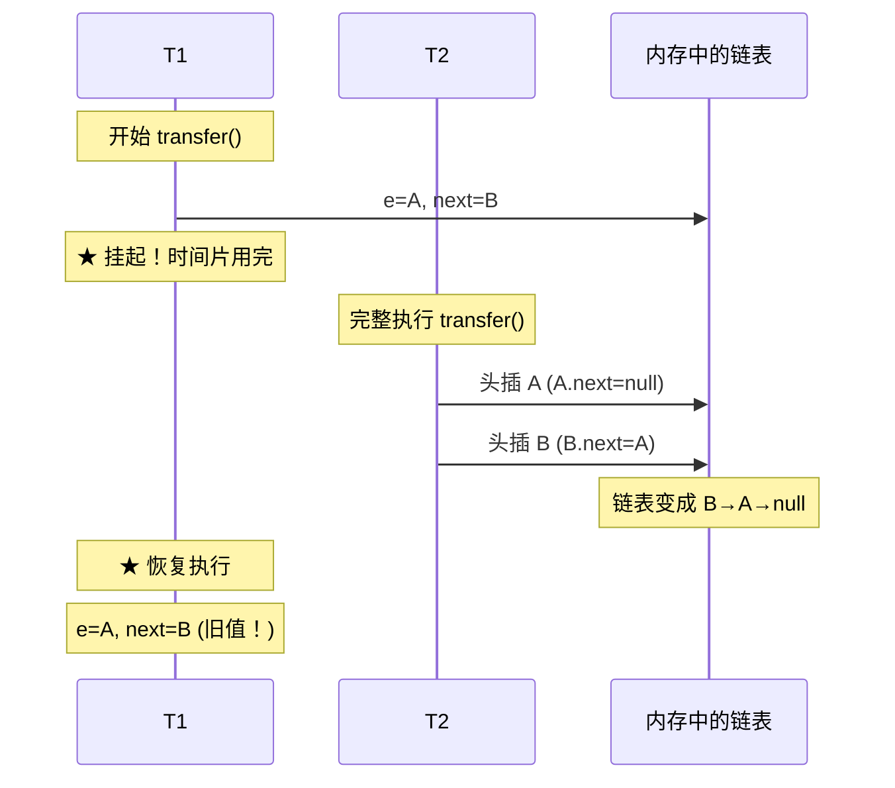
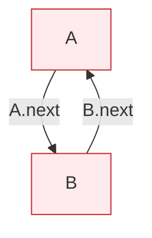

# 一、那是 2015 年的一个双十一前夜

压测环境中，一个普通的 Web 应用在并发量超过 2000 QPS 后，CPU 突然飙到 100%，且持续不退。`jstack` 线程 dump 显示十几个线程卡在 `HashMap.get()` 里面，堆栈指向同一个位置：

```
"http-nio-8080-exec-42" #42 daemon prio=5 tid=0x00007f8b1c00a000 nid=0x5a3b 
  at java.util.HashMap.get(HashMap.java:556)
  at java.util.HashMap.getEntry(HashMap.java:480)
  ...
```

`jmap -histo` 发现 `HashMap$Entry` 实例数量异常——内存中本应只有 10 万条数据，却有上百万个 `Entry` 对象。

根因是 JDK 7 HashMap 的**头插法扩容 + 多线程并发 = 环形链表**。这个 bug 在 Java 社区轰动一时，直接催生了 JDK 8 HashMap 的尾插法重构，也让 ConcurrentHashMap 成为并发场景的唯一标准答案。

本文还原这个 bug 的完整形成过程。阅读前建议先理解 [HashMap 核心原理](/posts/java集合/hashmap-核心原理哈希冲突红黑树化与扩容机制/)，特别是扩容迁移机制。

---

# 二、头插法——一切罪恶的根源

## 2.1 JDK 7 为什么选头插法？

```java
// JDK 7 HashMap.transfer() —— 扩容并迁移元素
void transfer(Entry[] newTable, boolean rehash) {
    int newCapacity = newTable.length;
    for (Entry<K,V> e : table) {           // 遍历旧表的每个桶
        while (null != e) {                // 遍历桶中的链表
            Entry<K,V> next = e.next;      // ① 暂存后继
            if (rehash) {
                e.hash = null == e.key ? 0 : hash(e.key);
            }
            int i = indexFor(e.hash, newCapacity);  // ② 计算新位置
            e.next = newTable[i];          // ③ 头插：新节点的 next 指向当前桶头
            newTable[i] = e;               // ④ 新节点成为新的桶头
            e = next;                      // ⑤ 处理下一个
        }
    }
}
```

头插法在**单线程**下完全正确。假设旧桶 `table[1]` 的链表是 `A → B → null`，迁移到新表：

```
初始: newTable[1] = null, e = A, next = B

第 1 轮: e=A, next=B
  ③ A.next = null
  ④ newTable[1] = A
  ⑤ e = B

第 2 轮: e=B, next=null
  ③ B.next = A      ← 头插！B 插在 A 前面
  ④ newTable[1] = B
  ⑤ e = null → 结束

结果: newTable[1] = B → A → null
```

**链表顺序反转了**：`A→B` 变成了 `B→A`。这个反转在并发时是致命的。

## 2.2 头插法的设计动机

JDK 7 的开发者选择头插法靠的是"最近插入的最可能被再次访问"这个假设（LRU 思想）。而且头插法实现简单——不需要维护尾指针，也不需要在链表尾找到插入点。但这个微小的实现便利，在多线程下酿成了灾难。

---

# 三、死循环的六步还原——每帧一个内存状态

假设初始状态：旧表 `table[1] = A → B → null`，两个线程 T1 和 T2 同时 `put` 触发扩容。

## 帧 1：T1 开始 transfer，挂起在循环中间

```
T1 状态:
  for (Entry e : table)  →  e = A（旧表桶头）
  Entry next = e.next    →  next = B
  —— 此时 T1 的时间片用完，挂起 ——

T1 寄存器: e=A, next=B
旧表: table[1] = A → B → null
T1 新表: newTable1[1] = null（T1 自己的新表）
```

## 帧 2：T2 完整执行 transfer

```
T2 不受影响，完整执行 transfer():

第 1 轮: e=A, next=B
  A.next = null
  newTable2[1] = A
  e = B

第 2 轮: e=B, next=null
  B.next = A         ← 头插法：B 指向 A
  newTable2[1] = B
  e = null → 完成

T2 完成后: 旧表被 newTable2 替换
  新表状态: table[1] = B → A → null
```



## 帧 3：T1 恢复——第 1 轮，处理 A

```
T1 恢复时的寄存器: e=A, next=B  (注意：这是挂起时的旧值！)

第 1 轮：处理节点 A
  ③ A.next = newTable1[1]  →  A.next = null
  ④ newTable1[1] = A       →  A 成为 T1 新表的桶头
  ⑤ e = next = B           →  e = B

T1 新表: newTable1[1] = A → null
T1 寄存器: e=B, next=??  (next 将在下一轮从 B.next 读取)
```

请注意：**T1 的 `next` 是从 T2 已经修改过的 B 节点读取的**。在 T2 完成后，`B.next = A`，所以下一轮 `next = B.next = A`。

## 帧 4：T1 第 2 轮——处理 B

```
第 2 轮：处理节点 B
  ① next = e.next = B.next = A    ← 关键！B.next 指向了 T2 设置的 A
  
  ③ B.next = newTable1[1]  →  B.next = A    ← B 指向 T1 新表的桶头 A
  ④ newTable1[1] = B       →  B 成为桶头
  ⑤ e = next = A           →  e = A

T1 新表: newTable1[1] = B → A → null
T1 寄存器: e=A
```

此时看起来还是正常的：`B → A → null`。但注意 `e = A`，下一轮又要处理 A。

## 帧 5：T1 第 3 轮——处理 A（第二次），环形链形成！

```
第 3 轮：再次处理节点 A
  ① next = e.next = A.next
     在 T1 的视角中，A.next 是什么？
     
     T1 在第 2 轮中设了 B.next = A（通过 ③ B.next = newTable1[1]）
     但 A.next 是什么？
     
     在 T2 完成后：A.next = null
     在 T1 第 1 轮：A.next = null（T1 设的）
     在 T1 第 2 轮：B.next = A（连接了 B→A）
     A.next 仍然是 null！
     
     所以：next = A.next = null

  ③ A.next = newTable1[1]  →  A.next = B   ← A 指向了桶头 B！
     但 B 已经指向 A 了！
     
  ④ newTable1[1] = A       →  A 成为新桶头
  ⑤ e = next = null        →  循环结束

结果: newTable1[1] = A → B → A → B → ...  ← 环形链表！
```



环形链表形成的瞬间：

- `A.next = B`（第 3 轮 ③）
- `B.next = A`（第 2 轮 ③ + T2 的设置）

两个指针咬合，永无止境。

## 帧 6：get/put 触发死循环

```java
// get(key) → 遍历链表
// table[1] = A → B → A → B → ...（环形！）
do {
    if (e.hash == hash && key.equals(e.key))
        return e.value;
} while ((e = e.next) != null);  // ← 永远不会等于 null，死循环
```

线程进入这个循环后再也无法退出。CPU 100%，线程栈无法恢复——这是 jstack 看到的场景。

---

# 四、JDK 8 如何从根本上修复？

## 4.1 不只是改成尾插法

```java
// JDK 8 resize() 的核心改动——不再"逐个头插"
// 而是用 loHead/loTail 和 hiHead/hiTail 维护两条链表

Node<K,V> loHead = null, loTail = null;  // 低位链（位置不变）
Node<K,V> hiHead = null, hiTail = null;  // 高位链（位置+oldCap）

Node<K,V> next;
do {
    next = e.next;
    if ((e.hash & oldCap) == 0) {
        // 低位 → 尾插到 lo 链
        if (loTail == null) loHead = e;
        else loTail.next = e;
        loTail = e;
    } else {
        // 高位 → 尾插到 hi 链
        if (hiTail == null) hiHead = e;
        else hiTail.next = e;
        hiTail = e;
    }
} while ((e = next) != null);

// 整条链表一次性挂到新桶
newTab[j] = loHead;           // 低位链 → 原位置
newTab[j + oldCap] = hiHead;  // 高位链 → 原位置+oldCap
```

JDK 8 做了三个关键修复：

1. **尾插法**：保持链表原有顺序，不会出现 A→B 变成 B→A
2. **局部变量 loTail/hiTail**：每个线程操作自己的局部变量，不共享引用
3. **整链迁移**：先构建完整的 lo 链和 hi 链，最后一次性挂到新表

即使 T1 和 T2 同时扩容（它们各自有自己的 newTable），也不会通过共享的 `next` 指针互相干扰——因为 JDK 8 的 do-while 循环中 `next = e.next` 是在循环体开头固定的，不会像 JDK 7 那样在跨线程时拿到被修改过的 `next`。

## 4.2 但 HashMap 仍然不是线程安全的

JDK 8 修复了死循环，但并发 `put` 还有以下问题：

```java
// 问题 1: 数据覆盖
// T1 和 T2 同时 put(hash相同, key不同)
// T1: tab[i] = newNode(...)
// T2: tab[i] = newNode(...)
// → 后执行者覆盖先执行者，丢失一条数据

// 问题 2: size 计数不准
// size++ 不是原子操作
// → 实际 100 条数据，size 可能是 98

// 问题 3: 扩容时的数据不一致
// 一个线程在扩容，另一个线程在 put
// → 可能 put 到旧表 → 扩容完成后数据丢失
```

**结论**：任何版本、任何场景，并发用 `ConcurrentHashMap`，不要对 HashMap 抱有幻想。详见 [ConcurrentHashMap 演进](/posts/java集合/concurrenthashmapjdk-7-分段锁到-jdk-8-cassynchronized-的演进/)。

---

# 五、问题排查——如果你也遇到了

## 5.1 症状

- CPU 某个核或全部核 100%，且持续不降
- `jstack` 多次 dump 看到同一个线程卡在 `HashMap.get()` 或 `HashMap.put()` 的同一行
- `jmap -histo` 发现 `HashMap$Entry` 或 `HashMap$Node` 数量远超预期

## 5.2 确认方法

```bash
# 1. 获取线程 dump（连续 3 次，间隔 5 秒）
jstack <pid> > jstack1.txt && sleep 5 && jstack <pid> > jstack2.txt && sleep 5 && jstack <pid> > jstack3.txt

# 2. 查看是否有线程一直停在 HashMap 相关代码
grep -A 20 "HashMap" jstack*.txt | grep -E "at java.util.HashMap"

# 如果三次 dump 同一线程停在同一个 HashMap 方法 → 极高概率是死循环
```

## 5.3 修复方案

1. **紧急止血**：重启服务（死循环线程无法被中断）
2. **根本修复**：升级到 JDK 8+，并且**将 HashMap 替换为 ConcurrentHashMap**
3. **兜底保护**：如果是遗留代码无法改，用 `Collections.synchronizedMap()` 包装（性能会大幅下降，仅作为临时措施）

---

# 六、总结

| | JDK 7 | JDK 8 |
|------|-------|-------|
| **插入方式** | 头插法（新元素在链表头） | 尾插法（新元素在链表尾） |
| **扩容迁移** | 逐个头插到新表 → 顺序反转 | lo/hi 链整链迁移 → 顺序保持 |
| **死循环根因** | 头插法 + 共享 `next` 指针被并发修改 | —（已从根本上消除） |
| **线程安全** | ❌ 死循环 + 数据覆盖 | ❌ 数据覆盖 + size 不准（不会死循环） |
| **正确做法** | ConcurrentHashMap | ConcurrentHashMap |

这个 Bug 给 Java 社区的教训：**并发安全的成本应该在设计阶段支付，而不是在生产环境支付**。Doug Lea 在 JDK 5 就提供了 `ConcurrentHashMap`，但开发者因为"我只是读多写少"、"加了就能跑"的理由坚持用 HashMap + 手动同步。JDK 7 的头插法死循环只是这种偷懒的代价之一——死循环能被 jstack 立刻定位到，而数据覆盖和计数不准这种"安静的 bug"可能潜伏数年才被发现。
