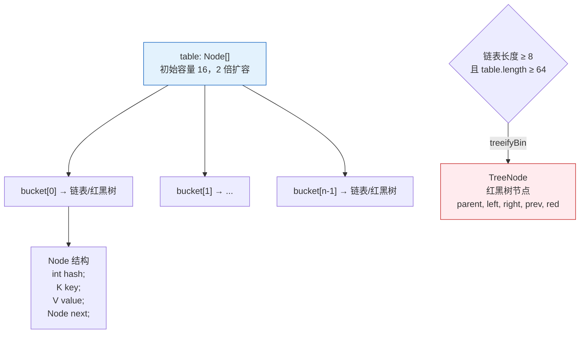
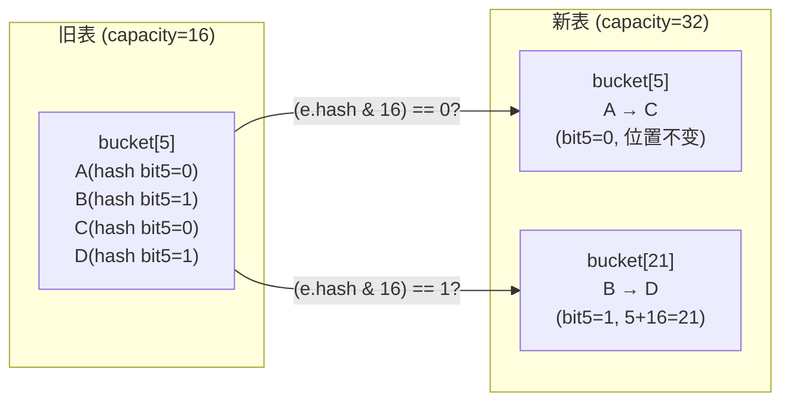

# 一、一个 1000 万 key 的 HashMap，为什么 CPU 飙到 100%？

考虑一个线上事故：促销活动期间，缓存预热系统初始化一个预计 2000 万 key 的 HashMap。`initialCapacity` 没有设置（默认 16），随着数据插入，HashMap 经历了 20+ 次扩容。每次扩容都要对所有 key 进行 rehash 并迁移——2000 万条数据的 rehash 持续了 8 秒，期间 CPU 100%，服务超时大面积发生。

这个事故暴露了一个事实：**HashMap 在大多数时候"刚好能跑"，但你不知道它什么时候会踩到扩容的雷**。

HashMap 是 Java 中最常用的数据结构，但也是最容易被"想当然"使用的数据结构。它的设计中有四个精妙的决策值得深入理解：

1. **扰动函数**：为什么 `hash = (h ^ h>>>16)`？不只是"让高位参与运算"
2. **扩容拆分**：为什么 JDK 8 用 `(e.hash & oldCap) == 0` 替代了 rehash？
3. **树化阈值**：为什么是 8？为什么退化是 6？这 2 的差值有什么深意？
4. **负载因子**：为什么是 0.75？不能是 0.5 或 1.0 吗？

本文逐个拆解。建议按顺序阅读：[ArrayList](/posts/java集合/arraylist-源码解析动态扩容与-fail-fast-机制/) 理解数组基础 → 本文 → [HashMap 并发死循环](/posts/java集合/hashmap-并发死循环jdk-7-头插法的致命-bug-复盘/) → [ConcurrentHashMap](/posts/java集合/concurrenthashmapjdk-7-分段锁到-jdk-8-cassynchronized-的演进/)。

---

# 二、数据结构全景——数组 + 链表 + 红黑树



HashMap 的核心结构是一个 `Node<K,V>[] table`。每个桶位置要么是 null（空），要么是一个链表的头节点，要么是一棵红黑树的根节点。链表的节点类型是 `Node`，树化后变为 `TreeNode`（继承自 `Node`）。

**为什么同时需要链表和红黑树？**

链表在冲突少时足够快（遍历几个节点），但如果哈希碰撞严重，退化到 O(N) 是不可接受的。红黑树保证最坏情况 O(logN)。但红黑树的节点 `TreeNode` 内存占用约是 `Node` 的 2 倍——所以在冲突少时用链表（省内存），冲突多时转红黑树（保性能）。

---

# 三、扰动函数——不只是"让高位参与"

## 3.1 为什么不能直接用 hashCode？

```java
// 直接用 key.hashCode() 取模会怎样？
int index = key.hashCode() % table.length;
```

问题出在 `table.length` 通常是 16、32、64……这些 2 的幂次。`% table.length` 等价于只取 hash 码的低位：

```
n = 16  →  n-1 = 15 = 0b0000_1111
index = hash & 15   ← 只有低 4 位参与！高 28 位被完全忽略
```

如果一批 key 的 `hashCode()` 低 4 位相同但高位不同——它们在 HashMap 中全部映射到同一个桶。这在现实中非常常见，因为很多对象的 `hashCode()` 是基于内存地址或递增 ID 生成的，低位有规律。

## 3.2 扰动函数做了什么

```java
static final int hash(Object key) {
    int h;
    return (key == null) ? 0 : (h = key.hashCode()) ^ (h >>> 16);
    //                      └──────────┬──────────┘   └──┬──┘
    //                       原始 32 位 hashCode      无符号右移 16 位
    //   结果：高 16 位 XOR 低 16 位 → 高位信息被"折叠"进低位
}
```

**为什么是异或（XOR）而不是与（AND）或（OR）？**

| 运算 | 结果中 1 的比例 | 问题 |
|------|---------------|------|
| `h & (h>>>16)` | ~25% | 偏向 0，哈希分布不均匀 |
| `h \| (h>>>16)` | ~75% | 偏向 1，哈希分布不均匀 |
| `h ^ (h>>>16)` | **~50%** | 0 和 1 的概率均等，均匀性最好 |

异或保持了 bit 的均衡分布——这是哈希函数最基本的要求。

**为什么不直接 Integer.rotateLeft 或更复杂的变换？**

这是 **性能 vs 效果** 的经典权衡。`^` 和 `>>>` 各只需要一个 CPU 时钟周期。更复杂的哈希函数（如 MurmurHash3、xxHash）虽然分布更均匀，但计算开销远超一次 XOR——而 HashMap 的 `put/get` 是热路径。Doug Lea 的选择是：用最小的计算代价把高位信息混入低位，让后续的 `(n-1) & hash` 取模时所有 bit 都参与索引计算。

## 3.3 JDK 7 vs JDK 8 的扰动对比

```java
// JDK 7：4 次扰动
h ^= (h >>> 20) ^ (h >>> 12);
h ^= (h >>> 7) ^ (h >>> 4);

// JDK 8：1 次扰动
(h = key.hashCode()) ^ (h >>> 16);
```

JDK 7 做了 4 次位移+异或，JDK 8 只做了 1 次。为什么简化了？因为 JDK 8 引入了红黑树——即使碰撞比 JDK 7 略多（单次扰动的均匀性确实弱于 4 次），O(logN) 的红黑树也能兜底。用"数据结构优化"替代"哈希函数优化"——更简单、更健壮。

---

# 四、扩容——2 倍 + 高低位拆分：JDK 8 最精妙的设计

## 4.1 为什么是 2 倍扩容？

JDK 8 选择了 2 倍扩容（vs ArrayList 的 1.5 倍），不是为了"空间换时间"的模糊理由，而是为了**利用 2 的幂特性来避免 rehash**。

## 4.2 高低位拆分——零 rehash 的扩容

这是 JDK 8 HashMap 最值得理解的设计。扩容时不是重新计算每个 key 的 `hash % newCapacity`，而是通过一个位运算判定去向：

```java
// JDK 8 扩容的核心逻辑（简化）
// oldCap = 16 (0b10000), newCap = 32 (0b100000)

for (Node<K,V> e : oldTab[j]) {  // 遍历每个旧桶的链表
    // 关键判断：e.hash 在 oldCap 对应的 bit 上是 0 还是 1？
    if ((e.hash & oldCap) == 0) {
        // bit = 0 → 位置不变，留在 lo 链
        loTail.next = e; loTail = e;
    } else {
        // bit = 1 → 位置 + oldCap，移到 hi 链
        hiTail.next = e; hiTail = e;
    }
}
// lo 链 → newTab[j]
// hi 链 → newTab[j + oldCap]
```

**为什么 `(e.hash & oldCap) == 0` 能替代 rehash？**

```
oldCap = 16 = 0b10000

计算旧索引：(n-1) & hash = 15 & hash  →  只看低 4 位
计算新索引：(2n-1) & hash = 31 & hash →  看低 5 位

低 5 位和低 4 位的区别，就是第 5 位（oldCap 对应的 bit）是 0 还是 1：
  - 如果 hash 的第 5 位 = 0 → 新索引 = 旧索引（不变）
  - 如果 hash 的第 5 位 = 1 → 新索引 = 旧索引 + 16（+oldCap）

所以只需要检查 (e.hash & oldCap)：判断 hash 在扩容位的 bit 值
```



**与 ArrayList 扩容的对比：**

| | ArrayList | HashMap |
|------|-----------|---------|
| 扩容倍数 | 1.5 倍 | **2 倍** |
| 为什么 | 内存碎片化权衡 | **保持 2 的幂 → 高低位拆分免 rehash** |
| 迁移成本 | `System.arraycopy`（O(N) 但很快） | 遍历所有节点 + 拆分链表（O(N)） |

ArrayList 不需要保持 2 的幂（通过数组下标直接访问），所以选 1.5 倍来减少内存浪费。HashMap 必须保持 2 的幂才能用 `(n-1) & hash` 代替取模——2 倍扩容恰好维持这个特性。

---

# 五、红黑树化——8 和 6 之间的秘密

## 5.1 为什么树化阈值是 8？

```java
// HashMap 的注释中引用了泊松分布概率：
// 在负载因子 0.75 下，链表长度超过 k 的概率：
// k=0: 0.606, k=1: 0.303, k=2: 0.075, k=3: 0.012
// k=4: 0.0015, k=5: 0.0002, k=6: 0.00003, k=7: 0.000004
// k=8: 0.000000006  ← 概率约 6/10亿，几乎不可能发生
```

**设计逻辑**：在理想哈希分布下，链表长度达到 8 的概率小于千万分之一。如果真的发生了，意味着哈希函数的分布出了问题（或者有人故意构造碰撞——见下文 DDoS 攻击）。此时转红黑树来兜底，保证最坏情况的性能。

**为什么不是 6 或 10？**

- 阈值太小（如 6）："误树化"频繁发生。链表遍历 6 个节点非常快（CPU 缓存友好的连续内存访问），转红黑树反而增加内存和 CPU 开销
- 阈值太大（如 10）：遍历 10 个节点的链表已经比较慢，且如果分布真的不均匀，等 10 个再转就晚了

## 5.2 为什么退化阈值是 6（不是 8）？——迟滞设计

```java
// 树化：链表长度 ≥ 8
static final int TREEIFY_THRESHOLD = 8;

// 退化：红黑树节点 ≤ 6
static final int UNTREEIFY_THRESHOLD = 6;
```

**为什么不是同一个值？** 如果树化和退化阈值相同（比如都是 8），当一个桶中的元素数恰好在 8 附近波动时（插入第 8 个 → 树化 → 删除第 8 个 → 退化 → 插入第 8 个 → 树化……），会频繁触发树化和退化——每次转换都要分配 `TreeNode` 或转回 `Node`，开销巨大。

6-8 的差值形成了一个**迟滞带**：树化需要 ≥8，退化需要 ≤6。在 7 这个值时不做任何转换——无论当前是链表还是红黑树，维持现状。这个设计在控制理论和硬件设计中也常见（如施密特触发器），用来防止振荡。

## 5.3 table < 64 时不树化

```java
final void treeifyBin(Node<K,V>[] tab, int hash) {
    if (tab == null || tab.length < MIN_TREEIFY_CAPACITY) // 64
        resize();  // 太小不树化，先扩容
    else {
        // 真正的树化
    }
}
```

当表本身还很小时（< 64 个桶），即使某个桶的链表很长，也不树化——而是直接扩容。扩容后桶数翻倍，每个桶中的元素被高低位拆分，链长自然减少。这比树化更经济。

## 5.4 安全角度：防止哈希碰撞 DDoS

2011 年，攻击者发现可以向 Web 应用发送**精心构造的 key**（通过 URL 参数、HTTP 头等），这些 key 的 `hashCode` 全部相同（或 `hashCode % n` 相同）→ 所有 key 落到同一个桶 → HashMap 退化为 O(N) 链表 → 单次 `put` 耗时从微秒级飙升到毫秒级 → CPU 被打满。

JDK 7 时代，Tomcat、Nginx 等都为此打了补丁（限制参数数量、随机化 hash seed）。JDK 8 引入红黑树后，即使全部碰撞，`put/get` 也是 O(logN)，彻底解决了这个攻击向量。

---

# 六、负载因子 0.75——时间和空间的帕累托最优

## 6.1 负载因子决定了什么？

```
threshold = capacity × loadFactor

当 size > threshold 时触发扩容
例如：capacity=16, loadFactor=0.75 → threshold=12
    → 第 13 个元素插入时触发扩容到 32
```

| 负载因子 | threshold (=16×) | 扩容触发 | 空间利用率 | 平均链长 | 查找开销 |
|---------|-----------------|---------|-----------|---------|---------|
| 0.5 | 8 | 频繁 | 50% | ~0.5 | 极低 |
| **0.75** | **12** | **适中** | **75%** | **~1** | **低** |
| 1.0 | 16 | 推迟 | 100% | ~2-3 | 升高 |

**0.75 是怎么来的？** 这是一个经验参数，但经过了数学验证：在良好的哈希函数下，负载因子 0.75 时每个桶的平均节点数约为 1，链表长度分布符合 λ=0.75 的泊松分布。碰撞和空间的乘积在 0.75 附近达到最优。

## 6.2 什么时候应该改负载因子？

```java
// 内存敏感 → 调大 loadFactor（减少预留空间）
new HashMap<>(1024, 0.9f);   // 90% 利用率

// 速度敏感 → 调小 loadFactor（减少碰撞概率）
new HashMap<>(1024, 0.5f);   // 更多空闲桶，冲突更少

// 一般不推荐改。如果改了，同时调大 initialCapacity
// 否则频繁扩容的代价远超负载因子带来的收益
```

---

# 七、JDK 7 → JDK 8 的完整演进

| 维度 | JDK 7 | JDK 8 | 变更原因 |
|------|-------|-------|---------|
| **数据结构** | 数组 + 链表 | 数组 + 链表 + 红黑树 | 防止哈希碰撞 DDoS 和极端退化 |
| **插入方式** | 头插法 | **尾插法** | 头插法在多线程扩容时导致环形链表 |
| **扩容迁移** | 逐个 rehash（`hash & (newCap-1)`） | **高低位拆分**（`(e.hash & oldCap) == 0`） | 避免每个节点重新计算 hash |
| **扰动函数** | 4 次异或+位移 | **1 次异或** | 红黑树兜底，不需要极致均匀的哈希 |
| **null key** | 特殊处理放在 `table[0]` | `hash=0`，统一处理 | 简化代码 |
| **并发问题** | resize 死循环（环形链表） | 死循环修复，但仍数据不一致 | 根本解决方案：用 ConcurrentHashMap |

> **关于并发**：JDK 8 修复了扩容时的环形链表问题（尾插法保证顺序），但 `put` 时的数据覆盖和 `size` 的计数不准确依然存在。HashMap 在任何版本都不是线程安全的。并发场景的完整分析见 [HashMap 并发死循环](/posts/java集合/hashmap-并发死循环jdk-7-头插法的致命-bug-复盘/)。

---

# 八、initialCapacity 的正确设置——最容易忽略的性能优化

```java
// ❌ 这样写：2000 万 key，默认 capacity=16
// → resize 24 次（16→32→64→...→33,554,432）
// → 每次 resize 遍历所有节点并重新拆分
new HashMap<>();

// ✅ 正确：预设容量，避免扩容风暴
// expectedSize / 0.75 + 1  = 目标容量（考虑负载因子）
int capacity = (int) (20_000_000 / 0.75) + 1;  // ≈ 26,666,668
// 向上取 2 的幂 → 33,554,432 (2^25)
new HashMap<>(capacity);

// JDK 8+ 可以直接用工具方法
Map<String, Object> map = new HashMap<>(20_000_000);
// 构造函数内部会自动计算：expectedSize/0.75 → 向上取 2 的幂
```

更精确的做法：

```java
// Guava 的 Maps.newHashMapWithExpectedSize 逻辑
public static <K, V> HashMap<K, V> newHashMapWithExpectedSize(int expectedSize) {
    return new HashMap<>((int) (expectedSize / 0.75f + 1.0f));
}
```

---

# 九、总结

```
HashMap 的设计哲学：

1. 空间换时间 —— 用 25% 的空桶换取 O(1) 查找（负载因子 0.75）
2. 懒加载 —— 初始化时不分配 table，put 时才分配
3. 分阶段优化 —— 冲突少用链表（省内存），冲突多用红黑树（保性能）
4. 位运算替代算术 —— (n-1)&hash 替代 %、hash&oldCap 替代 rehash
```

| 机制 | 核心参数 | 设计原因 |
|------|---------|---------|
| **hash 优化** | `h ^ (h>>>16)` | 高位参与：用 1 次 XOR 让高位信息影响索引 |
| **索引计算** | `(n-1) & hash` | 位运算替换取模：n 必须为 2 的幂 |
| **扩容倍数** | 2 倍 | 保持 2 的幂 + 高低位拆分免 rehash |
| **高低位拆分** | `(e.hash & oldCap) == 0` | 新位置 = j 或 j+oldCap，无需重算 hash |
| **树化阈值** | 链表 ≥ 8 且 table ≥ 64 | 泊松概率 < 千分之一，真正发生时用红黑树兜底 |
| **退化阈值** | ≤ 6 | 与 8 形成迟滞带，防止树化↔退化振荡 |
| **负载因子** | 0.75 | 空间×时间的帕累托最优，碰撞概率最低 |
| **最大容量** | 2^30 | 受限于 int 范围，且数组不能超过 JVM 限制 |
