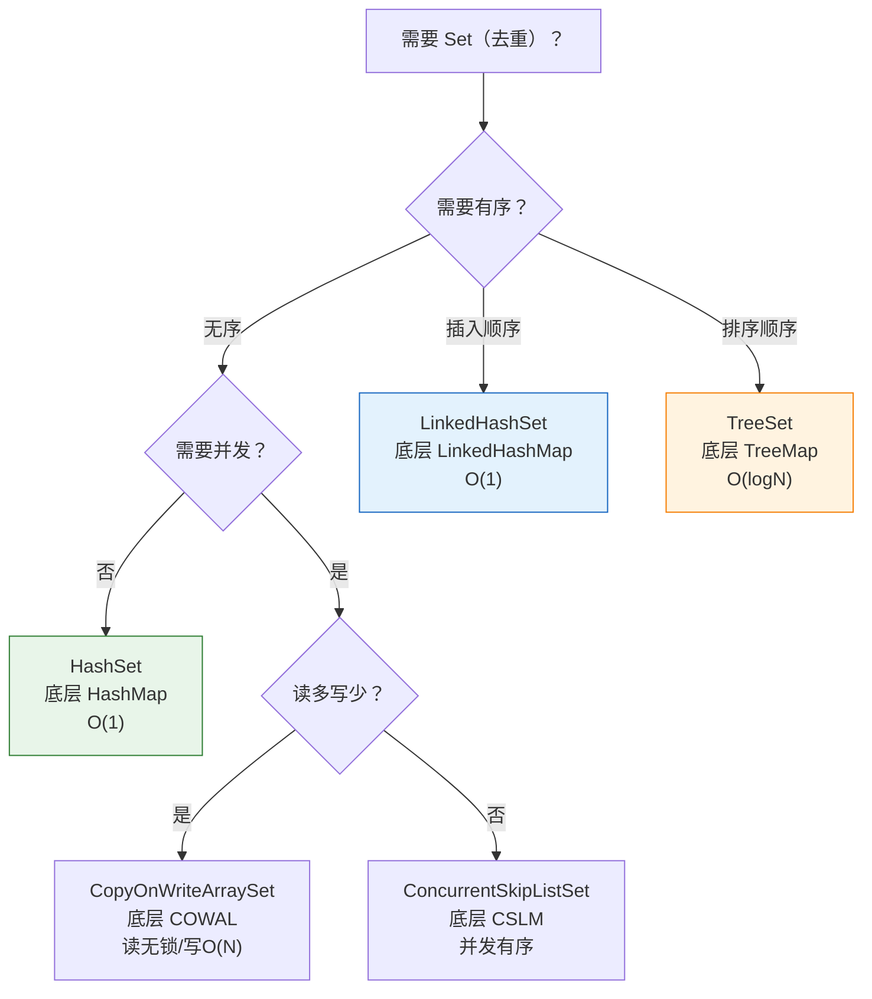

# 一、Set 的"盗窃"——把 Map 的 key-set 包装成独立的数据结构

如果你已经实现了一个功能完备的 `HashMap`，如何用最少的代码实现一个 `HashSet`？

Java 的回答是：**不要重新实现。让 HashSet 内部持有一个 HashMap，只用其 key，value 塞一个统一的占位符。**

```java
public class HashSet<E> extends AbstractSet<E> {
    private transient HashMap<E,Object> map;
    private static final Object PRESENT = new Object();  // 全局唯一的假 value
    
    public boolean add(E e)      { return map.put(e, PRESENT) == null; }
    public boolean remove(Object o) { return map.remove(o) == PRESENT; }
    public boolean contains(Object o) { return map.containsKey(o); }
    public int size()            { return map.size(); }
    public Iterator<E> iterator() { return map.keySet().iterator(); }
    public void clear()          { map.clear(); }
}
```

全量源码：**核心 API 全部委托给 HashMap**，HashSet 自身没有任何存储逻辑。

---

# 二、PRESENT——一个全局唯一的占位符

```java
private static final Object PRESENT = new Object();
```

这只**一个** `Object` 实例，被所有 `HashSet` 的所有条目共享。当 `add("hello")` 被调用时，内部执行的是：

```java
map.put("hello", PRESENT)
//           ↑ value 永远是同一个 PRESENT 对象
// 不占用额外内存——所有的 key 共享同一个 value 引用
```

**为什么不用 null？**

如果用 `null` 作 value，`map.put(key, null)` 在 HashMap 中是完全合法的（返回 null 表示之前没有这个 key 的映射）。但这样一来 `map.containsKey(key)` 和 `map.get(key) == null` 的区分就模糊了——用 `PRESENT` 能精确区分"这个 key 不在 Set 中"和"Set 的工作机制"。

---

# 三、LinkedHashSet——一行代码的威力

```java
public class LinkedHashSet<E> extends HashSet<E> {
    public LinkedHashSet() {
        super(new LinkedHashMap<>());  // ← 就这一行！
    }
    // 所有其他方法都继承自 HashSet，不需要重写
}
```

`HashSet` 提供了一个**包级私有的构造函数**，接收 `LinkedHashMap` 作为底层 Map：

```java
// HashSet 的包级私有构造函数
HashSet(Map<E,Object> map) {
    this.map = map;  // 可以传入 LinkedHashMap
}
```

这体现了面向对象设计中最优雅的模式之一：**子类只改变构造函数中的依赖，其他行为完全继承**。

---

# 四、TreeSet——同样的配方，不同的底料

```java
public class TreeSet<E> extends AbstractSet<E> implements NavigableSet<E> {
    private transient NavigableMap<E,Object> m;  // 实际是 TreeMap
    
    TreeSet(NavigableMap<E,Object> m) {
        this.m = m;
    }
    
    public boolean add(E e)        { return m.put(e, PRESENT) == null; }
    public boolean remove(Object o) { return m.remove(o) == PRESENT; }
    public boolean contains(Object o) { return m.containsKey(o); }
    
    // 额外的 NavigableSet 方法——全部委托给 NavigableMap
    public E first()               { return m.firstKey(); }
    public E last()                { return m.lastKey(); }
    public NavigableSet<E> headSet(E to) { return new TreeSet<>(m.headMap(to)); }
    // ...
}
```

**和 HashSet 完全一样的模式**——底层 Map 从 `HashMap` 变成 `TreeMap`，Set 从 `HashSet` 变成 `TreeSet`。

---

# 五、Set 全家福——一张图选型



| Set 实现 | 底层 | 去重依据 | 有序性 | 线程安全 | 基本操作 |
|---------|------|---------|--------|---------|---------|
| **HashSet** | HashMap | `hashCode()` + `equals()` | 无 | 否 | O(1) |
| **LinkedHashSet** | LinkedHashMap | `hashCode()` + `equals()` | 插入顺序 | 否 | O(1) |
| **TreeSet** | TreeMap | `compareTo()` 或 Comparator | 排序顺序 | 否 | O(logN) |
| **CopyOnWriteArraySet** | CopyOnWriteArrayList | `equals()` | 插入顺序 | 是 | 读 O(1)，写 O(N) |
| **ConcurrentSkipListSet** | ConcurrentSkipListMap | `compareTo()` | 排序顺序 | 是 | O(logN) |
| **EnumSet** | 位向量（bit vector） | enum 的 ordinal | 自然顺序 | 否 | O(1) |

---

# 六、包装模式的工程智慧

**Set = Map 的包装** 这种设计体现了两个重要原则：

1. **DRY（Don't Repeat Yourself）**：HashMap 和 HashSet 共享同一套哈希算法、扩容策略、树化逻辑。不需要在 HashSet 里重新实现一遍。

2. **单一职责**：HashMap 负责"key-value 映射的存储"，HashSet 负责"去重的语义"。前者是通用能力，后者是一个特殊视角。

这个设计的代价是每个 Set 元素多存储了一个 `PRESENT` 引用（4/8 字节）。对于一个 100 万元素的 HashSet，这额外的 4MB/8MB 是所有 Set 元素共享同一个 `PRESENT` 对象的引用——每个桶槽位多一个指针，而不是每个元素多一个对象。

---

# 七、总结

| 事实 | 含义 |
|------|------|
| **HashSet = 包装 HashMap** | `add(e) = map.put(e, PRESENT)` |
| **TreeSet = 包装 TreeMap** | 同样的模式，不同的底层 |
| **PRESENT 是单例** | 所有条目共享同一个占位符对象 |
| **LinkedHashSet = HashSet + LinkedHashMap** | 一行构造函数体现模板方法模式 |
| **Set 选型 = Map 选型** | 你需要什么特性的 Map，就选对应的 Set |
