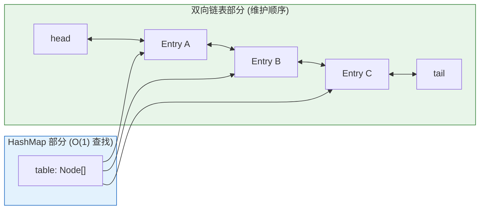
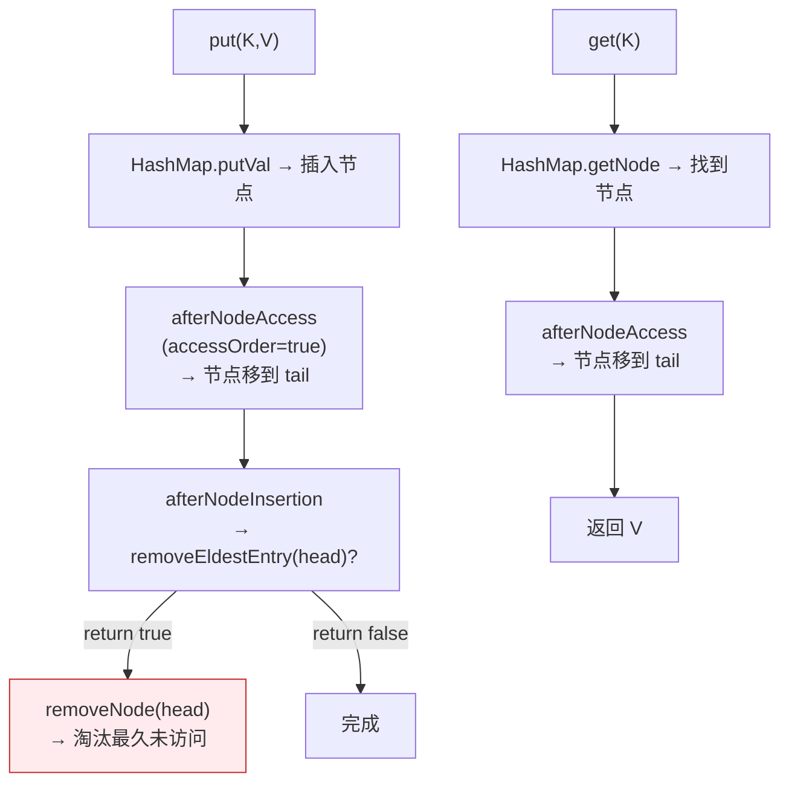

# 一、"面试官：用 10 行代码实现 LRU"

这是 Java 面试中最经典的"你知道但你可能不知道为什么"的问题。

```java
public class LRUCache<K, V> extends LinkedHashMap<K, V> {
    private final int capacity;
    
    public LRUCache(int capacity) {
        super(capacity, 0.75f, true);  // ← 关键：accessOrder = true
        this.capacity = capacity;
    }
    
    @Override
    protected boolean removeEldestEntry(Map.Entry<K, V> eldest) {
        return size() > capacity;       // ← 关键：自动淘汰最久未访问的
    }
}
// 就这 10 行。
LRUCache<String, String> cache = new LRUCache<>(3);
cache.put("a", "1"); cache.put("b", "2"); cache.put("c", "3");
cache.get("a");                        // a 被访问 → 移到链表尾
cache.put("d", "4");                   // 超过容量 → 淘汰 b（最久未访问）
// 结果: {c=3, a=1, d=4}
```

但这个故事的全貌远比 10 行代码复杂——它涉及 HashMap 的模板方法模式、双向链表的访问排序、以及在并发场景下的致命缺陷。本文展开全部细节。阅读前提：[HashMap 核心原理](/posts/java集合/hashmap-核心原理哈希冲突红黑树化与扩容机制/)。

---

# 二、数据结构——HashMap 的每个节点多两个指针

```java
public class LinkedHashMap<K,V> extends HashMap<K,V> {
    // 双向链表——维护顺序的骨架
    transient LinkedHashMap.Entry<K,V> head;  // 最老的节点（head 端）
    transient LinkedHashMap.Entry<K,V> tail;  // 最新的节点（tail 端）
    
    final boolean accessOrder;  
    // false（默认）→ 按插入顺序（insertion-ordered）
    // true        → 按访问顺序（access-ordered）：get/put 后节点移到末尾
    
    // LinkedHashMap 的 Entry 只是 HashMap.Node 多了前后指针
    static class Entry<K,V> extends HashMap.Node<K,V> {
        Entry<K,V> before, after;  // 双向链表的前后指针
    }
}
```



**两个数据结构各司其职**：
- **HashMap 部分**：负责 O(1) 的 `get/put`（通过 `table` 数组）
- **双向链表部分**：负责 O(1) 的顺序维护（通过 `before/after` 指针）

---

# 三、accessOrder 的核心机制——模板方法模式

## 3.1 HashMap 的"钩子"

LinkedHashMap 的秘密在于它继承了 HashMap，并重写了 HashMap 预留的三个**空方法**：

```java
// HashMap 中预留的模板方法（默认都是空方法）
// LinkedHashMap 重写它们，在关键操作后插入自己的逻辑

void afterNodeAccess(Node<K,V> p) { }  // 节点被访问后调用
void afterNodeInsertion(boolean evict) { }  // 节点插入后调用
void afterNodeRemoval(Node<K,V> p) { }  // 节点删除后调用
```

这是**模板方法模式**的经典应用：HashMap 在 `putVal`、`getNode` 等核心方法中调用这些钩子，LinkedHashMap 通过重写这些钩子来维护双向链表。

## 3.2 afterNodeAccess——让"最近访问"移到末尾

```java
// LinkedHashMap.afterNodeAccess —— 当 accessOrder=true 时
void afterNodeAccess(Node<K,V> e) {
    LinkedHashMap.Entry<K,V> last;
    if (accessOrder && (last = tail) != e) {
        // 从链表当前位置移除 e
        LinkedHashMap.Entry<K,V> p = (LinkedHashMap.Entry<K,V>) e;
        LinkedHashMap.Entry<K,V> b = p.before, a = p.after;
        p.after = null;
        if (b == null) head = a;
        else b.after = a;
        if (a != null) a.before = b;
        else last = b;
        
        // 将 e 加到 tail 后面（成为新的 tail）
        if (last == null) head = p;
        else { last.after = p; p.before = last; }
        tail = p;
    }
}
```

**效果**：
- `accessOrder=false`：`get("a")` 后链表不变 → 仍然按插入顺序遍历
- `accessOrder=true`：`get("a")` 后 a 移到 tail → a 成为"最新访问"的节点

```java
LinkedHashMap<String, Integer> map = new LinkedHashMap<>(16, 0.75f, true);
map.put("a", 1); map.put("b", 2); map.put("c", 3);
// 链表: head → a → b → c → tail

map.get("a");  // a 被访问 → afterNodeAccess → a 移到 tail
// 链表: head → b → c → a → tail   ← a 在最后！

map.put("d", 4);
// 链表: head → b → c → a → d → tail
// b 是最久未访问的（head 端 = 最早）
```

## 3.3 afterNodeInsertion——自动淘汰的触发点

```java
// LinkedHashMap.afterNodeInsertion —— 每次 put 都调用
void afterNodeInsertion(boolean evict) {
    LinkedHashMap.Entry<K,V> first;
    if (evict && (first = head) != null && removeEldestEntry(first)) {
        K key = first.key;
        removeNode(hash(key), key, null, false, true);  // 移除 head
    }
}

// 子类重写这个方法决定是否淘汰
protected boolean removeEldestEntry(Map.Entry<K,V> eldest) {
    return false;  // 默认不淘汰
}
```

**完整的 LRU 流程**：



---

# 四、10 行 LRU 的生产级缺陷

## 4.1 缺陷 1：没有过期时间

真正的缓存需要"访问时间"和"过期时间"两个维度：

```java
// 场景：缓存 100 条数据，5 分钟过期
// 但 LinkedHashMap 的 LRU 只是"容量满淘汰最久未访问"
// 某条数据 10 分钟前写入，即使它一直在 head 等待被淘汰
// 但它还没被淘汰时，get 到它就是过期数据

// → 需要自己组合 entry 的写入时间戳 + 在 get 时检查过期
class TimedEntry<V> {
    V value;
    long expireAt;
}
```

## 4.2 缺陷 2：不是线程安全的

在并发环境下，`LinkedHashMap` 的 LRU 不仅数据不安全——链表指针都可能被损坏：

```java
// T1: put → afterNodeAccess → 移动节点到 tail → 修改 before/after 指针
// T2: get → afterNodeAccess → 也在修改 before/after 指针
// → 指针竞态 → 链表断裂 → 遍历时 NPE 或死循环
```

**解决方案**：用 `Collections.synchronizedMap(new LinkedHashMap(...))` 包装，或使用第三方 LRU 缓存库（Caffeine、Guava Cache）。

## 4.3 缺陷 3：removeEldestEntry 在每次 put 时检查

```java
// 每次 put 都调用 removeEldestEntry，且只检查 size > capacity
// 这意味着如果一次 put 100 条数据（putAll），它只在每次 put 后检查
// 且一次只移除 head 一个节点
// → 如果 putAll 前几乎满，putAll 过程中 size 可能远超 capacity
```

## 4.4 生产环境该用什么？

| 方案 | 场景 |
|------|------|
| **Caffeine** | 现代 Java 应用首选——W-TinyLFU 淘汰策略、过期支持、Spring Boot 默认缓存 |
| **Guava Cache** | 传统项目、与 Guava 生态集成 |
| **LinkedHashMap** | **仅适合单线程、简单 LRU、学习原型** |
| **Ehcache / Redis** | 分布式缓存 |

```java
// Caffeine —— 生产级替代方案
Cache<String, String> cache = Caffeine.newBuilder()
    .maximumSize(1000)
    .expireAfterWrite(5, TimeUnit.MINUTES)
    .recordStats()
    .build();

cache.put("key", "value");
cache.getIfPresent("key");
```

---

# 五、LinkedHashSet——顺便理解了

```java
// LinkedHashSet 继承 HashSet，内部使用 LinkedHashMap
// 所以它是"保持插入顺序的 Set"
public class LinkedHashSet<E> extends HashSet<E> {
    public LinkedHashSet() {
        super(new LinkedHashMap<>());  // ← 就这一行不同
    }
}
```

`HashSet` 用 `HashMap`（无序），`LinkedHashSet` 用 `LinkedHashMap`（插入顺序）。两者代码几乎一样，只差底层 Map 的实现。

> 这体现了 HashSet "包装 HashMap" 的设计模式的威力——见 [HashSet/TreeSet 解析](/posts/java集合/hashsettreeset基于-hashmaptreemap-的包装设计/)。

---

# 六、总结

| 机制 | 核心要点 |
|------|---------|
| **数据结构** | HashMap.Node + before/after 指针 = 双向链表 |
| **插入顺序** | `accessOrder=false`（默认）——链表反映 put 顺序 |
| **访问顺序** | `accessOrder=true`——`afterNodeAccess` 将节点移到 tail |
| **LRU 淘汰** | `removeEldestEntry(eldest)` + `afterNodeInsertion` 自动调用 |
| **时间复杂度** | 所有操作 O(1)（HashMap + 双向链表各 O(1)） |
| **模板方法** | HashMap 的 `afterNodeAccess/Insertion/Removal` 钩子 |
| **生产使用** | Caffeine > Guava Cache > Collections.synchronizedMap(LinkedHashMap) |

LinkedHashMap 是 Java 集合框架中"模板方法模式"的最佳教学案例。HashMap 作为父类预留了 `afterNodeXxx` 三个空方法，LinkedHashMap 通过重写它们，在不修改 HashMap 一行代码的情况下，为其增加了有序性——这是面向对象设计中"对扩展开放，对修改关闭"的完美示范。
