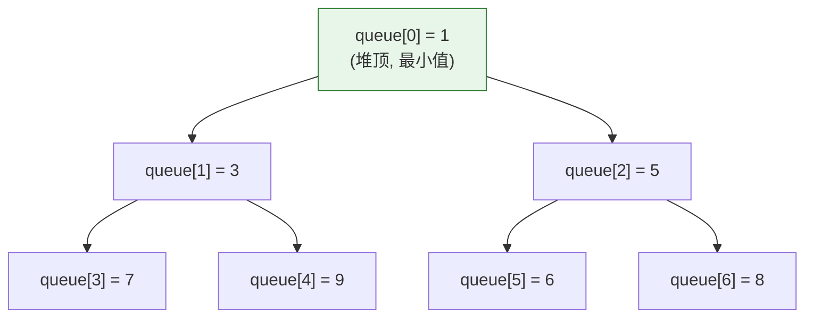

# 一、为什么 TopK 用堆而不是排序？

**场景**：从 10 亿条日志中找出访问量最高的 100 个 IP。

```
方案 A: 全量排序 → O(NlogN) = 10亿 × log(10亿) ≈ 30G 内存，不可行
方案 B: 堆维护 Top 100 → O(NlogK) = 10亿 × log(100) ≈ 只需要 100 个元素的堆
```

PriorityQueue 就是 Java 中实现这个"堆"的标准工具。它的本质是一个**用数组实现的二叉堆**——不是链表，不是树，就是一个 `Object[]` 数组。

---

# 二、二叉堆的数组表示——父子索引公式

## 2.1 为什么用数组而不是树？

二叉堆是一个**完全二叉树**。完全二叉树有一个重要性质：可以用数组紧凑存储，不需要 left/right 指针。

```java
// PriorityQueue 内部就是一个 Object[] 数组
transient Object[] queue;
int size;

// 节点 i 的索引公式：
// 左孩子: 2*i + 1
// 右孩子: 2*i + 2
// 父节点: (i - 1) / 2
// 最后一个非叶子节点: (size >>> 1) - 1
```



**默认是小顶堆**（小的在上面），可以通过自定义 Comparator 变成大顶堆。

## 2.2 用数组的优势

| | 数组存储（二叉堆） | 树节点存储（红黑树） |
|------|------------------|-------------------|
| **内存** | 紧凑，无指针开销 | 每个节点 3 个引用（left/right/parent） |
| **缓存** | 连续内存，CPU Cache 友好 | 分散节点，Cache Miss 多 |
| **访问子/父** | 位运算（`2*i+1`，`(i-1)/2`） | 指针跳转 |
| **维护堆序** | siftUp/siftDown | 旋转 + 变色 |

这就是为什么 PriorityQueue 通常比 TreeSet 更快——不是因为算法更好，而是内存布局对 CPU 更友好。

---

# 三、offer——siftUp 上浮，新元素找到自己的位置

```java
public boolean offer(E e) {
    int i = size;
    if (i >= queue.length) grow(i + 1);  // 扩容（类似 ArrayList）
    size = i + 1;
    if (i == 0) queue[0] = e;
    else siftUp(i, e);  // 从位置 i（堆底）开始上浮
    return true;
}

private void siftUpComparable(int k, E x) {
    Comparable<? super E> key = (Comparable<? super E>) x;
    while (k > 0) {
        int parent = (k - 1) >>> 1;        // 父节点索引
        Object e = queue[parent];
        if (key.compareTo((E) e) >= 0) break;  // x >= 父 → 满足小顶堆 → 停止
        queue[k] = e;                      // 父下沉到 k
        k = parent;                        // k 上升到父位置
    }
    queue[k] = key;                        // x 归位
}
```

**上浮过程图解**：

```
插入 2 到小顶堆:
        1                   1                  1
      /   \               /   \              /   \
     3     5    →       3     5    →       2     5
    / \   / \          / \   / \          / \   / \
   7   9 6   8        7   9 6   8        7   9 6   8
  /                  / \                / \
 X(2)               7   X(2)          3   X(2)
                      (X 和 7 换)     (X 和 3 换 → 满足堆序)

只比较和交换 logN 次（= 树的高度）
```

---

# 四、poll——siftDown 下沉，堆顶出队后重新平衡

```java
public E poll() {
    E result = (E) queue[0];       // ① 堆顶出队
    E x = (E) queue[--size];       // ② 最后一个元素提到堆顶
    queue[size] = null;            //    (避免内存泄漏)
    if (size != 0) siftDown(0, x); // ③ 从堆顶开始下沉
    return result;
}

private void siftDownComparable(int k, E x) {
    int half = size >>> 1;         // 非叶子节点的数量
    while (k < half) {             // 只在非叶子节点下沉
        int child = (k << 1) + 1;       // 左孩子
        Object c = queue[child];
        int right = child + 1;
        // 在左右孩子中选择更小的那个（小顶堆 → 和小的换）
        if (right < size && ((Comparable)c).compareTo(queue[right]) > 0)
            c = queue[child = right];
        if (key.compareTo((E) c) <= 0) break;  // x ≤ 最小孩子 → 满足堆序 → 停止
        queue[k] = c;                         // 孩子上浮
        k = child;
    }
    queue[k] = key;                           // x 归位
}
```

**关键设计**：`k < half` 确保只对非叶子节点做下沉。叶子节点没有孩子可以比较，直接 `queue[k] = key`。

---

# 五、heapify——O(N) 建堆为什么不是 O(NlogN)？

很多人以为建堆是"先放 N 个元素，每个元素 siftUp"——这是 O(NlogN)。但 `PriorityQueue` 的构造函数批量建堆用的是 O(N) 算法：

```java
// PriorityQueue(Collection c) → 批量建堆
private void heapify() {
    for (int i = (size >>> 1) - 1; i >= 0; i--)
        siftDown(i, (E) queue[i]);  // 从最后一个非叶子节点开始向下调整
}
```

**为什么是 O(N)？** 数学证明：

```
每层的节点数 × 每层可能的下沉次数：

堆底——第 0 层（叶子层）：N/2 个节点 × 下沉 0 次 = 0
第 1 层（叶子上一层）：N/4 个节点 × 下沉最多 1 次 = N/4
第 2 层：N/8 个节点 × 下沉最多 2 次 = 2N/8 = N/4
第 h 层：N/2^(h+1) 个节点 × 下沉最多 h 次 = hN/2^(h+1)

总操作次数 ≈ Σ(hN/2^(h+1)) = N × Σ(h/2^(h+1)) = N × 1 = O(N)
```

直观理解：叶子节点占总数一半，完全不需要下沉；叶子上一层占 1/4，至多下沉 1 次……越靠近根节点，节点越少，下沉次数越多，但乘积是常数级。

**siftUp 建堆为什么是 O(NlogN)？** 因为叶子节点占总数一半，每个叶子需要上浮 logN 次 → N/2 × logN = O(NlogN)。

---

# 六、工程应用——三个经典场景

## 6.1 TopK：用小顶堆维护最大的 K 个数

```java
int[] nums = {3, 1, 5, 8, 2, 7, 6, 4, 10, 9};
int k = 3;

PriorityQueue<Integer> heap = new PriorityQueue<>();  // 小顶堆
for (int num : nums) {
    heap.offer(num);
    if (heap.size() > k) heap.poll();  // 超过 K 就弹出最小的
}
// 堆里剩下的是最大的 K 个: [8, 10, 9]
// 时间复杂度: O(NlogK) vs 全排序 O(NlogN)
```

## 6.2 定时任务调度：堆顶是最早到期的任务

```java
// ScheduledThreadPoolExecutor 内部用 PriorityQueue 管理定时任务
// DelayedWorkQueue 是一个基于堆的阻塞队列
// 堆顶 = 最早到期的任务
// schedule 时 offer（上浮），execute 时 poll（下沉）

// 简化示例
PriorityQueue<ScheduledTask> taskQueue = new PriorityQueue<>(
    Comparator.comparingLong(ScheduledTask::getTriggerTime)
);
taskQueue.offer(new ScheduledTask("clean", now + 5000));
taskQueue.offer(new ScheduledTask("backup", now + 10000));
taskQueue.offer(new ScheduledTask("alert", now + 2000));

// taskQueue.peek() → alert（最早触发）
```

## 6.3 Dijkstra 最短路：每次取当前距离最小的节点

```java
// 图: 节点 0 → 1(4), 0 → 2(1), 1 → 3(1), 2 → 1(2), 2 → 3(5)
PriorityQueue<int[]> pq = new PriorityQueue<>(Comparator.comparingInt(a -> a[1]));
// int[] = [node, distance]
pq.offer(new int[]{0, 0});

while (!pq.isEmpty()) {
    int[] cur = pq.poll();
    int node = cur[0], dist = cur[1];
    // ... 松弛操作
}
```

---

# 七、PriorityQueue vs TreeSet——什么时候用哪个？

| | PriorityQueue | TreeSet |
|------|-------------|---------|
| **允许重复** | ✅ | ❌（Set 去重） |
| **删除任意元素** | O(N)（`remove(Object)`） | O(logN) |
| **遍历顺序** | 无保证（堆序 ≠ 全序） | 有序（中序遍历） |
| **内存** | 更小（数组，无指针） | 更大（红黑树节点，有指针） |
| **适用场景** | 优先级调度、TopK、Dijkstra | 需要有序遍历、范围查询 |

---

# 八、总结

| 操作 | 方法 | 复杂度 | 机制 |
|------|------|--------|------|
| **入队** | `offer` | O(logN) | siftUp 上浮 |
| **出队** | `poll` | O(logN) | siftDown 下沉 |
| **查看堆顶** | `peek` | O(1) | `queue[0]` |
| **任意删除** | `remove(Object)` | O(N) | 查找 O(N) + siftDown O(logN) |
| **建堆（逐个）** | N 次 offer | O(NlogN) | 每个元素上浮 |
| **建堆（批量）** | `heapify()` | **O(N)** | 从最后一个非叶子向前下沉 |

PriorityQueue 是"用最简单的数据结构（数组）实现最高频的算法需求（优先级队列）"的典范。它的核心技巧只有两个：**siftUp 让新元素归位，siftDown 让堆顶重新平衡**。理解这两个操作，你就理解了所有基于堆的数据结构。
