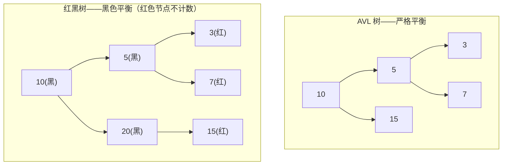
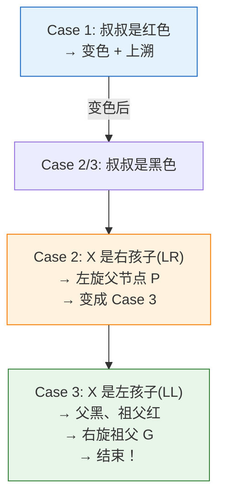
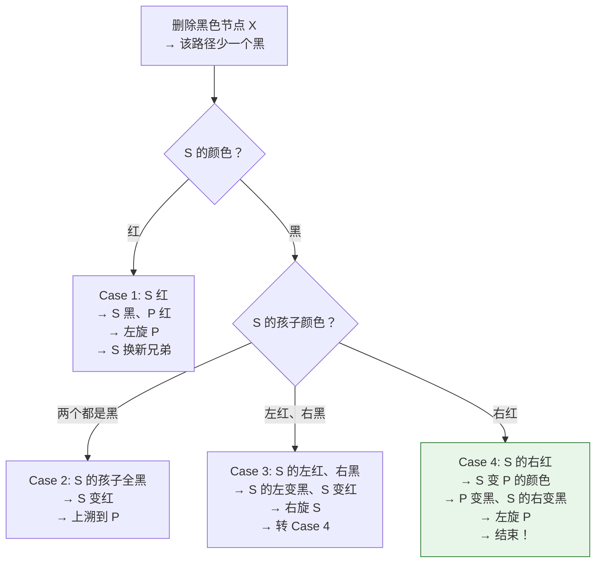

# 一、为什么不用 AVL 树？

这是一个经典面试题。答案不是"红黑树更快"那么简单。

## 1.1 红黑树 vs AVL 的对比

AVL 树是严格的平衡树：任何节点的左右子树高度差 ≤ 1。红黑树只满足"黑色平衡"——从根到叶子的任意路径包含相同数目的黑色节点。



| 特性 | AVL 树 | 红黑树 |
|------|--------|--------|
| **查找性能** | 稍快（更严格平衡，树更矮） | 稍慢（可能多一层） |
| **插入旋转次数** | 最多 **O(logN)** 次（需要一直回溯到根） | 最多 **3 次**（Case 3 后立即终止） |
| **删除旋转次数** | 最多 O(logN) 次 | 最多 **3 次** |
| **适合场景** | **查找密集型**（写少读多） | **写密集型**（读写均衡或写多） |

**Java 为什么选红黑树？**

TreeMap 是一个通用的有序 Map，插入和删除操作占比不低。红黑树用"稍慢一点的查找"换取"大幅减少的旋转次数"——对于 `put` 和 `remove` 都频繁的场景，这个权衡是合理的。

## 1.2 红黑树的五条性质

| # | 规则 | 设计意图 |
|---|------|---------|
| 1 | 节点是红色或黑色 | — |
| 2 | 根节点是黑色 | 简化（根没有父节点，不能为红） |
| 3 | 叶子（NIL）是黑色 | 统一边界处理 |
| 4 | 红色节点的子节点都是黑色（**不能连续红**） | 限制"不平衡"的程度：最多隔一层才不平衡 |
| 5 | 任一节点到叶子的黑色节点数相等（**黑色平衡**） | 保证最长路径 ≤ 2× 最短路径 |

性质 5 是关键：红节点只影响局部，黑节点保证全局平衡。这意味着最坏情况（全黑路径 vs 红黑交替路径），最长路径不超过最短路径的 2 倍——O(logN) 的保证还在。

---

# 二、插入修复——三种 Case，最多 3 次旋转

## 2.1 插入规则

新节点默认插入为**红色**。为什么不是黑色？因为插入黑色节点必然破坏性质 5（增加了一条路径的黑色节点数），而插入红色节点可能破坏性质 4（连续红）但也可能完全不影响（父节点是黑色）。

## 2.2 三种 Case 图解

修复逻辑围绕**叔叔节点**的颜色展开。假设新节点 X 的父节点 P 是祖父 G 的左孩子（P 是 G 的右孩子则对称）：



**Case 1：叔叔是红色 — 变色上溯**

```
修复前:                    修复后:
    G(黑)                     G(红)  ← G 变红
   /    \                    /    \
 P(红)  U(红)             P(黑)  U(黑)  ← P 和 U 变黑
 /                        /
X(红)                   X(红)           ← X 保持红，指针上移到 G

→ 然后把 G 当作新的 X，继续向上修复
```

**为什么变色就能解决？**

P 和 U 都变黑 → G 的两条路径各增加了一个黑节点 → 性质 5 保持。G 变红 → 性质 4 可能被破坏（G 的父节点也可能是红的）→ 把 G 当作新的 X 继续检查。

**Case 2：叔叔黑色 + X 是右孩子（LR 型）— 左旋变一字型**

```
修复前:                    左旋 P 后:
    G(黑)                     G(黑)
   /    \                    /    \
 P(红)  U(黑)             X(红)  U(黑)
   \                       /
   X(红)                 P(红)    ← P 成为 X 的左孩子

→ 转换为 Case 3（一字型 LL），X 和 P 角色互换
```

**Case 3：叔叔黑色 + X 是左孩子（LL 型）— 变色 + 右旋，结束！**

```
修复前:                    修复后:
    G(黑)                     P(黑)     ← P 变黑
   /    \                    /    \
 P(红)  U(黑)             X(红)  G(红)  ← G 变红
 /                                /  \
X(红)                         ...    U(黑)

→ 右旋 G → 结束！不再上溯
```

**Case 3 为什么可以立即结束？**

右旋后 P 成为新的子树根，P 是黑色 → 性质 2 和性质 4 都满足。G（现在是红的）的两条路径黑色节点数没有变化 → 性质 5 保持。不需要再向上检查。

**关键结论**：插入修复最多 3 次旋转——Case 2 一次左旋 + Case 3 一次右旋 = 最多 2 次。但 Case 1 可能重复（变色后上溯到新的节点可能需要再旋转），但旋转操作本身在 Case 1 中不存在——Case 1 只是变色。所以 **旋转次数上限 = 2 或 3 次**（取决于是否经过 Case 2）。

## 2.3 TreeMap 源码对应

```java
// TreeMap.fixAfterInsertion(x) —— 对应上述 Case 1/2/3
private void fixAfterInsertion(Entry<K,V> x) {
    x.color = RED;  // 新节点始终红色
    
    while (x != null && x != root && x.parent.color == RED) {
        if (parentOf(x) == leftOf(parentOf(parentOf(x)))) {
            // P 是 G 的左孩子
            Entry<K,V> uncle = rightOf(parentOf(parentOf(x)));
            
            if (colorOf(uncle) == RED) {
                // Case 1: 叔叔红色
                setColor(parentOf(x), BLACK);
                setColor(uncle, BLACK);
                setColor(parentOf(parentOf(x)), RED);
                x = parentOf(parentOf(x));  // 上溯
            } else {
                // Case 2/3: 叔叔黑色
                if (x == rightOf(parentOf(x))) {
                    // Case 2: LR 型 → 左旋
                    x = parentOf(x);
                    rotateLeft(x);
                }
                // Case 3: LL 型 → 变色 + 右旋
                setColor(parentOf(x), BLACK);
                setColor(parentOf(parentOf(x)), RED);
                rotateRight(parentOf(parentOf(x)));
            }
        } else {
            // P 是 G 的右孩子 —— 对称处理（左右互换）
            // ...
        }
    }
    root.color = BLACK;  // 性质 2：根永远是黑的
}
```

---

# 三、左旋和右旋——红黑树的原子操作

## 3.1 左旋图解

```java
// 左旋：把右孩子提上来
private void rotateLeft(Entry<K,V> p) {
    Entry<K,V> r = p.right;           // ① 右孩子
    p.right = r.left;                 // ② p 接收 r 的左子树
    if (r.left != null)
        r.left.parent = p;
    r.parent = p.parent;              // ③ r 接替 p 的父指针
    if (p.parent == null)
        root = r;                     // p 是根 → r 成为新根
    else if (p == p.parent.left)
        p.parent.left = r;
    else
        p.parent.right = r;
    r.left = p;                       // ④ p 成为 r 的左孩子
    p.parent = r;
}
```

```
左旋前:          p              左旋后:        r
               /   \                        /   \
              A     r                      p     C
                   / \                    / \
                  B   C                  A   B

旋转只改变了 p, r, B 三个节点的父子关系，其余子树完全不移动。
```

**一次旋转 O(1)**，只改了数个指针。

---

# 四、删除修复——为什么比插入复杂？

## 4.1 删除的前置处理

删除节点 D 时，先找**后继节点**（右子树的最左节点）替换：

```java
// TreeMap.deleteEntry(p)
// 如果 p 有两个子节点 → 找后继 s → s 覆盖 p → 删除 s
// 这样保证真正被删除的节点最多只有一个子节点
```

真正被物理删除的节点 X 最多只有一个非 NIL 子节点。删除后，用 X 的子节点（或 NIL）替换 X。

## 4.2 只有删除黑色节点才会破坏性质

- 删除红色节点：直接删除，不影响黑色平衡（性质 5），不产生连续红（性质 4）
- 删除黑色节点：该路径的黑色节点数减少 1 → 性质 5 被破坏 → 需要修复

修复的核心思想是："借"一个黑色节点给这条路径。

## 4.3 四种主要 Case（简化版）

修复围绕被删除节点的**兄弟节点**展开。设被删除的黑色节点是 X（已被物理移除），X 的兄弟是 S：



**删除修复的核心思想**：

- Case 1-3 是"调整"，把情况逐步转化为 Case 4
- Case 4 是"终结"，一次旋转后黑色平衡恢复，直接结束
- **和插入一样，删除修复最多 3 次旋转**

---

# 五、TreeMap 的工程价值——不只是"有序的 Map"

## 5.1 NavigableMap 接口——范围查询的瑞士军刀

```java
TreeMap<Integer, String> map = new TreeMap<>();
map.put(1, "A"); map.put(3, "C"); map.put(5, "E"); map.put(7, "G");

// 精准定位
map.ceilingKey(4);    // 5 —— ≥4 的最小 key
map.floorKey(4);      // 3 —— ≤4 的最大 key
map.higherKey(4);     // 5 —— >4 的最小 key
map.lowerKey(4);      // 3 —— <4 的最大 key

// 范围视图（惰性计算，不复制数据）
SortedMap<Integer, String> sub = map.subMap(2, 6);  // {3=C, 5=E}
sub.firstKey();       // 3
sub.lastKey();        // 5

// 头尾截取
map.headMap(5);       // {1=A, 3=C}  —— <5 的部分
map.tailMap(5);       // {5=E, 7=G}  —— ≥5 的部分

// 反向遍历
NavigableMap<Integer, String> desc = map.descendingMap();
// {7=G, 5=E, 3=C, 1=A}
```

**这些操作的时间复杂度都是 O(logN)**——因为有红黑树的结构支持。

## 5.2 什么时候用 TreeMap 而不是 HashMap？

| 场景 | 正确选择 |
|------|---------|
| 只需要 `get(key)` / `put(key,value)` | HashMap O(1) — 不需要排序，HashMap 是首选 |
| 需要按 key 顺序遍历 | **TreeMap** — 红黑树中序遍历天然有序 |
| 需要范围查询（≥、≤、区间） | **TreeMap** — NavigableMap 接口 |
| 需要"最近的 N 条"或 TopK | **TreeMap** — firstKey/lastKey + headMap/tailMap |
| 需要 LRU 缓存 | **LinkedHashMap**（见 [LinkedHashMap 文章](/posts/java集合/linkedhashmaplru-缓存的底层实现原理/)） |

---

# 六、总结

| 概念 | 要点 |
|------|------|
| **选红黑树不选 AVL** | 插入删除旋转次数更少（最多 3 次 vs O(logN)） |
| **插入修复** | Case 1 变色上溯 + Case 2 旋转变一字型 + Case 3 变色旋转结束 |
| **删除修复** | 比插入复杂，四种 Case，核心在兄弟节点"借"黑色 |
| **旋转** | O(1) 修改最多 3 个节点的 parent/left/right 指针 |
| **时间复杂度** | 基本操作 O(logN)，范围视图惰性计算 |
| **vs HashMap** | 需要排序/范围查询 → TreeMap；否则 HashMap |
