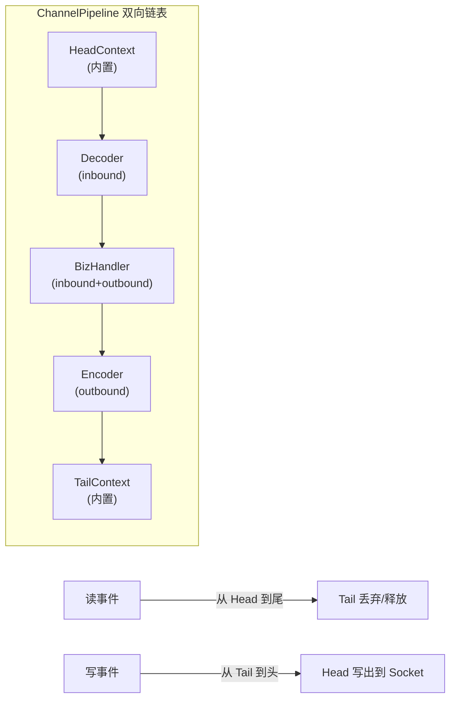

# 为什么你的 Handler 不执行？——Pipeline 的隐藏规则

你往 Pipeline 里加了 5 个 Handler，但业务逻辑只触发了 3 个。你在 `BizHandler` 里调了 `ctx.channel().write(response)`，客户端收到的却是乱码数据。你的解码器没有 `release()`，上线三天后 `OutOfDirectMemoryError` 炸了。

这三个问题指向同一个根因：**不理解 Pipeline 的双向传播机制**。

Netty 的 ChannelPipeline 不是简单的"排队执行"。它是一条**双向链表**，读事件（inbound）和写事件（outbound）沿**相反方向**传播。Head 和 Tail 两个哨兵节点承担着链条的入口和终点职责。`ctx.write()` 和 `ctx.channel().write()` 虽然只有几个字符之差，传播起点完全不同。

本文从源码层面拆解这套双向传播机制，读完你会知道：

- 为什么你的 Handler 被跳过了（`executionMask` 位掩码匹配）
- `ctx.write` vs `ctx.channel().write` 的区别为何是编码错误的头号元凶
- TailContext 如何在你忘记释放 ByteBuf 时兜底

> **跨篇阅读**：Pipeline 是 ByteBuf 引用计数流转的载体（见 [ByteBuf 内存管理](/posts/netty/bytebuf-内存管理引用计数池化与零拷贝/)），Handler 回调在 EventLoop 线程中执行（见 [Reactor 线程模型](/posts/netty/netty-reactor-线程模型bossworker-与-eventloop-机制/)）。三篇一起读，才会建立 Netty 核心机制的完整心智模型。

---

Netty 的 ChannelPipeline 是整个框架的心脏。每个 Channel 拥有独立的 Pipeline 实例，每条连接的所有数据处理都在这条链上流转。它本质上是一个**双向链表**，每个节点是一个 `ChannelHandlerContext`，包装着一个 `ChannelHandler`。



理解 Pipeline 的关键是记住两个方向：**读事件从 Head 向 Tail 走**（找到匹配的 InboundHandler），**写事件从 Tail 向 Head 走**（找到匹配的 OutboundHandler）。本文从源码层面拆解这套双向传播机制。

---

# 一、Pipeline 的双向链表结构

## 1.1 DefaultChannelPipeline 的内部结构

```java
// DefaultChannelPipeline 的核心结构（简化）
public class DefaultChannelPipeline implements ChannelPipeline {
    // 两个哨兵节点，永远在链表两端
    final AbstractChannelHandlerContext head;  // HeadContext
    final AbstractChannelHandlerContext tail;  // TailContext
    
    // 每次 addLast 都在 tail 前面插入
    // Head ↔ H1 ↔ H2 ↔ H3 ↔ Tail
}
```

`ChannelHandlerContext` 本身就是一个链表节点，持有 `prev` 和 `next` 指针：

```java
// AbstractChannelHandlerContext 的双向链表指针
volatile AbstractChannelHandlerContext next;
volatile AbstractChannelHandlerContext prev;
```

**HeadContext 和 TailContext** 是两个特殊的内置节点，用户无法移除。它们承担着链条开端和收尾的关键职责：

| 哨兵节点 | 类型 | 职责 |
|---------|------|------|
| **HeadContext** | inbound + outbound | **读入口**：从 Channel 读数据后触发 `fireChannelRead`；**写终点**：将数据通过底层 Socket 发送出去 |
| **TailContext** | inbound | **读终点**：收到未被消费的消息时，释放引用计数并丢弃；**异常兜底**：如果前面的 Handler 没处理异常，Tail 负责 warn 日志 |

## 1.2 添加和移除 Handler

```java
// 四种添加方式，本质都是在链表上操作 prev/next 指针
pipeline.addLast("decoder", new LengthFieldBasedFrameDecoder(65536, 0, 2));
pipeline.addFirst("idle", new IdleStateHandler(60, 0, 0));
pipeline.addBefore("decoder", "logger", new LoggingHandler());
pipeline.addAfter("decoder", "protobuf", new ProtobufDecoder(...));

// 动态移除
pipeline.remove("logger");
// 替换
pipeline.replace("decoder", "decoder", new UpgradeDecoder());
```

**关键注意**：`addLast` 并不是真的加在 Tail 后面——Tail 永远是最后一个节点。`addLast` 实际是加在 Tail **之前**。同理，`addFirst` 加在 Head **之后**。

## 1.3 ChannelHandler 的三种类型

| 类型 | 接口 | 使用场景 |
|------|------|---------|
| **InboundHandler** | `ChannelInboundHandler` | 解码器、协议转换、业务处理 |
| **OutboundHandler** | `ChannelOutboundHandler` | 编码器、流量整形、写缓冲 |
| **DuplexHandler** | 同时实现两者 | 日志、统计、鉴权（需要拦截入站和出站） |

Netty 提供了三个便捷的 Adapter 基类：

```java
// ChannelInboundHandlerAdapter  —— 只处理 inbound
// ChannelOutboundHandlerAdapter —— 只处理 outbound
// ChannelDuplexHandler         —— 同时处理 inbound 和 outbound
```

**一个 Handler 可以实现多个接口**，比如 `BizHandler` 既读入站消息又写出站响应，就同时实现 `channelRead`（inbound）和 `write`（outbound）。

---

# 二、inbound 事件——从 Head 向 Tail 传播

## 2.1 传播的起点与终点

读事件的完整链路：

```
Socket 有数据到达
  → NioEventLoop.select() 返回就绪 Channel
    → HeadContext.channelRead() 被调用
      → Head 调用 ctx.fireChannelRead(msg) 
        → 找到下一个 InboundHandler → 调用其 channelRead()
          → Handler 处理 → 调用 ctx.fireChannelRead(msg)
            → 继续找下一个 InboundHandler...
              → 最终到达 TailContext.channelRead()
                → 如果消息没被释放，Tail 调用 ReferenceCountUtil.release(msg)
                  → 记录警告：消息到达 Tail 了还没被释放！
```

**HeadContext 的源码核心逻辑：**

```java
// HeadContext 是 I/O 线程和 Pipeline 之间的桥梁
@Override
public void channelRead(ChannelHandlerContext ctx, Object msg) {
    // Head 不处理消息，直接向下传播
    ctx.fireChannelRead(msg);
}

// 不光读事件，所有 inbound 事件都从 Head 出发：
// channelRegistered → channelActive → channelRead → channelReadComplete
// channelInactive → channelUnregistered → exceptionCaught → userEventTriggered
```

**TailContext 的源码核心逻辑：**

```java
@Override
public void channelRead(ChannelHandlerContext ctx, Object msg) {
    onUnhandledInboundMessage(ctx, msg);
}

protected void onUnhandledInboundMessage(ChannelHandlerContext ctx, Object msg) {
    // 如果消息是 ByteBuf，释放它，防止内存泄漏
    boolean freed = ReferenceCountUtil.release(msg);
    if (freed) {
        logger.debug("Discarded inbound message {} that reached at the tail.", msg);
    }
    // 注意：如果消息到达 Tail，说明前面没有任何 Handler 消费了它
    // 这通常意味着你的 Pipeline 配置有问题！
}
```

**重要**：如果 Tail 释放了消息并打出了 DEBUG 日志，说明你的 InboundHandler 链没有正确处理这条消息——要么忘记 `fireChannelRead` 往下传，要么某个 Handler 吞了消息却没释放。

## 2.2 fireChannelRead 的查找机制

```java
// AbstractChannelHandlerContext.findContextInbound() 源码逻辑（简化）
private AbstractChannelHandlerContext findContextInbound(int mask) {
    AbstractChannelHandlerContext ctx = this;
    do {
        ctx = ctx.next;  // 从当前位置向后遍历
    } while ((ctx.executionMask & mask) == 0);  
    // executionMask 是一个位掩码，标记 Handler 对哪些事件感兴趣
    // 跳过不处理 channelRead 的 Handler，只找实现了 channelRead 的
    return ctx;
}
```

关键点：**查找是通过遍历 `next` 指针 + 位掩码匹配完成的**，并非维护了单独的 inbound 索引。位掩码的设计使得一次按位与就能判断 Handler 是否关心某个事件，效率很高。

## 2.3 完整实例

```java
public class LoggingHandler extends ChannelInboundHandlerAdapter {
    @Override
    public void channelRead(ChannelHandlerContext ctx, Object msg) {
        ByteBuf buf = (ByteBuf) msg;
        System.out.println("收到消息，长度=" + buf.readableBytes());
        ctx.fireChannelRead(msg);  // ✅ 必须显式传播，否则后续 Handler 收不到
    }
}

public class BizHandler extends ChannelInboundHandlerAdapter {
    @Override
    public void channelRead(ChannelHandlerContext ctx, Object msg) {
        ByteBuf buf = (ByteBuf) msg;
        // 处理业务逻辑...
        // 这里不需要 fireChannelRead，因为到达业务层后就结束了
        // 如果不传下去，Tail 会负责 release
    }
}
```

**如果忘记调用 `ctx.fireChannelRead(msg)` 会怎样？**
- 后续所有 InboundHandler 都收不到这条消息
- 消息的引用计数不会被正确递减
- 如果是堆外内存的 `ByteBuf`，这段内存永远不会被释放，最终导致 `OutOfDirectMemoryError`

---

# 三、outbound 事件——从 Tail 向 Head 传播

## 3.1 传播的起点与终点

写事件的完整链路与读事件**方向相反**：

```
Handler 调用 ctx.write(msg)
  → 从当前 Handler 开始，向前找下一个 OutboundHandler
    → 调用该 Handler 的 write() 方法
      → Handler 处理（如编码器将对象转为 ByteBuf）
        → 调用 ctx.write(msg) 继续向前传播
          → 最终到达 HeadContext.write()
            → Head 将数据通过底层的 unsafe.write() 写入 Socket 缓冲区
```

**HeadContext 的写终结点：**

```java
// HeadContext 同时是 outbound 传播的终点
@Override
public void write(ChannelHandlerContext ctx, Object msg, ChannelPromise promise) {
    // 最终写入 Socket 的操作
    unsafe.write(msg, promise);
}
```

**TailContext 没有 outbound 处理能力**——如果写事件从 Tail 开始传播（见下文 `ctx.channel().write()`），Tail 会直接跳过自己，向前找第一个 OutboundHandler。

## 3.2 write 事件的查找机制

```java
// AbstractChannelHandlerContext.findContextOutbound() 源码逻辑（简化）
private AbstractChannelHandlerContext findContextOutbound(int mask) {
    AbstractChannelHandlerContext ctx = this;
    do {
        ctx = ctx.prev;  // 从当前位置向前遍历！
    } while ((ctx.executionMask & mask) == 0);
    return ctx;
}
```

与 inbound 查找相反，outbound 沿 `prev` 指针向前遍历，本质上就是**从后往前找处理当前事件的 Handler**。

## 3.3 flush 事件与写缓冲

`write` 和 `flush` 是两个独立的 outbound 事件：

```
ctx.write(msg)   → 数据写入 Netty 内部的 ChannelOutboundBuffer（未真正发送）
ctx.flush()      → 触发 HeadContext.flush() → 调用 Socket 的 write() 系统调用
ctx.writeAndFlush(msg) → 两步合并，先 write 再 flush
```

**为什么需要分离 write 和 flush？**
- **批量化**：连续写多个消息时，每次都 `write(msg)`，最后统一 `flush()`，减少系统调用次数
- **反压（backpressure）**：`ChannelOutboundBuffer` 满了之后会标记 Channel 不可写（`channelWritabilityChanged`），上层可以暂停写操作

---

# 四、ctx.write 与 ctx.channel().write——最容易混淆的区别

这是 Netty 新手最容易犯错的地方。两者的差异在于**传播的起点不同**：

```java
// ctx.write(msg)
// 起点：当前 HandlerContext
// 方向：从当前位置向 Head 传播
// 经过：当前 Handler 前面的 OutboundHandler
//
// ctx.channel().write(msg)
// 起点：TailContext
// 方向：从 Tail 向 Head 重新传播
// 经过：Pipeline 中的所有 OutboundHandler
```

## 4.1 具体推演

Pipeline 配置：`Head → Decoder → BizHandler → Encoder → Tail`

`BizHandler` 在处理完请求后需要返回响应：

```java
// ✅ 正确做法：ctx.write(response)
// 传播路径：BizHandler → Encoder → Head → Socket
// Encoder 将 response 编码为 ByteBuf，Head 发出去

// ❌ 错误做法：ctx.channel().write(response)
// 传播路径：Tail → Encoder → BizHandler(不处理 outbound) → Decoder(不处理 outbound) → Head → Socket
// 问题 1：绕了一圈又回到 BizHandler，但 BizHandler 不处理 outbound，没有副作用
// 问题 2：Encoder 可能已经被调用过，数据被重复编码！
```

**实际的影响场景：**

假设 Encoder 是一个 ProtobufEncoder，它将业务对象 `encode()` 一次变成字节数组。如果使用 `ctx.channel().write(response)` 让写事件从 Tail 重新出发，response **已经过了 BizHandler 前面的 Encoder 编码过一次**，再从 Tail 出发时**又会过 Encoder 一次**——对象被二次编码，对端收到的是乱码数据。

## 4.2 源码层面的区别

```java
// ctx.write 的实现
// AbstractChannelHandlerContext.java
@Override
public ChannelFuture write(Object msg) {
    return write(msg, newPromise());
}

@Override
public ChannelFuture write(final Object msg, final ChannelPromise promise) {
    // 从当前 ctx 开始，向前找下一个 OutboundHandler
    findContextOutbound().invokeWrite(msg, promise);
    return promise;
}

// ctx.channel().write 的实现
// 本质是调 DefaultChannelPipeline 的 write，起点是 Tail
// DefaultChannelPipeline.java
@Override
public ChannelFuture write(Object msg) {
    return tail.write(msg);  // 从 Tail 开始！重新走整个 outbound 链
}
```

**最佳实践：在 Pipeline 中的 Handler 里，永远用 `ctx.write()`，不要用 `ctx.channel().write()`**。

---

# 五、ChannelHandlerContext——连接 Handler 与 Pipeline 的桥梁

## 5.1 Context 是什么？

每个 Handler 在被加入 Pipeline 时，会被包装成一个 `DefaultChannelHandlerContext`。Context 是 Handler 与 Pipeline 之间的粘合剂：

```java
// DefaultChannelHandlerContext 的简化结构
final class DefaultChannelHandlerContext extends AbstractChannelHandlerContext {
    private final ChannelHandler handler;  // 它包装的 Handler
    
    // executor() → 返回绑定的 EventLoop
    // pipeline() → 返回所属的 Pipeline
    // channel()  → 返回所属的 Channel
    // alloc()    → 返回 ByteBufAllocator
}
```

**Context 的核心价值：**
1. **事件传播的载体**——`fireChannelRead`、`write` 等方法通过 Context 查找下一个 Handler
2. **生命周期绑定**——每个 Handler 通过自己的 Context 访问 Channel、EventLoop、ByteBufAllocator
3. **双向链表节点**——`prev` 和 `next` 指针实现 O(1) 的邻居访问

## 5.2 Handler 与 Context 的关系

```java
// 当调用 pipeline.addLast(name, handler) 时
// Netty 内部做的事情：
DefaultChannelHandlerContext newCtx = 
    new DefaultChannelHandlerContext(this, childExecutor, name, handler);
// 然后将 newCtx 插入链表中 tail 之前
newCtx.prev = tail.prev;
newCtx.next = tail;
tail.prev.next = newCtx;
tail.prev = newCtx;
```

**一个 Handler 实例可以被多个 Pipeline 共享吗？** 可以，但必须标注 `@Sharable`：

```java
@ChannelHandler.Sharable
public class SharedLogHandler extends ChannelInboundHandlerAdapter { ... }

// 没有 @Sharable 的 Handler 每次 addLast 都必须是新实例
// 如果尝试添加同一个无 @Sharable 注解的实例，Netty 会抛异常
```

因为每个 Handler 实例被一个 Context 持有，共享一个 Handler 实例意味着多个 Context 指向同一个 Handler 对象——这就要求 Handler 本身是**无状态**的（或者状态由 Context 隔离）。

---

# 六、异常传播——exceptionCaught 链

Pipeline 中的异常也有自己的传播路径。

## 6.1 inbound 中的异常

当 Handler 的 `channelRead()` 中抛出异常时，Netty 捕获异常后调用 `ctx.fireExceptionCaught(cause)`，异常沿 inbound 方向向后传播，直到被某个 Handler 的 `exceptionCaught()` 处理：

```java
// 异常传播路径：
// Handler A 抛异常 → 调用 ctx.fireExceptionCaught(cause)
//   → 沿 next 找到第一个有 exceptionCaught 方法的 Handler → 调用处理
//     → 如果一直没处理 → 最终到达 TailContext.exceptionCaught()
//       → Tail 打 WARN 日志，不吞异常
```

**最佳实践：在 Pipeline 最后加一个全局异常处理器**，避免异常直接传到 Tail：

```java
pipeline.addLast(new ChannelInboundHandlerAdapter() {
    @Override
    public void exceptionCaught(ChannelHandlerContext ctx, Throwable cause) {
        logger.error("Pipeline 未处理的异常", cause);
        ctx.close();  // 发生未知异常时关闭连接
    }
});
```

## 6.2 outbound 中的异常

OutboundHandler 的 `write()` 方法通常通过 `ChannelPromise` 来传递失败：

```java
@Override
public void write(ChannelHandlerContext ctx, Object msg, ChannelPromise promise) {
    try {
        // 处理写入
        ctx.write(msg, promise);
    } catch (Exception e) {
        promise.setFailure(e);  // 标记 Promise 失败，让调用方感知
        // 注意：不要直接 throw，outbound 的异常应该通过 promise 传递
    }
}
```

---

# 七、ChannelHandler 生命周期

| 方法 | 触发时机 | 典型用途 |
|------|---------|---------|
| **`handlerAdded`** | Handler 被加入 Pipeline | 初始化资源（如分配本地缓冲区） |
| **`channelRegistered`** | Channel 注册到 EventLoop | 在 EventLoop 线程中执行准备工作 |
| **`channelActive`** | Channel 激活（TCP 连接建立） | 发送连接建立后的首条消息（如握手） |
| **`channelRead`** | 有数据到达 | 解码、业务处理 |
| **`channelReadComplete`** | 本次读操作完成 | 批量处理完成后刷新写缓冲 |
| **`userEventTriggered`** | 用户自定义事件触发 | 心跳超时、自定义协议事件 |
| **`channelWritabilityChanged`** | Channel 可写状态变化 | 反压控制——暂停/恢复写操作 |
| **`channelInactive`** | Channel 变为非活跃（连接断开） | 清理连接相关资源 |
| **`channelUnregistered`** | Channel 从 EventLoop 注销 | 清理注册相关资源 |
| **`handlerRemoved`** | Handler 从 Pipeline 中移除 | 释放 `handlerAdded` 中分配的资源 |

**重要**：这些方法的调用都在 EventLoop 线程中执行，因此**不需要额外加锁**。这是 Netty 的无锁化设计——每个 Channel 对应一个 EventLoop 线程，所有 Handler 回调都发生在这个线程上。

---

# 八、实际 Pipeline 配置深度解析

> **跨篇阅读**：本节中涉及的 `LengthFieldBasedFrameDecoder` 参数详解见 [TCP 粘包拆包全解](/posts/netty/netty-tcp-粘包拆包全解lengthfieldbasedframedecoder-实战/)，编解码器体系见 [Netty 编解码器体系](/posts/netty/netty-编解码器体系bytetomessagedecoder-与-messagetobyteencoder/)，心跳与重连见 [心跳与断线重连](/posts/netty/netty-心跳与断线重连idlestatehandler-与-channelfuturelistener/)。

## 8.1 典型的 TCP 服务端 Pipeline

```java
ServerBootstrap bootstrap = new ServerBootstrap();
bootstrap.group(bossGroup, workerGroup)
    .channel(NioServerSocketChannel.class)
    .childHandler(new ChannelInitializer<SocketChannel>() {
        @Override
        protected void initChannel(SocketChannel ch) {
            ChannelPipeline p = ch.pipeline();
            
            // 1. 空闲检测（outbound + inbound）
            //    60 秒未收到数据触发 IdleStateEvent
            p.addLast(new IdleStateHandler(60, 0, 0));
            
            // 2. 粘包/拆包处理（inbound）
            //    基于长度字段的帧解码器：前 2 字节声明长度
            p.addLast(new LengthFieldBasedFrameDecoder(65536, 0, 2));
            
            // 3. 协议解码（inbound）
            //    字节 → Protobuf 对象
            p.addLast(new ProtobufDecoder(MyProto.Request.getDefaultInstance()));
            
            // 4. 协议编码（outbound）
            //    Protobuf 对象 → 字节
            p.addLast(new ProtobufEncoder());
            
            // 5. 从帧中提取长度信息并写入前 2 字节（outbound）
            p.addLast(new LengthFieldPrepender(2));
            
            // 6. 心跳处理（inbound）
            p.addLast(new HeartbeatHandler());
            
            // 7. 业务处理（inbound）
            p.addLast(new BizHandler());
            
            // 8. 全局异常兜底（inbound）
            p.addLast(new ChannelInboundHandlerAdapter() {
                @Override
                public void exceptionCaught(ChannelHandlerContext ctx, Throwable cause) {
                    log.error("未处理异常", cause);
                    ctx.close();
                }
            });
        }
    });
```

## 8.2 执行流程推演

```
【收到请求，读方向】
Socket 数据到达
→ HeadContext.channelRead()
  → IdleStateHandler.channelRead()          // 重置读超时计时器
    → LengthFieldBasedFrameDecoder.channelRead()  // 粘包 → 完整帧
      → ProtobufDecoder.channelRead()       // 字节 → Request 对象
        → HeartbeatHandler.channelRead()    // 如果是心跳，直接响应
          → BizHandler.channelRead()        // 处理请求，生成 Response
          
【发送响应，写方向】
BizHandler → ctx.writeAndFlush(response)
  → ProtobufEncoder.write()                 // Response → 字节
    → LengthFieldPrepender.write()          // 在字节前面加 2 字节长度
      → HeadContext.write()                 // 写入 Socket 发送缓冲区
```

---

# 九、性能要点与调试技巧

## 9.1 Pipeline 的线程模型保证

```
一个 Channel → 绑定一个 EventLoop → 绑定一个线程
一个 Channel 的所有 Handler 回调 → 都在这个线程上执行
```

这意味着你在 `channelRead()` 里写的代码是**天然线程安全**的——不需要 `volatile`、不需要 `synchronized`。但反过来也意味着：**不要在 `channelRead()` 里做耗时操作**，否则会阻塞整个 EventLoop，影响绑定到同一个 EventLoop 上的其他 Channel。

耗时操作应该提交到业务线程池：

```java
@Override
public void channelRead(ChannelHandlerContext ctx, Object msg) {
    ByteBuf buf = (ByteBuf) msg;
    buf.retain();  // ⚠️ 必须 retain！否则在异步处理前就可能被释放
    businessExecutor.submit(() -> {
        try {
            process(buf);
        } finally {
            buf.release();
        }
    });
}
```

## 9.2 调试 Pipeline 结构

```java
// 打印当前 Pipeline 的完整结构
ChannelPipeline p = ctx.pipeline();
System.out.println(p);  
// 输出: (HeadContext#0 ↔ IdleStateHandler#1 ↔ BizHandler#2 ↔ TailContext#3)

// 或者遍历打印每个 Handler 的名称和类型
p.forEach(entry -> {
    System.out.println(entry.getKey() + " → " + entry.getValue().getClass().getSimpleName());
});
```

## 9.3 日志诊断 Handler 的传播

```java
// 添加 LoggingHandler 观察数据在 Pipeline 中的流转
pipeline.addFirst(new LoggingHandler(LogLevel.DEBUG));
// 输出类似：
// [id: 0x1234, L:/127.0.0.1:8080 - R:/127.0.0.1:54321] READ: 16B
//   +-------------------------------------------------+
//   |  0  1  2  3  4  5  6  7  8  9  a  b  c  d  e  f |
//   +--------+-------------------------------------------------+----------------+
//   |00000000| 00 0e 08 01 12 09 48 65 6c 6c 6f ... |......Hello     |
//   +--------+-------------------------------------------------+----------------+
// [id: 0x1234, L:/127.0.0.1:8080] WRITE: 10B ...
```

---

# 十、总结

| 概念 | 核心要点 |
|------|---------|
| **Pipeline 结构** | 双向链表，Head ↔ Handler1 ↔ ... ↔ HandlerN ↔ Tail |
| **inbound 传播** | 从 Head 到尾，通过 `ctx.fireChannelRead(msg)` 逐级传递 |
| **outbound 传播** | 从 Tail 到头，通过 `ctx.write(msg)` 逐级传递 |
| **ctx.write vs channel().write** | 前者从当前 Handler 向前传播，后者从 Tail 重新开始——**在 Pipeline 里永远用 ctx.write** |
| **HeadContext** | 读入口（触发 fireChannelRead）+ 写终点（unsafe.write 到 Socket） |
| **TailContext** | 读终点（释放未消费消息）+ 异常兜底（warn 日志） |
| **Context** | Handler 的包装，持有 prev/next 指针，负责任何事件的传播查找 |
| **线程模型** | 一个 Channel 的所有 Handler 回调在同一 EventLoop 线程，天然无锁 |
| **@Sharable** | 无状态的 Handler 可被多个 Pipeline 共享，节省实例数 |
| **耗时操作** | 提交到业务线程池 + 必须先 `retain()` 再异步处理 |
| **异常处理** | inbound 异常沿 next 传播到 exceptionCaught，outbound 异常通过 ChannelPromise 传递 |
