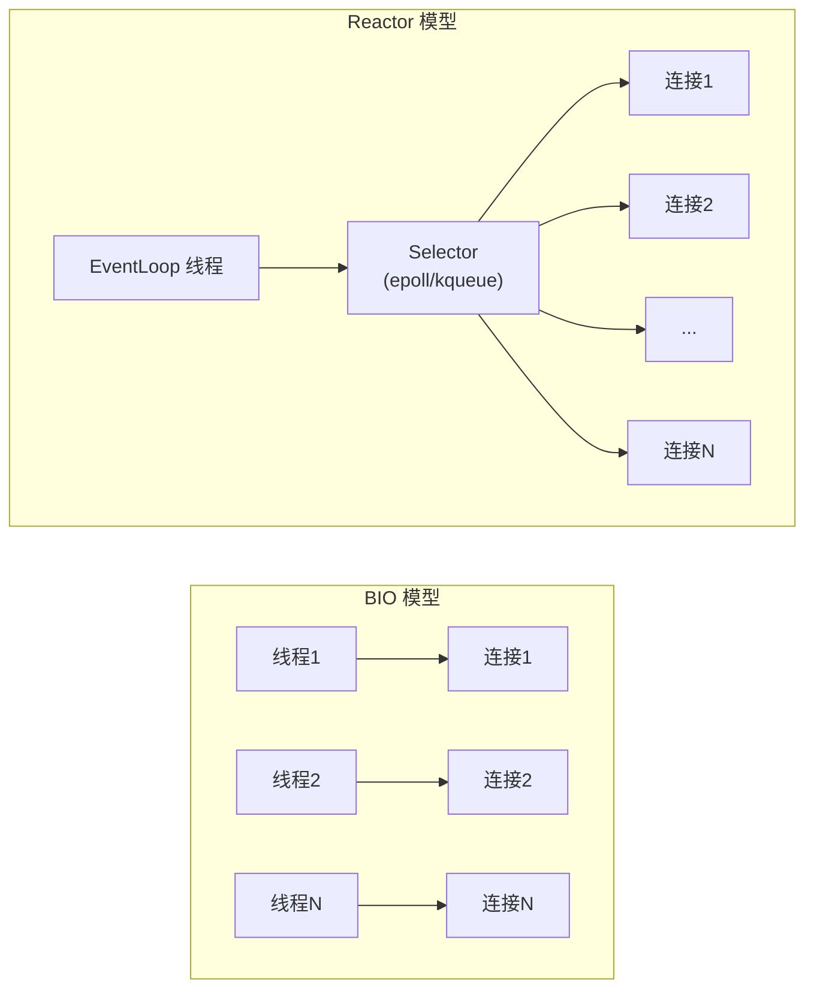
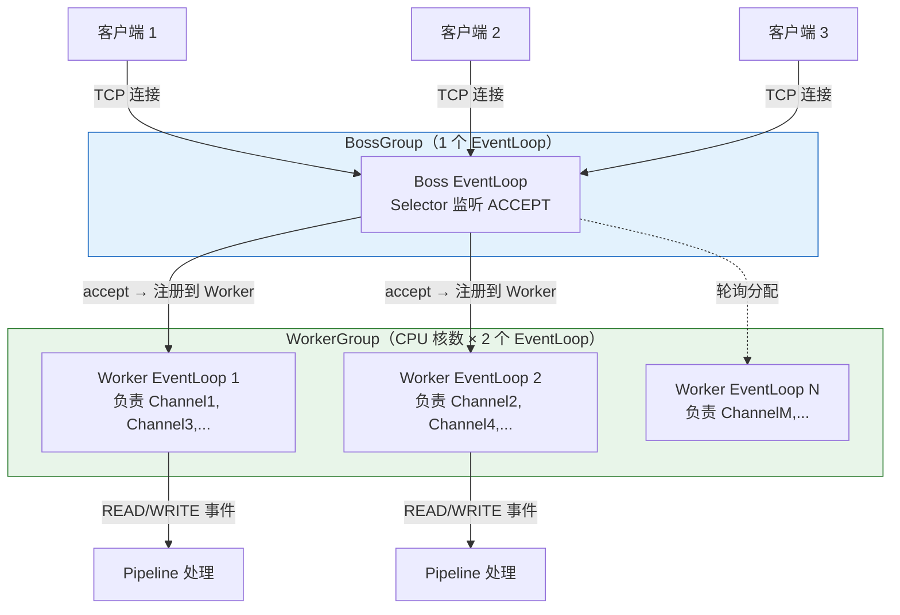

# 一、从 C10K 问题说起——为什么需要 Reactor？

1999 年，Dan Kegel 提出了著名的 **C10K 问题**：当服务器需要同时处理 10,000 个客户端连接时，传统的 "一个连接一个线程"（thread-per-connection）模型彻底崩溃。

## 1.1 传统 BIO 的致命缺陷

```java
// 传统 BIO 服务端——每个连接创建一个线程
ServerSocket serverSocket = new ServerSocket(8080);
while (true) {
    Socket socket = serverSocket.accept();  // 阻塞等待连接
    new Thread(() -> {
        handleConnection(socket);           // 阻塞读写
    }).start();
}
```

**为什么这个模型无法支撑 C10K？**

| 资源 | 10000 连接的开销 | 说明 |
|------|-----------------|------|
| **线程栈内存** | 10000 × 1MB = **10GB** | 每个线程默认 1MB 栈（`-Xss`），仅线程栈就吃光了内存 |
| **CPU 上下文切换** | 每秒数千次 | 线程数远超 CPU 核数，大量时间浪费在切换而非计算 |
| **线程调度延迟** | 数十至数百毫秒 | 线程在就绪队列中等待被调度 |
| **大部分线程在干什么？** | **等待** | 连接建立后大部分时间在 `read()` 上阻塞，线程资源被浪费 |

核心矛盾：**线程数 ≠ 并发度。** 大部分线程在等待 IO，真正需要 CPU 的少数线程反而被抢占了资源。

## 1.2 解决方向：IO 多路复用

Unix 提供了 `select` / `poll` / `epoll` 等系统调用，允许**一个线程同时监控多个连接的 IO 事件**。当一个线程可以管理成千上万个连接时，就不再需要每个连接开一个线程了。



**关键思路**：用一个线程（Reactor 线程）监听所有连接的 IO 事件，哪些连接有数据到达就处理哪些。从"一个线程等一个连接"变成"一个线程调度所有连接"。

---

# 二、Reactor 三种模式演进——Netty 选择了哪一种？

## 2.1 单线程 Reactor

```
┌─────────────────────────────────────┐
│             Reactor 线程            │
│                                     │
│  select() → dispatch() → handle()  │
│       ↓                  ↓         │
│  监听 ACCEPT        处理业务逻辑     │
│  监听 READ             (耗时！)     │
│  监听 WRITE                        │
└─────────────────────────────────────┘
```

所有操作在一个线程中完成：接收连接、读取数据、业务处理、发送响应。**优点**是极简，**致命缺陷**是 Handler 中的业务逻辑会阻塞整个 Reactor——如果某个请求的处理耗时 100ms，其他 9999 个连接全部等待。

这在 Redis 中可行（纯内存操作，微秒级），但在通用业务系统中不可行。

## 2.2 多线程 Reactor

```
┌──────────────────────┐     ┌─────────────────────┐
│    Reactor 线程       │     │    Worker 线程池     │
│                      │     │                     │
│  select() → dispatch │────→│  Thread-1: handle() │
│  (只负责事件分发)     │     │  Thread-2: handle() │
│                      │     │  Thread-N: handle() │
└──────────────────────┘     └─────────────────────┘
```

Reactor 线程只负责 IO 事件的监听和分发，业务处理交给 Worker 线程池。这解决了 Handler 阻塞 Reactor 的问题，但 Reactor 本身仍然是单线程——**在高并发场景下，单个 Reactor 的 `accept` + `read/write` 事件分发成为瓶颈**。

## 2.3 主从多线程 Reactor（Netty 的选择）

这是 Netty 采用的模式，也叫 **"Boss-Worker 模型"**：



**分工**：
- **BossGroup**：只做一件事——`accept()` 接收新连接，然后注册到 WorkerGroup
- **WorkerGroup**：处理已建立连接的所有 IO 事件（READ/WRITE）和 Pipeline 中的业务逻辑

---

# 三、EventLoop——线程 + Selector + 队列的三位一体

## 3.1 EventLoop 是什么？

在 Netty 中，`EventLoop` 不是一个抽象的"循环"，而是一个具体的**对象**，它由一个**线程**和一个**Java NIO Selector** 绑定而成：

```java
// EventLoop = 线程 + Selector + 任务队列
// 一个 NioEventLoop 的简化结构
public final class NioEventLoop extends SingleThreadEventLoop {
    // 每个 EventLoop 独占一个 Selector
    private Selector selector;
    
    // 任务队列：多生产者（其他线程提交任务）→ 单消费者（EventLoop 线程执行）
    private final Queue<Runnable> taskQueue;  // MPSC 队列
    
    // 定时任务队列
    private final Queue<ScheduledFutureTask<?>> scheduledTaskQueue;
    
    // EventLoop 绑定的线程
    private volatile Thread thread;
}
```

## 3.2 为什么一个 Channel 终生绑定一个 EventLoop？

这是 Netty **无锁化设计的基石**：

```
Channel 在注册时被分配到一个 EventLoop
  → 该 Channel 的所有 IO 事件（READ/WRITE/CONNECT）
  → 该 Channel 的所有 Handler 回调（channelRead/write/exceptionCaught）
  → 全部在同一个 EventLoop 线程中执行
    → 同一个 Channel 永远不会被多个线程并发访问
      → ChannelPipeline 中的所有 Handler 不需要加锁！
```

**一个 EventLoop 可以管理多个 Channel，但一个 Channel 只属于一个 EventLoop**。这就是为什么即使你的 `channelRead()` 中没有 `synchronized`、没有 `volatile`，代码仍然是线程安全的。

---

# 四、NioEventLoop.run()——事件循环的三大步骤

这是整个 Netty 线程模型的**心脏**。每个 EventLoop 线程启动后，进入一个死循环，不断执行以下三件事：

```java
// NioEventLoop.run() 的核心循环（简化）
while (!shutdown) {
    // ========== 步骤 1：select() ==========
    // 等待 IO 事件（连接到达、数据可读、可写）
    selector.select(timeoutMillis);
    // timeoutMillis 的计算：
    // - 如果有定时任务，timeout = 最近一个定时任务的到期时间
    // - 如果没有定时任务，timeout = 1000ms（防止饥饿）
    // - 如果有待执行任务（taskQueue 非空），timeout = 0（立即返回，不阻塞）
    
    // ========== 步骤 2：processSelectedKeys() ==========
    // 处理所有就绪的 IO 事件
    for (SelectionKey key : selectedKeys) {
        if (key.isAcceptable()) {
            // Boss EventLoop：处理新连接
            acceptNewConnection(key);
        }
        if (key.isReadable()) {
            // Worker EventLoop：读取数据 → 触发 Pipeline.fireChannelRead()
            readFromChannel(key);
        }
        if (key.isWritable()) {
            // Worker EventLoop：将 ChannelOutboundBuffer 中的数据 flush 出去
            flushToChannel(key);
        }
    }
    
    // ========== 步骤 3：runAllTasks() ==========
    // 执行任务队列中的所有任务
    // - 普通任务（其他线程通过 eventLoop.execute(task) 提交的）
    // - 定时任务（eventLoop.schedule(task, delay, unit) 提交的）
    runAllTasks();
}
```

## 4.1 select() 的超时策略——微妙的平衡术

`select()` 的超时时间选择是 Netty 中最精妙的设计之一：

```java
// NioEventLoop 的 select 策略（简化）
long selectDeadLineNanos = -1;
if (hasTasks()) {
    // 任务队列非空 → 非阻塞 select（立即返回）
    // 避免任务被延迟处理（"饥饿"）
    selector.selectNow();
} else if (hasScheduledTasks()) {
    // 有定时任务 → 超时 = 距离最近定时任务的剩余时间
    long delayNanos = scheduledTaskQueue.peek().delayNanos();
    selectDeadLineNanos = System.nanoTime() + delayNanos;
    selector.select(delayNanos / 1000000);
} else {
    // 没有定时任务 → 阻塞 1 秒（防止永久阻塞，影响 shutdown 响应）
    selector.select(1000);
}
```

**设计意图**：`select()` 必须在"及时响应任务"和"减少空转 CPU"之间取得平衡。如果有待执行的任务却阻塞 `select()`，任务就会被延迟处理（"IO 饥饿"）；如果总是非阻塞 `select()`，又会导致 CPU 空转。

## 4.2 processSelectedKeys()——IO 事件到 Pipeline 的转换

优化的 `SelectedSelectionKeySet` 是 Netty 的一大性能点。JDK 原生的 `Selector.selectedKeys()` 返回一个 `Set<SelectionKey>`，底层是 `HashSet`，Netty 替换为**数组**：

```java
// Netty 的优化：用数组替代 HashSet
final class SelectedSelectionKeySet extends AbstractSet<SelectionKey> {
    SelectionKey[] keys;     // 数组替代 HashSet
    int size;                // 实际元素数
    
    // add 是 O(1) 的数组赋值，而非 HashSet 的 O(1) 哈希计算 + 链表操作
    public boolean add(SelectionKey key) {
        keys[size++] = key;  // 极致的性能
        return true;
    }
}
```

这种优化的理论依据：`selectedKeys` 每次都是**写入 → 遍历 → 清空**的流式操作，不需要 `Set` 的去重能力。用数组替代消除了哈希计算、扩容、链表操作的开销。对于每次 select 返回几百个 key 的场景，这是可观的节省。

## 4.3 runAllTasks()——MPSC 队列与定时任务

`taskQueue` 采用 **MPSC（多生产者单消费者）队列**：

- **多生产者**：任何线程都可以通过 `channel.eventLoop().execute(task)` 提交任务
- **单消费者**：只有 EventLoop 自己的线程从队列中取任务执行
- **无锁**：利用单消费者的特性，出队操作不需要 CAS 或锁

Netty 的 `MpscUnboundedArrayQueue` 基于 JCTools 实现，核心思路是生产者之间用 CAS 竞争写位置，消费者直接按序读取。

**runAllTasks 的执行时间控制**：

```java
// runAllTasks 不会无限执行——有限流机制防止 IO 饥饿
protected boolean runAllTasks(long timeoutNanos) {
    long deadline = System.nanoTime() + timeoutNanos;
    for (;;) {
        Runnable task = pollTask();
        if (task == null) break;
        task.run();
        if (System.nanoTime() >= deadline) break;  // 超时则退出
    }
    return !taskQueue.isEmpty();  // 返回是否还有未执行的任务
}
```

`timeoutNanos` 通常 = `select 间隔` / 2，确保任务执行不会饿死 IO 事件处理。

---

# 五、BossGroup 如何将新连接交给 WorkerGroup？

这是 Netty 主从 Reactor 模型中最关键的**桥接点**：

```
1. Boss EventLoop 的 Selector 检测到 OP_ACCEPT
   → processSelectedKeys() 调用 unsafe.read()
     → NioServerSocketChannel.doReadMessages()
       → java.nio.ServerSocketChannel.accept()  ← JDK 底层 accept
         → 拿到 java.nio.SocketChannel

2. 封装为 Netty 的 NioSocketChannel
   → new NioSocketChannel(parent, javaSocketChannel)

3. 从 WorkerGroup 中选一个 EventLoop
   → workerGroup.next()  ← 轮询（Round-Robin）选择
     → 返回一个 Worker EventLoop

4. 将 NioSocketChannel 注册到选中的 Worker EventLoop
   → workerEventLoop.register(channel)
     → channel.unsafe().register(workerEventLoop, promise)
       → 如果当前在 Worker EventLoop 线程中：
           → 直接调用 javaChannel.register(selector, OP_READ, channel)
       → 如果当前在 Boss EventLoop 线程中（跨线程）：
           → workerEventLoop.execute(() -> register0(...))
             → 任务进入 Worker 的 MPSC 队列
               → Worker 线程在 runAllTasks 中执行注册
```

**线程切换的关键点**：Boss EventLoop 和 Worker EventLoop 是**不同的线程**。`register` 操作必须在 Worker EventLoop 线程中执行（JDK 的 `SelectableChannel.register()` 要求线程安全，Netty 选择在 EventLoop 线程中统一调用以避免同步开销）。

---

# 六、EventLoopGroup 的默认配置——为什么是 CPU×2？

```java
// Netty 默认配置
new NioEventLoopGroup();  // 默认线程数 = CPU 核数 × 2
```

**为什么是 2 倍而不是 1 倍？**

一个 EventLoop 线程在做 IO 处理，另一个 EventLoop 线程就可以在 CPU 上执行任务——避免 IO wait 期间 CPU 空闲。但也不应该太多：线程数过多会导致上下文切换增加，反而降低吞吐。

**BossGroup 默认 1 个线程**（大部分场景下一个端口只需要一个 accept 线程），除非你监听多个端口且有极高的连接建立速率。

```java
// 生产环境推荐配置
EventLoopGroup bossGroup = new NioEventLoopGroup(1);              // Boss: 1 个
EventLoopGroup workerGroup = new NioEventLoopGroup(Runtime.getRuntime().availableProcessors() * 2);

// Linux 生产环境优先使用 Epoll
EventLoopGroup bossGroup = new EpollEventLoopGroup(1);
EventLoopGroup workerGroup = new EpollEventLoopGroup();
```

关于 Nio vs Epoll 的深度对比，见 [Netty 高性能设计](/posts/netty/netty-高性能设计无锁化对象池线程绑定与-epoll/)。

---

# 七、线程安全检查——你在哪个线程？

## 7.1 判断当前是否在 EventLoop 线程

```java
// 判断当前线程是否是 Channel 绑定的 EventLoop 线程
if (channel.eventLoop().inEventLoop()) {
    // 在 EventLoop 线程中 → 直接操作 Channel，线程安全
    channel.writeAndFlush(msg);
} else {
    // 在外部线程 → 必须提交到 EventLoop
    channel.eventLoop().execute(() -> {
        channel.writeAndFlush(msg);
    });
}
```

**注意**：`channel.writeAndFlush(msg)` **内部已经做了这个判断**——如果调用线程不是 EventLoop，它会自动将操作封装成 task 提交到 EventLoop。所以外部线程直接调用 `channel.writeAndFlush` 不会出错，但理解这个机制有助于避免性能问题（大量外部线程调用 → 大量 task 入队 → EventLoop 忙于执行 task → IO 事件得不到及时处理）。

## 7.2 耗时操作的标准处理模式

```java
@Override
public void channelRead(ChannelHandlerContext ctx, Object msg) {
    // 当前在 EventLoop 线程中
    
    // 耗时操作（数据库查询、HTTP 调用等）→ 提交到业务线程池
    ByteBuf buf = (ByteBuf) msg;
    buf.retain();  // ⚠️ 必须 retain！否则可能被提前释放
    
    businessExecutor.execute(() -> {
        try {
            Result result = doExpensiveWork(buf);
            // 回到 EventLoop 线程写响应
            ctx.channel().eventLoop().execute(() -> {
                ctx.writeAndFlush(result);
            });
        } finally {
            buf.release();  // 释放 buffer
        }
    });
}
```

**为什么必须 `retain()`？**

ByteBuf 的引用计数机制决定了它的生命周期。如果不在异步处理前 `retain()`，当 `channelRead` 返回后，`SimpleChannelInboundHandler` 或 `TailContext` 会调用 `release()`，导致引用计数归零——此时业务线程池中的 `process(buf)` 访问到的是一块已被释放/回收的内存，要么读到脏数据，要么直接 crash。

详细机制见 [ByteBuf 内存管理](/posts/netty/bytebuf-内存管理引用计数池化与零拷贝/)。

---

# 八、总结

```
Netty 线程模型的核心设计理念：

1. 分治 —— Boss 只管 accept，Worker 管所有后续 IO
2. 绑定 —— 一个 Channel → 一个 EventLoop → 一个线程（终生绑定）
3. 串行 —— 同一 Channel 的所有操作在同一线程（无锁化）
4. 异步 —— 跨线程操作通过 MPSC 队列提交任务
```

| 组件 | 线程数 | 职责 | 关键机制 |
|------|--------|------|---------|
| **BossGroup** | 通常 1 个 | accept 新连接，注册到 Worker | `NioServerSocketChannel.doReadMessages()` |
| **WorkerGroup** | 默认 CPU×2 | 处理 READ/WRITE，执行 Pipeline | `NioEventLoop.run()` 三大步骤循环 |
| **EventLoop** | 1 线程 1 实例 | IO 事件监听 + 任务调度 | `select() → processSelectedKeys() → runAllTasks()` |
| **MPSC Queue** | 单消费者无锁 | 跨线程任务提交 | CAS 入队 + 顺序出队 |
| **Channel-EL 绑定** | 终生绑定 | 保证线程安全 | `register(EventLoop)` 时确立 |

理解 Netty 的线程模型，核心是记住 **"一个 Channel 的所有操作永远在同一个线程中"**。这条原则贯穿了 Pipeline 的无锁设计、ByteBuf 的引用计数安全、以及 Handler 的线程模型——Netty 的所有上层设计都建立在这个线程模型的基础之上。
