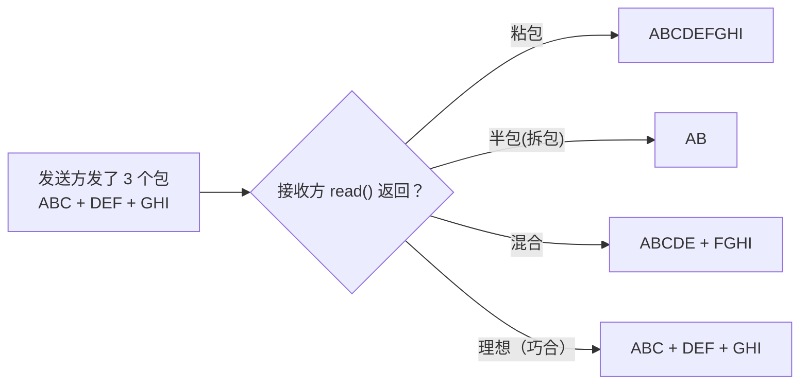

# 一、TCP 为什么会有粘包？——一个被低估的问题

## 1.1 根本原因：TCP 是流协议，没有消息边界

TCP 是一个**面向字节流**的传输层协议。发送方调用三次 `write()`：

```
应用层:     write("ABC")    write("DEF")    write("GHI")
                  ↓               ↓               ↓
TCP 发送缓冲区:  [A][B][C][D][E][F][G][H][I]  ← 一条连续的字节流
                  ↓
网络传输:     三个 TCP 段（取决于 MSS、Nagle 算法、拥塞窗口……）
                  ↓
对端 TCP 接收缓冲区: [A][B][C][D][E][F][G][H][I]  ← 重新组装为连续流
```

接收方调用 `read()` 时，拿到的可能是：

| 现象 | 收到的字节 | 原因 |
|------|-----------|------|
| **粘包** | `ABCDEFGHI`（一次全到） | 发送端 Nagle 算法合并了小包，或者接收端一次性读空了缓冲区 |
| **半包** | `AB`（只有部分） | TCP 分段，后面的数据还没到达 |
| **粘包+半包** | `ABCDE` + `FGHI`（混合拆分） | 网络延迟波动导致的无规律到达 |



**核心认知**：TCP 不保证你发几个包对方就收几个包。它只保证字节的顺序和可靠性。应用层协议必须自己定义消息边界。

## 1.2 Nagle 算法——粘包的常见加速器

Nagle 算法是 TCP 的默认行为：当有未确认的数据时，小的写入会被延迟，直到收到 ACK 或累积到足够大小。这就是为什么你连续调用三次 `write()` 但对方只收到一个大包的根本原因。

```java
// 服务端可以禁用 Nagle 来减少延迟（以吞吐为代价）
bootstrap.childOption(ChannelOption.TCP_NODELAY, true);  // 禁用 Nagle
```

**但禁用 Nagle 并不能解决粘包问题**——因为接收端的 TCP 栈可能在一次 `read()` 中返回多个同时到达的 TCP 段。粘包需要应用层自己解决，不能依赖 TCP 栈行为。

---

# 二、Netty 五种内置拆包器——选哪个？

| 拆包器 | 原理 | 适用场景 |
|--------|------|---------|
| **FixedLengthFrameDecoder** | 固定 N 字节为一帧 | 协议中所有消息固定长度（如传感器数据、GPS 定位） |
| **LineBasedFrameDecoder** | 以 `\n` 或 `\r\n` 为分隔符 | 文本协议（如 SMTP、Redis 协议） |
| **DelimiterBasedFrameDecoder** | 以自定义字节序列为分隔符 | 自定义文本协议（如 `$$` 分隔） |
| **LengthFieldBasedFrameDecoder** | **协议头中声明长度字段** | 二进制协议（最通用、最推荐） |
| **自定义继承 ByteToMessageDecoder** | 完全自定义逻辑 | 极特殊协议（如解析 XML/JSON 流） |

**LengthFieldBasedFrameDecoder 为什么是最推荐的？**

因为在一个字节流中找分隔符需要逐个字节比较（O(n) 遍历），而读长度字段只需要读固定位置的固定字节数（O(1)）。对于高性能二进制协议，长度字段方案是最优选择。

---

# 三、LengthFieldBasedFrameDecoder——四个参数解决一切（但极易配错）

## 3.1 五个参数的含义

```java
new LengthFieldBasedFrameDecoder(
    int maxFrameLength,      // ① 单帧最大字节数（超过抛异常，防止内存溢出）
    int lengthFieldOffset,   // ② 长度字段从第几个字节开始
    int lengthFieldLength,   // ③ 长度字段占几个字节（1/2/3/4/8）
    int lengthAdjustment,    // ④ 调整值：长度字段的值 + 调整值 = 从长度字段之后开始算的帧剩余字节数
    int initialBytesToStrip  // ⑤ 解码后跳过头部前几个字节（0=保留完整帧，>0=剥离头部）
);
```

**`lengthAdjustment` 是最容易配错的参数**。它的含义是：

```
实际需要读取的字节数 = 长度字段值 + lengthAdjustment

其中，"长度字段之后还需要读的字节数" 由 lengthAdjustment 补偿。
```

## 3.2 四种典型协议的配置对照表

**这是本文最重要的部分——理解这四种模式，你就理解了所有 length-based 协议。**

**协议 A：长度字段只包含 Body 长度（最常见）**

```
┌────────────────────┬──────────────────────────┐
│  Length (2B)       │  Body (Length 字节)       │
│  值 = Body 长度     │                          │
└────────────────────┴──────────────────────────┘
```

```java
new LengthFieldBasedFrameDecoder(65536, 0, 2, 0, 2);
// offset=0: 长度从 byte 0 开始
// fieldLength=2: 长度占 2 字节
// adjustment=0: 长度值 = 从长度字段之后开始的字节数 = Body 长度，正确
// strip=2: 去掉 2 字节长度头，只保留 Body
```

**协议 B：长度字段包含头部自身**

```
┌────────────────────┬──────────────────────────┐
│  Length (2B)       │  Body (Length-2 字节)     │
│  值 = 整帧长度      │                          │
└────────────────────┴──────────────────────────┘
```

如果 Length 的值 = **整帧长度**（包含了 2 字节的 Length 字段自身）：

```java
// Length 值 = Header(2) + Body(N) = 2 + N
// 但"长度字段之后"的字节只有 Body(N) = Length - 2
// 所以 adjustment = -2
new LengthFieldBasedFrameDecoder(65536, 0, 2, -2, 2);
```

**协议 C：长度字段前有额外头部，长度只含 Body**

```
┌──────┬──────┬──────────┬──────────────────────┐
│ Magic│ Ver  │ Length   │  Body                │
│ 2B   │  1B  │  2B      │  (Length 字节)       │
│      │      │=Body长度  │                      │
└──────┴──────┴──────────┴──────────────────────┘
```

```java
// offset=3: 长度从 byte 3 (Magic 2B + Version 1B) 开始
// fieldLength=2
// adjustment=0: 长度就是 Body 长度
// strip=5: 去掉前 5 字节 (Magic+Version+Length)，只留 Body
new LengthFieldBasedFrameDecoder(65536, 3, 2, 0, 5);
```

**协议 D：长度字段前有头部，长度 = 头部之后的所有内容**

```
┌──────┬──────────┬──────────────────┬──────────┐
│Magic │ Length   │  Header2         │  Body    │
│ 2B   │  4B      │  变长 (H2Len)     │  变长     │
│      │= H2+Body │                  │          │
└──────┴──────────┴──────────────────┴──────────┘
```

```java
// offset=2: 长度从 byte 2 (Magic 之后) 开始
// fieldLength=4
// Length 的值 = Header2 + Body
// lengthAdjustment = 0 (长度字段之后 = Header2 + Body = Length，正好)
// strip=0: 保留整帧（包括 Magic 和 Length）
new LengthFieldBasedFrameDecoder(65536, 2, 4, 0, 0);
```

## 3.3 配错 lengthAdjustment 的典型症状

| 错误 | 配置 | 现象 |
|------|------|------|
| adjustment 偏大 | adjustment = +2 实际应该 = 0 | 等待时间过长后抛 `DecoderException`：实际可读字节不够 Length+2 |
| adjustment 为负但不够 | adjustment = -2 实际应该 = -4 | 读到了下一帧的前 2 个字节，导致魔数校验失败 |
| 忘记 strip | strip = 0 实际应该 = 2 | 下游 Handler 收到的 ByteBuf 前面多了 2 字节长度头，解析偏移 |

---

# 四、内部机制——解码器如何等待和拆帧？

`LengthFieldBasedFrameDecoder` 继承自 `ByteToMessageDecoder`，内部维护一个**状态机**：

```java
// 解码过程的伪状态机
protected final void decode(ChannelHandlerContext ctx, ByteBuf in, List<Object> out) {
    Object decoded = decode(ctx, in);
    if (decoded != null) {
        out.add(decoded);  // 完整帧到了，传给下游
    }
    // decoded == null 表示数据不够 → 自动退出 → 等待下次 channelRead
}

// decode() 的内部逻辑
protected Object decode(ChannelHandlerContext ctx, ByteBuf in) {
    // 状态 1: 检查是否有足够数据读取长度字段
    if (in.readableBytes() < lengthFieldEndOffset) {
        return null;  // 不够读长度 → 返回 null，等下次
    }
    
    // 状态 2: 读取长度字段值
    long frameLength = getUnadjustedFrameLength(in, lengthFieldOffset, 
                                                  lengthFieldLength, byteOrder);
    // 加上 adjustment，得到实际需要读取的长度
    frameLength += lengthAdjustment + lengthFieldEndOffset;
    
    // 状态 3: 验证帧长度
    if (frameLength < 0) {
        throw new CorruptedFrameException("长度字段为负");
    }
    if (frameLength > maxFrameLength) {
        throw new TooLongFrameException("帧长超过最大值");
    }
    
    // 状态 4: 检查完整帧是否到达
    if (in.readableBytes() < frameLength) {
        return null;  // 数据还不够 → 返回 null，等下次
    }
    
    // 状态 5: 完整帧到达！提取并返回
    // 如果 strip > 0，跳过前 strip 个字节
    return extractFrame(ctx, in, readerIndex, (int) frameLength);
}
```

**核心理解**：`decode()` 返回 `null` 不是错误——它是告诉 `ByteToMessageDecoder` 的累积循环"数据还不够，先退出，下次积累了更多数据再调我"。`callDecode` 循环检测到 `in.readableBytes()` 没变，自动 break，等待下一次 `channelRead` 触发。

关于这个累积-循环机制的完整分析，见 [Netty 编解码器体系](/posts/netty/netty-编解码器体系bytetomessagedecoder-与-messagetobyteencoder/)。

---

# 五、完整的生产级 Pipeline 配置

## 5.1 服务端

```java
ServerBootstrap b = new ServerBootstrap();
b.group(bossGroup, workerGroup)
 .channel(NioServerSocketChannel.class)
 .childHandler(new ChannelInitializer<SocketChannel>() {
     @Override
     protected void initChannel(SocketChannel ch) {
         ChannelPipeline p = ch.pipeline();
         
         // 1. 日志（调试用，生产可移除或改为 TRACE 级别）
         // p.addLast(new LoggingHandler(LogLevel.DEBUG));
         
         // 2. 空闲检测：60 秒无读 → 触发心跳/断连
         p.addLast(new IdleStateHandler(60, 0, 0));
         
         // 3. 帧解码：2 字节长度头 + Protobuf Body
         p.addLast(new LengthFieldBasedFrameDecoder(
             65536,    // maxFrameLength: 64KB
             0,        // lengthFieldOffset: 长度从 byte 0 开始
             2,        // lengthFieldLength: 长度占 2 字节
             0,        // lengthAdjustment: 长度字段值 = Body 长度
             2         // initialBytesToStrip: 去掉 2 字节长度头
         ));
         
         // 4. 协议解码：ByteBuf → Protobuf 对象
         p.addLast(new ProtobufDecoder(MyProto.Request.getDefaultInstance()));
         
         // 5. 协议编码：Protobuf 对象 → ByteBuf（outbound 方向）
         p.addLast(new ProtobufEncoder());
         
         // 6. 长度头添加：在字节前面加上 2 字节长度（outbound 方向）
         p.addLast(new LengthFieldPrepender(2));
         
         // 7. 心跳处理
         p.addLast(new HeartbeatHandler());
         
         // 8. 业务处理
         p.addLast(new BizHandler());
         
         // 9. 全局异常兜底
         p.addLast(new ChannelInboundHandlerAdapter() {
             @Override
             public void exceptionCaught(ChannelHandlerContext ctx, Throwable cause) {
                 log.error("未处理异常, channel={}", ctx.channel(), cause);
                 ctx.close();
             }
         });
     }
 });
```

## 5.2 客户端（对称配置）

```java
Bootstrap b = new Bootstrap();
b.group(group)
 .channel(NioSocketChannel.class)
 .handler(new ChannelInitializer<SocketChannel>() {
     @Override
     protected void initChannel(SocketChannel ch) {
         ChannelPipeline p = ch.pipeline();
         
         // Inbound（读）：和 Server 一样的顺序
         p.addLast(new LengthFieldBasedFrameDecoder(65536, 0, 2, 0, 2));
         p.addLast(new ProtobufDecoder(MyProto.Response.getDefaultInstance()));
         
         // Outbound（写）：编码 → 加长度头
         p.addLast(new ProtobufEncoder());
         p.addLast(new LengthFieldPrepender(2));
         
         // 空闲检测 + 心跳 + 重连
         p.addLast(new IdleStateHandler(0, 30, 0));  // 30s 无写则发心跳
         p.addLast(new HeartbeatHandler());
         p.addLast(new ReconnectHandler(b));
         
         // 业务
         p.addLast(new ClientHandler());
     }
 });
```

**编解码器的顺序为什么是这样？**

在 [ChannelPipeline 责任链设计](/posts/netty/channelpipeline-责任链设计handler-的执行顺序与事件传播/) 中有详细解释。核心原则：
- **Inbound 方向**：先进先出——先处理 TCP（帧解码），再处理协议，最后业务
- **Outbound 方向**：后进先出——业务对象先被协议编码，再在字节前添加长度头

---

# 六、故障排查——当粘包拆包出了 bug

## 6.1 启用 LoggingHandler 观察原始字节

```java
// 加在 LengthFieldBasedFrameDecoder 前面
pipeline.addFirst(new LoggingHandler(LogLevel.DEBUG));

// 输出示例：
// READ: 18B
//  |  0  1  2  3  4  5  6  7  8  9  a  b  c  d  e  f |
//  |00000000| 00 0e 08 01 12 09 48 65 6c 6c 6f 20 ... |......Hello     |
//              ↑↑ ↑↑
//              长度=14(0x000e)  数据从这里开始
```

通过原始字节你可以直接验证：长度字段的值是否正确？是否有意外的前导字节？

## 6.2 常见错误诊断表

| 现象 | 可能原因 | 排查方向 |
|------|---------|---------|
| `TooLongFrameException` | `maxFrameLength` 设置太小 | 检查实际帧大小，调整上限 |
| `CorruptedFrameException` | 长度字段位置/字节序不对 | 检查 `lengthFieldOffset`、`byteOrder` |
| 下游收到残缺数据 | `lengthAdjustment` 配错 | 对照 3.2 节的协议公式重新计算 |
| 下游 Handler 收到长度头 | `initialBytesToStrip` 忘记设置 | 设置 `strip = lengthFieldOffset + lengthFieldLength` |
| 长时间无响应后报错 | 半包等待超时 + 连接断开 | 检查对端是否发送了完整帧 |
| 魔数校验失败 | `lengthAdjustment` 偏小，读到了下一帧的数据 | 重新计算 adjustment |

## 6.3 用 Wireshark 分析 TCP 流

在开发和调试阶段，Wireshark 是最有效的协议分析工具：

1. 抓取 lo0 上的包：`tcp.port == 8080`
2. 右键 → "Follow TCP Stream" 查看完整字节流
3. 检查实际发送的字节是否与协议定义一致
4. 确认 TCP 分段点：哪个帧在哪个 TCP 段中？是否确实发生了粘包？

---

# 七、总结

| 问题 | 解决方案 | 关键点 |
|------|---------|--------|
| **粘包** | `LengthFieldBasedFrameDecoder` 按长度字段拆分 | 理解 `lengthAdjustment` 公式 |
| **半包** | `ByteToMessageDecoder` 的累积机制 | 数据不够时返回 null，框架自动累积 |
| **多帧粘在一起** | `callDecode` 循环 | 一次 `channelRead` 循环解码直到数据不够 |
| **防止内存溢出** | `maxFrameLength` | 拒绝超大帧，避免攻击者发送恶意长度导致 OOM |
| **字节序问题** | `ByteOrder` 参数 | 默认 `BIG_ENDIAN`（网络字节序），如协议用 `LITTLE_ENDIAN` 需显式指定 |
| **排查手段** | `LoggingHandler` + Wireshark | 原始字节是最可靠的真值 |

TCP 粘包拆包是网络编程的必修课。Netty 的 `LengthFieldBasedFrameDecoder` 本质上就是把"按长度分帧"这个最常见的拆包策略做成了一个高度可配置的组件——四个参数覆盖几乎所有基于长度字段的二进制协议。关键不是记住参数，而是理解**你的协议格式中各部分的偏移和包含关系**。
