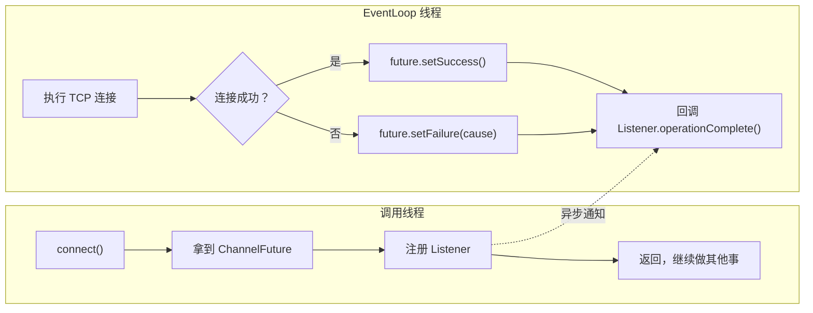

# 一、你写的 writeAndFlush，真的发出去了吗？

考虑一段看似正常的 Netty 客户端代码：

```java
ChannelFuture f = bootstrap.connect("localhost", 8080);
f.channel().writeAndFlush(msg);  // 连接可能还没建立！
```

这段代码有一个隐蔽的 bug：`connect()` 返回的 `ChannelFuture` 表示连接操作**正在进行中**，此时 `f.channel()` 虽然不为 null，但连接尚未建立。直接 `writeAndFlush` 大概率把数据写进了一个还没完成 TCP 三次握手的 Channel——数据丢了。

正确的做法：

```java
ChannelFuture f = bootstrap.connect("localhost", 8080);
f.addListener((ChannelFutureListener) future -> {
    if (future.isSuccess()) {
        future.channel().writeAndFlush(msg);  // 连接确认建立后才发送
    } else {
        log.error("连接失败", future.cause());
    }
});
```

**这就是 Netty 异步编程模型的核心价值**：所有 IO 操作非阻塞，结果通过 Future/Promise 异步通知。如果你按同步思维写 Netty 代码，就会出现上面这种隐蔽的 bug。



---

# 二、JDK Future 为什么不够用？

Java 5 引入了 `java.util.concurrent.Future`，它的 API 是这样的：

```java
Future<String> future = executor.submit(() -> doLongWork());
String result = future.get();  // 阻塞当前线程，等待结果！
```

**核心问题：`get()` 是阻塞的。**

在 Netty 的 EventLoop 线程中，阻塞是致命的。一个 EventLoop 管理着成百上千个 Channel，如果因为等待一个 IO 操作完成而阻塞，其他所有 Channel 的事件处理都会停滞。这相当于一条高速公路被一辆车堵死。

| 对比维度 | JDK Future | Netty Future |
|---------|-----------|-------------|
| **获取结果** | `get()` 阻塞调用线程 | `getNow()` 非阻塞返回当前值 + Listener 异步回调 |
| **完成通知** | 不支持（只能轮询 `isDone()`） | `addListener(GenericFutureListener)` 注册回调 |
| **操作结果判断** | 只能 `get()` 拿结果或抛异常 | `isSuccess()` / `cause()` 精确区分成功与失败 |
| **可写性** | 只读——由线程池内部设置结果 | `Promise` 接口继承 Future，提供 `setSuccess()` / `setFailure()` |
| **取消** | `cancel()` mayInterruptIfRunning | 不支持取消（IO 操作一旦发出无法撤销） |

JDK Future 的设计假设是"我用线程池异步执行，但最终还是要等结果"。Netty 的设计假设是"我绝不等待，你好了通知我"——这是两种完全不同的编程范式。

---

# 三、ChannelFuture——每个 IO 操作为什么都返回它？

## 3.1 ChannelFuture 的状态机

Netty 中所有 IO 操作都是异步的：`connect()`、`write()`、`close()`、`bind()`……它们全部返回 `ChannelFuture`。

`ChannelFuture` 内部维护一个状态机，只有三种状态：

```
                    ┌──────────┐
                    │ unfinished │  初始状态
                    └─────┬─────┘
                          │
              ┌───────────┴───────────┐
              ▼                       ▼
        ┌──────────┐           ┌──────────┐
        │ success  │           │  failed  │   终结状态（不可逆）
        └──────────┘           └──────────┘
```

关键约束：**状态只能从未完成变为完成（成功或失败），不可逆**。这个约束是 Netty 异步编程可靠性的基石——一旦你通过 Listener 拿到了结果，它永远不会变。

## 3.2 底层实现：DefaultChannelPromise

```java
// 调用链：
// ctx.write(msg) 
//   → ChannelOutboundBuffer.addMessage(msg, promise)
//     → Socket 数据实际发送成功后
//       → promise.setSuccess()
//         → 遍历所有注册的 Listener → 逐个调用 operationComplete()
```

以 `writeAndFlush` 为例，完整链路是：

```java
// Netty 内部的抽象表示（简化）
ChannelFuture writeAndFlush(Object msg) {
    DefaultChannelPromise promise = new DefaultChannelPromise(channel);
    // 将 msg + promise 写入 ChannelOutboundBuffer
    // 当操作系统确认数据已发送（或写入 Socket 缓冲区）
    // → EventLoop 线程调用 promise.setSuccess()
    return promise;
}
```

这里有一个**极度重要的细节**：`Listener.operationComplete()` 的回调**在 EventLoop 线程中执行**。这意味着：

1. 你不需要担心并发——Listener 中的代码是线程安全的（和其他 Handler 回调在同一个线程）
2. 你不能在 Listener 中做耗时操作——会阻塞整个 EventLoop

## 3.3 完整的异步编程范式

```java
// ✅ 正确的异步编程方式
ChannelFuture future = ctx.writeAndFlush(msg);

// 方式 1：添加 Listener 监听完成事件
future.addListener((ChannelFutureListener) f -> {
    if (f.isSuccess()) {
        log.info("消息发送成功");
        // 可以在这里发送下一条消息
    } else {
        log.error("发送失败", f.cause());
        ctx.close();
    }
});

// 方式 2：不关心结果，直接返回（适合日志、监控等非关键场景）
ctx.writeAndFlush(msg);  // 不管它成功还是失败

// ❌ 绝对禁止：阻塞等待（在 EventLoop 线程中）
// future.await();  // 死锁！EventLoop 线程在等自己完成
// future.sync();   // 同样的问题
```

**在非 EventLoop 线程（如 main 线程）中**，可以用 `sync()` 阻塞等待：

```java
// 在 main 线程中启动服务端，可以 sync 等待关闭
ChannelFuture bindFuture = bootstrap.bind(8080).sync();
ChannelFuture closeFuture = bindFuture.channel().closeFuture().sync();
```

---

# 四、Promise——我需要"写"结果的能力

## 4.1 Future 是只读，Promise 是可写

`Future` 的语义是"我等着拿结果"，`Promise` 的语义是"我来填结果"。在 Netty 中，`Promise extends Future`，这意味着 Promise 既是结果的容器（可读），也是结果的设置者（可写）。

```java
public interface Promise<V> extends Future<V> {
    Promise<V> setSuccess(V result);      // 标记成功，触发所有 Listener
    boolean trySuccess(V result);         // 尝试标记成功，已被标记过则返回 false
    Promise<V> setFailure(Throwable cause);
    boolean tryFailure(Throwable cause);
    Promise<V> setUncancellable();        // 标记为不可取消
}
```

`setSuccess` 和 `trySuccess` 的区别在于：如果 Promise 已经完成，`setSuccess` 抛异常，`trySuccess` 返回 false。

## 4.2 典型场景：用 Promise 将异步操作转为可编排的编程单元

假设你有一个 RPC 调用，底层是异步的，但你想让调用方通过 Future 等待结果：

```java
public Future<String> rpcCall(String request) {
    // 创建一个 Promise —— 这是"借条"
    Promise<String> promise = new DefaultPromise<>(eventLoop);
    
    // 将 "借条编号" 和请求一起发出去
    long requestId = generateRequestId();
    pendingRequests.put(requestId, promise);
    channel.writeAndFlush(new RpcMessage(requestId, request));
    
    // 返回 Future 给调用方——调用方只能读，不能写
    return promise;
}

// 收到响应时，在另一个 Handler 中：
public void onResponse(RpcResponse response) {
    Promise<String> promise = pendingRequests.remove(response.getRequestId());
    if (promise != null) {
        promise.setSuccess(response.getBody());  // "兑现借条" → 触发调用方的 Listener
    }
}
```

这个模式在 Netty 内部被广泛使用：`connect()` 返回的 `ChannelFuture` 本质上就是一个在连接完成后被 `setSuccess/setFailure` 的 Promise。

## 4.3 Promise 的状态保护

Promise 的 `setSuccess`/`setFailure` 通过 CAS 操作保证**只能设置一次**。这是故意设计的：异步操作的结果是确定的，不应该被覆盖。如果你不确定 Promise 是否已经被设置，用 `trySuccess`：

```java
if (promise.trySuccess(result)) {
    log.debug("结果已设置");
} else {
    log.warn("Promise 已被设置过，丢弃重复结果");
}
```

---

# 五、GenericFutureListener——回调的执行机制

## 5.1 注册时机对执行行为的影响

`addListener()` 的逻辑取决于调用时 Promise 是否已经完成：

```java
// DefaultPromise.addListener() 的核心逻辑（简化）
public Promise<V> addListener(GenericFutureListener<? extends Future<V>> listener) {
    if (isDone()) {
        // Promise 已经完成 → 立即通知 Listener
        notifyListener(executor, this, listener);
    } else {
        // Promise 未完成 → 将 Listener 加入列表，等完成后通知
        synchronized (this) {
            if (!isDone()) {
                listeners.add(listener);
                return this;
            }
        }
        notifyListener(executor, this, listener);
    }
    return this;
}
```

**关键启示**：你可以在任何时刻注册 Listener——即使结果已经产生，Listener 仍然会被调用。这消除了一类典型的竞态 bug：

```java
// ✅ 安全：就算 IO 操作瞬间完成，Listener 也不会丢失
ChannelFuture f = channel.writeAndFlush(msg);
// 假设这里写了之后 IO 操作立即完成……
f.addListener(future -> {
    // 仍然会被调用！addListener 内部检查了 isDone()
});
```

## 5.2 通知在 EventLoop 线程中执行

这是 Netty 异步编程中**最重要的一条规则**：

> `Listener.operationComplete()` 的回调在 Channel 绑定的 EventLoop 线程中执行。

带来的直接影响：

```java
channel.writeAndFlush(msg).addListener(future -> {
    // 这里的代码在 EventLoop 线程中执行
    // ✅ 可以：访问 Channel、Pipeline（线程安全）
    // ✅ 可以：调用 ctx.write()（线程安全）
    // ❌ 禁止：阻塞操作（Thread.sleep、同步 IO、重量级计算）
    // ❌ 禁止：调用 future.await()（EventLoop 在等自己，死锁）
    
    if (future.isSuccess()) {
        // 继续写——这是安全的，因为我们在 EventLoop 线程中
        channel.writeAndFlush(nextMsg);
    }
});
```

如果确实需要做耗时操作，交给业务线程池：

```java
future.addListener(f -> {
    if (f.isSuccess()) {
        businessExecutor.execute(() -> {
            doHeavyWork();  // 在业务线程中执行
        });
    }
});
```

## 5.3 ChannelFutureListener 的便捷常量

Netty 预置了几个常用的 Listener：

```java
// 操作成功就关闭连接（常用于发送最后一条消息后）
future.addListener(ChannelFutureListener.CLOSE);

// 操作失败就关闭连接
future.addListener(ChannelFutureListener.CLOSE_ON_FAILURE);

// 操作失败就打印异常栈
future.addListener(ChannelFutureListener.FIRE_EXCEPTION_ON_FAILURE);
```

这些常量遵循 Netty 的惯例：关闭连接是处理异常的最终手段。但生产环境中建议自定义 Listener，至少加上日志：

```java
future.addListener(f -> {
    if (!f.isSuccess()) {
        log.error("写入失败, channel={}", channel.remoteAddress(), f.cause());
        ctx.close();
    }
});
```

---

# 六、实战——批量异步写入与结果聚合

## 6.1 向多个 Channel 群发消息

```java
// 场景：IM 系统向一个聊天室的所有成员推送消息
public Promise<Void> broadcast(List<Channel> channels, Object msg) {
    Promise<Void> allDone = new DefaultPromise<>(eventLoop);
    
    // 每个 channel 保留一份 msg 的引用计数副本
    AtomicInteger pending = new AtomicInteger(channels.size());
    
    for (Channel ch : channels) {
        // 每条消息保留一份引用（防止被提前释放）
        ReferenceCountUtil.retain(msg);
        ch.writeAndFlush(msg).addListener(future -> {
            ReferenceCountUtil.release(msg);  // 写完后释放
            if (!future.isSuccess()) {
                log.warn("向 {} 发送失败", ch.remoteAddress(), future.cause());
                // 单点失败不影响整体——继续等待其他 channel 完成
            }
            if (pending.decrementAndGet() == 0) {
                allDone.setSuccess(null);  // 全部完成（无论成败）
            }
        });
    }
    
    return allDone;  // 调用方可以 addListener 等待全部完成
}

// 使用示例
broadcast(roomMembers, chatMsg).addListener(f -> {
    if (f.isSuccess()) {
        log.info("消息已推送给全部 {} 人", roomMembers.size());
    }
});
```

## 6.2 请求-响应模式中的超时处理

异步操作的另一个核心问题是**超时**。Netty 本身不提供超时 Future，需要自己实现：

```java
public <T> Future<T> withTimeout(Promise<T> promise, long timeout, TimeUnit unit) {
    EventLoop eventLoop = channel.eventLoop();
    
    // 注册超时任务
    ScheduledFuture<?> timeoutTask = eventLoop.schedule(() -> {
        if (promise.tryFailure(new TimeoutException("请求超时"))) {
            log.warn("操作超时，已取消");
        }
    }, timeout, unit);
    
    // 无论成功还是失败，取消超时任务
    promise.addListener(f -> timeoutTask.cancel(false));
    
    return promise;
}

// 使用
Promise<String> rpcPromise = rpcCall("request");
withTimeout(rpcPromise, 3, TimeUnit.SECONDS).addListener(f -> {
    if (f.isSuccess()) {
        handleResponse(f.getNow());
    } else {
        handleError(f.cause());  // 可能是超时，也可能是真实的 IO 错误
    }
});
```

---

# 七、常见陷阱与最佳实践

## 7.1 陷阱一：在 EventLoop 线程中阻塞等待

```java
// ❌ 死锁！EventLoop 线程在等待自己完成
channel.writeAndFlush(msg).await();

// ✅ 正确：注册 Listener，异步处理
channel.writeAndFlush(msg).addListener(f -> {
    // 在 EventLoop 线程中异步执行
});
```

**诊断技巧**：如果在日志中看到 `BlockingOperation` 相关的警告（需要开启 Netty 的阻塞检测），说明有代码在 EventLoop 中执行了阻塞操作。

## 7.2 陷阱二：忘记 EventLoop 线程边界

```java
// ❌ 错误：在外部线程直接操作 Channel
new Thread(() -> {
    channel.writeAndFlush(msg);  // writeAndFlush 会封装成 task 进队列，但线程安全边界模糊
}).start();

// ✅ 正确：明确交给 EventLoop 执行
new Thread(() -> {
    channel.eventLoop().execute(() -> {
        channel.writeAndFlush(msg);  // 明确在 EventLoop 线程中执行
    });
}).start();
```

## 7.3 陷阱三：Listener 中继续注册 Listener 的嵌套地狱

```java
// ❌ 回调地狱
connect().addListener(f1 -> {
    if (f1.isSuccess()) {
        sendHandshake(f1.channel()).addListener(f2 -> {
            if (f2.isSuccess()) {
                sendRequest(f2.channel()).addListener(f3 -> {
                    // 三层嵌套了……
                });
            }
        });
    }
});

// ✅ 提取方法，扁平化处理
private void onConnected(ChannelFuture f) {
    if (!f.isSuccess()) { handleError(f.cause()); return; }
    sendHandshake(f.channel()).addListener(this::onHandshakeSent);
}

private void onHandshakeSent(ChannelFuture f) {
    if (!f.isSuccess()) { handleError(f.cause()); return; }
    sendRequest(f.channel()).addListener(this::onRequestSent);
}
```

## 7.4 Promise 应该谁创建，谁设置

一个常见的坏味道：调用方创建 Promise 并传给被调用方去 `setSuccess`。更好的模式是：

```java
// ✅ Future 返回给调用方（只读），Promise 保留在创建方（可写）
class RpcClient {
    public Future<String> call(String req) {
        Promise<String> promise = new DefaultPromise<>(eventLoop);
        // 内部持有 promise，外部只看到 Future
        doAsyncRpc(req, promise);
        return promise;
    }
    
    private void onResponse(RpcResponse resp) {
        Promise<String> promise = pendingRequests.remove(resp.id());
        promise.setSuccess(resp.body());  // 只有内部知道何时设置
    }
}
```

---

# 八、源码关键路径

## 8.1 DefaultPromise 的核心结构

```java
public class DefaultPromise<V> extends AbstractFuture<V> implements Promise<V> {
    // 结果容器：只有 setSuccess/setFailure 后会填充
    private volatile Object result;  // null=未完成, 非null=完成（值或异常）
    
    // 监听器列表：写时复制，线程安全
    private Object listeners;  
    // null → 无监听器
    // GenericFutureListener → 单个监听器
    // DefaultFutureListeners → 多个监听器
    
    // notifyListeners() 在 EventLoop 线程中被调用
    // 遍历 listeners，逐个调用 operationComplete()
}
```

## 8.2 通知流程

```
IO 操作完成（Socket 数据已发送）
  → HeadContext 收到 OP_WRITE 事件
    → ChannelOutboundBuffer.remove() 取出已发送的消息
      → promise.setSuccess()
        → CAS 设置 result
          → notifyListeners()
            → 如果是 EventLoop 线程 → 直接执行 operationComplete()
            → 如果不是 EventLoop 线程 → submit 到 EventLoop 执行
```

**再次强调**：Listener 最终**一定在 EventLoop 线程中执行**。这是 Netty 线程模型的铁律，也是你能在 Listener 中安全访问 Channel/Pipeline 的根本原因。

---

# 九、总结

| 概念 | 角色 | 关键约束 |
|------|------|---------|
| **ChannelFuture** | 异步 IO 操作的结果容器 | 状态不可逆（unfinished → success/failed） |
| **Promise** | 可写结果的 Future | `setSuccess/setFailure` 通过 CAS 保证只设置一次 |
| **addListener()** | 注册异步回调 | 如果 Future 已完成则立即通知，否则加入等待列表 |
| **EventLoop 线程** | Listener 的执行者 | 回调在 EventLoop 中执行 → 线程安全但不能阻塞 |
| **sync() / await()** | 阻塞等待（非 EventLoop 线程） | 绝对不能在 EventLoop 线程中调用 |
| **trySuccess / tryFailure** | 尝试设置结果 | 已被设置过则返回 false（不抛异常） |

Netty 的 Future/Promise 模型本质上是一种**事件驱动的观察者模式**：IO 操作是事件源，Future 是事件载体，Listener 是事件处理器，EventLoop 是事件调度器。理解这个模型，才能真正驾驭 Netty 的异步编程。
