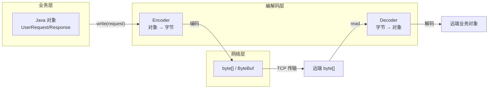

# 一、网络传的是字节，你写的是对象——怎么桥接？

在 Netty 应用开发中，存在一个根本性的阻抗不匹配：

```
你的业务代码操作的是：UserRequest、ChatMessage、OrderDTO  ← Java 对象
但网络传输的是：      byte[]                               ← 原始字节
```

TCP 协议不关心你传的是 Protobuf、JSON、还是自定义二进制——它只认字节流。编解码器（Codec）的作用就是在这两个世界之间架桥：**编码器**（Encoder）负责 Java 对象 → 字节，**解码器**（Decoder）负责字节 → Java 对象。



**注意**：编解码器不仅仅是"调一下 serialize/deserialize"。在网络编程中，编解码器必须解决三个层次的问题：

1. **帧同步**：从 TCP 流中切出完整的消息（粘包/拆包）
2. **协议解析**：识别消息类型（是心跳还是业务数据？）
3. **对象转换**：字节 ↔ Java 对象

本文聚焦第 3 层，第 1 层见 [Netty TCP 粘包拆包全解](/posts/netty/netty-tcp-粘包拆包全解lengthfieldbasedframedecoder-实战/)，第 2 层在第 1 层中已通过 LengthFieldBasedFrameDecoder 解决。

---

# 二、编解码器的两种层次——"帧编解码"vs"对象编解码"

Netty 的编解码器按照处理的数据类型分为两类：

| 类型 | 输入 → 输出 | 典型实现 | 解决问题 |
|------|------------|---------|---------|
| **ByteToMessageXxx** | `ByteBuf` → `Object`（或反向） | `ByteToMessageDecoder` / `MessageToByteEncoder` | 字节 ↔ 消息对象的**最底层转换** |
| **MessageToMessageXxx** | `Object` → `Object`（或反向） | `MessageToMessageDecoder` / `MessageToMessageEncoder` | 消息对象之间的**协议层转换** |

```
Pipeline 中的典型流转：

ByteBuf (TCP 原始数据)
  → ByteToMessageDecoder:    ByteBuf → ByteBuf (帧解码：拆出完整包)
    → MessageToMessageDecoder: ByteBuf → UserRequest (协议解码：字节转对象)
      → BizHandler:          处理 UserRequest，返回 UserResponse
    ← MessageToMessageEncoder: UserResponse → ByteBuf (协议编码：对象转字节)
  ← MessageToByteEncoder:    在 ByteBuf 前加长度头 (帧编码)
```

**Netty 内置的编解码器全家福**：

| 类别 | 编解码器 | 用途 |
|------|---------|------|
| **帧级** | `LengthFieldBasedFrameDecoder` | 按长度字段拆帧（见粘包拆包文章） |
| | `DelimiterBasedFrameDecoder` | 按分隔符拆帧（如 `\r\n`） |
| | `FixedLengthFrameDecoder` | 按固定长度拆帧 |
| | `LengthFieldPrepender` | 发送端自动加长度头 |
| **协议级** | `ProtobufDecoder` / `ProtobufEncoder` | Google Protobuf 编解码 |
| | `MarshallingDecoder` / `MarshallingEncoder` | JBoss Marshalling |
| | `JdkZlibDecoder` / `JdkZlibEncoder` | 压缩/解压 |
| | `Base64Decoder` / `Base64Encoder` | Base64 编解码 |
| | `StringDecoder` / `StringEncoder` | 字符串编解码（ByteBuf ↔ String） |
| | `ObjectDecoder` / `ObjectEncoder` | JDK 序列化（不推荐生产使用） |

---

# 三、ByteToMessageDecoder——累积 + 解码循环

## 3.1 为什么需要 Cumulator？

`ByteToMessageDecoder` 是所有帧解码器的父类。它解决的核心问题是：**TCP 流可能一次只到达半包数据，解码器必须累积到完整帧才能输出**。

```
场景：协议规定每帧 100 字节
第 1 次 read: 60 字节 → 不够一帧 → 累积到内部缓冲区
第 2 次 read: 70 字节 → 60+70=130 字节 → 解码出第 1 帧 (100B)
                                         剩余 30B 继续累积
```

这就是 `Cumulator` 的职责——管理一个内部的累积缓冲区：

```java
// ByteToMessageDecoder 内部的核心结构（简化）
public abstract class ByteToMessageDecoder extends ChannelInboundHandlerAdapter {
    // 累积缓冲区：存放多次 read 未解码完的数据
    ByteBuf cumulation;
    
    // 累积策略：MERGE（默认，内存拷贝，更安全） vs COMPOSITE（零拷贝，更复杂）
    Cumulator cumulator = MERGE_CUMULATOR;
    
    @Override
    public void channelRead(ChannelHandlerContext ctx, Object msg) {
        ByteBuf input = (ByteBuf) msg;
        // 将新数据累积到 cumulation 中
        cumulation = cumulator.cumulate(ctx.alloc(), cumulation, input);
        // 调用子类的 decode 方法
        callDecode(ctx, cumulation, out);
    }
}
```

**两种 Cumulator 策略的取舍**：

| 策略 | 实现方式 | 优点 | 缺点 |
|------|---------|------|------|
| **MERGE_CUMULATOR**（默认） | 将新数据 `writeBytes` 到累积区，必要时扩容拷贝 | 简单可靠 | 可能发生内存拷贝 |
| **COMPOSITE_CUMULATOR** | 用 `CompositeByteBuf` 聚合多个 Buffer | 零拷贝，不复制数据 | 分配成本较高；`CompositeByteBuf` 操作（如 `indexOf`）比连续内存慢 |

**生产建议**：默认的 `MERGE_CUMULATOR` 对大多数场景足够。只有当你的帧特别大（如几百 KB 以上）且 `System.arraycopy` 的开销能在 profiling 中被观测到时，才考虑切换到 `COMPOSITE_CUMULATOR`。

## 3.2 decode 循环——一条消息也不多读

`callDecode` 的核心逻辑是一个**循环调用子类的 `decode()` 方法**：

```java
// callDecode 的核心循环（简化）
protected void callDecode(ChannelHandlerContext ctx, ByteBuf in, List<Object> out) {
    while (in.isReadable()) {
        int oldInputLength = in.readableBytes();
        
        // 调用子类的 decode(ctx, in, out)
        // 子类从 in 读取数据，解码出的对象添加到 out 中
        decodeRemovalReentryProtection(ctx, in, out);
        
        // 如果子类没有从 in 中读取任何数据（说明数据不够一帧）
        // → 退出循环，等待下次 channelRead 补充数据
        if (oldInputLength == in.readableBytes()) {
            break;  // 关键退出条件：没读到新数据 = 等下一波
        }
        // 读到了 → 继续循环，检查是否还有完整帧
    }
}
```

**这个循环的设计意图**：一次 TCP read 可能带过来多个完整帧（粘包场景）。`callDecode` 会循环调用 `decode()` 直到累积区中的数据不够一帧为止。这样一次 `channelRead` 就能把粘在一起的帧全拆出来。

**子类实现 `decode()` 需要遵循的协议**：

```java
protected abstract void decode(ChannelHandlerContext ctx, ByteBuf in, List<Object> out) throws Exception;
// 从 in 中读取数据 → 解码 → 添加到 out
// 如果 in 中的数据不够一个完整帧：
//   → 不要修改 in 的 readerIndex！
//   → 不向 out 添加任何对象
//   → 直接返回（框架会累积更多数据后再调用）
//
// 如果解码成功：
//   → in 的 readerIndex 向前移动（消费了数据）
//   → 将解码出的对象添加到 out
//   → out 中的对象会被传播到下一个 InboundHandler
```

## 3.3 实战：手写一个简单的长度前缀帧解码器

理解了 `ByteToMessageDecoder` 的机制后，手写一个最简版的帧解码器就是透明的：

```java
public class SimpleLengthFrameDecoder extends ByteToMessageDecoder {
    public static final int MAX_FRAME_LENGTH = 65536;
    public static final int LENGTH_FIELD_LENGTH = 2;  // 长度字段占 2 字节
    
    @Override
    protected void decode(ChannelHandlerContext ctx, ByteBuf in, List<Object> out) {
        // 1. 至少要有长度字段（2 字节）
        if (in.readableBytes() < LENGTH_FIELD_LENGTH) {
            return;  // 还不够，等下次 read
        }
        
        // 2. 标记当前读位置，以便回退
        in.markReaderIndex();
        
        // 3. 读取长度
        int length = in.readUnsignedShort();  // 读 2 字节长度
        if (length > MAX_FRAME_LENGTH) {
            throw new TooLongFrameException("帧太长: " + length);
        }
        
        // 4. 检查数据体是否完整到达
        if (in.readableBytes() < length) {
            in.resetReaderIndex();  // 回退，等下次 read
            return;
        }
        
        // 5. 完整帧到了！提取并传给下游
        ByteBuf frame = in.readRetainedSlice(length);  // 零拷贝切片 + retain
        out.add(frame);
    }
}
```

对比 Netty 内置的 `LengthFieldBasedFrameDecoder`，这个简化版缺少了 `lengthAdjustment` 和 `initialBytesToStrip` 等灵活配置，但核心思路完全一致。理解了它，你就理解了 Netty 如何解决粘包拆包问题——详细的参数配置见 [粘包拆包文章](/posts/netty/netty-tcp-粘包拆包全解lengthfieldbasedframedecoder-实战/)。

---

# 四、MessageToByteEncoder——对象到字节

## 4.1 工作机制

编码器比解码器简单得多——不需要累积，直接编码即可：

```java
public abstract class MessageToByteEncoder<I> extends ChannelOutboundHandlerAdapter {
    
    @Override
    public void write(ChannelHandlerContext ctx, Object msg, ChannelPromise promise) {
        ByteBuf buf = null;
        try {
            // 分配一个新的 ByteBuf
            buf = ctx.alloc().ioBuffer();  // 网络 IO 用 direct buffer
            // 调用子类的 encode 方法
            encode(ctx, (I) msg, buf);
            // 将编码后的字节传给下一个 OutboundHandler
            ctx.write(buf, promise);
        } catch (Exception e) {
            // 编码失败 → 释放 buf → 标记 promise 失败
            if (buf != null) buf.release();
            promise.setFailure(e);
        }
    }
}
```

**关键点**：
- `MessageToByteEncoder` 会调用 `ctx.alloc().ioBuffer()` **分配一个新的 ByteBuf**。这意味着每次编码都会分配新内存，这也是 [PooledByteBufAllocator](/posts/netty/bytebuf-内存管理引用计数池化与零拷贝/) 发挥作用的地方
- 编码后的 ByteBuf 通过 `ctx.write(buf, promise)` 继续沿 outbound 链向前传播
- 编码失败时自动释放 buffer 并标记 promise 失败

## 4.2 子类实现示例——Protobuf 编码器

```java
public class ProtobufEncoder extends MessageToByteEncoder<MessageLite> {
    @Override
    protected void encode(ChannelHandlerContext ctx, MessageLite msg, ByteBuf out) {
        // 将 Protobuf 对象序列化到 ByteBuf 中
        byte[] bytes = msg.toByteArray();
        out.writeBytes(bytes);
    }
}
```

注意：这里 `msg.toByteArray()` 每次都创建一个临时 `byte[]`。对于高频 RPC 场景，可以考虑用 `msg.writeTo(CodedOutputStream)` 直接写入 ByteBuf，避免中间数组分配。

---

# 五、MessageToMessageCodec——协议层转换

当输入和输出都已经是 Java 对象时，使用 `MessageToMessage` 系列：

## 5.1 ByteToMessageCodec——在一个类中同时完成编解码

如果你的网络协议中编码和解码紧密耦合（共享同一个协议定义），可以继承 `ByteToMessageCodec`：

```java
// 同时实现 encode 和 decode，共享协议常量和工具方法
public class MyProtocolCodec extends ByteToMessageCodec<MyMessage> {
    
    private static final int MAGIC_NUMBER = 0xCAFE;
    
    @Override
    protected void encode(ChannelHandlerContext ctx, MyMessage msg, ByteBuf out) {
        out.writeShort(MAGIC_NUMBER);
        out.writeByte(msg.getVersion());
        byte[] body = msg.serialize();
        out.writeInt(body.length);
        out.writeBytes(body);
    }
    
    @Override
    protected void decode(ChannelHandlerContext ctx, ByteBuf in, List<Object> out) {
        if (in.readableBytes() < 3) return;  // 至少需要 magic(2) + version(1)
        in.markReaderIndex();
        int magic = in.readUnsignedShort();
        if (magic != MAGIC_NUMBER) {
            throw new CorruptedFrameException("非法魔数: " + Integer.toHexString(magic));
        }
        int version = in.readUnsignedByte();
        if (in.readableBytes() < 4) { in.resetReaderIndex(); return; }
        int length = in.readInt();
        if (in.readableBytes() < length) { in.resetReaderIndex(); return; }
        ByteBuf body = in.readRetainedSlice(length);
        out.add(MyMessage.deserialize(version, body));
    }
}
```

**注意**：`ByteToMessageCodec` 同时继承了 `ByteToMessageDecoder` 和 `MessageToByteEncoder`。但因为它同时是一个 Decoder 和一个 Encoder，不适合标注 `@Sharable`（解码器几乎都是有状态的——累积区 `cumulation`）。

## 5.2 MessageToMessage 的典型场景

```java
// MessageToMessageDecoder：对象 → 对象
// 例如：将解码后的 ByteBuf 转为 Java 对象
pipeline.addLast(new ProtobufVarint32FrameDecoder());     // ByteBuf → ByteBuf（帧级）
pipeline.addLast(new ProtobufDecoder(requestPrototype));  // ByteBuf → Request（协议级）
// ProtobufDecoder 继承自 MessageToMessageDecoder<ByteBuf>

// MessageToMessageEncoder：对象 → 对象  
// 例如：Java 对象 → ByteBuf
pipeline.addLast(new ProtobufEncoder());  
// ProtobufEncoder 继承自 MessageToMessageEncoder<MessageLite>
```

---

# 六、实战——自定义协议编解码器

## 6.1 协议设计

假设我们设计一个简单的 RPC 协议，每条消息格式如下：

```
┌───────┬───────┬──────┬──────────┬──────────────┐
│ Magic │Version│ Type │ Length   │     Body     │
│ 2B    │  1B   │  1B  │   4B     │  Length 字节  │
│ 0xABCD│  0x01 │0x01=│  Body    │  (Protobuf/  │
│       │       │REQ   │  长度    │   JSON/... ) │
│       │       │0x02= │          │              │
│       │       │RESP  │          │              │
└───────┴───────┴──────┴──────────┴──────────────┘
```

总计 8 字节固定头 + 可变长度 Body。

## 6.2 编码器

```java
public class RpcMessageEncoder extends MessageToByteEncoder<RpcMessage> {
    
    private static final short MAGIC = (short) 0xABCD;
    
    @Override
    protected void encode(ChannelHandlerContext ctx, RpcMessage msg, ByteBuf out) {
        out.writeShort(MAGIC);                    // 魔数
        out.writeByte(msg.getVersion());          // 版本号
        out.writeByte(msg.getMessageType());      // 消息类型（REQ/RESP/HEARTBEAT）
        
        byte[] body = msg.serializeBody();        // 序列化 body
        out.writeInt(body.length);                // body 长度
        out.writeBytes(body);                     // body 数据
    }
}
```

## 6.3 解码器

```java
public class RpcMessageDecoder extends ByteToMessageDecoder {
    
    private static final short MAGIC = (short) 0xABCD;
    private static final int HEADER_SIZE = 8;  // 2+1+1+4
    
    @Override
    protected void decode(ChannelHandlerContext ctx, ByteBuf in, List<Object> out) {
        // 1. 可读数据 < 头部长度 → 等下次
        if (in.readableBytes() < HEADER_SIZE) return;
        
        // 2. 标记位置，以便不满足条件时回退
        in.markReaderIndex();
        
        // 3. 校验魔数
        short magic = in.readShort();
        if (magic != MAGIC) {
            throw new CorruptedFrameException(
                "非法魔数: 0x" + Integer.toHexString(magic & 0xFFFF)
            );
        }
        
        // 4. 读取头部
        byte version = in.readByte();
        byte msgType = in.readByte();
        int bodyLength = in.readInt();
        
        // 5. 长度校验
        if (bodyLength < 0 || bodyLength > 64 * 1024 * 1024) {  // 最大 64MB
            throw new TooLongFrameException("Body 长度异常: " + bodyLength);
        }
        
        // 6. Body 没到齐 → 回退，等下次
        if (in.readableBytes() < bodyLength) {
            in.resetReaderIndex();
            return;
        }
        
        // 7. 提取 Body（零拷贝 + 已 retain）
        ByteBuf body = in.readRetainedSlice(bodyLength);
        
        // 8. 组装消息对象
        RpcMessage msg = RpcMessage.builder()
            .version(version)
            .messageType(msgType)
            .body(body)
            .build();
        
        out.add(msg);
    }
}
```

## 6.4 Pipeline 配置

```java
public class RpcChannelInitializer extends ChannelInitializer<SocketChannel> {
    @Override
    protected void initChannel(SocketChannel ch) {
        ChannelPipeline p = ch.pipeline();
        
        // Inbound: TCP 字节 → 完整帧 → RPC 消息对象 → 业务处理
        p.addLast(new LengthFieldBasedFrameDecoder(64*1024*1024, 4, 4, -8, 0));
        // 协议: [Magic(2)][Ver(1)][Type(1)][Len(4)] → 
        // LengthFieldBasedFrameDecoder 配置: offset=4, fieldLen=4, 
        //   adjustment=-8 (8 bytes header before length), strip=0
        p.addLast(new RpcMessageDecoder());
        p.addLast(new RpcServerHandler());
        
        // Outbound: RPC 消息对象 → 字节 → 长度头
        p.addLast(new RpcMessageEncoder());
        p.addLast(new LengthFieldPrepender(4));  // 发送端加 4 字节长度头
    }
}
```

**为什么 LengthFieldBasedFrameDecoder 的配置是 (max, 4, 4, -8, 0)？**

```
协议布局:  [Magic 2B][Ver 1B][Type 1B][Length 4B][Body N bytes]
                                    ↑ offset=4   ↑ lengthFieldLength=4

"Length" 字段的值 = Body 的长度（不包含头部）
真实帧总长 = offset(4) + fieldLen(4) + length(仅Body) 
           = 8 + length
所以 adjustment = -8 (抵消 8 字节头部)
```

---

# 七、性能优化要点

## 7.1 避免编解码中的多余拷贝

```java
// ❌ 在 encode 中创建临时 byte[]
@Override
protected void encode(ChannelHandlerContext ctx, Object msg, ByteBuf out) {
    byte[] bytes = serialize(msg);     // 临时数组
    out.writeBytes(bytes);             // 拷贝到 ByteBuf
    // GC: byte[] 成为垃圾
}

// ✅ 直接写入 ByteBuf（如果可以控制序列化过程）
@Override
protected void encode(ChannelHandlerContext ctx, Object msg, ByteBuf out) {
    msg.serializeTo(out);  // 直接写入 ByteBuf，零拷贝
}
```

## 7.2 编码器的 ByteBuf 分配策略

```java
// 对于网络 IO，优先使用 ioBuffer() → DirectByteBuf
// 这样后续的 Socket 写入可以避免堆外拷贝
ctx.alloc().ioBuffer();  // socketChannel → directBuffer

// 对于嵌入式 Channel（测试），ioBuffer() = heapBuffer()
ctx.alloc().buffer();     // 不保证 direct/head
```

## 7.3 Decoder 中的 Cumulator 选择

如果帧体较大（几百 KB 以上），`COMPOSITE_CUMULATOR` 可以避免累积时的内存拷贝。切换方式：

```java
// 在 ChannelInitializer 中配置
LengthFieldBasedFrameDecoder decoder = new LengthFieldBasedFrameDecoder(...);
decoder.setCumulator(ByteToMessageDecoder.COMPOSITE_CUMULATOR);
pipeline.addLast(decoder);
```

但注意：`COMPOSITE_CUMULATOR` 下的 `CompositeByteBuf.indexOf()` 操作（查找分隔符等）比连续内存慢。如果你的解码器需要频繁查找分隔符，MERGE 可能更好。

---

# 八、总结

| 组件 | 层级 | 输入 → 输出 | 核心机制 |
|------|------|------------|---------|
| **ByteToMessageDecoder** | 字节→消息 | `ByteBuf` → `Object` | Cumulator 累积 + decode 循环 |
| **MessageToByteEncoder** | 消息→字节 | `Object` → `ByteBuf` | `ctx.alloc().ioBuffer()` 分配 + `ctx.write()` 传播 |
| **ByteToMessageCodec** | 字节↔消息 | 双向 | 整合以上两者，共享协议常量和工具方法 |
| **MessageToMessageDecoder** | 消息→消息 | `Object` → `Object` | 协议层转换（如 ByteBuf → Protobuf 对象） |
| **MessageToMessageEncoder** | 消息→消息 | `Object` → `Object` | 协议层反向转换 |

Netty 的编解码器体系提供了从原始字节到业务对象的完整转化链。理解 `ByteToMessageDecoder` 的累积-循环模型是掌握 Netty 解码的关键——它解释了为什么你能在 Handler 中直接拿到完整的业务对象而不是残缺的字节流。配合 [ByteBuf 内存管理](/posts/netty/bytebuf-内存管理引用计数池化与零拷贝/) 的零拷贝和引用计数机制，编解码路径上的内存效率可以做到极致。
