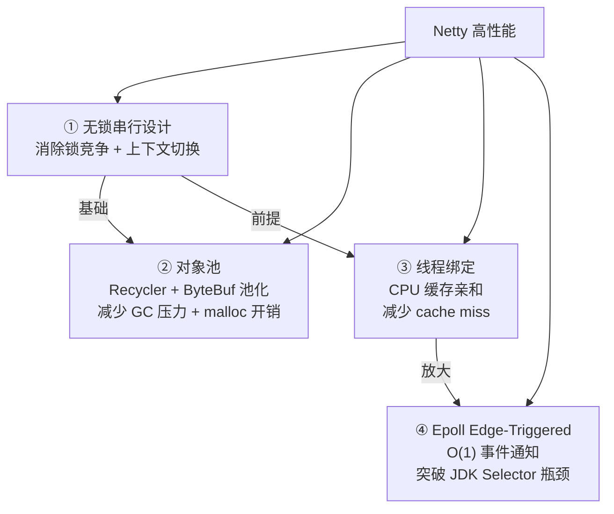
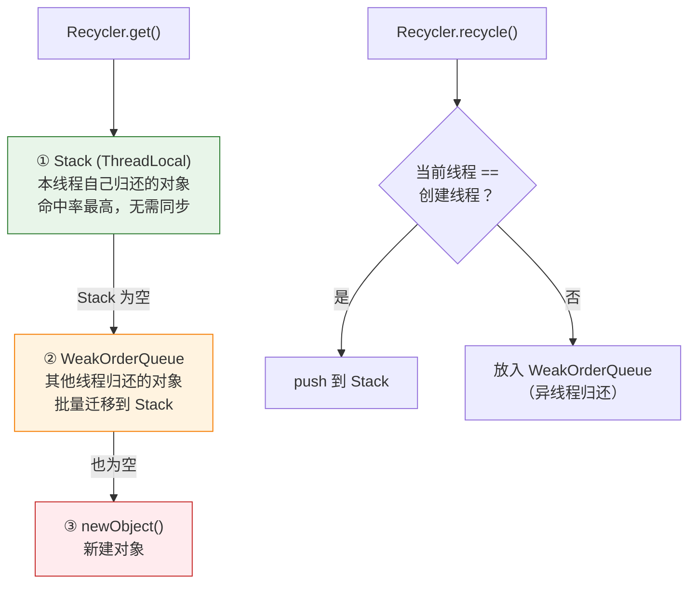

# 一、Netty 为什么快？——四个维度的合力

Netty 的高性能不是单一技巧，而是一套完整的设计哲学。四个核心设计相互配合，从不同维度消除开销：



它不是"挑一个最强的优化"，而是**每层的开销都被消除了，积少成多**。

---

# 二、无锁串行——Netty 线程模型的基石

## 2.1 加锁到底有多贵？

Java 中的锁开销来自三个层面：

| 开销来源 | 说明 | 典型耗时 |
|---------|------|---------|
| **CAS 自旋** | 乐观锁失败时的重试 | 数十~数百 ns |
| **Monitor Enter** | 重量级锁的 OS Mutex | 数 μs（含系统调用） |
| **上下文切换** | 阻塞在锁上的线程被挂起，CPU 切换执行上下文 | 数十 μs + Cache 失效 |

在高并发场景下，线程数远超 CPU 核数，锁竞争导致大量线程在**就绪队列 ↔ 阻塞队列**之间反复切换。每一次切换都意味着 CPU Cache 中的热数据被冲刷掉，下次被调度时需要重新从内存加载——这个隐藏开销比锁本身大得多。

**Netty 的做法**：让锁根本不需要存在。

## 2.2 串行化——用"绑定"取代"加锁"

```
核心约束：一个 Channel 终生绑定一个 EventLoop 线程

      Channel1 ──→ EventLoop 线程 A
      Channel2 ──→ EventLoop 线程 A    ← 两个 Channel 共享一个线程，但互不干扰
      Channel3 ──→ EventLoop 线程 B
      Channel4 ──→ EventLoop 线程 B

同一个 Channel 的所有操作永远在同一个线程中执行
→ 没有并发访问
→ 不需要加锁
→ 不需要 volatile（除了跨线程通信的控制字段）
→ 不需要考虑 happens-before
→ 代码是直观的、可预测的
```

```java
// Handler 中的代码：没有任何 synchronized、Lock、Atomic
// 但这就是线程安全的——因为它在 EventLoop 线程中执行
public class BizHandler extends ChannelInboundHandlerAdapter {
    private int counter = 0;  // 不需要 volatile，不需要 AtomicInteger
    
    @Override
    public void channelRead(ChannelHandlerContext ctx, Object msg) {
        counter++;  // 线程安全！只有 EventLoop 线程会访问这个字段
        processMessage((ByteBuf) msg);
    }
}
```

**关键认知**：这不是"没有了并发"——多个 Channel 分布在多个 EventLoop 上，并发依然存在。这是**"把并发粒度从方法调用提升到了 EventLoop 级别"**。每个 EventLoop 内部是串行的，但多个 EventLoop 之间天然并行。

## 2.3 跨线程操作的代价

当必须从外部线程访问 Channel 时，操作被封装成 Task 入队：

```java
// 外部线程调用
channel.writeAndFlush(msg);
// ↓ 内部实现
if (eventLoop.inEventLoop()) {
    // 直接在 EventLoop 线程中 → 直接写
    unsafe.write(msg, promise);
} else {
    // 外部线程 → 封装成 Task 入队
    eventLoop.execute(() -> unsafe.write(msg, promise));
}
```

这个机制保证了即使有上千个外部线程同时写同一个 Channel，最终落到 EventLoop 线程上的也是**串行执行**——MPSC 队列决定了这一点。

**为什么选择 MPSC 队列而不是传统的线程池？**

| 对比 | ThreadPoolExecutor | MPSC 队列 |
|------|-------------------|----------|
| 消费者数量 | 多个（`corePoolSize`） | **1 个**（EventLoop 线程自己） |
| 出队操作 | 需要加锁 | **不需要锁**（只有一个消费者） |
| 公平性 | 不保证 | **先入先出** |
| 适用场景 | 均衡负载 | 串行化指定 Channel 的操作 |

---

# 三、Recycler——轻量级对象池的三级缓存

## 3.1 为什么 GC 是 Netty 的敌人？

Netty 处理每秒几十万消息时，每条消息的流转会创建大量临时对象。这些对象的生命周期极短（在一个 Handler 方法内创建和丢弃），对 GC 形成巨大压力：

- **Young GC 频率升高**：Eden 区迅速被填满
- **GC 停顿**：即使是 Minor GC，在高吞吐场景下也会引起可感知的延迟抖动
- **晋升到 Old 区**：存活时间稍长的对象可能被误晋升，加剧 Full GC 风险

Netty 的 Recycler 用**对象复用**来减少创建/销毁的频率。

## 3.2 Recycler 的三级缓存结构



**三级缓存的工作原理**：

```
创建线程 T1 调用 Recycler.get()
  → 优先从 T1 的 ThreadLocal Stack 中 pop（同线程归还的）
    → Stack 为空 → 从其他线程的 WeakOrderQueue 中"批量迁移" 到 Stack
      → 所有 WeakOrderQueue 也为空 → 调用 newObject() 新建

异线程 T2 调用 recycle(obj)
  → 发现 obj 的创建线程是 T1，不是当前线程
    → 将 obj 放入 T2 → T1 的 WeakOrderQueue（LIFO 链表）
      → T1 下次 get() 时将整个 WeakOrderQueue 的链表头**整链迁移**到 Stack
```

**为什么异线程归还不能直接 push 到 Stack？**

如果 T2 直接 push 到 T1 的 Stack，需要加锁（Stack 是 T1 的 ThreadLocal 数据，T2 在并发写入）。Netty 的解决方案是让 T2 放入一个**专属的 WeakOrderQueue**（本质是 T2 到 T1 的单向链表），T1 在需要时**一次性**把整个链表迁移过来。这样：
- T2 写入时只需要对头结点 CAS（一次）
- T1 读取时不需要锁（整链迁移是 O(1) 的指针操作）

## 3.3 使用 Recycler 的正确姿势

```java
public class MyObject {
    // 1. 静态的 Recycler 实例（全局唯一）
    private static final Recycler<MyObject> RECYCLER = new Recycler<MyObject>() {
        @Override
        protected MyObject newObject(Handle<MyObject> handle) {
            return new MyObject(handle);  // 池空时创建新对象
        }
    };
    
    private final Recycler.Handle<MyObject> handle;
    
    private MyObject(Recycler.Handle<MyObject> handle) {
        this.handle = handle;  // Handle 是归还池的"钥匙"
    }
    
    public void recycle() {
        // 归还前清理状态——防止脏对象污染
        this.reset();
        handle.recycle(this);
    }
    
    public static MyObject newInstance() {
        return RECYCLER.get();  // 从池中获取（优先复用）
    }
    
    private void reset() {
        // 重置所有字段到初始状态
        // 如果忘记清理，下次 get() 拿到的对象会残留上次的数据！
    }
}

// 使用
MyObject obj = MyObject.newInstance();
try {
    doWork(obj);
} finally {
    obj.recycle();  // 归还——不是丢弃
}
```

**关键注意事项**：

1. **`recycle()` 后不能再使用对象** —— 它已经被回收，可能被另一个线程 `get()` 拿到
2. **必须在 `recycle()` 前重置状态** —— 这是 Recycler 使用中最容易出 bug 的地方
3. **`Handle` 绑定到对象实例** —— 不要跨对象共享 Handle

## 3.4 Recycler vs 对象池 vs ThreadLocal 对比

| 机制 | 适用场景 | 跨线程归还 | GC 友好？ |
|------|---------|-----------|----------|
| **Recycler** | 频繁创建/销毁的中等对象 | 支持（WeakOrderQueue） | 是（减少分配） |
| **PooledByteBufAllocator** | ByteBuf 的堆外内存 | 支持（Arena + ThreadLocal Cache） | 是（减少 malloc/free） |
| **ThreadLocal** | 每个线程独占的对象 | 不支持 | 取决于对象大小 |

---

# 四、线程绑定——CPU 缓存的极致利用

## 4.1 线程迁移的隐藏代价

当操作系统把一个线程从 CPU Core 0 迁移到 Core 3 时，发生的事远不止"改一下寄存器"：

```
线程在 Core 0 上执行时：
  L1 Cache（32KB, ~1ns）— 装满了当前 Channel 的热数据
  L2 Cache（256KB, ~3ns）— 装满了 Pipeline Handler 的字节码
  L3 Cache（共享, ~10ns）— 部分数据

线程被迁移到 Core 3：
  L1/L2 Cache 全部 miss → 从 L3 或主存重新加载 → 每次访问 +50~100ns
  这种 "cold start" 会持续数千个时钟周期，直到 Cache 重新预热
```

在高吞吐的 IO 场景中，每次 `channelRead` 处理的数据只有几百字节，但处理它的代码路径（`ByteToMessageDecoder.decode → BizHandler.channelRead → ctx.writeAndFlush`）涉及大量的字段访问和方法调用。如果 Cache 是冷的，这些操作会慢 10-50 倍。

## 4.2 Netty 如何利用线程绑定？

Netty 的 EventLoop 线程创建后**不会退出**（除非 shutdown）。虽然 Netty 没有显式调用 `taskset` 绑定 CPU 核，但操作系统调度器倾向于把长时间运行的线程保持在同一个核心上，形成了**事实上的 CPU 亲和性**。

```
// Netty 的 EventLoop 线程生命周期
创建 → 启动 → run() 死循环 → shutdown → 退出

在数小时/数天的运行中，
线程几乎一直在同一个核心上执行
→ L1/L2 Cache 始终保持热状态
→ 每个 IO 事件的处理都在热缓存中完成
```

**如果你需要显式绑定 CPU**，可以结合 `Affinity` 库：

```java
// 使用 Java-Thread-Affinity 库（可选）
EventLoopGroup group = new NioEventLoopGroup(4);
group.forEach(eventLoop -> {
    eventLoop.execute(() -> {
        int cpuId = eventLoop.hashCode() % 4;
        Affinity.setAffinity(cpuId);  // 显式绑定到 CPU cpuId
    });
});
```

但大多数场景不需要——OS 调度器已经在做这件事了。

## 4.3 线程绑定对内存访问模式的优化

另一个经常被忽略的优势：**NUMA 架构下的内存本地访问**。

现代多路服务器采用 NUMA（非一致性内存访问）架构，每个 CPU Socket 有自己的本地内存。EventLoop 线程长期停留在特定 CPU 上 → 该 CPU 的本地内存被优先分配 → 数据访问延迟最低。

---

# 五、Epoll Edge-Triggered——突破 JDK NIO 的性能天花板

## 5.1 JDK NIO Selector 的性能瓶颈

JDK 的 `Selector.open()` 在 Linux 上默认使用 `poll()` 系统调用（不是 `epoll`）。`poll()` 的性能特征：

```c
// poll() 的内核实现思想（简化）
int poll(struct pollfd *fds, nfds_t nfds, int timeout) {
    for (int i = 0; i < nfds; i++) {
        // 对每个 fd 检查是否有事件
        // O(n) 复杂度，n = 注册的 Channel 总数
        check_events(&fds[i]);
    }
}
```

**每个 `select()` 调用都要遍历所有注册的 Channel**。当连接数从 1K 增长到 10K 时，每次 `select()` 的开销增长 10 倍，但大部分连接是空闲的——这就是经典的 O(n) 问题。

```java
// JDK NIO Selector 的性能退化
// 1000 连接：每次 select 遍历 1000 个 fd → 几微秒
// 10000 连接：每次 select 遍历 10000 个 fd → 几十微秒  
// 100000 连接：每次 select 遍历 100000 个 fd → 毫秒级 → 吞吐崩溃
```

## 5.2 Epoll 如何做到 O(1)？

`epoll` 的核心机制是**事件驱动而非轮询**：

```c
// epoll 的两阶段设计
// 阶段 1: epoll_ctl() —— 注册感兴趣的 fd 和事件（红黑树索引）
// 阶段 2: epoll_wait() —— 只返回有事件就绪的 fd（就绪链表）

int epoll_wait(int epfd, struct epoll_event *events, int maxevents, int timeout) {
    // 检查就绪链表 (rdllist)
    // 如果有就绪事件 → 直接返回（只拷贝就绪的）
    // 如果没有就绪事件 → 阻塞等待
    // O(1) 复杂度（不随总连接数增长！）
}
```

```
epoll 的数据结构：

    epoll 实例
    ├── 红黑树（所有注册的 fd，用于 epoll_ctl 的增删改查）
    └── 就绪链表（有事件到达的 fd，epoll_wait 直接取）

当内核收到数据包 → 触发中断 → 将 fd 从红黑树移到就绪链表 → 唤醒 epoll_wait
```

**关键差异**：`epoll_wait` 只处理有事件就绪的 fd，不管总共注册了多少个。10 个连接中有 1000 个活跃，只处理这 10 个——时间复杂度取决于活跃连接数而非总连接数。

## 5.3 Level-Triggered vs Edge-Triggered

| 触发模式 | Level-Triggered (LT) | Edge-Triggered (ET) |
|---------|---------------------|-------------------|
| **通知行为** | 只要缓冲区有数据就**持续通知** | 只在数据从无到有的一刻通知**一次** |
| **未读完整** | 下次 epoll_wait 还会通知 | **不会**再通知！必须读到 EAGAIN |
| **编程复杂度** | 低（容忍不完整的读取） | 高（必须读完，否则数据丢失） |
| **性能** | 可能重复通知同一个 fd | 每个事件只通知一次，效率更高 |

JDK NIO 的 Selector 默认使用 **Level-Triggered**。Netty 的 `EpollEventLoop` 使用 **Edge-Triggered**，这意味着每次 read 必须一口气读完所有数据（循环 `read()` 直到返回 0 或 EAGAIN），但也因此避免了重复事件通知的开销。

Netty 对这些复杂性的处理是透明的：你在 Handler 中写 `channelRead` 时不需要关心底层是 LT 还是 ET——Netty 的 `unsafe.read()` 已经处理好了循环读取和 EAGAIN 判断。

## 5.4 切换方式与性能数据

```java
// Linux 上 Epoll 自动启用（优先级高于 NIO）
// 显式声明也不会出错
EpollEventLoopGroup boss = new EpollEventLoopGroup(1);
EpollEventLoopGroup worker = new EpollEventLoopGroup();

// 需要注意：需要额外引入 netty-transport-native-epoll 依赖
// <dependency>
//     <groupId>io.netty</groupId>
//     <artifactId>netty-transport-native-epoll</artifactId>
//     <classifier>linux-x86_64</classifier>
// </dependency>
```

**Netty 官方的 benchmark 数据**：在 100K 连接的场景下，EpollEventLoop 的吞吐比 NioEventLoop 高约 98%，CPU 使用率降低约 40%。这主要来自三个来源：
1. `epoll_wait` 的 O(1) 复杂度（vs `poll` 的 O(n)）
2. Edge-Triggered 避免重复通知
3. Netty 自己优化的 `SelectedSelectionKeySet`（数组替代 `HashSet`）

---

# 六、这四个设计如何协同工作？

一个读请求在 Netty 中的完整路径，揭示了这四个设计的协作关系：

```
① 网卡收到数据包 → 中断 → epoll 就绪链表中出现该 fd
    ↓
② EventLoop 线程从 epoll_wait() 返回（线程绑定：CPU Cache 是热的）
    ↓
③ processSelectedKeys() 用 SelectedSelectionKeySet（数组，O(1) 遍历）找到 Channel
    ↓
④ HeadContext.channelRead(msg) → ChannelPipeline 责任链启动
    ↓
⑤ 每个 Handler 的 channelRead() 在同一个 EventLoop 线程中执行（无锁串行）
    ↓
⑥ 需要分配 ByteBuf → PooledByteBufAllocator 从 ThreadLocal Cache 直接获取（对象池）
    ↓
⑦ 写回响应 → ctx.writeAndFlush(response)
    ↓
⑧ 数据进入 ChannelOutboundBuffer → epoll 再次通知 OP_WRITE → 数据写出
```

全链路中：
- **没有锁**
- **没有 GC 分配**（ByteBuf 从池中拿，对象从 Recycler 拿）
- **没有 Cache Miss**（线程绑定，代码和数据都是热的）
- **没有不必要的系统调用**（epoll 只通知有数据的 fd）

这就是 Netty 高性能的秘密——它不是在一个地方特别快，而是在所有地方都不慢。

---

# 七、总结

| 设计 | 消除的开销 | 实现方式 | 收益 |
|------|-----------|---------|------|
| **无锁串行** | 锁竞争 + 上下文切换 + 可见性开销 | Channel-EventLoop 终生绑定 | 代码简单、可预测、零同步开销 |
| **Recycler 对象池** | GC 分配 + 回收压力 | ThreadLocal Stack → WeakOrderQueue → newObject 三级 | 减少 90%+ 的对象分配 |
| **线程绑定** | Cache Miss + NUMA 远程访问 | EventLoop 线程长期不退出 | L1/L2 热缓存命中，不影响其他线程 |
| **Epoll ET** | poll() 的 O(n) 遍历 + LT 的重复通知 | epoll_wait 就绪链表 + ET 一次性通知 | 100K 连接场景吞吐翻倍 |

理解 Netty 的高性能，核心不是记忆这些技术，而是理解其设计哲学：**在每条 IO 路径上，找到并消除最大的那个开销——不是优化代码，而是让开销根本不存在。**
