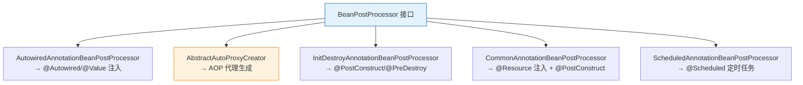
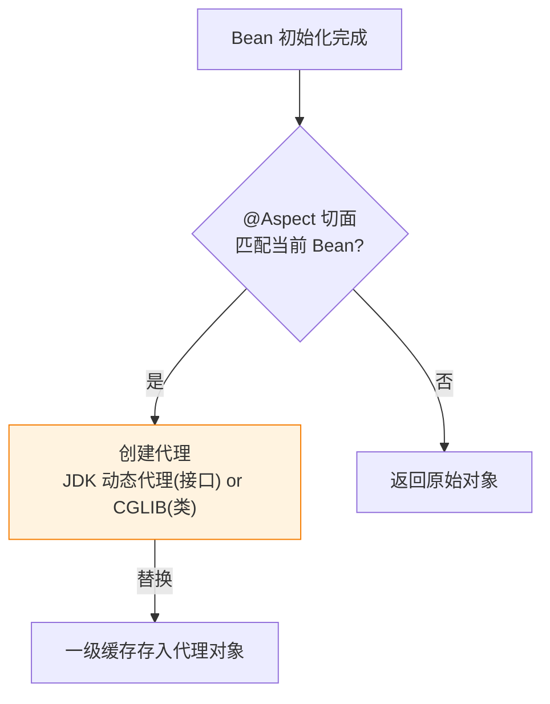

---

# 一、BeanPostProcessor 接口——一切扩展的入口

```java
public interface BeanPostProcessor {
    // 初始化前回调
    default Object postProcessBeforeInitialization(Object bean, String beanName) {
        return bean;  // 可返回原始对象或包装对象
    }
    // 初始化后回调
    default Object postProcessAfterInitialization(Object bean, String beanName) {
        return bean;  // ← AOP 代理在此创建！
    }
}
```

**核心设计**：在 Bean 初始化的前后两个节点插入拦截逻辑。Spring 本身的大量功能（@Autowired、@PostConstruct、AOP、@Async）都是通过实现这个接口完成的。

---

# 二、AutowiredAnnotationBeanPostProcessor——@Autowired 是如何工作的

```java
// 初始化前回调
public Object postProcessBeforeInitialization(Object bean, String beanName) {
    // 1. 反射找到所有 @Autowired 标记的字段和方法
    // 2. 从容器中按类型找到依赖 Bean
    // 3. 反射注入
    // 注意：依赖注入在初始化之前完成
}
```

**核心链**：`populateBean()` → `postProcessProperties()` → `InjectionMetadata.inject()` → 反射 set。

---

# 三、AbstractAutoProxyCreator——AOP 代理的创建者

```java
// 初始化后回调
public Object postProcessAfterInitialization(Object bean, String beanName) {
    if (bean != null) {
        Object cacheKey = getCacheKey(bean.getClass(), beanName);
        // 检查是否匹配切点（@Around / @Before / Advisor）
        Object[] specificInterceptors = getAdvicesAndAdvisorsForBean(bean.getClass(), beanName, null);
        if (specificInterceptors != DO_NOT_PROXY) {
            // 创建代理！
            Object proxy = createProxy(bean.getClass(), beanName, specificInterceptors, targetSource);
            return proxy;
        }
    }
    return bean;  // 不需要代理 → 返回原始对象
}
```



---

# 四、关键 BeanPostProcessor 速查

| BPP 实现 | 回调阶段 | 做了什么 |
|----------|---------|---------|
| **AutowiredAnnotationBeanPostProcessor** | before | @Autowired/@Value 注入 |
| **CommonAnnotationBeanPostProcessor** | before + after | @PostConstruct + @PreDestroy + @Resource |
| **AbstractAutoProxyCreator** | after | AOP 代理创建 |
| **AsyncAnnotationBeanPostProcessor** | after | @Async 代理 |
| **ScheduledAnnotationBeanPostProcessor** | after | @Scheduled 定时任务注册 |
| **ApplicationListenerDetector** | after | 自动注册 ApplicationListener |

---

# 五、如何自定义 BeanPostProcessor

```java
@Component
public class MyBeanPostProcessor implements BeanPostProcessor {
    
    @Override
    public Object postProcessBeforeInitialization(Object bean, String beanName) {
        // 在 @PostConstruct 之前执行
        if (bean instanceof MyService) {
            // ...自定义逻辑
        }
        return bean;  // 不能返回 null
    }
    
    @Override
    public Object postProcessAfterInitialization(Object bean, String beanName) {
        // 在 AOP 代理生成之后执行
        return bean;
    }
}
```

**注意**：BeanPostProcessor 本身需要被提前实例化和注册，所以建议标记为 `static` 或通过 `addBeanPostProcessor()` 直接注册。

---

# 六、总结

| 问题 | 答案 |
|------|------|
| **为什么 Spring 可扩展？** | 所有关键功能都是 BPP 实现的，替换 BPP 就替换了行为 |
| **为什么 @Autowired 能工作？** | AutowiredAnnotationBeanPostProcessor 在初始化前注入 |
| **为什么 AOP 能切到 Bean？** | AbstractAutoProxyCreator 在初始化后返回代理 |
| **为什么 BPP 顺序重要？** | 通过实现 PriorityOrdered/Ordered 控制先后（如 Common 在 AutoProxy 前面） |
