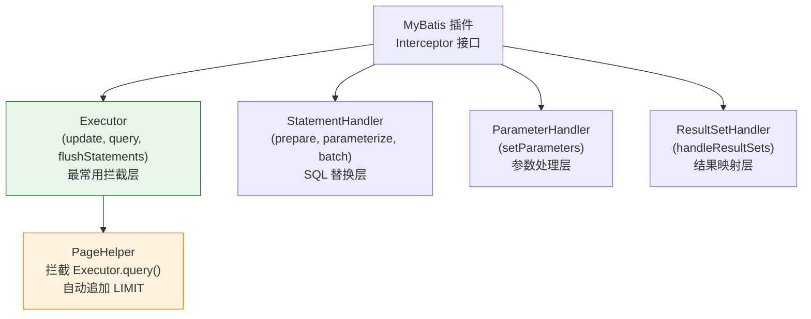
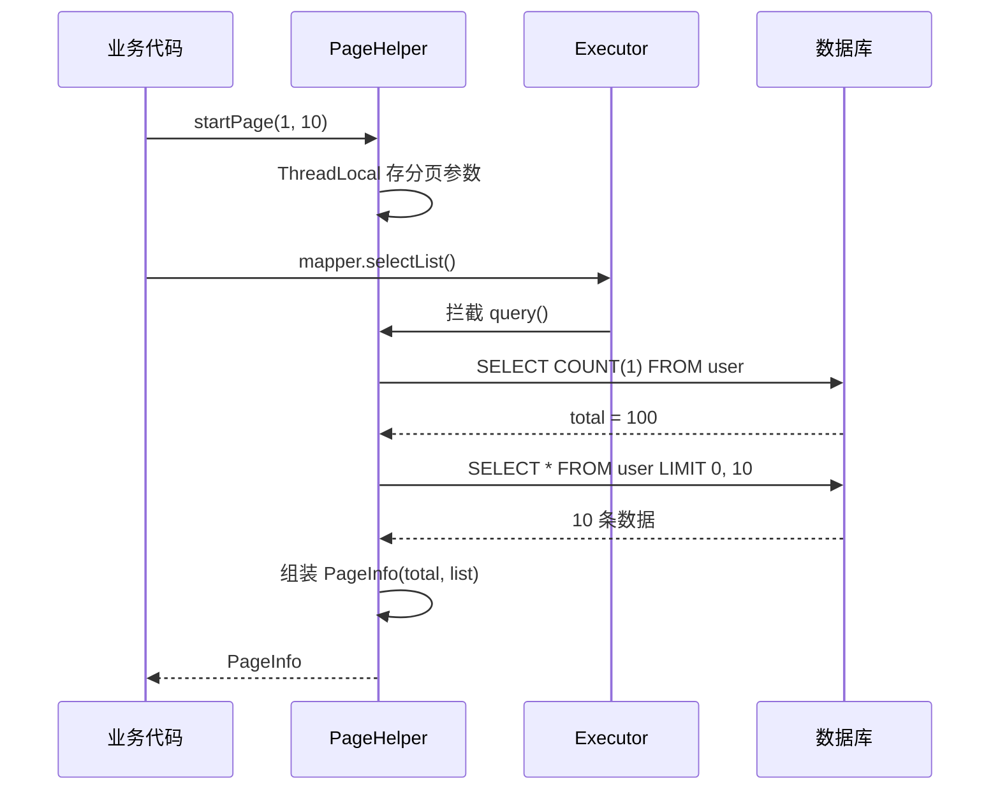
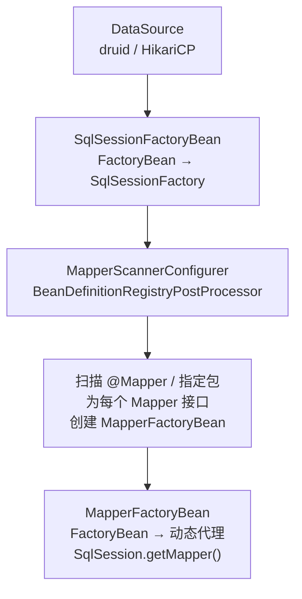

---

# 一、MyBatis 插件——Interceptor 四层拦截

## 1.1 接口与注解

```java
@Intercepts({
    @Signature(type = Executor.class, method = "query",
        args = {MappedStatement.class, Object.class, RowBounds.class, ResultHandler.class})
})
public class MyPlugin implements Interceptor {
    @Override
    public Object intercept(Invocation invocation) throws Throwable {
        System.out.println("before query");
        Object result = invocation.proceed();  // 放行
        System.out.println("after query");
        return result;
    }
}
```

## 1.2 四层拦截点

| 拦截层 | 做什么 | 典型使用 |
|--------|--------|---------|
| **Executor** | SQL 执行入口，控制查询/更新行为 | 分页、读写分离、缓存 |
| **StatementHandler** | 预编译和参数设置 | SQL 改写、表名替换 |
| **ParameterHandler** | 参数映射 | 统一参数处理 |
| **ResultSetHandler** | 结果集映射 | 结果脱敏 |

---

# 二、PageHelper——Executor 拦截的经典案例

```java
// PageHelper 的执行流程
PageHelper.startPage(1, 10);  // ① 设置分页参数（存入 ThreadLocal）

// ② 拦截 Executor.query()
// → 拿到原始 SQL："SELECT * FROM user"
// → 自动追加 COUNT："SELECT COUNT(1) FROM user" → 查总数
// → 自动追加 LIMIT："SELECT * FROM user LIMIT 0, 10" → 查分页数据
```



---

# 三、Spring 整合 MyBatis——三个关键组件

| 组件 | 职责 |
|------|------|
| **SqlSessionFactoryBean** | 创建 SqlSessionFactory，配置 DataSource + Mapper XML 扫描 |
| **MapperScannerConfigurer** | 扫描 Mapper 接口，动态生成代理 Bean 注册到 IoC |
| **SqlSessionTemplate** | SqlSession 的线程安全封装 |



---

# 四、整合的常见问题

| 问题 | 原因 | 解法 |
|------|------|------|
| Mapper 找不到 | MapperScanner 没扫到包 | 加 `@MapperScan("com.example.mapper")` |
| PageHelper 不生效 | 插件没注册到 SqlSessionFactory | `factory.setPlugins(new PageInterceptor())` |
| 事务不回滚 | 异常被 MyBatis 吞了 | `@Transactional` 在 Service 层加 |
| SqlSession 线程安全问题 | 直接用 DefaultSqlSession | 用 SqlSessionTemplate（线程安全） |

---

# 五、总结

| 边界 | MyBatis | Spring |
|------|---------|--------|
| **Bean 管理** | 不管理 | 通过 MapperFactoryBean 注册到 IoC |
| **事务** | 手动 commit/rollback | 通过 `@Transactional` + DataSourceTransactionManager |
| **连接池** | 不管理 | DataSource 由 Spring 管理的 HikariCP/Druid |
| **插件** | Interceptor 链 | Spring 管理插件注册到 SqlSessionFactory |
