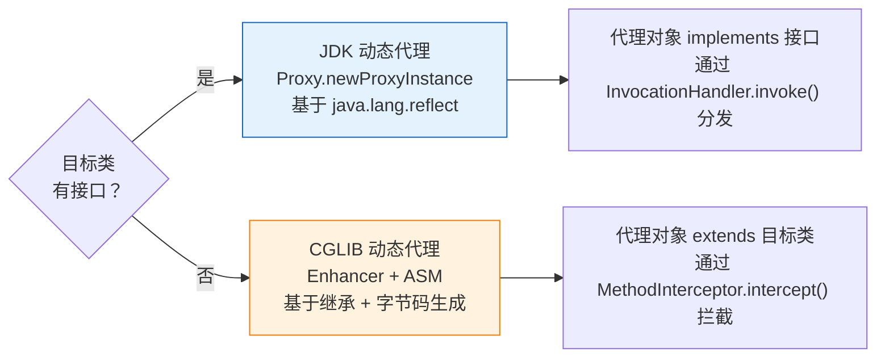

---

# 一、JDK 动态代理——接口代理的宿命

## 1.1 核心实现

```java
// JDK 动态代理只生成三个类：
// 1. 目标接口（UserService）
// 2. InvocationHandler 实现
// 3. Proxy 生成的代理类（$Proxy0，implements 目标接口）

UserService proxy = (UserService) Proxy.newProxyInstance(
    target.getClass().getClassLoader(),
    target.getClass().getInterfaces(),
    (proxyObj, method, args) -> {
        System.out.println("before");
        Object result = method.invoke(target, args);  // 反射调用目标方法
        System.out.println("after");
        return result;
    }
);
```

## 1.2 致命限制

```java
// ❌ JDK 代理只能代理接口方法
UserImpl proxy = (UserImpl) Proxy.newProxyInstance(...);
// ClassCastException! $Proxy0 implements UserService, not UserImpl

// ✅ 必须用接口引用接收
UserService proxy = (UserService) Proxy.newProxyInstance(...);
```

**为什么 Spring 默认先用 JDK 代理？** 因为 JDK 代理是标准库的一部分，零外部依赖，JVM 对 `java.lang.reflect.Proxy` 有深度优化。

---

# 二、CGLIB——字节码生成的接管

## 2.1 底层原理

```java
// CGLIB 生成的代理类结构：
public class UserServiceImpl$$EnhancerByCGLIB$$ extends UserServiceImpl {
    // 覆写所有非 final 方法
    @Override
    public void createUser(User user) {
        MethodInterceptor interceptor = ...;
        interceptor.intercept(this, originalMethod, args, methodProxy);
        // → 先执行 Advice（@Before/@Around）
        // → 再执行 super.createUser(user)
        // → 再执行 Advice（@After/@AfterReturning）
    }
}
```

## 2.2 关键限制

| 限制 | 原因 |
|------|------|
| **不能代理 final 类** | `extends` 不了 |
| **不能代理 final 方法** | `@Override` 不了 |
| **构造器会被调用两次** | 代理对象的构造器 + 目标对象的构造器 |
| **目标类需要无参构造器** | CGLIB 的子类构造器隐式调用 `super()` |

## 2.3 Objenesis——绕过构造器的黑科技

```java
// Spring 4.0+ 结合 CGLIB + Objenesis：
// 代理对象的创建不经过目标类的构造器，直接通过 Unsafe 分配内存
// 解决了"目标类必须有无参构造器"的限制
Enhancer enhancer = new Enhancer();
enhancer.setStrategy(new ObjenesisCglibAopProxy.ObjenesisProxyFactory());
```

---

# 三、性能对比

| | JDK 动态代理 | CGLIB |
|------|------------|-------|
| **创建代理耗时** | 快（类生成简单） | 慢（生成字节码 + 类加载） |
| **方法调用耗时** | 反射 invoke → 较慢 | 直接方法调用（继承） → 快 |
| **内存占用** | 低 | 高（生成的类更多） |
| **依赖** | 无（JRE 自带） | ASM + CGLIB jar |

**Spring 的策略**（`proxyTargetClass`）：

```java
// 默认：有接口用 JDK，无接口用 CGLIB
@EnableAspectJAutoProxy  // proxyTargetClass = false

// 强制 CGLIB：Spring Boot 2.x+ 默认行为
@EnableAspectJAutoProxy(proxyTargetClass = true)
```

---

# 四、总结

| 问题 | 答案 |
|------|------|
| **JDK vs CGLIB 本质区别** | 接口代理 vs 继承代理 |
| **Spring Boot 默认用哪个** | CGLIB（proxyTargetClass=true） |
| **CGLIB 为什么不能代理 final** | `extends` 限制 |
| **性能何时有差距** | 方法调用时 CGLIB 更快，代理创建时 JDK 更快 |
