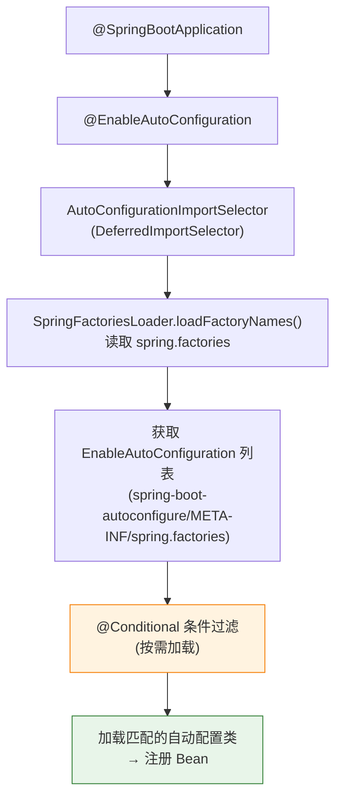
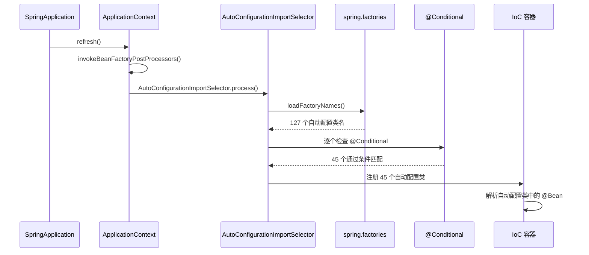

---

# 一、入口 @SpringBootApplication

```java
@SpringBootApplication
public class Application {
    public static void main(String[] args) {
        SpringApplication.run(Application.class, args);
    }
}

// @SpringBootApplication = @SpringBootConfiguration 
//                         + @EnableAutoConfiguration  ← 自动配置
//                         + @ComponentScan            ← 包扫描
```

---

# 二、AutoConfigurationImportSelector——配置类筛选器

```java
// 核心方法：决定加载哪些自动配置类
protected List<String> getCandidateConfigurations(AnnotationMetadata metadata, 
                                                   AnnotationAttributes attributes) {
    // 从 spring.factories 读取所有自动配置类名
    List<String> configurations = SpringFactoriesLoader.loadFactoryNames(
        EnableAutoConfiguration.class, getBeanClassLoader());
    return configurations;
}
// spring-boot-autoconfigure-2.x.x.jar!/META-INF/spring.factories
// 返回 100+ 个自动配置类名：
// org.springframework.boot.autoconfigure.web.servlet.WebMvcAutoConfiguration
// org.springframework.boot.autoconfigure.jdbc.DataSourceAutoConfiguration
// ...
```

---

# 三、spring.factories——SPI 配置文件

```
# spring-boot-autoconfigure/META-INF/spring.factories
org.springframework.boot.autoconfigure.EnableAutoConfiguration=\
  WebMvcAutoConfiguration,\              # 有 Spring MVC 依赖时加载
  DataSourceAutoConfiguration,\          # 有 DataSource 依赖时加载
  DataSourceTransactionManagerAutoConfiguration,\
  RedisAutoConfiguration,\               # 有 Redis 依赖时加载
  KafkaAutoConfiguration,\               # 有 Kafka Starter 时加载
  ...  # 约 100+ 个自动配置类
```

---

# 四、@Conditional 条件注解——精确控制加载

```java
@Configuration
@ConditionalOnClass({ DataSource.class, EmbeddedDatabaseType.class })  // ① 类存在
@EnableConfigurationProperties(DataSourceProperties.class)             // ② 配置绑定
@Import({ DataSourcePoolMetadataProvidersConfiguration.class })
public class DataSourceAutoConfiguration {
    
    @Bean
    @ConditionalOnMissingBean  // ③ 用户没自己定义 DataSource
    @ConditionalOnProperty(name = "spring.datasource.type")  // ④ 配置了类型
    public DataSource dataSource(DataSourceProperties properties) {
        return properties.initializeDataSourceBuilder().build();
    }
}
```

| 条件注解 | 含义 |
|----------|------|
| `@ConditionalOnClass` | classpath 中存在指定类 |
| `@ConditionalOnMissingClass` | classpath 中不存在指定类 |
| `@ConditionalOnBean` | IoC 容器中存在指定 Bean |
| `@ConditionalOnMissingBean` | IoC 容器中不存在指定 Bean |
| `@ConditionalOnProperty` | 配置文件中存在指定属性 |
| `@ConditionalOnResource` | classpath 中存在指定资源文件 |
| `@ConditionalOnWebApplication` | 是 Web 应用 |

---

# 五、自动配置的执行时序



---

# 六、如何自定义自动配置

```java
// ① 写自动配置类
@Configuration
@ConditionalOnClass(MyService.class)
@EnableConfigurationProperties(MyProperties.class)
public class MyAutoConfiguration {
    @Bean
    @ConditionalOnMissingBean
    public MyService myService(MyProperties props) {
        return new MyServiceImpl(props.getUrl());
    }
}

// ② 写 spring.factories
// resources/META-INF/spring/org.springframework.boot.autoconfigure.AutoConfiguration.imports
// (Spring Boot 2.7+: 用 imports 文件替代 spring.factories)
org.myproject.MyAutoConfiguration
```

---

# 七、总结

| 步骤 | 关键组件 |
|------|---------|
| **入口** | `@EnableAutoConfiguration` |
| **加载候选** | `SpringFactoriesLoader.loadFactoryNames()` 读 spring.factories |
| **条件过滤** | `@ConditionalOnClass/OnBean/OnProperty` 等 |
| **注册 Bean** | 匹配的配置类被解析，其 `@Bean` 方法注册到 IoC |
