# 历史背景——为什么 Spring MVC 要在 Filter 之上再造一个 Interceptor？

2003 年，Servlet 规范定义了 `Filter` 接口——这是 Java Web 应用拦截请求的唯一标准方式。但在 Spring MVC 的架构中，Filter 有一个根本问题：**它工作在 Servlet 容器层，不知道 Spring MVC 的 Controller、HandlerMapping、ModelAndView 是什么。**

举个具体场景：你想在请求处理前记录"这个请求被哪个 Controller 的哪个方法处理了"。Filter 做不了——因为它拿到的是 `ServletRequest` 和 `ServletResponse`，不知道后面谁处理。同样，你想在 Controller 返回后统一修改 ModelAndView——Filter 也做不了。

Spring MVC 在 DispatcherServlet 之后插入了一层（"欢迎来到 Spring 内部！"），给这层起了个名字叫 **Interceptor**。它不是 Filter 的替代品——它们是两层，各自负责不同的事。

---

# 一、请求处理全链路——两层在哪干活

```mermaid
flowchart LR
    REQ["HTTP 请求"] --> TOMCAT["Tomcat\n(Servlet 容器)"]
    
    TOMCAT --> F1["Filter 1\ndoFilter()"]
    F1 --> F2["Filter 2\ndoFilter()"]
    F2 --> DS["DispatcherServlet\n(Spring 入口)"]
    
    DS --> HM["HandlerMapping\n找到对应的 Controller"]
    HM --> I1["Interceptor 1\npreHandle()"]
    I1 --> I2["Interceptor 2\npreHandle()"]
    I2 --> CTL["Controller 方法执行"]
    CTL --> I2B["Interceptor 2\npostHandle()"]
    I2B --> I1B["Interceptor 1\npostHandle()"]
    I1B --> VR["视图渲染"]
    VR --> I2C["Interceptor 2\nafterCompletion()"]
    I2C --> I1C["Interceptor 1\nafterCompletion()"]
    
    I1C --> F2B["Filter 2\n(返回)"]
    F2B --> F1B["Filter 1\n(返回)"]
    F1B --> RESP["HTTP 响应"]
```



**关键认知**：Filter 包围着整个 DispatcherServlet；Interceptor 在 DispatcherServlet 内部。这意味着 **Filter 能看到"请求进入 Spring"之前和"响应离开 Spring"之后的一切，但不知道 Spring 内部发生了什么。**

---

# 二、Filter 核心机制——doFilter 链、责任链与 OncePerRequestFilter

## 2.1 Filter 的三段生命周期

```java
public interface Filter {
    // ① 初始化——Filter 实例创建后调用，只执行一次
    default void init(FilterConfig filterConfig) throws ServletException {}
    
    // ② 核心方法——每个请求经过时调用
    void doFilter(ServletRequest request, ServletResponse response, 
                  FilterChain chain) throws IOException, ServletException;
    
    // ③ 销毁——应用关闭时调用，只执行一次
    default void destroy() {}
}
```

## 2.2 doFilter 链——责任链模式的经典实现

```java
// Filter 链的执行逻辑（Tomcat 内部实现简化版）
public class ApplicationFilterChain implements FilterChain {
    private Filter[] filters;
    private int position = 0;
    
    @Override
    public void doFilter(ServletRequest request, ServletResponse response) {
        if (position < filters.length) {
            Filter filter = filters[position++];
            filter.doFilter(request, response, this);  // ← 把 chain 传给下一个 Filter
            // filter.doFilter() 返回 = 这个 Filter 完成了响应部分的处理
        } else {
            servlet.service(request, response);  // ← 链尾：进入 DispatcherServlet
        }
    }
}
```

**Filter 的执行顺序由 `@Order` 或 `Ordered` 控制**——数值越小越先执行。请求进入时按升序执行，响应返回时按降序执行（栈式出栈）。

## 2.3 OncePerRequestFilter——解决重复执行问题

Servlet 中有 `forward()` 和 `include()` 机制——一个请求可能被**多次转发到不同的 Servlet**。如果你的 Filter 没有做判断，它会在每次 forward/include 时都执行一次。

```java
// ❌ 普通 Filter：forward 时会被执行多次
public class MyFilter implements Filter {
    @Override
    public void doFilter(ServletRequest req, ServletResponse resp, FilterChain chain) {
        // 第一次请求 → 执行
        // forward 到另一个 Servlet → 又被执行一次！
        chain.doFilter(req, resp);
    }
}

// ✅ OncePerRequestFilter：保证同一个请求只执行一次
@Component
public class MyFilter extends OncePerRequestFilter {
    @Override
    protected void doFilterInternal(HttpServletRequest request,
                                     HttpServletResponse response,
                                     FilterChain filterChain) {
        // 内部用 request.setAttribute("alreadyFiltered." + filterName, true) 做标记
        // 如果已经执行过 → 直接调 chain.doFilter 跳过
        filterChain.doFilter(request, response);
    }
}
```

**面试中经常追问**：你写的 Filter 是 implements Filter 还是 extends OncePerRequestFilter？有什么区别？——前者每次请求/forward 都执行，后者保证同个请求只执行一次。

## 2.4 Spring 内置的三个 Filter

| Filter | 继承自 | 作用 |
|--------|--------|------|
| **`OncePerRequestFilter`** | — | 请求级去重（Spring 所有内置 Filter 都继承自它） |
| **`AbstractRequestLoggingFilter`** | `OncePerRequestFilter` | 自动打印请求体/头/参数日志 |
| **`CorsFilter`** | `OncePerRequestFilter` | Spring 的跨域解决方案（替代 `@CrossOrigin`） |
| **`CharacterEncodingFilter`** | `OncePerRequestFilter` | 强制设置请求/响应编码 |

---

# 三、Interceptor 核心机制——三个拦截点的精确语义

## 3.1 HandlerInterceptor 接口

```java
public interface HandlerInterceptor {
    
    // ① Controller 方法执行前
    //    返回 true → 继续执行链 → 进入下一个 Interceptor 或 Controller
    //    返回 false → 中断！（后续 Interceptor 和 Controller 都不会执行）
    //    handler 参数 = HandlerMethod 对象（可以拿到 Controller 类、方法、参数注解）
    default boolean preHandle(HttpServletRequest request, 
                               HttpServletResponse response, 
                               Object handler) throws Exception {
        return true;
    }
    
    // ② Controller 方法执行后，视图渲染前
    //    只有 preHandle 返回 true 且 Controller 正常返回时才会调用
    //    Controller 抛异常 → 这个函数不会被执行！
    //    modelAndView 可以被修改（加公共属性）
    default void postHandle(HttpServletRequest request, 
                             HttpServletResponse response, 
                             Object handler,
                             @Nullable ModelAndView modelAndView) throws Exception {}
    
    // ③ 请求处理完毕（视图渲染后）
    //    无论如何都会执行（只要 preHandle 返回 true）
    //    ex 非 null → Controller 抛出了异常
    //    典型用途：记录请求耗时、清理 ThreadLocal 资源
    default void afterCompletion(HttpServletRequest request, 
                                  HttpServletResponse response, 
                                  Object handler,
                                  @Nullable Exception ex) throws Exception {}
}
```

## 3.2 preHandle=false 的执行规则——最容易答错的细节

```
注册顺序: Interceptor1 → Interceptor2

正常情况（都返回 true）：
  pre:  I1 → I2
  post: I2 → I1
  aft:  I2 → I1

I2.preHandle() 返回 false 的情况：
  pre:  I1 → I2(返回 false)
  post: 无（I2 返回 false，post 全不执行）
  aft:  I1（只有 I1！I2 返回 false 意味着它的 preHandle 没通过 → 不应该执行它的 afterCompletion）

面试追问：如果 I1.preHandle() 返回 false，I2 会怎么样？
  答案：I2 完全不会被调用——pre/port/afterCompletion 都不会。
  因为 I2 根本没有进入拦截器链。
```

## 3.3 Interceptor 的注册与执行顺序

```java
@Configuration
public class WebConfig implements WebMvcConfigurer {
    @Override
    public void addInterceptors(InterceptorRegistry registry) {
        registry.addInterceptor(new Interceptor1())
                .addPathPatterns("/api/**")          // 拦截 /api/ 下的所有路径
                .excludePathPatterns("/api/health");  // 健康检查不拦截
        
        registry.addInterceptor(new Interceptor2())
                .addPathPatterns("/**");              // 拦截所有
    }
}

// 执行顺序（按 addInterceptor 调用的顺序）：
// preHandle: I1 → I2
// postHandle: I2 → I1（逆序！先注册的 intercept 执行 preHandle 最前，执行 postHandle/afterCompletion 最后）
// afterCompletion: I2 → I1
```

## 3.4 获取目标 Controller 和方法——这是 Interceptor 独有的能力

```java
@Component
public class AuthInterceptor implements HandlerInterceptor {
    
    @Override
    public boolean preHandle(HttpServletRequest request, 
                             HttpServletResponse response, 
                             Object handler) {
        
        if (handler instanceof HandlerMethod handlerMethod) {
            // 获取目标 Controller 类
            Class<?> controllerClass = handlerMethod.getBeanType();
            
            // 获取目标方法
            Method method = handlerMethod.getMethod();
            
            // 获取方法上的注解
            if (method.isAnnotationPresent(RequireAuth.class)) {
                RequireAuth auth = method.getAnnotation(RequireAuth.class);
                // 根据注解做鉴权...
                return checkPermission(auth.role());
            }
            
            // 获取方法参数
            MethodParameter[] parameters = handlerMethod.getMethodParameters();
            for (MethodParameter param : parameters) {
                if (param.hasParameterAnnotation(RequestBody.class)) {
                    // 可以做参数校验、日志、脱敏...
                }
            }
        }
        
        return true;
    }
}
```

**这是 Filter 永远做不到的事情**——Filter 不知道请求会被哪个方法处理，它只看到 `ServletRequest`。

---

# 四、十个维度逐项对比

| 维度 | Filter | Interceptor |
|------|--------|-------------|
| **规范归属** | Servlet API（`javax.servlet.Filter`） | Spring MVC（`HandlerInterceptor`） |
| **依赖** | 依赖 Servlet 容器，**不依赖** Spring | **依赖** Spring MVC，必须在容器中注册 |
| **拦截范围** | 所有请求（含 .css/.js/图片/静态资源） | 只拦截被 Spring MVC 的 HandlerMapping 映射的请求 |
| **触发时机** | **DispatcherServlet 之前** | **DispatcherServlet 之后**（Handler 已确定） |
| **能否获取目标方法** | ❌ 不知道谁处理请求 | ✅ `handler` 是 `HandlerMethod` 对象 |
| **能否获取 Controller** | ❌ 不知道哪个 Controller | ✅ `handlerMethod.getBeanType()` |
| **能否注入 Spring Bean** | ✅ 可以，但 Filter 自己需要注册为 Bean 或在 `doFilter` 中手动从 ApplicationContext 获取 | ✅ 天然支持（Interceptor 注册在 Spring 容器中） |
| **能否修改请求体** | ✅ `HttpServletRequestWrapper` | ❌ 只能读取请求属性 |
| **能否修改响应体** | ✅ `HttpServletResponseWrapper` | ❌ 只能通过 `postHandle` 修改 `ModelAndView` |
| **异常处理** | Filter 层异常直接影响容器，不走 `@ControllerAdvice` | Interceptor 异常在 Spring 上下文内，可被 `@ControllerAdvice` 捕获 |

---

# 五、两个经典踩坑场景

## 场景 1：Filter 中读请求体后 Controller 读到空

```java
// ❌ 问题代码：Filter 中打印请求体后，Controller 的 @RequestBody 解析失败
@Component
public class LoggingFilter extends OncePerRequestFilter {
    @Override
    protected void doFilterInternal(HttpServletRequest request,
                                     HttpServletResponse response,
                                     FilterChain chain) {
        String body = StreamUtils.copyToString(request.getInputStream(), UTF_8);
        log.info("Request body: {}", body);
        chain.doFilter(request, response);  // ← request 的 InputStream 已经读到底了！
        // → Controller 中 @RequestBody 反序列化时 InputStream 已经空了
    }
}
```

**根因**：`HttpServletRequest` 的 `InputStream` 只能读一次，读了就消耗完了。

**✅ 正确做法**：包装请求，缓存请求体：

```java
@Component
public class LoggingFilter extends OncePerRequestFilter {
    
    @Override
    protected void doFilterInternal(HttpServletRequest request,
                                     HttpServletResponse response,
                                     FilterChain chain) throws IOException, ServletException {
        // ① 先包装 Request（缓存请求体）
        ContentCachingRequestWrapper wrappedRequest = 
            new ContentCachingRequestWrapper(request);
        
        // ② 正常走 Filter 链（先让请求处理完）
        chain.doFilter(wrappedRequest, response);
        
        // ③ 请求处理完毕后再读缓存的请求体
        byte[] body = wrappedRequest.getContentAsByteArray();
        // ⚠️ 只能在请求处理完后读！因为它是"处理后缓存"而非"预读"
        log.info("Request body: {}", new String(body, UTF_8));
    }
}

// 如果需要"在请求处理前"读取请求体：
// 需要自己实现 HttpServletRequestWrapper 预读 + 缓存
public class CachedBodyHttpServletRequest extends HttpServletRequestWrapper {
    private final byte[] cachedBody;
    
    public CachedBodyHttpServletRequest(HttpServletRequest request) throws IOException {
        super(request);
        this.cachedBody = StreamUtils.copyToByteArray(request.getInputStream());
    }
    
    @Override
    public ServletInputStream getInputStream() {
        return new CachedBodyServletInputStream(this.cachedBody);
    }
    
    @Override
    public BufferedReader getReader() {
        return new BufferedReader(new InputStreamReader(new ByteArrayInputStream(this.cachedBody)));
    }
}
```

## 场景 2：Filter 中鉴权失败抛异常但不走全局异常处理

```java
// ❌ 问题：Filter 中抛异常 → @ControllerAdvice 捕获不到
@Component
public class AuthFilter extends OncePerRequestFilter {
    @Override
    protected void doFilterInternal(HttpServletRequest request,
                                     HttpServletResponse response,
                                     FilterChain chain) {
        String token = request.getHeader("Authorization");
        if (token == null) {
            throw new UnauthorizedException("未登录");  
            // ← 这个异常在 Filter 层抛出 → 不经过 DispatcherServlet
            // → @ControllerAdvice 根本看不到它 → 客户端收到 500 而不是 401
        }
        chain.doFilter(request, response);
    }
}
```

**根因**：`@ControllerAdvice` 是 Spring MVC 的异常处理机制，工作在 DispatcherServlet 内。Filter 在 DispatcherServlet 之前，抛出的异常直接被 Servlet 容器捕获。

**三种解法**：

```java
// 解法 ①：Filter 中直接写 response（推荐）
@Override
protected void doFilterInternal(HttpServletRequest request,
                                 HttpServletResponse response,
                                 FilterChain chain) throws IOException {
    if (token == null) {
        response.setStatus(401);
        response.setContentType("application/json");
        response.getWriter().write("{\"error\":\"未登录\"}");
        return;  // ← 不调 chain.doFilter
    }
    chain.doFilter(request, response);
}

// 解法 ②：把鉴权逻辑从 Filter 移到 Interceptor
// → Interceptor 异常在 Spring 上下文中 → @ControllerAdvice 能捕获

// 解法 ③：用 Spring Security（内部有 ExceptionTranslationFilter 专门处理这个）
```

---

# 六、Spring Security 的 Filter 链——为什么鉴权只能用 Filter

Spring Security 的所有功能都基于 Filter 链。理解它就能回答"为什么 Spring Security 不用 Interceptor 做鉴权？"

```
Security Filter Chain 的核心 Filter（按顺序）：

  SecurityContextPersistenceFilter  
    → 从 HttpSession 恢复 SecurityContext
    → 或新建空的 SecurityContext

  UsernamePasswordAuthenticationFilter
    → 拦截 POST /login
    → 从请求中提取 username/password
    → 调用 AuthenticationManager.authenticate()

  BasicAuthenticationFilter
    → 拦截 Authorization: Basic ... 头
    → 后台服务之间的认证

  ExceptionTranslationFilter
    → 捕获下游 Filter 抛出的 AuthenticationException → 返回 302（重定向登录页）
    → 捕获下游 Filter 抛出的 AccessDeniedException → 返回 403
    → **这就是为什么 Filter 鉴权也能有好的异常处理——Spring Security 自己兜底了**

  FilterSecurityInterceptor
    → 检查当前用户是否有权限访问该 URL
    → 调用 AccessDecisionManager.decide()
```

**Spring Security 必须用 Filter 的三个原因**：

1. **必须工作在请求的最外层**——安全防线不能放在 DispatcherServlet 之后，必须在请求进入 Spring MVC 核心之前就完成身份确认
2. **需要替换/包装 HttpServletRequest**——Spring Security 用自己的 `SecurityContextHolder` 代替了 `HttpSession`，这只能通过 Filter 的 `HttpServletRequestWrapper` 实现
3. **需要包装 Response**——`ExceptionTranslationFilter` 需要拦截下游异常并转换为 HTTP 重定向（302），这需要包装 `HttpServletResponse`

---

# 七、选型决策树

```
你需要拦截静态资源请求（.css/.js/图片）吗？
  ├── 是 → Filter（Interceptor 看都不看静态资源）
  └── 否 → 继续 ↓

你需要知道请求被哪个 Controller 的哪个方法处理吗？
  ├── 是 → Interceptor
  └── 否 → 继续 ↓

你需要修改请求体/响应体内容（加密/解密、内容替换）吗？
  ├── 是 → Filter（HttpServletRequestWrapper/HttpServletResponseWrapper）
  └── 否 → 继续 ↓

你需要做认证/授权（安全防线，不能放进 Spring MVC 内部）吗？
  ├── 是 → Filter（或直接用 Spring Security）
  └── 否 → 继续 ↓

以上都不是 → 两者都可以，Interceptor 更方便（有 Spring 上下文 + 注入方便）
```

---

# 八、总结

| 问题 | 答案 |
|------|------|
| **Filter 和 Interceptor 的本质差异** | Filter 是 Servlet 容器层，工作在 DispatcherServlet 之前；Interceptor 是 Spring MVC 层，工作在 HandlerMapping 找到 Controller 之后 |
| **Filter 的最大优势** | 可以包装请求/响应体（`HttpServletRequestWrapper`） |
| **Interceptor 的最大优势** | 可以获取目标 Controller 和方法（`HandlerMethod`），可以用 Spring 注入 |
| **Filter 鉴权为什么可能出问题** | Filter 层的异常不走 `@ControllerAdvice`，需要自己处理 |
| **Spring Security 为什么是 Filter 链** | 安全防线必须在请求进入 Spring MVC 核心之前，且需要替换/包装 Request 和 Response |
| **什么时候用 Filter** | 安全管控、请求/响应体改写、静态资源拦截 |
| **什么时候用 Interceptor** | 日志、权限注解检查、Controller 级别拦截、统一 ModelAndView 处理 |

# 延伸阅读

**Do——动手验证：**
- 同时注册一个 Filter 和一个 Interceptor，各打一条日志，观察执行顺序是否和本文的时序图一致
- 在 Interceptor 的 `preHandle` 中 `return false`，观察 `afterCompletion` 是否仍然被调用
- 写一个 Filter 日志拦截，读请求体后用 `ContentCachingRequestWrapper` 包装，确认 Controller 能正常反序列化请求体

**Todo——深入方向：**
- `FilterRegistrationBean` vs `@WebFilter`——两种注册 Filter 的方式在 Spring Boot 中的优先级差异
- Spring Security 的 `ExceptionTranslationFilter` 源码分析——它是如何把 `AuthenticationException` 转译为 `302 重定向`的
- `@ControllerAdvice` 覆盖的范围边界——除了 Filter，还有哪些异常它捕获不到

*本文参考资料：*
- Servlet 4.0 Specification: Filter Interface
- Spring Framework 6.x Documentation: HandlerInterceptor / WebMvcConfigurer
- Spring Security Architecture Reference: Security Filter Chain
