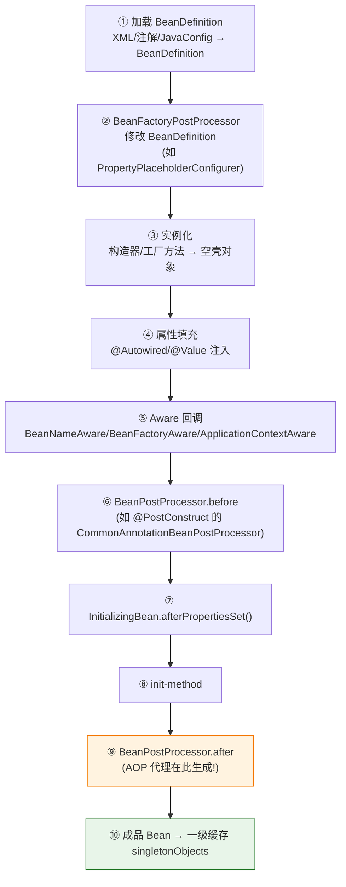

---

# 一、BeanDefinition 加载——Bean 的"设计图纸"

```java
// 三种配置方式，最终都变成 BeanDefinition
@Component         // 注解扫描 → ClassPathBeanDefinitionScanner
@Bean              // JavaConfig → ConfigurationClassBeanDefinitionReader
<bean id="..." />  // XML → XmlBeanDefinitionReader
```

**BeanDefinition 包含的关键信息**：

| 属性 | 说明 |
|------|------|
| `beanClassName` | 全限定类名 |
| `scope` | singleton / prototype |
| `lazyInit` | 是否延迟初始化 |
| `dependsOn` | 显式依赖的 Bean |
| `propertyValues` | 属性填充值 |
| `initMethodName` | init-method 方法名 |
| `destroyMethodName` | destroy-method 方法名 |

---

# 二、BeanFactoryPostProcessor——"改图纸"

```java
// PropertyPlaceholderConfigurer：把 ${jdbc.url} 替换为真实值
// 在所有 BeanDefinition 加载完毕后、Bean 实例化之前执行
@Bean
public static PropertySourcesPlaceholderConfigurer configurer() {
    return new PropertySourcesPlaceholderConfigurer();
}
```

**与 BeanPostProcessor 的区别**：

| | BeanFactoryPostProcessor | BeanPostProcessor |
|------|------------------------|-------------------|
| **操作对象** | BeanDefinition（图纸） | Bean 实例（对象） |
| **时机** | Bean 实例化前 | 每个 Bean 初始化的前后 |
| **典型实现** | PropertyPlaceholderConfigurer | AOP 代理创建 |

---

# 三、实例化——new 一个空壳

```java
// AbstractAutowireCapableBeanFactory.createBeanInstance()
// 选择构造器 → 反射调用 → 得到空壳对象（属性全是 null）
```

---

# 四、属性填充——@Autowired 注入

```java
// AbstractAutowireCapableBeanFactory.populateBean()
// 遍历 BeanDefinition 的 propertyValues → 反射 set 进去
// @Autowired 的注入由 AutowiredAnnotationBeanPostProcessor 完成
```

---

# 五、初始化——三步走

```java
// ① Aware 回调：让 Bean 感知容器
class MyBean implements ApplicationContextAware {
    void setApplicationContext(ApplicationContext ctx) {
        this.ctx = ctx;  // Bean 拿到容器引用
    }
}

// ② BeanPostProcessor.before：拦截每个 Bean 初始化前
//   @PostConstruct 注解处理
//   ApplicationContext.getBeanFactory().addBeanPostProcessor(...)

// ③ afterPropertiesSet + init-method
class MyBean implements InitializingBean {
    void afterPropertiesSet() { /* 自定义初始化逻辑 */ }
}
// 然后执行 XML/@Bean 里指定的 init-method
```

---

# 六、BeanPostProcessor.after——AOP 代理在这里诞生

```java
// AbstractAutoProxyCreator (postProcessAfterInitialization)
// 检查 Bean 是否需要 AOP 代理 → 需要则创建 JDK/CGLIB 动态代理
// → 放入一级缓存的是代理对象，不是原始对象！
```

---

# 七、Bean 销毁——优雅下线

```
容器关闭(SmartLifecycle.stop)
  → @PreDestroy 回调
  → DisposableBean.destroy()
  → destroy-method
```

---

# 八、总结

| 阶段 | 关键类/接口 | 做什么 |
|------|-----------|--------|
| 加载 | BeanDefinitionReader | 生成 BeanDefinition |
| 修改图纸 | BeanFactoryPostProcessor | 改 BeanDefinition |
| 实例化 | createBeanInstance | new 空壳 |
| 属性填充 | populateBean | @Autowired 注入 |
| 初始化前 | BeanPostProcessor.before | @PostConstruct |
| 初始化 | InitializingBean + init-method | 自定义逻辑 |
| 初始化后 | BeanPostProcessor.after | **AOP 代理生成** |
| 销毁 | @PreDestroy + DisposableBean | 清理资源 |
