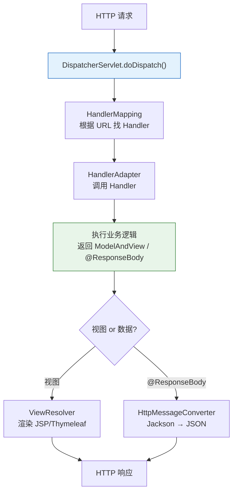
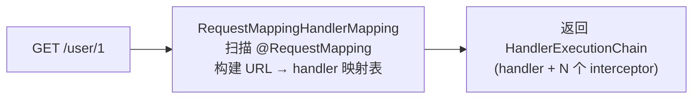
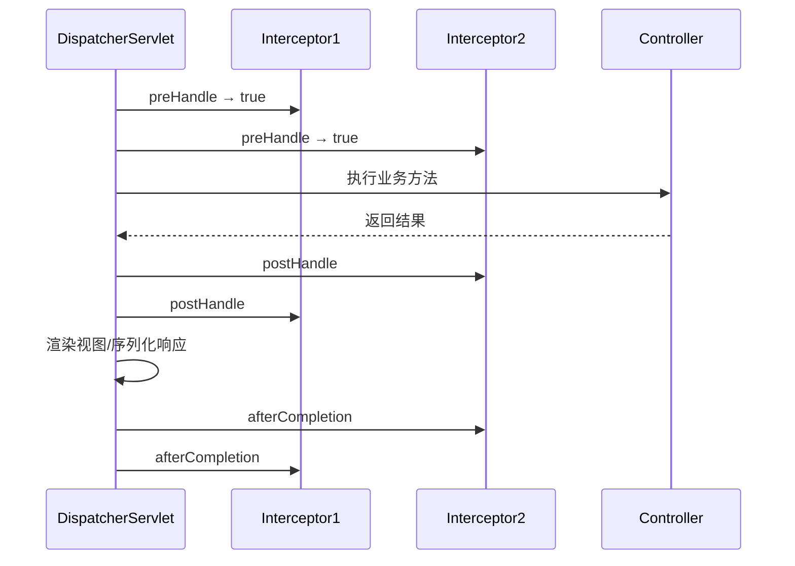

---

# 一、DispatcherServlet——请求的中央调度器

```java
protected void doDispatch(HttpServletRequest request, HttpServletResponse response) {
    HandlerExecutionChain mappedHandler = null;
    try {
        // ① 根据请求 URL 找到 Handler（Controller 方法）
        mappedHandler = getHandler(request);              // HandlerMapping
        // ② 找到能执行这个 Handler 的 Adapter
        HandlerAdapter ha = getHandlerAdapter(mappedHandler.getHandler());
        // ③ 执行拦截器 preHandle
        if (!mappedHandler.applyPreHandle(request, response)) return;
        // ④ 真正调用 Controller 方法
        ModelAndView mv = ha.handle(request, response, mappedHandler.getHandler());
        // ⑤ 执行拦截器 postHandle
        mappedHandler.applyPostHandle(request, response, mv);
        // ⑥ 处理视图或 @ResponseBody 返回值
        processDispatchResult(request, response, mappedHandler, mv);
    } finally {
        // ⑦ 执行拦截器 afterCompletion
        mappedHandler.triggerAfterCompletion(request, response);
    }
}
```

---

# 二、HandlerMapping——URL → Handler 的路由



```java
// RequestMappingHandlerMapping 初始化时扫描所有 @Controller 的方法
// 构建映射：GET /user/{id} → UserController.getById(Long id)
// 请求到达时：提取路径变量、匹配最佳 handler
```

---

# 三、HandlerAdapter——适配多种 Handler

```java
public interface HandlerAdapter {
    // 判断能否处理
    boolean supports(Object handler);
    // 真正执行
    ModelAndView handle(HttpServletRequest req, HttpServletResponse resp, Object handler);
}

// 实现类：
// RequestMappingHandlerAdapter    → @RequestMapping 方法（最常见）
// HttpRequestHandlerAdapter       → HttpRequestHandler 实现
// SimpleControllerHandlerAdapter  → Controller 接口实现（已废弃）
```

---

# 四、参数解析——你的参数是怎么到的 Controller

```java
// HandlerMethodArgumentResolver 体系
// 遍历所有 ArgumentResolver，找到能解析当前参数的那个
for (HandlerMethodArgumentResolver resolver : argumentResolvers) {
    if (resolver.supportsParameter(parameter)) {
        Object arg = resolver.resolveArgument(parameter, mavContainer, request, ...);
        args[i] = arg;
        break;
    }
}
```

| ArgumentResolver | 解析什么 |
|-----------------|---------|
| `@RequestParam` | `?name=xxx` query 参数 |
| `@PathVariable` | `/user/{id}` 路径变量 |
| `@RequestBody` | JSON 请求体 → 反序列成对象 |
| `@RequestHeader` | HTTP Header |
| 无注解的 Model | 按名称从 Model 中取值 |

---

# 五、返回值处理——@ResponseBody 如何变成 JSON

```java
// HandlerMethodReturnValueHandler 体系
for (HandlerMethodReturnValueHandler handler : returnValueHandlers) {
    if (handler.supportsReturnType(returnType)) {
        handler.handleReturnValue(returnValue, returnType, mavContainer, request, response);
        break;
    }
}
```

```mermaid
flowchart LR
    RET["Controller 返回\nUser{id:1, name:'Tom'}"] -->|"@ResponseBody"| CONV["HttpMessageConverter\nMappingJackson2HttpMessageConverter"]
    CONV -->|"ObjectMapper.writeValueAsString"| JSON['{"id":1,"name":"Tom"}']
    JSON --> RESP["HTTP 200\nContent-Type: application/json"]
```

---

# 六、拦截器（Interceptor）链



---

# 七、总结

| 组件 | 职责 |
|------|------|
| **DispatcherServlet** | 中央调度器，请求入口 |
| **HandlerMapping** | URL → Handler 路由匹配 |
| **HandlerAdapter** | 适配调用 Handler |
| **ArgumentResolver** | 参数解析（@RequestParam/@RequestBody/...） |
| **ReturnValueHandler** | 返回值处理（@ResponseBody → JSON） |
| **Interceptor** | 请求前/后/完成时的切面拦截 |
