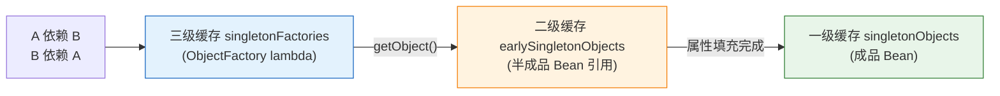
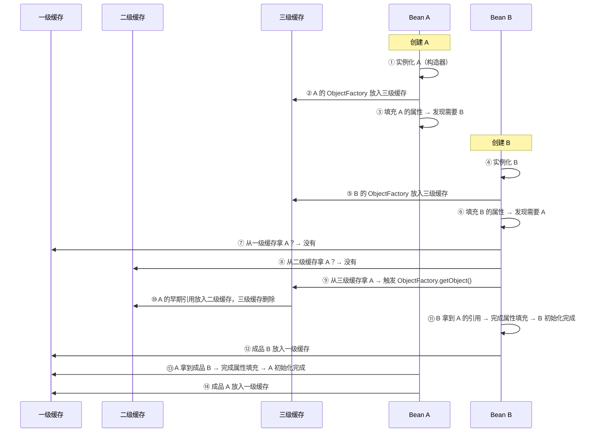

---

# 一、什么是循环依赖？

```java
@Component
class A {
    @Autowired B b;  // A 依赖 B
}
@Component
class B {
    @Autowired A a;  // B 依赖 A
}
// A 创建时发现需要 B → 去创建 B → B 发现需要 A → 死循环
```

---

# 二、三级缓存解决了什么？

| 缓存 | 类型 | 存什么 |
|------|------|--------|
| **一级** `singletonObjects` | `Map<String, Object>` | 成品 Bean（属性注入完毕、初始化完成） |
| **二级** `earlySingletonObjects` | `Map<String, Object>` | 半成品 Bean 的引用（已实例化但未填充属性） |
| **三级** `singletonFactories` | `Map<String, ObjectFactory<?>>` | 能生成半成品 Bean 引用的工厂 lambda |

---

# 三、完整流程——A 和 B 互相依赖



---

# 四、三级缓存的源码核心

```java
// DefaultSingletonBeanRegistry.getSingleton()
protected Object getSingleton(String beanName, boolean allowEarlyReference) {
    Object singletonObject = this.singletonObjects.get(beanName);      // 一级
    if (singletonObject == null && isSingletonCurrentlyInCreation(beanName)) {
        singletonObject = this.earlySingletonObjects.get(beanName);    // 二级
        if (singletonObject == null && allowEarlyReference) {
            ObjectFactory<?> factory = this.singletonFactories.get(beanName); // 三级
            if (factory != null) {
                singletonObject = factory.getObject();  // ← 关键：触发 lambda
                this.earlySingletonObjects.put(beanName, singletonObject); // 升级二级
                this.singletonFactories.remove(beanName);                // 删除三级
            }
        }
    }
    return singletonObject;
}
```

**三级缓存里的 lambda 干了什么？**

```java
// AbstractAutowireCapableBeanFactory.doCreateBean()
addSingletonFactory(beanName, () -> 
    getEarlyBeanReference(beanName, mbd, bean)  // ← 生成早期引用
);
// getEarlyBeanReference() 会经过 SmartInstantiationAwareBeanPostProcessor
// 如果有 AOP 代理，这里返回代理对象！
```

---

# 五、为什么三级缓存需要存在？

> **如果只是解决循环依赖，二级缓存就够了。三级之所以存在，是为了兼容 AOP——在早期引用阶段就把代理对象创建好。**

如果没有三级缓存：
- A 的早期引用是原始对象
- A 初始化后需要 AOP 代理 → 代理对象 ≠ 原始对象
- B 拿到的原始对象引用就错了

有了三级缓存：
- `getEarlyBeanReference()` 在三级转二级时触发 → 先判断要不要代理
- 要代理 → 直接生成代理对象放入二级缓存
- B 拿到的就是正确的代理引用

---

# 六、构造器注入为什么无解？

```java
@Component
class A {
    B b;
    A(B b) { this.b = b; }  // 构造器注入
}
```

构造器注入的依赖在**实例化阶段**就需要——此时连三级缓存都还没放进去。`new A(b)` 这行代码本身就死循环了，缓存帮不上忙。

**解决方案**：构造器循环依赖 → 加 `@Lazy` 让注入的只是一个代理。

```java
A(@Lazy B b) { this.b = b; }  // b 是一个代理对象，不会触发真正的 B 创建
```

---

# 七、总结

| 问题 | 答案 |
|------|------|
| **一级缓存** | 存成品 Bean，getBean 的默认来源 |
| **二级缓存** | 存半成品引用，已经过 getEarlyBeanReference |
| **三级缓存** | 存 ObjectFactory lambda，三级转二级时触发 |
| **三级为什么存在** | 兼容 AOP——早期引用阶段就确定代理关系 |
| **构造器注入为什么不行** | 实例化阶段还没放缓存，依赖就卡死了 |
