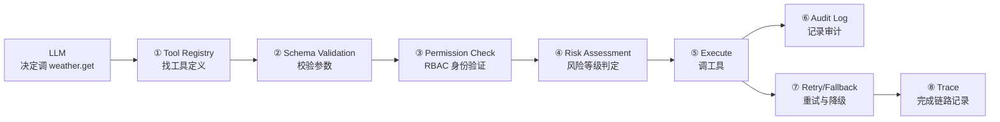
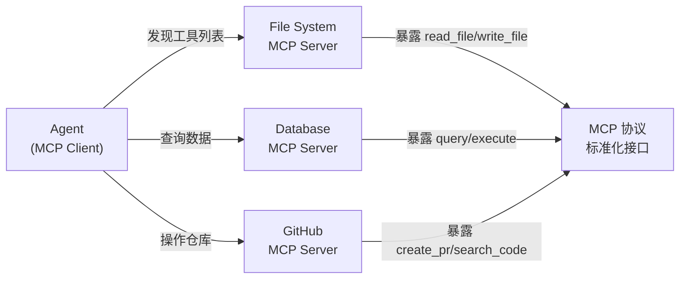

# 历史背景——从 Function Calling 到 Tool Runtime

2023 年 6 月，OpenAI 发布了 Function Calling——模型可以生成结构化的 JSON 参数来"调用"开发者预先注册的函数。突然之间，Agent 不再是"模型说，你做"，而是"模型说该调哪个工具，你执行完把结果告诉它"。

但 Function Calling 只解决了"调用"这一步。工具的**注册、发现、参数校验、权限控制、超时、重试、审计、灰度**——这些生产环境中必须要有的东西，FC 一个都没管。就好像 Spring 给了你 `@RestController` 但没有 `DispatcherServlet`、没有 Filter 链、没有异常处理。

Agent Tool Runtime 就是 Agent 的"Spring MVC 基础设施"——把"模型说该调哪个工具"这句话，落地成一套完整的工具治理体系。

---

# 一、Tool Runtime 是 Agent 的"后端中间件层"

## 1.1 Tool Runtime 八件套

```
一次完整的工具调用链路：

  模型说 → "调 weather.get(city='Beijing')"
    ↓
  ① Tool Registry（工具注册中心）：找到 weather.get 这个工具
  ② Schema Validation（参数校验）：检查 city 参数是否合法
  ③ Permission Check（权限控制）：当前用户是否有权调这个工具
  ④ Risk Assessment（风险评估）：这个操作是只读还是写？
  ⑤ Execution（执行）：真正调工具（调 HTTP API / DB / Shell / MCP Server）
  ⑥ Audit Log（审计记录）：记录输入/输出/耗时/身份/TraceID
  ⑦ Retry & Fallback（重试与降级）：超时/失败后的恢复策略
  ⑧ Trace（链路追踪）：完整记录从选择工具→参数→执行→返回的时序
```



## 1.2 Tool Registry——工具从哪里来

Tool Registry 是工具注册、发现和管理的中心。Agent 在每次需要调用工具时，都要从 Registry 中查找可用的工具：

```python
# Tool Registry 的核心接口
class ToolRegistry:
    def register(self, tool: ToolDefinition) -> None: ...
    def discover(self, task: str, user: User) -> list[ToolDefinition]: ...
    def get(self, tool_name: str) -> ToolDefinition: ...
    def enable(self, tool_name: str) -> None: ...
    def disable(self, tool_name: str) -> None: ...
    def list(self, category: str = None) -> list[ToolDefinition]: ...
```

**Registry 不仅仅是存一个 HashMap**——它要支持：
- **按任务匹配**：Agent 的任务是"帮我查询北京天气" → Registry 返回 `weather.get`、`weather.forecast`，不返回 `github.create_pr`
- **按用户过滤**：用户 A 只能用只读工具，用户 B 可以用写工具
- **按风险隔离**：高风险工具（如 `shell.exec`）不会出现在普通任务的候选列表中
- **版本管理**：`weather.get@v1.0` 和 `weather.get@v2.0` 可以共存

## 1.3 Tool Schema——工具定义的六要素

```python
@dataclass
class ToolDefinition:
    name: str                    # 工具名称：weather.get
    description: str             # 工具说明：查询指定城市的实时天气
    input_schema: dict           # JSON Schema：参数定义
    output_schema: dict          # 返回结构
    error_schema: dict           # 错误结构
    permission_level: Permission # 权限等级：READ / WRITE / HIGH_RISK / NEEDS_APPROVAL
    risk_level: RiskLevel        # 风险等级：SAFE / NORMAL / DANGEROUS
    timeout_ms: int              # 超时配置：5000ms
    retry_policy: RetryPolicy    # 重试策略：最多 3 次，exponential backoff
    audit_fields: list[str]      # 审计字段：["user_id", "tool_input", "tool_output"]
    dependencies: list[str]      # 依赖的服务/密钥/资源
```

每个工具至少包含这六个维度。以 `github.create_pr` 为例：

```python
ToolDefinition(
    name="github.create_pr",
    description="在指定仓库创建一个 Pull Request",
    input_schema={
        "type": "object",
        "properties": {
            "repo": {"type": "string", "description": "仓库名"},
            "title": {"type": "string", "description": "PR 标题"},
            "body": {"type": "string", "description": "PR 描述"},
            "base": {"type": "string", "description": "目标分支", "default": "main"},
            "head": {"type": "string", "description": "源分支"},
        },
        "required": ["repo", "title", "head"]
    },
    output_schema={...},
    error_schema={
        "type": "object",
        "properties": {
            "error_code": {"type": "string"},
            "message": {"type": "string"}
        }
    },
    permission_level=Permission.WRITE,
    risk_level=RiskLevel.NORMAL,
    timeout_ms=30000,
    retry_policy=RetryPolicy.NO_RETRY,  # 写操作不重试！
    audit_fields=["user_id", "repo", "title", "head", "status", "pr_url"],
    dependencies=["github_token", "github_api"]
)
```

---

# 二、权限控制——Agent 不是你，但它在用你的身份

## 2.1 四级权限模型

Agent 有可能"越权"——模型可能被 Prompt Injection 诱导去调用它不应该调的工具。权限控制必须在 Runtime 层面拦截，不能依赖 Prompt 里的"你不要乱调用"。

```
READ：只读工具。用户可以调用，不需要额外确认
  例：weather.get、codebase.search_code、database.query_readonly

WRITE：写操作工具。用户可以调用，需要记录审计
  例：github.create_pr、file.write、database.insert

HIGH_RISK：高风险工具。调用时需要额外的确认（Human-in-the-loop）
  例：shell.exec、database.execute_ddl、aws.terminate_instance

NEEDS_APPROVAL：需要审批。调用时生成审批工单，通过后执行
  例：production.deploy、billing.refund
```

## 2.2 RBAC + 身份透传

Agent 不能直接用"系统管理员"的身份调所有工具——它应该**继承调用者的身份**：

```python
# Agent 运行时，用户身份透传到工具调用
class ToolExecutor:
    def execute(self, tool_name: str, params: dict, user: User) -> ToolResult:
        tool = self.registry.get(tool_name)
        
        # ① 身份透传：检查 user 是否有权调用这个工具
        if not self.authz.check(user, tool):
            raise PermissionDenied(f"用户 {user.id} 无权调用 {tool_name}")
        
        # ② 高风险工具 → 需要用户手动确认
        if tool.risk_level == RiskLevel.DANGEROUS:
            if not self.confirmation.request(user, tool, params):
                raise UserDeclined(f"用户 {user.id} 拒绝了 {tool_name}")
        
        # ③ 读写隔离：只读工具不记录详细审计，写工具记录全量
        if tool.permission_level in [Permission.WRITE, Permission.HIGH_RISK]:
            self.audit_log.record(user=user, tool=tool, params=params, ...)
```

---

# 三、超时、重试与降级——工具不是每次都成功

```python
# 组合模式：超时 → 重试 → 降级
def execute_with_resilience(tool, params):
    # ① 超时控制
    try:
        result = http_client.post(
            url=tool.endpoint,
            json=params,
            timeout=tool.timeout_ms / 1000  # 秒
        )
    except TimeoutError:
        if tool.retry_policy.max_retries > 0:
            return retry_with_backoff(tool, params)  # 重试
        return ToolResult.failed("超时", fallback=tool.fallback)  # 降级
    
    # ② 限流 → 等一等再重试
    if result.status_code == 429:
        wait_ms = result.headers.get("Retry-After", 5) * 1000
        time.sleep(wait_ms / 1000)
        return retry_with_backoff(tool, params)
    
    # ③ 不可恢复的错误 → 直接失败
    if result.status_code >= 500:
        return ToolResult.failed(f"服务端错误 {result.status_code}")
```

**降级策略**：工具不可用时，Agent 不应该直接崩溃——应该有 fallback：
- `weather.get` 失败 → 返回缓存中最近一次成功的天气数据（标记 `stale=true`）
- `database.query` 超时 → 返回提示"数据库暂时不可用，请稍后重试"
- `github.create_pr` 失败 → 把 PR 内容存为草稿，人工手动提交

---

# 四、MCP 协议——工具接入的标准化

## 4.1 Function Calling vs MCP——谁管什么

```
Function Calling：模型如何"选择"和"调用"工具
  → 模型根据用户请求和工具描述生成 JSON 参数
  → MCP 不关心这一步

MCP：工具如何"标准化接入到 Agent 系统"
  → 工具提供方按照 MCP 协议暴露工具/资源/Prompt
  → Agent 通过 MCP Client 发现并调用这些工具
  → Function Calling 不关心这一步
```



**MCP 的基本交互**：

```
① MCP Client 连接 MCP Server → 获取 Server 暴露的工具列表
② Agent 决定调某个工具 → MCP Client 向 MCP Server 发 tools/call 请求
③ MCP Server 执行工具 → 返回结果
④ MCP Client 把结果送回 Agent 的上下文

整个过程中，Agent 不直接依赖工具的 HTTP API / 数据库连接 / 文件系统——
它只知道"MCP 协议"，MCP Server 屏蔽了接入细节。
```

## 4.2 MCP 接入示例——文件系统 Server 的工具定义

```json
// MCP Server 暴露的工具列表（tools/list 响应）
{
  "tools": [
    {
      "name": "read_file",
      "description": "读取指定路径的文件内容",
      "inputSchema": {
        "type": "object",
        "properties": {
          "path": {"type": "string", "description": "文件路径"}
        },
        "required": ["path"]
      }
    },
    {
      "name": "write_file",
      "description": "写入内容到指定文件",
      "inputSchema": {
        "type": "object",
        "properties": {
          "path": {"type": "string"},
          "content": {"type": "string"}
        },
        "required": ["path", "content"]
      }
    }
  ]
}
```

**MCP 的核心价值**：工具提供方只需要实现 MCP Server 协议，Agent 侧只需要实现 MCP Client——中间不需要"每个工具各写一个 Adapter"。200 个工具 = 200 个 MCP Server，Agent 侧一套 MCP Client 全接入。

---

# 五、Tool Runtime 完整代码骨架

```python
# Agent Tool Runtime 的简化骨架（约 200 行）

class AgentToolRuntime:
    def __init__(self):
        self.registry = ToolRegistry()
        self.executor = ToolExecutor()
        self.audit = AuditLogger()
        self.tracer = TraceRecorder()
    
    async def execute_tool(
        self, tool_name: str, params: dict, user: User, trace_id: str
    ) -> ToolResult:
        """执行一个工具调用的完整流程"""
        span = self.tracer.start_span(tool_name, trace_id)
        
        try:
            # ① 查找工具
            tool = self.registry.get(tool_name)
            if not tool:
                return ToolResult.not_found(tool_name)
            
            # ② 参数校验
            errors = validate_schema(tool.input_schema, params)
            if errors:
                span.record("validation_failed", errors)
                return ToolResult.invalid_params(errors)
            
            # ③ 权限检查
            if not self.check_permission(tool, user):
                span.record("permission_denied")
                return ToolResult.permission_denied(tool_name)
            
            # ④ 风险拦截
            if tool.risk_level == RiskLevel.DANGEROUS:
                confirmed = await self.request_confirmation(tool, params, user)
                if not confirmed:
                    return ToolResult.user_declined(tool_name)
            
            # ⑤ 执行（带超时和重试）
            result = await self.executor.execute_with_retry(tool, params)
            
            # ⑥ 审计日志
            self.audit.record(
                tool=tool, user=user, params=params,
                result=result, trace_id=trace_id
            )
            
            span.record("completed", result)
            return result
            
        except Exception as e:
            span.record("failed", str(e))
            return ToolResult.failed(str(e))
```

---

# 六、总结

| 组件 | 解决的问题 | 生产级要求 |
|------|----------|-----------|
| **Tool Registry** | 工具从哪来 | 注册/发现/版本/启停/依赖声明 |
| **Tool Schema** | 工具怎么定义 | 六要素完整定义 + JSON Schema + 错误结构 |
| **权限控制** | 谁可以用什么 | 四级权限（READ/WRITE/HIGH_RISK/NEEDS_APPROVAL）+ RBAC |
| **超时重试** | 工具失败怎么办 | exponential backoff + 降级 fallback |
| **审计追踪** | 谁在什么时候做了什么 | 输入/输出/身份/TraceID 全量记录 |
| **MCP 协议** | 工具怎么标准化接入 | Client↔Server 标准化，200 个工具一套接入 |

# 延伸阅读

**Do——动手实现：**
- 用 Python 写一个最小 Tool Registry（字典存储 + register/discover/list 三个方法）
- 实现 MCP Server 的 tools/list 和 tools/call 两个端点的协议（JSON-RPC 2.0 格式）
- 为 `shell.exec` 工具加四级权限校验：只允许特定用户调用 + 高风险需确认

**Todo——深入方向：**
- MCP 的 transport 层——HTTP/SSE vs stdio vs WebSocket 三种传输方式的场景选择
- 工具调用的流式返回——工具执行时间长的场景下，如何边执行边返回部分结果
- 工具间的依赖声明与自动编排——数据库查询结果 → 自动传给下一个工具

*本文参考资料：*
- OpenAI Function Calling 文档
- MCP (Model Context Protocol) 规范: https://modelcontextprotocol.io/
- Anthropic Tool Use 文档
