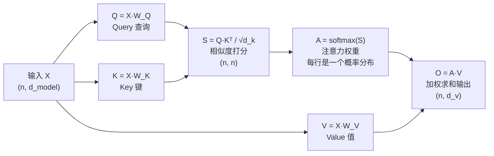
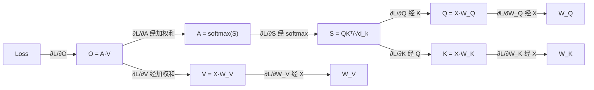

# 历史背景——一个公式挡住一半的 LLM 学习者

Transformer 论文（"Attention Is All You Need", 2017）开篇核心公式：

```
Attention(Q, K, V) = softmax(QKᵀ/√d_k)V
```

这行公式是 GPT 系列、BERT、Llama 等一切现代大模型的基石。但它是用"矩阵语言"写的——如果你不熟悉矩阵乘法、点积、转置，这行公式就是天书。

本文把这行公式**逐项拆开**，每拆一项，补一块所需的数学。读完你应该能：① 白板默写完整计算流（含每一步的形状）② 解释 √d_k 为什么存在 ③ 手推一个 2 词小例子。这是《大模型数学知识地图》的配套实战篇。

---

# 一、问题定义——语言模型在算什么

## 1.1 语言模型 = 条件概率模型

大模型生成文本的本质，是在反复计算同一个条件概率：

```python
# 输入 "我喜欢"，预测下一个词：
# 模型计算：P(下一个词 | "我", "喜", "欢")

# 完整生成流程：
# "我" → 预测 P(w₂|我) → 采样出 "喜"
# "我喜" → 预测 P(w₃|我,喜) → 采样出 "欢"
# "我喜欢" → 预测 P(w₄|我,喜,欢) → 采样出 "吃"
```

所以 Transformer 的全部任务可以浓缩为：**给一个 token 序列，输出序列中每个位置"下一个 token 的概率分布"**。Attention 就是完成这个任务的引擎。

## 1.2 输入怎么变成向量——Embedding 一句话

Attention 处理的是向量不是字。每个 token 先查表换成向量：

```python
# 词表大小 V = 50000，向量维度 d_model = 4096（Llama 级别）
# Embedding 矩阵 E: (50000, 4096)

# "我" 的 token id = 1234 → 查表 → E[1234] → 一个 4096 维向量
# x₁ = [0.21, -0.13, 0.87, ...]   # "我" 的向量表示
# x₂ = [-0.05, 0.42, 0.11, ...]   # "喜" 的向量表示
```

序列 [x₁, x₂, ..., xₙ] 堆叠成矩阵 X，形状 **(n, d_model)**。之后的一切，都是对这个矩阵做线性变换。

---

# 二、Attention 公式总览——先把地图挂出来

## 2.1 完整计算流



四个步骤，对应公式的四部分：

| 步骤 | 数学表达 | 直觉 |
|------|---------|------|
| ① 生成 QKV | Q=XW_Q, K=XW_K, V=XW_V | 同一份输入，复制三份，各乘一个可学习矩阵 |
| ② 打分 | S = QKᵀ/√d_k | "每个词对每个词"的相似度矩阵 |
| ③ 归一化 | A = softmax(S) | 相似度 → 概率分布（每行和 = 1） |
| ④ 聚合 | O = AV | 按概率加权，把其他词的信息"搬"到自己身上 |

## 2.2 一个贯穿全文的类比：注意力 = 数据库检索

这个类比非常有效，先用它建立全局直觉：

```python
# 数据库检索：      query ──匹配──> key ──取出──> value
# 搜索引擎：        搜索词 ──匹配──> 文档标题 ──取出──> 文档内容
# Attention：      Q      ──点积──> K        ──加权──> V

# "我"这个位置的词，想知道自己该关注哪些词：
#   它生成一个 Query（我要找什么）
#   每个词都有一个 Key（我是什么）
#   点积 Q·K = 匹配度 → softmax 变成权重 → 按权重取 Value（我携带的信息）
```

下面逐项拆解。

---

# 三、QKV 从哪来——三次矩阵乘法

## 3.1 形状推导

```python
# 输入 X: (n, d_model)   n = 序列长度, d_model = 隐藏维度
# 三个权重矩阵（模型参数，训练时学习）：
#   W_Q: (d_model, d_k)
#   W_K: (d_model, d_k)
#   W_V: (d_model, d_v)

Q = X @ W_Q    # (n, d_model) @ (d_model, d_k) → (n, d_k)
K = X @ W_K    # (n, d_k)
V = X @ W_V    # (n, d_v)

# 单头时 d_k = d_v = d_model
# 多头时 d_k = d_v = d_model / h（h = 头数，见第八节）
```

## 3.2 为什么同一个 X 要乘三个不同的矩阵

```python
# 同一个词，扮演三个角色，需要三种投影：

# "我" 作为 query：表达"我在寻找什么信息"
# "喜" 作为 key：  表达"我是什么信息"（供别人匹配）
# "喜" 作为 value：表达"我实际携带的内容"（被搬走的信息）

# 类比：图书馆借书
#   query = 你的借书需求："关于并发编程"
#   key   = 书的索引标签："并发编程、JUC"
#   value = 书的内容本身
# 需求匹配标签（Q·K），拿走内容（V）——标签和内容可以不同！
```

W_Q、W_K、W_V 是可学习参数：**模型通过训练学会"怎么表达需求、怎么打标签、怎么装内容"**。这就是 attention 的全部可调空间（加上 FFN 和 embedding）。

---

# 四、点积打分——为什么 Q·K 能衡量相似度

## 4.1 点积的几何意义

```python
# 两个向量 a、b 的点积：
# a·b = |a|·|b|·cos(θ)

# θ 是两向量的夹角：
#   方向一致   θ=0°    cos=1   → 点积大（正相关）
#   垂直       θ=90°   cos=0   → 点积 = 0（无关）
#   方向相反   θ=180°  cos=-1  → 点积小（负相关）
```

**点积 = 长度 × 方向一致程度**。语义相似的词，embedding 向量方向接近，点积自然大。

## 4.2 打分矩阵——一次矩阵乘算出"每个词对每个词"

```python
S = Q @ K.T
# S[i][j] = Q[i] · K[j] = "第 i 个词和第 j 个词的匹配度"

# 序列 "我喜欢吃苹果"（5 个词），S 是一个 5×5 矩阵：
#        我    喜    欢    吃    苹果
# 我   [ 2.1   0.5   0.3   0.1   0.2 ]
# 喜   [ 0.4   2.3   1.8   0.2   0.1 ]
# 欢   [ 0.2   1.7   2.4   1.2   0.3 ]
# 吃   [ 0.1   0.1   1.0   2.2   1.9 ]
# 苹果 [ 0.2   0.2   0.3   1.8   2.5 ]
#         ↑ S[4][3] = "吃"作为query 对 "苹果"作为key 的匹配度很高
```

一次矩阵乘法，算完所有两两匹配——这是 attention 高效的关键，也是"并行化"的来源。

---

# 五、√d_k 缩放——方差推导，一个被低估的细节

## 5.1 为什么公式里有个 √d_k

```python
S = Q @ K.T / sqrt(d_k)   # 论文里写的是除以 √d_k，不是随便加的
```

**推导**：假设 Q、K 的分量独立同分布，均值 0、方差 1：

```python
# q·k = q₁k₁ + q₂k₂ + ... + q_dk_d     共 d_k 项求和

# 每一项 qᵢkᵢ 的方差 = Var(qᵢ)·Var(kᵢ) = 1·1 = 1
# （独立变量乘积的方差：Var(qk) = E[q²]E[k²] - (E[q]E[k])² = 1·1 - 0 = 1）

# d_k 项求和，方差累加：Var(q·k) = d_k
# 标准差 = √d_k
```

**结论**：维度越大，点积的波动越大。d_k = 64 时，点积值大致在 ±8 范围内；d_k = 4096 时，±64。

## 5.2 不缩放的后果：softmax 饱和 → 梯度消失

```python
# softmax 的输入如果太大，输出会接近 one-hot：

softmax([8, -8, 0, 0])  → [0.9993, 0.0000, 0.0003, 0.0003]
#                                    ↑ 几乎只关注一个词

# 问题：softmax 在"极端区"的梯度趋近于 0
# 梯度小 → 训练时这一层学不动 → 模型难以收敛

# 除以 √d_k 后：Var(QKᵀ/√d_k) = d_k / d_k = 1 → 方差归一化回 1
# softmax 输入落在"温和区" → 梯度健康
```

这就是公式里 `/√d_k` 的完整因果链：**维度增大 → 点积方差增大 → softmax 饱和 → 梯度消失 → 除以 √d_k 把方差拉回 1**。一个细节串起方差、softmax 和梯度三个知识点。

---

# 六、softmax 归一化——把分数变成概率

## 6.1 为什么需要 softmax

打分矩阵 S 的每一行是"第 i 个词对所有词的匹配度"，但这些分数**没有可比尺度**（可能是 2.1，也可能是 -0.3）。我们需要的是"权重"——加起来等于 1 的概率分布。

```python
# softmax 三步：
# ① 取指数：exp(sᵢ)       → 把负数变成正数，且放大差距（e²≈7.4, e³≈20）
# ② 求和：  Σ exp(sⱼ)      → 得到归一化分母
# ③ 相除：  exp(sᵢ)/Σ      → 每一项 ∈ (0,1)，整行和 = 1

softmax([2.1, 0.5, 0.3]) 
= [e^2.1, e^0.5, e^0.3] / (e^2.1 + e^0.5 + e^0.3)
= [8.17, 1.65, 1.35] / 11.17
= [0.73, 0.15, 0.12]     # 概率分布：73% 注意力给自己，15% 给第二个词
```

## 6.2 数值稳定技巧：先减最大值

```python
# 直接算有风险：sᵢ 很大时 exp 溢出（exp(1000) = inf）

# 技巧：softmax(s) = softmax(s - max(s))，结果完全一样：
# exp(sᵢ - m) / Σexp(sⱼ - m) = exp(sᵢ)/exp(m) / (Σexp(sⱼ)/exp(m)) = exp(sᵢ)/Σexp(sⱼ)

s = [1000, 999, 998]
softmax_stable = exp(s - 1000) / sum(exp(s - 1000))
# = [e^0, e^-1, e^-2] / (1 + 0.368 + 0.135) = [0.665, 0.245, 0.090]
# 不溢出，结果与"数学上正确的 softmax"一致
```

看 PyTorch / vLLM 源码时，`softmax` 实现里都有这个减 max 的操作——这就是数值计算拼图在 attention 里的落点。

---

# 七、加权求和 V——信息的聚合

## 7.1 最后一步

```python
O = A @ V
# O[i] = Σⱼ A[i][j] · V[j]
#      = "第 i 个词的新表示 = 所有词的 value 按注意力权重加权平均"

# 还是 "我喜欢吃苹果" 的例子，假设 "吃" 这一行的权重是：
# A[吃] = [0.02, 0.03, 0.10, 0.50, 0.35]   # 50% 关注自己，35% 关注 "苹果"
# O[吃] = 0.02·V[我] + 0.03·V[喜] + 0.10·V[欢] + 0.50·V[吃] + 0.35·V[苹果]
```

**"吃"的新表示里混入了 35% 的"苹果"信息**——这就是 attention 的本质：每个词的表示，被上下文中的其他词"更新"。经过多层堆叠，"吃"最终能感知到"吃什么"。

## 7.2 为什么加权平均就能"理解语义"

```python
# "苹果" 在两个句子中的表示变化：
# ① "我喜欢吃苹果" → "苹果"的 value 被 "吃" 的 query 高权重选中
#    → "苹果"的上下文表示里，融入了"食物"的语义
# ② "苹果发布了新手机" → "苹果"被 "发布"、"手机" 高权重选中
#    → "苹果"的上下文表示里，融入了"公司"的语义

# 同一个词，不同上下文 → 不同表示 → 这就是"一词多义"的解决机制
# 数学上就是：同样的 V，不同的注意力权重 A，加权出不同的 O
```

---

# 八、多头注意力——多个子空间的并行检索

## 8.1 为什么要多头

单头有一个盲区：**一次加权平均只能表达一种"关注模式"**。而语言里一个词常常需要同时关注多种关系：

```python
# "我昨天在图书馆借了一本关于并发编程的书"
# "书" 需要同时关注：
#   - 主语关系："谁借的" → 我
#   - 时间关系："什么时候" → 昨天
#   - 地点关系："在哪" → 图书馆
#   - 内容关系："什么书" → 并发编程

# 单头：4 种关系挤在一个权重分布里，互相稀释
# 多头：8 个头 = 8 组独立的 W_Q/W_K/W_V，各自学会关注一种模式
```

## 8.2 多头的计算

```python
# h = 8 个头，每个头在低维子空间工作：
# d_k = d_v = d_model / h = 4096 / 8 = 512

# 每个头独立做一遍完整 attention：
# headᵢ = Attention(X·W_Qⁱ, X·W_Kⁱ, X·W_Vⁱ)     # (n, 512)

# 8 个头的结果拼接，再乘一个输出矩阵：
# MultiHead = concat(head₁, ..., head₈) @ W_O
#           = (n, 4096) @ (4096, 4096) → (n, 4096)

# 参数量不变（8 × 512² ≈ 4096²），但获得了 8 个独立子空间
```

---

# 九、反向传播——softmax + 交叉熵的优雅梯度

## 9.1 先看最容易的：输出层的梯度

Transformer 输出 logits 后接 softmax + 交叉熵损失。这个组合的梯度推导有一个著名的优雅结果：

```python
# 损失：L = -log(softmax(z)_y)    y = 正确 token 的索引
#       = -log(ŷ_y)               ŷ = softmax(z)

# 对 zᵢ 求导（链式法则）：
# ∂L/∂zᵢ = ŷᵢ - 1[i == y]

# 即：梯度 = 模型预测的概率分布 - 真实 one-hot 分布
# 预测 "很" 的概率 0.42，正确答案是 "很"：
#   ∂L/∂z = [0.42-1, 0.31-0, 0.15-0, ...] = [-0.58, 0.31, 0.15, ...]
# 预测越接近真实，梯度越接近 0 → 收敛
```

**这个结果值得手推一遍**（用除法法则或对数求导），它是理解"模型怎么学会的"最直观的入口，也是《数学知识地图》里的毕业标准之一。

## 9.2 Attention 内部梯度的直觉

Attention 内部的梯度不需要手推全部（交给 autograd），但需要理解梯度流经的路径：



三个观察：

1. **每条边都是一次链式法则**——梯度从 loss 出发，沿计算图反向逐边相乘
2. **softmax 环节是关键**：∂L/∂S 的每个元素都经过"softmax 的梯度"（A 的分布形状决定学习速度，这就是第 5.2 节梯度消失的位置）
3. **W_Q、W_K、W_V 是训练目标**——梯度最终落在这三个矩阵上，模型通过调整它们学会"怎么查询、怎么被匹配"

---

# 十、完整手推实例——2 个词验证理解

把一切缩小到最小可算的规模：序列 = ["我", "喜"]，d_model = d_k = 4，权重矩阵取单位阵（W_Q=W_K=W_V=I，纯为演示，真实模型是可学习的）。

```python
# ① 输入（embedding 简化版）
X = [[1, 0, 1, 0],    # "我"
     [0, 1, 0, 1]]    # "喜"   形状 (2, 4)

# ② QKV（W=I 时 Q=K=V=X）
Q = K = V = X

# ③ 打分：S = QKᵀ
# QKᵀ = [[1,0,1,0]·[1,0,1,0],  [1,0,1,0]·[0,1,0,1]]
#       [[0,1,0,1]·[1,0,1,0],  [0,1,0,1]·[0,1,0,1]]
S = [[2, 0],
     [0, 2]]          # 自己和自己的点积 = 2，互相 = 0

# ④ 缩放：√d_k = √4 = 2
S_scaled = [[1.0, 0.0],
            [0.0, 1.0]]

# ⑤ softmax（按行）
# 第 1 行：e^1 / (e^1+e^0) = 2.718/3.718 = 0.731；e^0/3.718 = 0.269
A = [[0.731, 0.269],
     [0.269, 0.731]]  # 每行和 = 1 ✓

# ⑥ 加权求和：O = AV
O[0] = 0.731·[1,0,1,0] + 0.269·[0,1,0,1] = [0.731, 0.269, 0.731, 0.269]
O[1] = 0.269·[1,0,1,0] + 0.731·[0,1,0,1] = [0.269, 0.731, 0.269, 0.731]

# 观察：
# - "我"的新表示 = 73.1% 的自己 + 26.9% 的 "喜" → 融入了上下文
# - 每行的权重是一个概率分布（和为 1）
# - 两个词的表示是"自己为主、对方为辅"的混合
```

如果你能不看注释独立重算这六步，attention 的计算流就通了。真实模型的唯一区别：W_Q/W_K/W_V 不是单位阵（可学习）、维度是 4096 而不是 4、序列是几千而不是 2。

---

# 十一、总结

| 组件 | 数学 | 一句话用途 |
|------|------|-----------|
| Q = XW_Q 等 | 矩阵乘法 | 同一输入投影成查询/键/值三个角色 |
| QKᵀ | 点积 | 两两匹配度打分（几何：方向一致性） |
| /√d_k | 方差 | 抑制高维点积方差，防 softmax 饱和梯度消失 |
| softmax | 指数归一化 | 分数 → 概率分布（每行和 = 1） |
| AV | 加权平均 | 按注意力权重聚合上下文信息 |
| 多头 | 矩阵分块 | 8 个低维子空间并行关注不同模式 |
| 反向传播 | 链式法则 | 输出层梯度 = ŷ - y，内部沿计算图逐边相乘 |

**核心一句话**：Attention 就是"每个词发出查询（Q），与所有词的标签（K）点积匹配，softmax 成权重，按权重搬走内容（V）"——用三次矩阵乘法和一次 softmax 实现的数据库检索。

# 延伸阅读

**Do——动手验证：**
- 用 NumPy 手写这 4 行（不调 PyTorch 的 attention API），打印每步形状
- 把第十节例子的维度改成 3 个词、6 维，重算一遍
- 手推 softmax + 交叉熵梯度，验证 ∂L/∂z = ŷ - y
- 实验：随机两个 d 维向量，d = 4/64/4096，各算 100 次点积，统计方差 ≈ d（验证 √d_k 推导）

**Todo——深入方向：**
- 位置编码：attention 本身对顺序不敏感，位置信息怎么注入
- KV Cache：推理时为什么能省掉重复计算
- Flash Attention：为什么 attention 的显存瓶颈能被算法优化解决
- 配套前文：《大模型数学知识地图——从线性代数到数值计算的六块拼图》

*本文参考资料：*
- "Attention Is All You Need" (Vaswani et al., 2017): https://arxiv.org/abs/1706.03762
- "The Illustrated Transformer" by Jay Alammar: https://jalammar.github.io/illustrated-transformer/
- 3Blue1Brown《线性代数的本质》: https://www.3blue1brown.com/topics/linear-algebra
- 动手学深度学习 (d2l.ai) 注意力机制章节: https://zh.d2l.ai/
