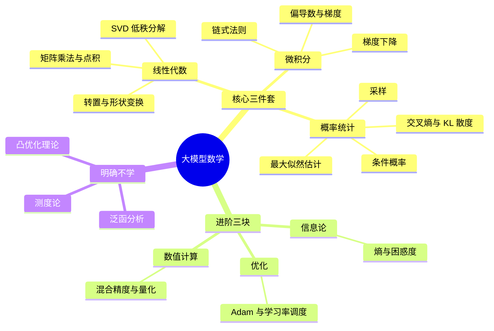
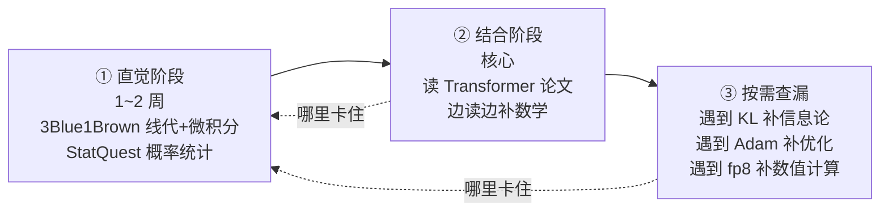

# 历史背景——从"调 API"到"读论文"，中间隔着一层数学

大多数工程师接触大模型是从一行 API 调用开始的：`client.chat.completions.create()`，输入 prompt，输出文本。这个阶段不需要任何数学。

但再往前走一步，问题就来了：

- 想读懂 Transformer 论文，第一页的 `Attention(Q,K,V) = softmax(QKᵀ/√d_k)V` 就把人挡在门外
- 想理解为什么 LoRA 能用低秩矩阵近似全参微调，需要知道 SVD
- 想搞懂训练时的 loss 为什么用交叉熵而不是 MSE，需要概率统计
- 想诊断"为什么 bf16 训练会 loss 爆炸"，需要数值计算基础

**本文目标**：不是让你成为数学系学生，而是让你成为"能读懂论文公式、能手推关键计算"的工程师。为此需要一张地图——哪里必须学、学到什么程度、哪里明确不碰。

---

# 一、全景地图——大模型数学的六块拼图

先把全景摆出来。大模型在数学上就是一句话：

> **大模型 = 一堆矩阵乘法 + 反向传播训练出来的概率模型**

所以核心只有三块，外围再挂三块：



六块拼图的关系：**三件套覆盖 90% 的场景，进阶三块按需取用，剩下的数学系内容明确排除**。下面逐块展开——每一块都精确标注"这个知识点在大模型里的用途"，核心三件套的每一块末尾附「快速学习」小节（核心定义、必背公式、几何直觉），公式可直接背、直接查，这才是工程师学数学的正确姿势。

---

# 二、线性代数——理解"模型里发生了什么"

## 2.1 为什么线代排第一

Transformer 的整个前向计算，本质上是矩阵乘法。输入是 token 序列，每个 token 是一个向量；模型的所有"理解"，都是向量在高维空间中的线性变换。线代是描述这一切的语言。

## 2.2 知识点 × 用途对照表

| 知识点 | 需要掌握的深度 | 在大模型里的用途 |
|--------|--------------|----------------|
| 向量、矩阵、矩阵乘法 | 熟练（手算过 2×3 × 3×2 级别） | Embedding、QKV 计算、FFN——整个 Transformer 就是矩阵乘 |
| 点积 | 熟练 | Attention 打分核心：Q·Kᵀ，衡量两个向量的相似度 |
| 转置、reshape/transpose | 熟练 | 多头注意力的形状变换；看 PyTorch 代码绕不开 |
| 特征值/特征向量 | 了解概念 | 理解 PCA 降维、权重矩阵谱分析 |
| SVD 奇异值分解 | 了解概念 + 知道怎么用 | **LoRA 的原理基石**：ΔW = BA，用低秩矩阵近似全参更新 |
| 张量 | 概念级（三维即可） | 理解 batch × seq_len × hidden_dim 的数据排布 |

## 2.3 检验标准：逐项看懂 Attention 公式

```python
# 整个 Attention 的计算核心，只有 4 行
scores = Q @ K.T / sqrt(d_k)   # ① 点积打分：每个 query 和每个 key 的相似度
weights = softmax(scores)      # ② 归一化：相似度变成概率分布
output = weights @ V           # ③ 加权求和：按注意力权重聚合 value

# Q: (n, d_k)  K: (m, d_k)  V: (m, d_v)
# scores: (n, m)  weights: (n, m)  output: (n, d_v)
```

这个公式吃透 = 懂了 70% 的 Transformer。它只用到了矩阵乘法、点积、转置、softmax——全部在线代 + 概率统计的射程内。具体逐项推导见配套文章《Attention 数学拆解》。

## 2.4 快速学习①：向量的两种视角

```python
# 视角 1（计算机）：一组数字的列表
v = [1, 0, 1, 0]     # embedding 就是这个视角

# 视角 2（几何）：从原点出发的箭头，有方向、有长度
# 长度（模长）：|v| = √(v₁² + v₂² + ... + vₙ²)
# |[3, 4]| = √(9+16) = 5

# 单位向量（方向不变、长度缩为 1）：v / |v|
# 用途：归一化后只比较方向，忽略长度

# 向量加减：对应分量加减（几何上是平行四边形法则）
# 数乘：每个分量乘同一个数 → 拉伸/缩短（负数反向）
```

两种视角自由切换是学线代的关键：**计算时用列表，理解时用箭头**。

## 2.5 快速学习②：点积的两种算法

```python
# 算法 1（分量）：a·b = a₁b₁ + a₂b₂ + ...
# 算法 2（几何）：a·b = |a|·|b|·cos(θ)

# 两个算法结果相等——这是线代最值得记住的等式之一：
# 分量相乘求和 = 长度乘积 × 方向夹角余弦

# 三个推论：
# a·a = |a|²               （自己和自己的点积 = 模长平方）
# a·b = 0 ⟺ 两向量垂直     （点积为零 = 正交 = 无关）
# cos(θ) = a·b/(|a||b|)    （余弦相似度的来源！向量检索、RAG 打分就用它）
```

## 2.6 快速学习③：矩阵乘法与转置

```python
# 形状规则：A(m×n) @ B(n×p) → C(m×p)
# 左矩阵列数 = 右矩阵行数；结果形状 = "左行数 × 右列数"

# 元素规则：C[i][j] = A 的第 i 行 点积 B 的第 j 列

# 三个必记性质：
# ① 结合律：(AB)C = A(BC)          → 可以随便加括号
# ② 分配律：A(B+C) = AB + AC
# ③ 不可交换：AB ≠ BA              → 顺序不能换！(n,n)@(n,d) 和 (n,d)@(n,n) 形状都对不上

# 转置性质：(AB)ᵀ = BᵀAᵀ          → 顺序反转，QKᵀ 计算的基础
# 单位矩阵 I：AI = IA = A           → 相当于"数字 1"
```

**几何直觉（理解级）**：矩阵乘向量 = 对空间做一次线性变换（旋转、缩放、投影）。`X @ W_Q` 就是把整个嵌入空间"转一下"，让语义关系沿新坐标轴展开——这也是 W_Q/W_K/W_V 可学习能起作用的底层原因。

## 2.7 快速学习④：特征值与 SVD 的直觉

```python
# 特征值与特征向量：Av = λv
# 矩阵作用在特征向量上，方向不变、只缩放 λ 倍
# 直觉：特征向量是矩阵的"天然坐标轴"

# SVD：任意矩阵 A 都可以分解为 A = U Σ Vᵀ
#   Vᵀ：旋转 → Σ：沿坐标轴缩放 → U：再旋转
#   Σ 对角线上的奇异值从大到小排列，通常衰减极快

# 低秩近似：只保留前 r 个奇异值（其余置 0）
#   A ≈ U_r Σ_r V_rᵀ，是"所有秩 r 矩阵中最接近 A"的那个（最小二乘意义下最优）

# 这就是 LoRA 的原理基石：
# 全参更新 ΔW 很大，但可以用低秩乘积近似
# ΔW ≈ B·A，A、B 是两个小矩阵 → 可训练参数量骤降
```

## 2.8 线代速查表

| 操作 | 记法 | PyTorch | 大模型中的出现 |
|------|------|---------|--------------|
| 矩阵乘法 | A @ B | `torch.matmul(A, B)` | Q@Kᵀ、A@V |
| 转置 | Aᵀ | `A.T` | Kᵀ |
| 点积 | a·b | `(a * b).sum()` | 相似度打分 |
| 形状变换 | — | `x.view(...)` | 多头拆分/合并 |
| 拼接 | [A; B] | `torch.cat([A, B], dim=-1)` | 多头输出合并 |
| 按行求和 | — | `x.sum(dim=-1)` | softmax 分母 |

---

# 三、微积分——理解"模型怎么学会的"

## 3.1 微积分在大模型里的全部用途

如果说线代描述的是"模型里发生了什么"，微积分描述的是"模型怎么从数据里学会的"。用途收敛得惊人：

| 知识点 | 需要掌握的深度 | 在大模型里的用途 |
|--------|--------------|----------------|
| 导数、偏导数 | 熟练（理解几何意义：变化率） | 梯度 = 损失函数对每个参数的变化率 |
| 链式法则 | **必须滚瓜烂熟** | 反向传播的全部数学基础，没有之一 |
| 梯度下降 | 熟练 | 参数更新的全部逻辑：θ ← θ - η·∇L |
| 雅可比矩阵 | 听说过就行 | 部分论文推导中出现，知道"是个导数矩阵"即可 |

## 3.2 反向传播 = 链式法则的工程实现

```python
# 一个简单的三层链：loss 对第一层的梯度，是逐层链式相乘
# loss = f(g(h(x)))
# ∂loss/∂x = ∂loss/∂g · ∂g/∂h · ∂h/∂x

# 具体到 Transformer：
# 输出 logits → softmax → loss（交叉熵）
# ∂loss/∂W = ∂loss/∂logits · ∂logits/∂hidden · ∂hidden/∂W
#                  ↑ 每一层都只算"自己这一跳"的导数，乘起来
```

PyTorch 的 `autograd` 做的就是这件事：前向时记录计算图，反向时按链式法则自动求导。**你不需要会手推整个 Transformer 的梯度，但需要一眼认出"这是在链式法则"**——否则读任何一篇训练相关的论文都是黑盒。

## 3.3 快速学习①：导数的定义与几何意义

```python
# 导数 = 瞬时变化率
# f'(x) = lim[Δx→0] (f(x+Δx) - f(x)) / Δx

# 几何意义：函数图像在该点的切线斜率

# 大模型视角：f = loss，x = 某个参数 w
# f'(w) = "w 动一点点，loss 变多少"
#   f'(w) > 0 → w 增大 loss 增大 → 应该减小 w
#   f'(w) < 0 → w 增大 loss 减小 → 应该增大 w
# 所以参数更新方向永远取负导数——梯度下降的全部直觉
```

## 3.4 快速学习②：必背导数公式

| 函数 | 导数 | 备注 |
|------|------|------|
| c（常数） | 0 | 常数不变 |
| xⁿ | n·xⁿ⁻¹ | 幂函数 |
| eˣ | eˣ | **指数函数的导数是自己**——softmax 好算的根源 |
| ln x | 1/x | 交叉熵求导会用到 |
| f(x)+g(x) | f' + g' | 逐项求导 |
| f(x)·g(x) | f'g + fg' | 乘法法则 |

```python
# 就这几个够了——softmax + 交叉熵的梯度推导（见配套文章第九节）
# 用到的全部导数：eˣ 的导数、ln x 的导数、乘法法则、链式法则
```

## 3.5 快速学习③：偏导数与梯度

```python
# 偏导数：多变量函数 f(x, y)，固定 y 不变，只对 x 求导 → ∂f/∂x
# 计算规则：把其他变量当常数，按一元函数求导

# 梯度：所有偏导数组成的向量
# ∇f = (∂f/∂x₁, ∂f/∂x₂, ..., ∂f/∂xₙ)

# 关键性质：梯度指向函数上升最快的方向
# → 梯度下降 = 沿负梯度走一小步
# θ ← θ - η · ∇L     η = 学习率（步长）

# 学习率的作用：
# η 太小 → 收敛慢（蜗牛爬）
# η 太大 → 震荡甚至发散（跨过谷底，越走越远）
# 大模型训练 = 选好 η 及其调度策略（见 5.2 节）
```

## 3.6 快速学习④：链式法则的计算图视角

```python
# 公式：dz/dx = dz/dy · dy/dx     （多层就逐层连乘）

# 例：z = ln(eˣ + 1)，令 y = eˣ + 1
#   dz/dx = dz/dy · dy/dx = (1/y) · eˣ

# 计算图视角：
# x → [y = eˣ+1] → [z = ln y] → loss
# 反向传播 = 从 loss 出发，沿计算图反向走：
#   ∂loss/∂x = ∂loss/∂z · ∂z/∂y · ∂y/∂x
#               ↑ 每条边都是一个"局部导数"，逐边相乘

# PyTorch 的 autograd：
# 前向时记录计算图（谁由谁算出来）
# 反向时按链式法则自动连乘 → 你只需要写前向代码
```

## 3.7 微积分速查表

| 概念 | 公式 | 大模型中的出现 |
|------|------|--------------|
| 导数 | f'(x) = 变化率 | 参数对 loss 的影响 |
| 梯度 | ∇L = (∂L/∂θ₁, ...) | 参数更新方向 |
| 梯度下降 | θ ← θ - η∇L | 训练的每一步 |
| 链式法则 | dz/dx = dz/dy·dy/dx | 反向传播 |
| 学习率 | η | 训练配置里最重要的超参之一 |

---

# 四、概率统计——理解"模型的本质是什么"

## 4.1 语言模型本质上是概率模型

大模型输出不是"思考的结果"，而是"条件概率分布"：

```python
# 语言模型的本质
# P(下一个词 | 前面的所有词)

# GPT 每次生成的完整流程：
# 输入 "今天天气" → 模型输出一个概率分布（词表大小的向量）
#   P("很") = 0.42
#   P("真") = 0.31
#   P("不") = 0.15
#   ...（词表里每个 token 一个概率，加起来 = 1）
# 然后从这个分布里"采样"出一个词 → 拼到输入后面 → 重复
```

## 4.2 知识点 × 用途对照表

| 知识点 | 需要掌握的深度 | 在大模型里的用途 |
|--------|--------------|----------------|
| 条件概率、贝叶斯公式 | 熟练 | 理解模型输出的语义：P(next \| context) |
| 常见分布（正态/多项式/伯努利） | 熟练 | 输出层 softmax 就是多项式分布；权重初始化用正态分布 |
| 期望、方差 | 熟练 | 无处不在——从 attention 缩放因子的推导到评估指标 |
| 最大似然估计 MLE | 理解思想 | **训练目标的来源**：最大化训练语料出现的概率 ⟺ 最小化交叉熵 |
| 交叉熵、KL 散度 | 熟练（会算） | 损失函数本身；KL 散度还是 RLHF（PPO）中的核心项 |
| 采样 | 理解三种方法 | 推理时 temperature / top-k / top-p 的数学原理 |

## 4.3 采样三参数——概率统计的直接应用

```python
# 模型输出的 logits 经过温度缩放后再 softmax：
# p_i = exp(logits_i / T) / Σ exp(logits_j / T)

# T = 0.1（低温）→ 分布尖锐 → 几乎总是选概率最大的词 → 确定性强
# T = 1.0（标准）→ 原始分布
# T = 1.5（高温）→ 分布平坦 → 更多"意外"的词 → 创意强

# top-k：只保留概率最高的 k 个词，其余置 0，再归一化
# top-p：按概率从高到低累加，累加到 p 为止，其余截断
```

这就是为什么工具调用场景 `temperature=0`（要确定性）、创意场景 `temperature=0.8`（要多样性）——不是玄学，是概率分布的形状控制。

## 4.4 快速学习①：概率基本规则（四条够用）

```python
# ① 条件概率：P(A|B) = P(A∩B) / P(B)
#    "已知 B 发生了，A 的概率" = 把样本空间缩小到 B

# ② 乘法规则（①的变形）：P(A∩B) = P(A|B)·P(B)
#    语言模型就是反复用它：
#    P("我喜欢") = P(我)·P(喜|我)·P(欢|我,喜)
#    一句话的联合概率 = 逐词条件概率连乘

# ③ 全概率公式：P(A) = Σᵢ P(A|Bᵢ)·P(Bᵢ)
#    "把所有可能路径的概率加起来"

# ④ 贝叶斯公式（①②③的组合）：
#    P(B|A) = P(A|B)·P(B) / P(A)
#    "由果推因"——已知结果，反推原因的概率
```

## 4.5 快速学习②：期望与方差

```python
# 期望（加权平均）：E[X] = Σ x·p(x)
#   骰子：1·(1/6) + 2·(1/6) + ... + 6·(1/6) = 3.5

# 方差（离散程度）：Var(X) = E[(X - E[X])²] = E[X²] - E[X]²

# 三条性质（√d_k 推导全靠它们）：
# E[aX + b] = a·E[X] + b               → 线性
# Var(aX + b) = a²·Var(X)              → 平移不变，缩放按平方放大
# X、Y 独立：Var(X+Y) = Var(X)+Var(Y)  → 独立则方差可加

# 回顾配套文章 √d_k 推导：
# q·k 是 d_k 个独立项之和 → Var(q·k) = d_k·1 = d_k
# 除以 √d_k → 方差变回 1 → 用的就是这三条性质
```

## 4.6 快速学习③：常见分布速查

| 分布 | 记法 | 场景 | 大模型中的出现 |
|------|------|------|--------------|
| 正态分布 | N(μ, σ²) | 连续值、自然噪声 | 权重初始化、LayerNorm |
| 伯努利分布 | B(p) | 二选一 | 二元分类 |
| 二项分布 | B(n, p) | n 次独立二选一 | — |
| 多项分布 | Mult(n, p) | **多选一（词表！）** | **输出层 softmax 就是多项分布** |
| 均匀分布 | U(a, b) | 等可能 | dropout 的随机掩码 |

```python
# 关键对应关系（记住这一条）：
# softmax 输出 = 词表上的多项分布
# p = softmax(logits) → 从 p 中采样 → 得到下一个 token
# 整个生成过程 = 反复从多项分布采样
```

## 4.7 快速学习④：从 MLE 到交叉熵——抛硬币推一遍

```python
# 问题：抛硬币 10 次，7 次正面。估计正面概率 p = ？

# 似然 = "参数 p 下，观察到这组数据的概率"
# L(p) = p⁷ · (1-p)³     ← 7 次正、3 次反的联合概率

# 最大似然估计 MLE：找让 L(p) 最大的 p
# 求导置零：dL/dp = 0 → p = 7/10 = 0.7（就是"频率派"的直觉答案）

# 取对数（连乘变连加，好算好导）：
# log L(p) = 7·log p + 3·log(1-p)

# 加负号、除以总次数 N=10：
# -(7/10)·log p - (3/10)·log(1-p)
# = -Σ 真实频率 · log 模型概率
# = 交叉熵！
```

**结论：最大化似然 ⟺ 最小化交叉熵。** 训练大模型的 loss 用交叉熵不是拍脑袋，是 MLE 的等价形式——这就是"训练目标"的理论来源。

## 4.8 快速学习⑤：KL 散度

```python
# KL(P‖Q) = Σ P(x)·log(P(x)/Q(x))
# 含义：真实分布是 P，用 Q 去近似它，"损失的信息量"

# 两条性质：
# ① 非负：KL ≥ 0，且 KL = 0 ⟺ P = Q
# ② 不对称：KL(P‖Q) ≠ KL(Q‖P)  → 不是"距离"，是"方向性的代价"

# 与交叉熵的关系：KL(P‖Q) = H(P,Q) - H(P)
# 交叉熵 = KL 散度 + P 自己的熵
# P 固定时，最小化交叉熵 ⟺ 最小化 KL（H(P) 是常数）

# 大模型中的出现：
# - RLHF/PPO：惩罚模型偏离参考模型的 KL 项
# - 知识蒸馏：让学生分布 Q 逼近教师分布 P
# - 评估：衡量两个分布差异的通用工具
```

## 4.9 概率统计速查表

| 概念 | 公式 | 大模型中的出现 |
|------|------|--------------|
| 条件概率 | P(A\|B) = P(A∩B)/P(B) | 语言模型定义 |
| 联合概率 | P(A∩B) = P(A\|B)P(B) | 逐词生成 |
| 贝叶斯 | P(B\|A) ∝ P(A\|B)P(B) | 推断、分类 |
| 期望/方差 | E[X]、Var(X) | √d_k 推导、权重初始化 |
| MLE | argmax Π p(xᵢ) | 训练目标 |
| 交叉熵 | -Σ y·log ŷ | 损失函数 |
| KL 散度 | Σ P·log(P/Q) | RLHF 惩罚项 |

---

# 五、进阶三块——按需取用，不要提前学

## 5.1 信息论

| 知识点 | 用途 | 什么时候补 |
|--------|------|-----------|
| 熵、交叉熵 | 损失函数与评估指标的理论底座 | 理解 loss 含义时 |
| 困惑度 Perplexity | 语言模型评估指标：PPL = exp(交叉熵) | 看 benchmark 时 |

交叉熵是概率统计和信息论的交汇点——**学会交叉熵，两块拼图就拼上了**。

```python
# 熵（不确定度）：H(p) = -Σ p(x)·log p(x)
#   均匀分布熵最大（完全不确定），one-hot 分布熵 = 0（完全确定）

# 交叉熵：H(p, q) = -Σ p(x)·log q(x)
#   "用分布 q 去描述真实分布 p 的平均代价"

# 困惑度（语言模型评估指标）：
# PPL = exp(交叉熵) = 2^(每 token 平均编码比特数)
# PPL 越低越好：PPL = 10 意味着平均每个 token 相当于在 10 个候选里猜
```

## 5.2 优化

| 知识点 | 用途 | 什么时候补 |
|--------|------|-----------|
| SGD → Momentum → Adam/AdamW | 理解训练配置里的 optimizer 参数 | 动训练/微调时 |
| 学习率 warmup + 余弦退火 | 理解学习率调度曲线 | 动训练/微调时 |
| 正则化（weight decay、dropout） | 理解为什么模型不严重过拟合 | 看训练论文时 |

```python
# Adam = Momentum + RMSProp 的组合，训练大模型的事实标准：

# m = β₁·m + (1-β₁)·g         # 一阶矩：梯度的指数滑动平均（惯性/动量）
# v = β₂·v + (1-β₂)·g²        # 二阶矩：梯度平方的滑动平均（自适应步长）
# m̂ = m / (1-β₁ᵗ)             # 偏差修正（修正冷启动的前几步）
# v̂ = v / (1-β₂ᵗ)
# θ = θ - η · m̂ / (√v̂ + ε)    # 更新：方向用 m̂，步长除以 √v̂

# 直觉：梯度大的参数 → v 大 → 步长自动缩小（防震荡）
#       梯度小的参数 → v 小 → 步长自动放大（加速学习）
# β₁=0.9, β₂=0.999, ε=1e-8 是论文默认值，微调时一般只调 η
```

## 5.3 数值计算

| 知识点 | 用途 | 什么时候补 |
|--------|------|-----------|
| 浮点数表示（fp32/bf16/fp8） | 理解混合精度训练：为什么能省一半显存 | 动训练时 |
| 数值稳定性技巧 | 为什么 softmax 要减最大值、LayerNorm 放哪里 | 读源码时 |
| 量化（INT8/INT4） | 推理加速与显存压缩的原理 | 部署模型时 |

| 格式 | 指数位 | 尾数位 | 取值范围 | 定位 |
|------|--------|--------|---------|------|
| fp32 | 8 | 23 | ±3.4×10³⁸ | 默认精度 |
| fp16 | 5 | 10 | ±65504 | 老式半精度，范围小易溢出 |
| bf16 | 8 | 7 | 同 fp32 | **训练标配**：范围与 fp32 一致，只牺牲精度 |
| fp8 | 4~5 | 2~3 | 很小 | 推理加速，需要按张量缩放 |

```python
# bf16 为什么比 fp16 更适合训练：
# 溢出风险：梯度瞬间超过 65504 → fp16 爆炸，bf16 没事（指数位同 fp32）
# 混合精度：矩阵乘用 bf16（快、省显存），梯度累加用 fp32（准）
# 显存直接减半 → 这是"同样显存训更大模型"的主要手段之一
```

---

# 六、明确不学——先排除，别踩坑

工程师学大模型数学，最大的风险不是学得少，而是**学错路线**。以下是常见陷阱：

| 排除项 | 为什么排除 | 什么情况下才需要 |
|--------|-----------|----------------|
| 泛函分析、测度论 | 数学系证明路线，与工程理解无关 | 做理论证明方向的研究 |
| 凸优化完整理论 | 深度学习本身是非凸问题，教科书上的凸优化结论大部分用不上 | 做优化算法研究 |
| 傅里叶变换 | 只在个别位置编码论文（如 FNet）出现 | 恰好读到那篇论文时再查 |
| 图论 | attention 可以"看作"全连接图，但不需要图论工具来分析它 | 做图神经网络方向 |

**判断标准**：如果一个数学主题，你无法回答"这个知识点在 LLM 里用在哪"——那就先不学。

---

# 七、学习路径——以终为始，别陷入数学

## 7.1 最大的误区：先啃完数学再学大模型

数学和大模型**交替推进**，效率远高于顺序学习：



为什么不能顺序学：数学太抽象，脱离模型学完就忘。**以 Transformer 为锚点学数学，每个公式都有落点，记忆才牢固**。

## 7.2 毕业标准——三个手推检验

不需要考试，用这三个手推来检验数学是否够用：

| 检验 | 考察的数学 | 卡住说明缺什么 |
|------|-----------|--------------|
| ① 白板手推 attention 完整计算流（含形状变化） | 线代：矩阵乘/点积/转置 | 补线代 |
| ② 手推 softmax + 交叉熵的反向传播梯度，得到优雅形式 ŷ - y | 微积分：链式法则 | 补链式法则 |
| ③ 讲清 Adam 更新公式每个符号的含义 | 概率统计 + 优化 | 补优化 |

三个都能推，数学就毕业了。剩下的都是"遇到再查"。

## 7.3 参考资源

| 资源 | 定位 | 用法 |
|------|------|------|
| 3Blue1Brown《线性代数的本质》《微积分的本质》 | 直觉建立（B 站有中字） | ① 阶段主力 |
| StatQuest 频道 | 概率统计直觉 | ① 阶段主力 |
| 《动手学深度学习》(d2l.ai) 附录数学基础 | 速查手册 | ② 阶段常备 |
| 《深度学习》花书第 2~4 章 | 字典 | 需要严格定义时查 |
| Mathematics for Machine Learning | 系统参考书（免费电子版） | 不啃全书，当案头字典 |

---

# 八、总结

| 模块 | 一句话用途 | 优先级 |
|------|-----------|--------|
| **线性代数** | 看懂模型里发生了什么（矩阵乘） | 必学 |
| **微积分** | 看懂模型怎么学会的（链式法则） | 必学 |
| **概率统计** | 看懂模型的本质（条件概率） | 必学 |
| 信息论 | 看懂 loss 和评估指标 | 按需 |
| 优化 | 看懂训练配置 | 按需 |
| 数值计算 | 看懂训练/部署的工程技巧 | 按需 |

**一句话记住**：大模型 = 矩阵乘法 + 链式法则 + 条件概率。先吃透这三样在 attention 公式里的体现，再按论文需要向外扩展。

各节的「快速学习」小节就是必背清单：**线代背点积等式（2.5）、微积分背导数表（3.4）、概率背四条规则 + MLE→交叉熵推导（4.4/4.7）**，其余按速查表现用现查。

# 延伸阅读

**Do——动手验证：**
- 用 NumPy 手写一遍 4 行 attention（不用 PyTorch 的 `nn.MultiheadAttention`），打印每一步的形状
- 手推 softmax + 交叉熵的梯度，验证结果是 ŷ - y
- 同一个 prompt 跑 temperature = 0.1 / 1.0 / 1.5，观察输出分布的差异

**Todo——深入方向：**
- 配套文章《Attention 数学拆解——从点积打分到反向传播的完整推导》
- Transformer 完整前向：从 token 到 logits 的 12 层数据流
- LoRA 的 SVD 原理：为什么低秩矩阵能近似全参更新

*本文参考资料：*
- 3Blue1Brown: https://www.3blue1brown.com/topics/linear-algebra
- 动手学深度学习 (d2l.ai): https://zh.d2l.ai/
- "The Illustrated Transformer" by Jay Alammar: https://jalammar.github.io/illustrated-transformer/
- "Attention Is All You Need" (Vaswani et al., 2017)
