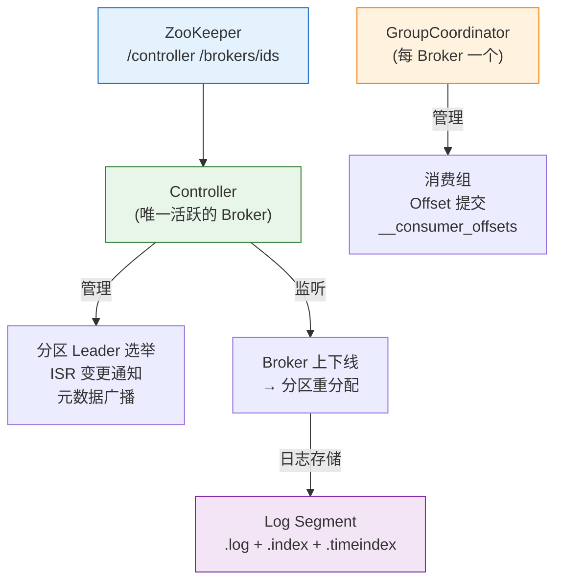
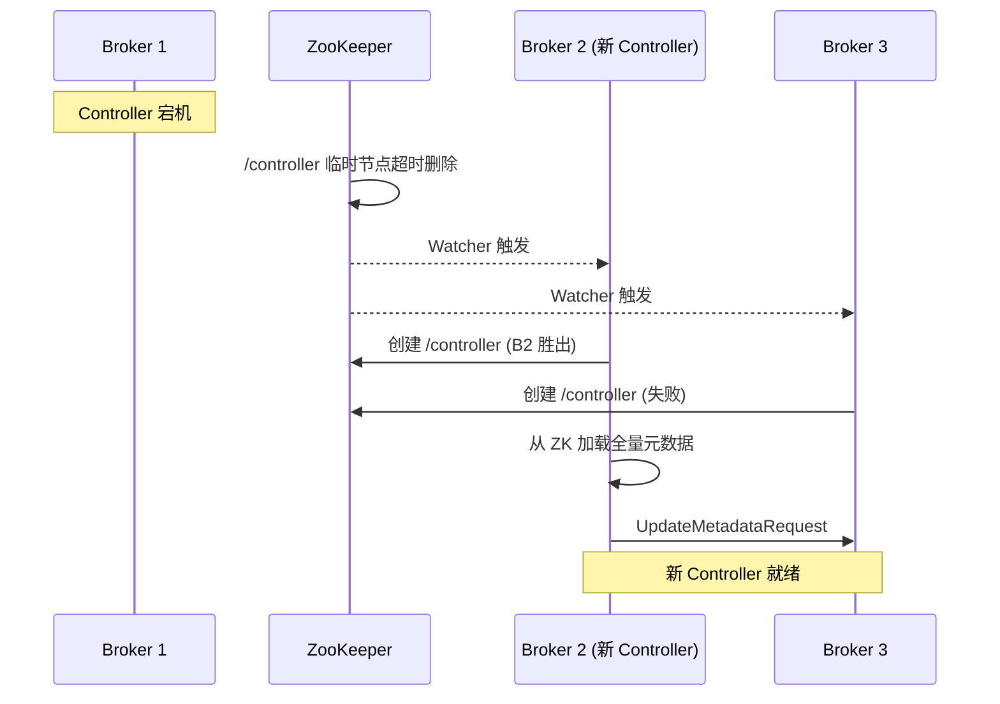
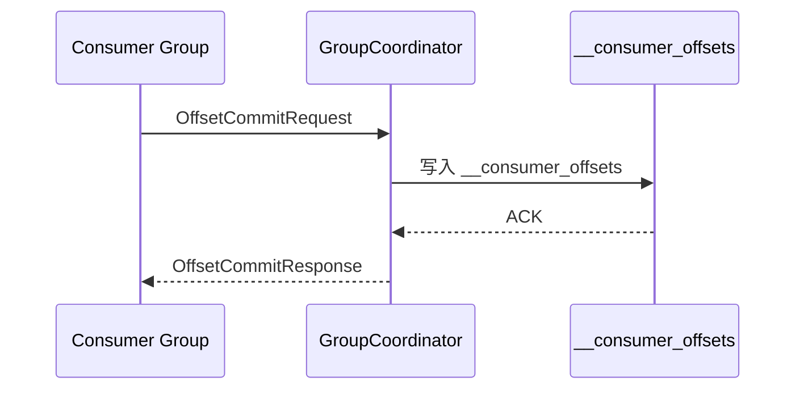

# 历史背景——为什么 LinkedIn 要造 Kafka？

2010 年，LinkedIn 面临一个典型的"数据管道爆炸"问题：各个业务系统之间通过点对点的 TCP 连接传递数据，活动数据、用户画像、搜索索引、推荐 feed……几十个服务互相拉扯，拓扑乱成一团。更重要的是，这些数据都是**流式的**——用户每点击一个页面、每关注一个人、每发一条消息，都需要实时被下游系统感知。

当时已有的消息系统（ActiveMQ、RabbitMQ）在架构上偏重"可靠投递"，消息消费后立即删除，无法回溯历史数据；同时由于依赖索引结构来追踪消息投递状态，吞吐量很难突破数万条/秒。LinkedIn 的工程师（以 Jay Kreps 为代表）决定推倒重来，按照**分布式日志**的范式设计一个新的系统——这就是 Kafka。

**Kafka 的核心洞察**：消息不需要在消费后被删除。把所有消息按时间顺序追加到一个日志里，消费者自己记录"读到了哪里"，这样既实现了极高的写入吞吐（纯顺序写磁盘），又天然支持消息回溯和多订阅者独立消费。

理解这段历史，才能理解 Kafka 为什么长成今天这个样子——Controller、GroupCoordinator、Log Segment 这些组件，本质上都是为了把"分布式日志"这一简单模型扩展到数百台 Broker、数万分区、PB 级数据的规模。



---

# 一、Controller——集群的大脑

## 1.1 What：Controller 是什么？

Controller 是 Kafka 集群中**唯一一个承担管理职责的 Broker**。它不是独立的进程，而是某个 Broker 在竞选中获胜后获得的"角色"。所有集群级别的管理操作——分区 Leader 选举、Broker 上下线处理、元数据广播——都由 Controller 发起。

这个设计的内在权衡是：集中式管理（一个 Controller 决定一切）比分布式协商（每个 Broker 各自决定）简单得多，避免了复杂的一致性协议，代价是 Controller 宕机时有短暂的不可用窗口。

## 1.2 Why：为什么需要 Controller？

假设没有 Controller，每个 Broker 各自独立判断分区 Leader 应该在哪里。当 Broker A 宕机，Broker B 和 Broker C 分别根据自己的局部视角决定谁来接管该 Broker 上的分区——两个 Broker 可能选出不同的 Leader，导致**脑裂**。

Controller 的价值就是提供一个**全局唯一的决策者**：所有 Broker 把元数据上报给它，它独自做出决策后广播给所有人。

## 1.3 How：Controller 选举与职责

**选举过程**：所有 Broker 启动时都会在 ZooKeeper 的 `/controller` 路径上尝试创建临时节点。ZK 保证只有一个能创建成功，创建成功的那个 Broker 成为 Controller。Controller 启动后，会从 ZK 加载全量元数据（所有 Broker、所有 Topic、所有分区的状态），并注册一系列 Watch 来监听变化。

```bash
# 查看当前 Controller（KRaft 模式）
./kafka-metadata.sh --snapshot /tmp/kraft-metadata --print
```

**Controller 的核心职责**：

| 职责 | 触发条件 | 具体动作 |
|------|---------|---------|
| **分区 Leader 选举** | Broker 宕机或下线 | 扫描受影响分区 → 从 ISR 中按 AR 顺序选新 Leader → 通知所有 Broker |
| **ISR 管理** | Follower 复制进度变化 | Follower 落后超过 `replica.lag.time.max.ms` → 移出 ISR；追回 → 加回 ISR |
| **元数据广播** | 任何元数据变更 | 通过 `UpdateMetadataRequest` 推送给所有 Broker |
| **分区重分配** | 运维脚本触发 | 执行 `kafka-reassign-partitions` 的分区迁移计划 |
| **Topic 创建/删除** | 管理员操作 | 在 ZK 中创建 Topic 节点 → 通知各 Broker 创建对应的 Log 目录 |

## 1.4 Controller 故障转移

Controller 宕机 → ZK 临时节点超时删除 → 其他 Broker 的 ZK Watcher 被触发 → 所有 Broker 争先抢注 `/controller` → 胜者成为新 Controller → 从 ZK 重新加载全量元数据。

**影响窗口**：Controller 切换期间，新的分区 Leader 选举无法进行（受影响分区的读写暂停），但已存在的 Leader 继续服务。整个切换过程通常在**几秒到 30 秒**内完成（取决于 ZK session timeout 和分区数量）。

**KRaft 的改进（Kafka 3.3+）**：KIP-500 用内置的 Raft 共识替代 ZK 存储元数据，Controller 选举从"抢 ZK 节点"变为 Raft 的 Leader 选举。好处是摆脱了对 ZK 的依赖，Controller 切换更快（Raft 心跳超时 < 1s），且元数据变更日志本身就是 Kafka Topic（`@metadata`），无需维护两套系统。



---

# 二、GroupCoordinator——消费组的管家

## 2.1 What：GroupCoordinator 是什么？

每个 Broker 上都有一个 `GroupCoordinator` 实例，负责管理分配到自己身上的消费组。但一个消费组只有一个 Coordinator（位于 `__consumer_offsets` 的 Group 分区的 Leader 所在 Broker），避免多写冲突。

**Coordinator 的选址规则**：对消费组 ID 做 hash → 映射到 `__consumer_offsets` 的某个分区 → 该分区的 Leader Broker 就是该消费组的 Coordinator。

## 2.2 Why：Offset 为什么从 ZK 搬到 Kafka 内部 Topic？

Kafka 0.8 时代，消费组的 Offset 存在 ZK 中。0.9 版本将其迁移到了内部 Topic `__consumer_offsets`。原因非常直接：

1. **ZK 不适合高频写入**：每个消费者每秒可能要提交多次 Offset，ZK 的写吞吐远不及 Kafka 自身
2. **架构闭环**：Offset 本质上也是一种消息（"消费组 G 读到了分区 P 的 offset O"），用 Kafka 自己存储天然合理，享受 Kafka 的分区、复制、压缩能力
3. **减少依赖**：降低对 ZK 的压力，为后来 KRaft 移除 ZK 做准备



## 2.3 How：Rebalance 协议

当消费者加入或离开消费组，Coordinator 触发 Rebalance，重新分配分区。

**Rebalance 的四个阶段**：
1. **JoinGroup**：所有消费者向 Coordinator 发送 `JoinGroup` 请求
2. **选举 Group Leader**：Coordinator 选第一个加入的消费者作为该消费组的 Leader Consumer
3. **分配方案**：Coordinator 将所有成员信息发给 Group Leader，Leader 执行分配策略后返回方案
4. **SyncGroup**：Coordinator 将分配方案发给所有消费者，各消费者开始消费指定分区

**四种分配策略**：

| 策略 | 分配逻辑 | 适用场景 |
|------|---------|---------|
| **Range**（默认） | 按 Topic 维度，每个 Topic 的分区尽量连续分给一个消费者 | 单个 Topic 多分区时可能不均衡 |
| **RoundRobin** | 所有 Topic 的所有分区轮询分配 | 消费者订阅的 Topic 大致相同时最均衡 |
| **Sticky** | 尽量保持上次分配，减少分区迁移 | 滚动重启时减少不必要的数据切换 |
| **Cooperative Sticky** | 增量 Rebalance，不暂停整个消费组 | 生产环境首选，避免 Stop-The-World |

**Cooperative Rebalance 是 Kafka 2.4+ 的重大改进**：传统 Eager Rebalance 期间所有消费者暂停消费（Stop-The-World），而 Cooperative 只迁移发生变更的分区，其余分区继续消费。

---

# 三、日志存储——Kafka 的物理基石

## 3.1 What：日志存储模型

Kafka 的数据以 **Log Segment** 为单位存储在磁盘上。一个 Topic 分区在磁盘上对应一个目录，每个 Segment 由一个 `.log` 文件（消息数据）和两个索引文件构成。按 offset 命名 Segment 使得定位变得极快——你要找 offset=25000000，就直接读 `00000000000002500000.log`。

```
topic-partition/
├── 00000000000000000000.log        ← 消息数据
├── 00000000000000000000.index      ← 偏移量→物理位置索引
├── 00000000000000000000.timeindex  ← 时间戳→偏移量索引
├── 00000000000002500000.log        ← 下一个 Segment
└── leader-epoch-checkpoint         ← Leader Epoch 记录
```

## 3.2 Why：为什么用稀疏索引 + 二分查找？

Kafka 选择**稀疏索引**而非每条消息一个索引项。原因在于：

- **空间效率**：每 4KB 左右一个索引项（`log.index.interval.bytes`），一个 16GB 的 Segment 只有约 4MB 的索引——全部可以在内存中
- **查找效率**：二分查找 `.index` 拿到 offset 的大致物理位置 → 再在 `.log` 中顺序扫描最多 4KB 找到精确位置
- **写入效率**：稀疏意味着索引写操作的频率降低，不影响写入吞吐

**`.timeindex` 同理**，支持按时间戳二分定位，适合"从 10 分钟前开始消费"这种场景。

## 3.3 日志清理策略

| 策略 | 参数 | 行为 | 适用场景 |
|------|------|------|---------|
| **按时间删除** | `retention.ms=7d` | 超过 7 天的 Segment 直接删除 | 流处理、日志收集（数据天然有时效） |
| **按大小删除** | `retention.bytes=100GB` | 分区总大小超限删最旧 Segment | 磁盘空间有限的场景 |
| **按 Key 压缩** | `cleanup.policy=compact` | 每个 Key 只保留最新 Value | 数据库 CDC、KV 存储、状态恢复 |

**Log Compaction** 值得单独展开：它不是按时间删除，而是按 Key 去重。当后台的 Log Cleaner 线程扫描 Segment 时，保留每个 Key 最新版本的消息，删除旧版本。这使 Kafka 可以充当**分布式 KV 数据库的 changelog**——比如 Kafka Streams 的 state store 恢复就依赖 Compaction。

## 3.4 Do：日志段大小怎么设？

```properties
# Segment 大小（默认 1GB）
log.segment.bytes=1073741824

# 意义：
# - 太小：文件数过多，文件句柄耗尽
# - 太大：单个文件太大，清理不够灵活
# 推荐：1GB 是合理的平衡点，大流量 Topic 可设为 2-4GB
```

---

# 四、总结

| 组件 | 核心职责 | 设计权衡 |
|------|---------|---------|
| **Controller** | 集群唯一大脑，管分区 Leader + ISR + 元数据广播 | 集中式决策简单高效，但切换时有短暂不可用窗口 |
| **GroupCoordinator** | 管消费组 Offset + Rebalance | Offset 存 Kafka 内建 Topic，闭环架构 |
| **Log Segment** | 稀疏索引 + 分段日志 + 二分查找 | 时间/空间效率的工程最优解 |
| **ZooKeeper / KRaft** | 元数据一致性存储 | KRaft 摆脱 ZK 依赖，架构更简洁 |

# 延伸阅读

**Do——动手实践：**
- 用 `kafka-metadata.sh --snapshot` 查看 KRaft 模式下的元数据快照
- 找一台测试 Broker，用 `jstack` dump Controller 线程，观察它处理的请求类型
- 修改 `log.index.interval.bytes=4096` vs `=1024`，对比索引文件大小和查找延迟

**Todo——深入方向：**
- [ ] KRaft 模式下的 Controller 选举与 ZK 模式的详细对比（Raft 日志 vs ZK 临时节点）
- [ ] `__consumer_offsets` 的内部格式与 Compaction 行为
- [ ] Cooperative Sticky Rebalance 的增量分配算法源码分析
- [ ] Log Cleaner 的 Compaction 线程模型与 `cleaner.io.threads` 调优

*本文参考资料：*
- Neha Narkhede et al.《Kafka: The Definitive Guide》（第 2 版）——第 5 章（内部机制）、第 6 章（可靠性）
- Apache Kafka 官方文档 - Design: https://kafka.apache.org/documentation/#design
- KIP-500: Replace ZooKeeper with a Self-Managed Metadata Quorum
- KIP-429: Incremental Cooperative Rebalancing
- Jun Rao, "Intra-cluster Replication in Kafka" (2013)
