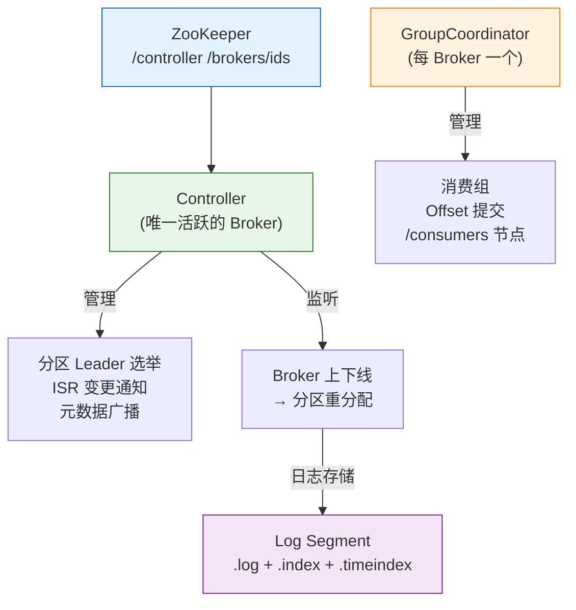
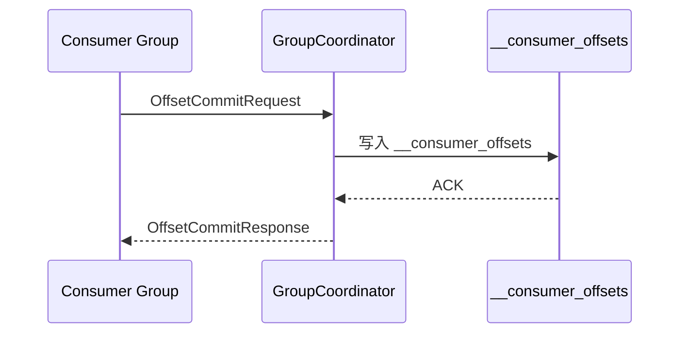

---

# 一、Controller——集群的大脑

## 1.1 Controller 选举

所有 Broker 启动时都在 ZK 的 `/controller` 路径上创建**临时顺序节点**。只有**第一个创建成功**的 Broker 成为 Controller。

```bash
# 查看当前 Controller
./kafka-metadata.sh --snapshot /tmp/kraft-metadata --print
# KRaft 模式：/controller 节点被元数据仲裁替代
```

## 1.2 Controller 的核心职责

| 职责 | 机制 |
|------|------|
| **分区 Leader 选举** | Broker 上下线 → 扫描受影响分区 → 从 ISR 中选新 Leader → 更新 ZK 元数据 |
| **ISR 管理** | Follower 落后太多 → 从 ISR 移出；追上 → 加回 ISR |
| **元数据广播** | 通过 `UpdateMetadataRequest` 推送到所有 Broker |
| **分区重分配** | 执行运维脚本的 `reassign partitions` 指令 |

## 1.3 Controller 故障转移

Controller 宕机 → ZK 临时节点超时删除 → 其他 Broker 抢注 `/controller` → 新 Controller 从 ZK 重新加载全量元数据。

# 二、GroupCoordinator——消费组的管家

## 2.1 消费组 Offset 存储



Offsets 从 ZK 迁移到内部 Topic `__consumer_offsets`（Kafka 0.9+），依赖 Kafka 原生的分区和复制机制。

## 2.2 Rebalance 协议

| 策略 | 分配逻辑 |
|------|---------|
| **Range**（默认） | 按 Topic 分区范围均分，可能不均 |
| **RoundRobin** | 所有分区轮询分配，均分更均衡 |
| **Sticky** | 尽量保持上次分配结果，减少分区迁移 |
| **Cooperative Sticky** | 增量 rebalance，不暂停整个消费组 |

---

# 三、日志存储——Kafka 的物理基石

## 3.1 Log Segment 结构

```
topic-partition/
├── 00000000000000000000.log        ← 消息数据
├── 00000000000000000000.index       ← 偏移量→物理位置索引
├── 00000000000000000000.timeindex   ← 时间戳→偏移量索引
├── 00000000000002500000.log         ← 下一个 Segment
└── leader-epoch-checkpoint          ← Leader Epoch 记录
```

## 3.2 索引机制

- **稀疏索引**：不是每条消息一个索引项，而是每 4KB 左右一个索引项
- **二分查找**：用 index 定位目标 offset 的大致位置，再顺序扫描 .log 找精确位置
- `.timeindex`：按时间戳二分定位，适合"从 10 分钟前开始消费"

## 3.3 日志清理策略

| 策略 | 参数 | 行为 |
|------|------|------|
| **按时间删除** | `retention.ms=7d` | 超过 7 天的 Segment 直接删除 |
| **按大小删除** | `retention.bytes=100GB` | 分区总大小超限删最旧 Segment |
| **按 Key 压缩** | `cleanup.policy=compact` | 每个 Key 只保留最新 Value |

---

# 四、总结

| 组件 | 一句话 |
|------|--------|
| **Controller** | 集群唯一大脑，管分区 Leader 和 ISR |
| **GroupCoordinator** | 管消费组 offset + rebalance |
| **Log Segment** | 稀疏索引 + 分段日志 + 二分查找 |
| **ZooKeeper** | 元数据存储（KRaft 3.3+ 可移除） |

*本文参考资料：*
- Neha Narkhede et al.《Kafka: The Definitive Guide》（第 2 版）——第 1-6 章（架构、生产者、消费者、内部机制）
- Apache Kafka 官方文档 - Design 章节: https://kafka.apache.org/documentation/#design
- Apache ZooKeeper 官方文档: https://zookeeper.apache.org/doc/current/
- Flavio P. Junqueira, Benjamin Reed《ZooKeeper: Distributed Process Coordination》
- Linux 内核文档 - sendfile(2) / mmap(2) / Page Cache
- KIP-500: Replace ZooKeeper with a Self-Managed Metadata Quorum (KRaft)
