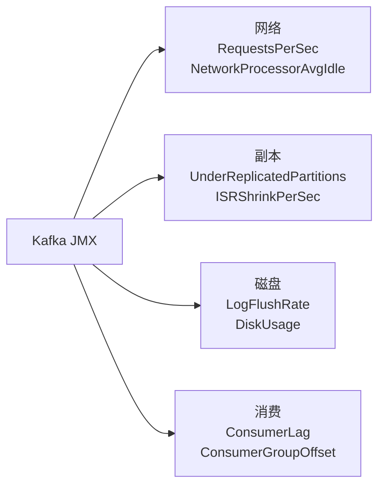

# 历史背景——为什么要专门写 Kafka 监控？

2016 年，Uber 的 Kafka 集群发生过一次著名事故：某个消费组的 Lag 悄悄涨到了几十亿，但没有任何告警触发。直到生产者的磁盘被积压消息写满，周边的在线服务也被拖垮，才发现是消费者的业务代码改了逻辑，消费速率从 10 万/秒陡降到几十条/秒。事故复盘的核心结论：**Kafka 作为数据管道的"中枢神经系统"，不能只看它自己跑得怎么样，还必须看上下游——消息来得快不快（生产者流量）、走得动走不动（消费者 Lag）、管子堵不堵（磁盘水位）。**

Kafka 监控的独特之处在于它需要覆盖**三个角色**（Broker、Producer、Consumer）和**两个方向**（流量进出、数据落地）。如果只关注 Broker 的 CPU 和内存，你会错过消费 Lag 的积压；如果只关注 Lag，你会错过磁盘即将写满的信号。本文从这三个角色的关键指标出发，结合故障演练 SOP，构建一个完整的可观测性体系。

---

# 一、消费 Lag 监控——最核心的指标

## 1.1 What：Lag 是什么？

```
Lag = 生产者最新写入的 offset - 消费者当前消费到的 offset
     即分区上还有多少条消息在等待被消费
```

每个分区的 lag 独立计算。消费组的 lag 是所有分区 lag 的总和。

## 1.2 Why：Lag 为什么是第一个要监控的指标？

Lag 是一个**联动信号**。Lag 上涨说明消费者跟不上，消费者跟不上 → 消息积压在磁盘 → 磁盘写满 → Broker 拒绝写入 → 生产者 send 失败 → 业务数据丢失。因此 Lag 是第一块多米诺骨牌。

更重要的是，**Lag 的增速比 Lag 的绝对值更重要**。Lag = 10000 但稳定 → 说明消费者和生产者速率匹配，只是有固定延迟。Lag 以每秒 1000 的速度增长 → 说明消费者出了问题，马上会失控。

```bash
# 查看消费组 Lag
kafka-consumer-groups --bootstrap-server localhost:9092 \
  --group my-group --describe

# 输出示例
# TOPIC  PARTITION  CURRENT-OFFSET  LOG-END-OFFSET  LAG
# order  0          1523000        1523000         0      ← 健康
# order  1          1523000        1528000         5000   ← 有积压！
# order  2          1523000        1535000         12000  ← 严重积压！
```

## 1.3 How：Prometheus + Grafana 监控体系

**Kafka Exporter** 是 Prometheus 生态中用于采集 Lag 指标的标准工具。它的核心指标：

```yaml
# Kafka Exporter 暴露的关键指标（拉取端点 /metrics）
kafka_consumergroup_lag                   # 每个分区的 Lag 值
kafka_consumergroup_lag_sum               # 消费组 Lag 总和
kafka_topic_partition_current_offset      # 消费者当前 offset
kafka_topic_partition_latest_offset       # 分区最新 offset
```

**分层告警策略**：

| 告警级别 | 条件 | 动作 |
|---------|------|------|
| **P3 提醒** | Lag > 5000 | 记录，观察趋势 |
| **P2 警告** | Lag > 10000 持续 5 分钟 | 通知 oncall，排查消费者 |
| **P1 紧急** | Lag 增速 > 100/s | 立即响应，考虑扩容消费者 |
| **P0 灾难** | 磁盘使用率 > 85% 且 Lag 仍在增长 | 全员响应，准备限流生产者 |

**Prometheus 告警规则示例**：

```yaml
groups:
  - name: kafka_lag
    rules:
      - alert: KafkaLagIncreasing
        expr: rate(kafka_consumergroup_lag_sum[5m]) > 100
        for: 5m
        labels:
          severity: P1
        annotations:
          summary: "消费组 {{ $labels.consumergroup }} 的 Lag 正在快速增长"
```

---

# 二、磁盘水位——沉默的杀手

## 2.1 What：为什么磁盘水位单独拿出来说？

磁盘写满与其他资源耗尽（CPU、内存）不同——它一旦发生，后果是**不可逆的**：

```
磁盘满
  → Broker 拒绝写入（Kafka 不会删除已有数据为写入腾空） 
    → 生产者 send() 抛异常
      → 消息积压在客户端内存
        → 客户端 OOM / 业务数据丢失
          → 同时 Controller 可能因磁盘满而下线
            → 集群完全动荡
```

而磁盘写满的原因往往不是"流量真的太大"，而是**retention 策略配置不当**——比如 Topic 设了 `retention.ms=7d` 但增长超出了预估，或者某个消费者挂了导致数据积压 7 天后还没消费完就被删了。

## 2.2 How：预防和监控

```properties
# Broker 端磁盘保护配置
log.retention.bytes=500000000000  # 分区最大 500GB（硬限制）
log.segment.bytes=1073741824      # 1GB 一个 Segment（方便清理）
log.retention.check.interval.ms=300000  # 每 5 分钟检查一次清理条件
```

```yaml
# Prometheus node_exporter 磁盘监控
# node_filesystem_avail_bytes{mountpoint="/data/kafka"}
# node_filesystem_usage_percent{mountpoint="/data/kafka"} > 80
```

**多级保护策略**：

| 水位 | 动作 |
|------|------|
| 60% | 正常，定期巡检 |
| 75% | 通知扩容/延长 retention 时间 |
| 85% | P2 告警，启动 Topic 限流，加速清理旧 Segment |
| 92% | P1 告警，紧急扩容，暂停低优先级 Topic 的写入 |

---

# 三、核心 JMX 指标速查

Kafka 通过 JMX 暴露了上百个指标。不需要全部监控，以下 7 个覆盖了最关键的健康状态：



| 指标 | 健康值 | 异常排查方向 |
|------|--------|------------|
| `ActiveControllerCount` | **= 1** | 不等于 1 → Controller 故障或脑裂 |
| `UnderReplicatedPartitions` | **= 0** | > 0 → Broker 宕机、网络分区、磁盘满 |
| `BytesInPerSec` 趋势 | **平稳** | 突刺 → DDoS 或业务突发；持续下降 → 生产者故障 |
| `RequestHandlerAvgIdlePercent` | **> 0.3** | < 0.3 → IO 线程不足或磁盘瓶颈 |
| `NetworkProcessorAvgIdlePercent` | **> 0.3** | < 0.3 → 网络线程不足或流量太大 |
| `ISRShrinkPerSec` | **= 0** | > 0 → Follower 跟不上，ISR 在缩容 |
| `ZooKeeperDisconnectsPerSec` | **= 0** | > 0 → ZK 连接不稳定（KRaft 模式无此指标） |

**JMX 采集工具**：`jmx_exporter`（Prometheus 官方）、`jolokia`（REST 桥接）、Dynatrace/Datadog Agent 都支持直接拉取 Kafka JMX 指标。

---

# 四、故障演练 SOP

**演练的意义**：监控是"看到问题"，SOP 是"知道怎么做"。很多团队监控面板很全，但凌晨 3 点 Broker 宕机时，oncall 的同学还要翻 Confluence 查操作步骤。SOP 的价值在于**把应急响应变成肌肉记忆**。

## 4.1 Broker 宕机

```
现象：
  - UnderReplicatedPartitions 告警
  - 宕机 Broker 上 Leader 分区不可用
  - 对应的 Producer/Consumer 请求超时

操作步骤：
  1. 确认 ISR 中有其他副本可以接管（URP 未持续扩大）
  2. 等待 Controller 自动触发 Leader 选举（通常 < 30s）
  3. 如果超过 2 分钟仍未恢复 → 排查 Controller 状态
  4. 恢复宕机 Broker：
     - 检查硬件（磁盘 SMART、网卡 link status）
     - 检查 OS（dmesg 有无 OOM Killer、磁盘 IO error）
     - 启动 Kafka → 观察 ISR 重新加入
  5. 观察 auto.leader.rebalance.enable 是否触发优选 Leader 选举
     （手动触发：kafka-leader-election.sh --election-type preferred）
```

## 4.2 Controller 切换

```
现象：
  - ActiveControllerCount 短暂波动（从 1 变 0 再变 1）
  - 生产者和消费者短暂报错 LEADER_NOT_AVAILABLE
  - ZK 日志中出现 /controller 节点删除和重新创建

影响范围：
  - 受控分区（新 Leader 选举期间）暂时不可读写
  - 已有 Leader 的分区不受影响，继续服务

恢复过程：
  1. 旧 Controller 宕机 → ZK session 超时 → /controller 临时节点被删除
  2. 其他 Broker 检测到 /controller 删除 → 抢注该节点
  3. 抢注成功者成为新 Controller
  4. 新 Controller 从 ZK 加载全量元数据
  5. 对受影响分区执行 Leader 选举
  6. 通过 UpdateMetadataRequest 广播新状态

典型恢复时间：10-60 秒（取决于分区数和 ZK 延迟）
```

## 4.3 磁盘故障

```
现象：
  - Broker 日志中出现 "disk error" / "No space left on device"
  - 该 Broker 上的所有分区 ISR 缩容
  - Broker 可能自动 shutdown

操作步骤：
  1. 立即停止该 Broker 的 Kafka 进程（systemctl stop kafka）
  2. 从集群中移除该 Broker（如果需要重建）
  3. 使用 kafka-reassign-partitions.sh 将该 Broker 上的分区迁移到其他 Broker
  4. 更换磁盘 → 格式化（mount -o noatime）→ 启动 Broker
  5. 新 Broker 启动后从 Leader 副本同步数据
  6. 数据同步完成后，可选将分区迁回（或保留新布局）
```

## 4.4 消费 Lag 突增

```

现象：
  - Lag 曲线 45 度角上扬
  - 消费者日志出现异常

排查步骤：
  1. 确认所有消费者实例是否存活（消费组成员数是否等于预期）
  2. 查看消费者日志是否有大量 rebalance（可能是网络不稳定）
  3. 定位是单个分区 Lag 还是全部分区（单分区 → 热 key；全部分区 → 消费者瓶颈）
  4. 检查生产者流量是否突增（如果流量增长了，Lag 增长是正常的）
  5. 应急止血：扩容消费者实例数（不超过分区数）或临时调整 fetch 参数
```

---

# 五、运维工具链

| 工具 | 用途 | 来源 | 推荐场景 |
|------|------|------|---------|
| **Kafka Exporter** | 将 Kafka 指标暴露为 Prometheus 格式 | 社区 | Prometheus + Grafana 体系 |
| **CMAK**（原 Kafka Manager） | 集群管理 UI，查看 Topic、分区、消费组 | Yahoo | 日常运维，手动操作 |
| **Kafka Eagle** | 消费 Lag + Topic 趋势 + 可视化面板 | 国内开源 | 需要开箱即用的监控面板 |
| **Burrow** | 消费组 Lag 检测（不依赖阈值，用 EWMA 算法判断异常） | LinkedIn | 需要精准 Lag 异常检测 |
| **kcat**（原 kafkacat） | 命令行收发消息、查看元数据 | 社区 | 调试和手工测试 |
| **JMXTerm** | 命令行读取 JMX 指标 | 社区 | 脚本化指标采集 |

---

# 六、总结

| 监控领域 | 最关键的 2 个指标 | 为什么 |
|---------|------------------|--------|
| **消费 Lag** | Lag 绝对值 + Lag 增速 | 绝对值定级，增速定紧急度 |
| **磁盘水位** | 磁盘使用率 + 未来 24h 趋势 | 写满不可逆，需要提前预警 |
| **副本健康** | URP + ISR 变化 | 直接影响数据可靠性 |
| **读写性能** | BytesIn/Out + Request Idle | 流量和剩余处理能力 |

# 延伸阅读

**Do——动手搭建：**
- 用 Docker Compose 搭建 `kafka + kafka-exporter + prometheus + grafana` 一套本地监控环境
- 写一个简单的 Lag 告警脚本（shell + curl Kafka Exporter API），不依赖 Prometheus
- 在测试集群上模拟一次 Broker 宕机和恢复，记录每一步的时间
- 用 `kafka-producer-perf-test.sh` 快速灌入数据，然后优雅地清理（`kafka-delete-records.sh`）

**Todo——深入方向：**
- [ ] Burrow 的 EWMA 算法原理——为什么它比"阈值 > N"的静态告警更准确
- [ ] Kafka 3.3+ KRaft 模式下 Controller 指标的差异（Quorum 健康度、Raft 日志 Replication）
- [ ] 大规模集群（>1000 分区）的 JMX 采集性能优化（过滤不关心的指标、调低采集频率）
- [ ] Kafka 的 RocksDB-based state store 和分层存储（Tiered Storage）对监控的影响

*本文参考资料：*
- Neha Narkhede et al.《Kafka: The Definitive Guide》（第 2 版）——第 10 章（监控）
- Apache Kafka 官方文档 - Monitoring: https://kafka.apache.org/documentation/#monitoring
- LinkedIn Engineering Blog, "Burrow: Kafka Consumer Lag Checking" (2017)
- Prometheus Kafka Exporter: https://github.com/danielqsj/kafka_exporter
