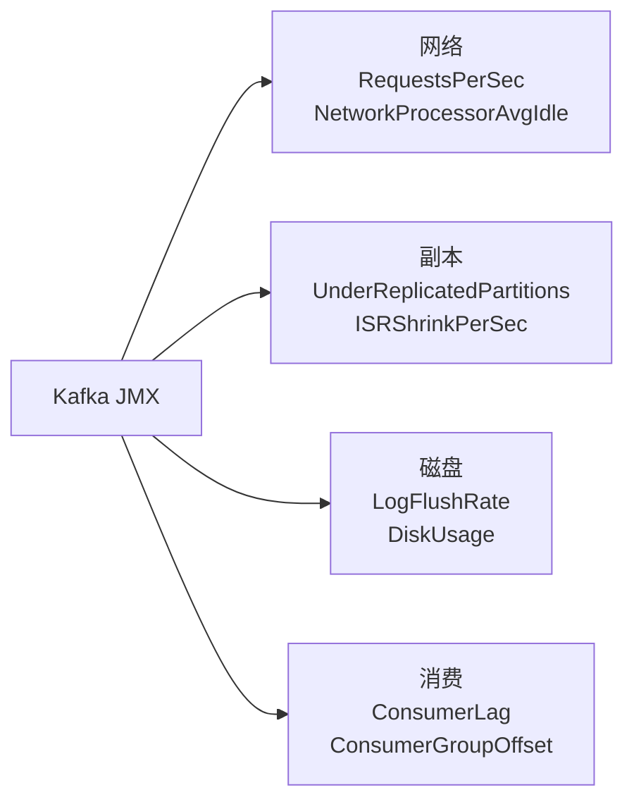

# 一、消费 Lag 监控——最核心的指标

## 1.1 Lag 的危害

```
Lag = 生产者最新 offset - 消费者当前 offset
Lag 持续增长 → 消费者跟不上 → 消息积压 → 磁盘写满 → Broker 不可用
```

## 1.2 关键指标

```bash
# 查看消费组 Lag
kafka-consumer-groups --bootstrap-server localhost:9092 \
  --group my-group --describe

# 输出
# TOPIC  PARTITION  CURRENT-OFFSET  LOG-END-OFFSET  LAG
# order  0          1523000        1523000         0      ← 正常
# order  1          1523000        1528000         5000   ← 有积压！
```

## 1.3 Prometheus + Grafana 监控

```yaml
# Kafka Exporter 核心指标
kafka_consumergroup_lag           # Lag 值
kafka_consumergroup_lag_sum       # Lag 总和
kafka_topic_partition_under_replicated_partitions  # URP
kafka_broker_bytes_in_total       # 入流量
kafka_broker_bytes_out_total      # 出流量
```

**告警规则**：

| 规则 | 阈值 |
|------|------|
| 消费 Lag > 10000 持续 5 分钟 | P2 告警 |
| Lag 持续增长速率 >100/s | P1 告警 |
| URP > 0 | P1 告警 |
| 磁盘使用率 > 80% | P2 告警 |

---

# 二、磁盘水位——沉默的杀手

## 2.1 磁盘写满后的连锁反应

```
磁盘满 → Broker 拒绝写入 → 生产者 send 失败
→ 消息丢失/积压在客户端 → 消费停顿
→ Controller 可能因磁盘满而下线 → 集群动荡
```

## 2.2 预防措施

```properties
# Broker 磁盘保留
log.retention.bytes=500000000000  # 分区最大 500GB
log.segment.bytes=1073741824      # 1GB 切 Segment（方便删除）

# 监控磁盘使用
# Prometheus node_exporter:
# node_filesystem_avail_bytes{mountpoint="/data/kafka"}
```

---

# 三、核心 JMX 指标速查



| 指标 | 健康值 |
|------|--------|
| `ActiveControllerCount` | =1 |
| `UnderReplicatedPartitions` | =0 |
| `BytesInPerSec` 趋势 | 平稳，无突刺 |
| `RequestHandlerAvgIdlePercent` | > 0.3（不忙） |
| `NetworkProcessorAvgIdlePercent` | > 0.3 |

---

# 四、故障演练 SOP

## 4.1 Broker 宕机

```
现象：某 Broker 的 ISR 缩容，Leader 切换到其他副本
操作：
  1. 确认 URP 未扩大（其他副本有完整数据）
  2. 等待 Follower 晋升 Leader（自动，<30s）
  3. 恢复宕机 Broker（先检查磁盘/网络，再启动）
  4. 启动后观察优选 Leader 自动平衡（auto.leader.rebalance.enable）
```

## 4.2 Controller 切换

```
现象：ActiveControllerCount 变化
影响：瞬间不可写入（Leader 选举期间）
恢复：ZK 临时节点超时 → 新 Broker 抢注 Controller → <60s
```

## 4.3 磁盘故障

```
现象：某 Broker 磁盘 IO 错误 → 日志写失败 → Broker 自动关闭
操作：
  1. 停止故障 Broker 的 Kafka 进程
  2. 从集群移除故障 Broker
  3. 更换磁盘 → 重新格式化 → 启动 Broker（从其他副本同步数据）
  4. 使用 kafka-reassign-partitions 重新分配该 Broker 上的分区
```

---

# 五、运维工具链

| 工具 | 用途 |
|------|------|
| **Kafka Eagle** | 消费 Lag + Topic 监控可视化 |
| **CMAK** | Yahoo 出品，集群管理 UI（原 Kafka Manager） |
| **Burrow** | Linkedin 出品，消费 Lag 检测 |
| **kcat** | 命令行测试工具（收发消息） |

*本文参考资料：*
- Neha Narkhede et al.《Kafka: The Definitive Guide》（第 2 版）——第 1-6 章（架构、生产者、消费者、内部机制）
- Apache Kafka 官方文档 - Design 章节: https://kafka.apache.org/documentation/#design
- Apache ZooKeeper 官方文档: https://zookeeper.apache.org/doc/current/
- Flavio P. Junqueira, Benjamin Reed《ZooKeeper: Distributed Process Coordination》
- Linux 内核文档 - sendfile(2) / mmap(2) / Page Cache
- KIP-500: Replace ZooKeeper with a Self-Managed Metadata Quorum (KRaft)
