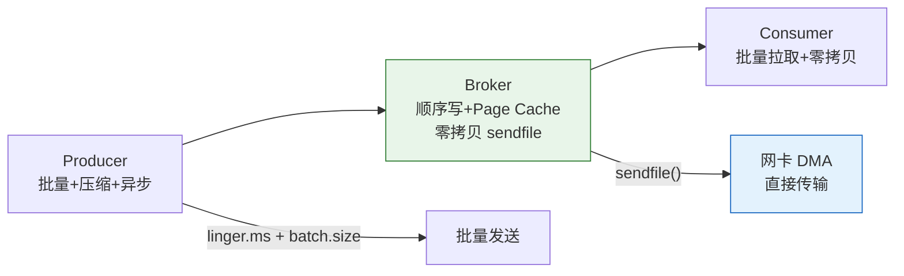
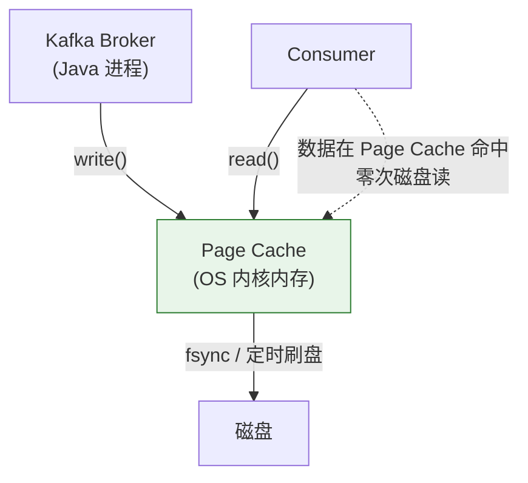
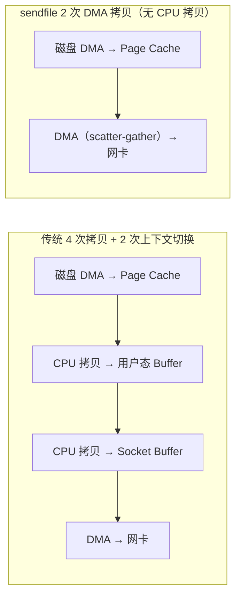

# 历史背景——"快"是生存问题，不是炫技

2010 年前后，LinkedIn 的实时数据管道需要每天处理**数万亿条事件**——用户点击、页面浏览、搜索查询、连接邀请……传统消息队列（ActiveMQ、RabbitMQ）的设计前提是"可靠投递优先，吞吐其次"，每条消息有独立的状态追踪，消息确认后立即删除。这种架构在日处理百万条消息时表现尚可，但面对 LinkedIn 量级的实时流数据，就成了瓶颈。

Kafka 团队做了一个根本性的范式转换：**把消息系统当成日志系统来做**。这个决策直接决定了 Kafka 的性能天花板——因为日志的语义是"追加"，而不是"增删改查"。一旦接受了"只追加不修改"，四个性能杠杆就自动解锁了：**顺序写磁盘**、**Page Cache 充当读写缓冲**、**sendfile 零拷贝传输**、**批量压缩减少网络开销**。

这四个技术杠杆并不新鲜——OS 内核和硬件本身都支持了几十年。Kafka 的创新在于**把这些技术按正确的顺序组合到了一起**，让一个 Java 进程在普通商用服务器上跑出接近硬件极限的吞吐。



---

# 一、顺序写磁盘——被误解的"慢"

## 1.1 What：磁盘快还是慢？

这个问题没有绝对答案。现代 HDD 的顺序写入速度约 **150-200MB/s**，企业级 SSD 可达 **600MB/s+**——但**随机写入**只有 **100KB/s 左右**，差了 3-4 个数量级。

关键洞察是：**磁盘的"慢"，慢在寻道（seek），不是慢在带宽**。顺序写入不需要寻道，磁头一直往前走，速度接近磁盘的物理极限。Kafka 耍了一个聪明的"把戏"——所有数据操作严格设计为**追加**：

```
传统 MQ（随机 IO）：
  消息来到 → 分配存储页 → 写入 → 消费确认 → 随机删除 → 磁盘碎片 → 更慢

Kafka（纯顺序 IO）：
  消息来到 → 追加到 Segment 末尾 → 写完就完了
  消费不删除数据 → 等 retention 到了 → 直接删整个 Segment 文件
```

## 1.2 Why：不修改不删除 = 零碎片

文件系统最怕的就是碎片化——小块小块的删和改产生不连续的空洞，迫使写的磁头频繁寻道。Kafka 的"不修改、不逐条删除"策略彻底规避了这个问题。整个 Segment 文件是一次性删掉的，文件系统释放的是整块连续空间。

这也是为什么 Kafka 在普通 HDD 上的表现和不比 SSD 差太多——只要数据是顺序读写的，HDD 的顺序带宽完全可以胜任。

---

# 二、Page Cache——OS 的免费加速层

## 2.1 What：Page Cache 是什么？

Page Cache 是 Linux 内核维护的一块内存空间，用于缓存磁盘数据。所有 `read()`/`write()` 调用默认不走 `O_DIRECT`，都会经过 Page Cache。



## 2.2 Why：Kafka 为什么主动依赖 Page Cache 而不是自己缓存？

Java 进程内缓存数据只有一个选择——JVM 堆。但堆有几个致命问题：

1. **GC 压力**：把 100GB 的数据存在 JVM 堆里，GC 的停顿会直接拖垮吞吐
2. **进程重启数据全丢**：JVM 进程崩溃，堆里的数据就没了
3. **重复造轮子**：OS 已经有成熟的 LRU 淘汰、预读、回写机制，Java 不可能做得比内核更好

Kafka 的设计哲学是：**数据不需要在 JVM 堆中驻留**。Broker 拿到消息 → 里调用 `write()` 交给 Page Cache → 马上返回。Consumer 读数据时，如果数据还在 Page Cache 里，`read()` 是纯内存操作；如果已经被淘汰到磁盘，就触发一次磁盘读。在正常的生产负载下（持续写入+实时消费），热点数据几乎永远在 Page Cache 中，读延迟接近内存级别。

**生产实践**：Broker 的 JVM Heap 设 6GB 足够（存放元数据和请求对象），剩余物理内存全部留给 OS 做 Page Cache。32GB 物理机的典型分配：JVM 6GB + Page Cache 20GB + OS 开销 6GB。

---

# 三、sendfile 零拷贝——数据不经过用户态

## 3.1 What：传统方式的问题在哪？

传统数据发送路径（Broker 读磁盘 → 发网络）：



传统方式：数据从 Page Cache **拷贝到用户态**应用程序 Buffer，再从用户态**拷贝回内核态**Socket Buffer，最后 DMA 到网卡。中间两次 CPU 执行的拷贝完全是浪费——因为 Kafka Broker 根本不需要"看"消息内容，它的工作就是把磁盘上的数据搬到网卡上。

## 3.2 How：sendfile 做了什么？

`sendfile()` 系统调用让内核直接从 Page Cache 把数据推到 Socket Buffer（或通过 scatter-gather DMA 直接从 Page Cache 到网卡），**全程不需要数据拷贝到用户态**。

Kafka 的 Java 代码里实际用的是 `FileChannel.transferTo()`，在 Linux 上 JVM 底层映射到 `sendfile64()` 系统调用：

```java
// Kafka 内部逻辑（简化）
// FileRecords.writeTo() → FileChannel.transferTo()
// 数据从 Page Cache 直接 DMA 到网卡，零次 CPU 拷贝
```

**收益量化**：在 1Gbps 网络下，传统方式消耗约 30% CPU 在数据拷贝上，sendfile 将这个开销降到近乎零。

## 3.3 什么时候 sendfile 用不了？

如果 Broker 需要对消息做**转换**（比如不同版本的协议转换、加密），数据就必须经过用户态。这也是为什么 Kafka 不推荐在 Broker 端做消息变换——违背了"数据不经过用户态"的高吞吐前提。消息处理逻辑应该放在 Consumer 端。

---

# 四、生产者端——批量 + 压缩 = 网络 IO 减半

## 4.1 Why：为什么批量比压缩更重要？

单条发送消息时，网络开销包含 TCP 头（20B）+ IP 头（20B）+ Kafka 协议头 + 消息数据本身。如果一条消息只有 100 字节，协议头和 TCP 确认的开销可能比消息本身还大。**批量发送**把多条消息打包进一个 TCP 包，分摊了这些固定开销。

压缩在此基础上再进一步——读卡夫消息在批量基础上进行压缩，通常能减少 **50-80%** 的网络 IO。

## 4.2 How：核心参数调优

```java
Properties props = new Properties();

// 批量大小：太小程序开销大，太大增加延迟
props.put("batch.size", 262144);      // 256KB（默认 16KB）

// 积攒时间：0 表示有数据就发，>0 积攒等待更多消息凑批
props.put("linger.ms", 10);           // 等待 10ms 攒批

// 压缩算法选择
props.put("compression.type", "lz4"); // LZ4：速度最优，压缩率~50%
```

| 参数 | 默认值 | 建议值 | 原理 |
|------|--------|--------|------|
| `batch.size` | 16KB | 128-512KB | 提高每批数据量，减少网络请求次数 |
| `linger.ms` | 0 | 5-20ms | 故意等一小会攒批，用延迟换吞吐 |
| `compression.type` | none | `lz4` 或 `zstd` | LZ4 速度快（最低 CPU 消耗），zstd 压缩率高（磁盘 IO 紧张时用） |
| `buffer.memory` | 32MB | 128MB+ | 高吞吐时缓冲区不够会阻塞 send() |

## 4.3 压缩算法对比

| 算法 | 压缩率 | 速度 | CPU 消耗 | Kafka 中的建议 |
|------|--------|------|---------|-------------|
| **LZ4** | ~50% | 极快 | 低 | **吞吐优先首选**，大部分场景 |
| **ZSTD** | ~65% | 快 | 中 | 磁盘或带宽紧张时，节省更多空间 |
| **GZIP** | ~70% | 慢 | 高 | 不适合线上实时场景，适合冷备归档 |
| **Snappy** | ~45% | 快 | 低 | Google 方案，平衡性好，略逊 LZ4 |

---

# 五、消费者端——批量拉取

消费者端也有对应的批量机制：

```java
// Consumer 端批量拉取参数
props.put("fetch.min.bytes", 1024);     // 至少攒够 1KB 才返回
props.put("fetch.max.wait.ms", 500);    // 最多等待 500ms 凑够 min.bytes
props.put("max.partition.fetch.bytes", 1048576);  // 单次最大拉 1MB
```

- **`fetch.min.bytes`**：Broker 攒够这么多数据再返回，减少网络往返
- **`fetch.max.wait.ms`**：最多等这么久，防止低流量时延迟过大
- **分区并行**：消费组内消费者数 ≤ 分区数，多余的消费者空转

**消费者数量和分区的配合**是最容易被忽略的点。如果你有 8 个分区，最多分配 8 个消费者（同一个消费组内）。第 9 个消费者只是 idle 在这个组里，不消费任何数据。

---

# 六、总结

| 技术 | 收益 | 核心原理 |
|------|------|---------|
| **顺序写** | 磁盘吞吐 ~600MB/s | 追加不修改 = 零碎片 + 零寻道 |
| **Page Cache** | 读写命中 OS 缓存 | 依赖内核而非 JVM Heap，避免 GC 和数据丢失 |
| **sendfile** | 省 2 次 CPU 拷贝 + 2 次上下文切换 | 内核态 DMA 直接从 Page Cache 到网卡 |
| **批量发送** | 减少网络请求次数 | 多条消息打包一个 TCP 包，分摊固定开销 |
| **压缩** | 网络 IO 减少 50-80% | LZ4/ZSTD 在批量基础上进一步压缩 |
| **批量拉取** | 减少 Consumer-Broker 往返 | fetch.min.bytes 攒够再返回 |

# 延伸阅读

**Do——动手实践：**
- 用 `iostat -x 1` 观察 Kafka Broker 的磁盘 `await` 和 `%util`——顺序写的 `await` 通常 < 2ms
- 用 `cat /proc/meminfo | grep -E "Cached|Dirty"` 观察 Page Cache 使用量和脏页
- 用 `strace -e sendfile` attach 到 Kafka 进程，确认零拷贝确实被调用
- 生产者测：`linger.ms=0` vs `linger.ms=20`，对比相同 QPS 下的网络包数量和 CPU 使用率

**Todo——深入方向：**
- [ ] Linux 内核 sendfile 的 scatter-gather DMA 实现机制（`DMA_ENGINE` + `sg_list`）
- [ ] Kafka 为什么不默认用 `O_DIRECT` 绕过 Page Cache？（答案：预读和写合并的优势）
- [ ] ZSTD 字典压缩（`zstd.dictionary`）在固定格式消息中的额外收益
- [ ] Broker 端 `message.downconversion.enable` 对零拷贝的破坏（协议降级导致数据进用户态）

*本文参考资料：*
- Neha Narkhede et al.《Kafka: The Definitive Guide》（第 2 版）——第 5 章（内部机制）
- Apache Kafka 官方文档 - Design 章节: https://kafka.apache.org/documentation/#design
- Linux 内核文档 - sendfile(2) / mmap(2) / Page Cache
- Jay Kreps, "The Log: What every software engineer should know about real-time data's unifying abstraction" (2013)
