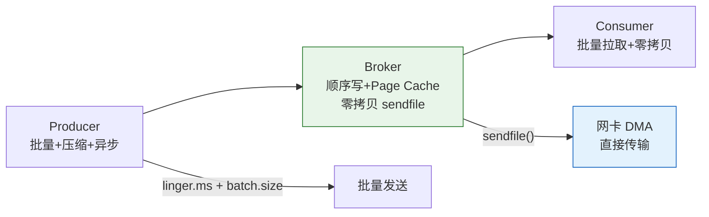
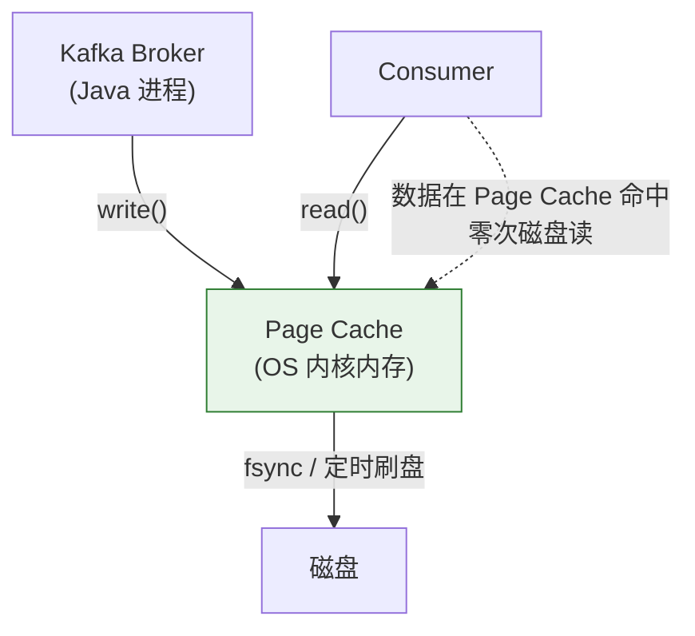
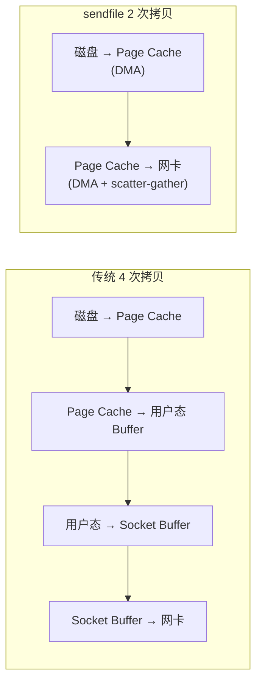

---

# 一、顺序写——磁盘比随机读写快 6000 倍

磁盘的顺序读写能达到 **600MB/s**，而随机读写只有 **100KB/s**。Kafka 的设计核心就是：**所有写入都是追加（append-only），绝不修改已写入的数据。**

```
传统 MQ：
  消息到来 → 写磁盘 → 消费确认 → 删除消息（随机删除）
  
Kafka：
  消息到来 → 顺序追加到 Segment 末尾 → 消费不删除（等 retention 策略整体删 Segment）
```

---

# 二、Page Cache——OS 的免费加速



**Kafka 故意依赖 Page Cache 而非 JVM 堆内存**：

- 消息写入 → 直接进 Page Cache → OS 决定何时刷盘
- 消息读取 → 大概率命中 Page Cache → 零磁盘 IO
- 进程重启 → Page Cache 数据不丢（OS 管理）

---

# 三、零拷贝——数据从不经过用户态

## 3.1 传统传输 vs sendfile



传统方式需要 **4 次拷贝 + 2 次内核态/用户态切换**，sendfile 只需 **2 次 DMA 拷贝 + 0 次用户态参与**。

## 3.2 Kafka 的零拷贝配置

```properties
# Broker 端：数据传输用 sendfile（默认开启）
# Java NIO FileChannel.transferTo() → Linux sendfile()

# Consumer 端：不需要改动
# Broker 直接通过 sendfile 将 Page Cache 数据 DMA 传输到网卡
```

---

# 四、生产者端优化——批量 + 压缩

| 参数 | 默认 | 建议 |
|------|------|------|
| `batch.size` | 16KB | 调大到 128-512KB，提高吞吐 |
| `linger.ms` | 0 | 设为 5-20ms，积攒批次 |
| `compression.type` | none | `lz4`（速度）或 `zstd`（压缩比） |
| `buffer.memory` | 32MB | 高吞吐场景 128MB+ |

```java
Properties props = new Properties();
props.put("batch.size", 262144);      // 256KB
props.put("linger.ms", 10);           // 积攒 10ms
props.put("compression.type", "lz4"); // LZ4 压缩——速度最优
```

---

# 五、消费者端优化

- **批量拉取**：`fetch.min.bytes` + `fetch.max.wait.ms` 减少网络往返
- **分区并行**：消费组内消费者数 ≤ 分区数，多余的空转

---

# 六、总结

| 技术 | 收益 |
|------|------|
| **顺序写** | 磁盘吞吐 600MB/s，接近内存 |
| **Page Cache** | 读写命中 OS 缓存，零磁盘 IO |
| **sendfile 零拷贝** | 省 2 次拷贝 + CPU 上下文切换 |
| **批量+压缩** | 网络 IO 减少 60-80% |
| **批量拉取** | 减少 Consumer-Broker 往返次数 |

*本文参考资料：*
- Neha Narkhede et al.《Kafka: The Definitive Guide》（第 2 版）——第 1-6 章（架构、生产者、消费者、内部机制）
- Apache Kafka 官方文档 - Design 章节: https://kafka.apache.org/documentation/#design
- Apache ZooKeeper 官方文档: https://zookeeper.apache.org/doc/current/
- Flavio P. Junqueira, Benjamin Reed《ZooKeeper: Distributed Process Coordination》
- Linux 内核文档 - sendfile(2) / mmap(2) / Page Cache
- KIP-500: Replace ZooKeeper with a Self-Managed Metadata Quorum (KRaft)
