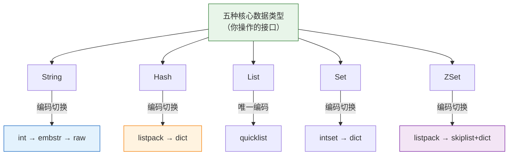
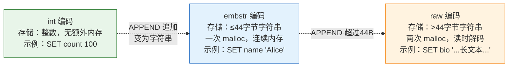
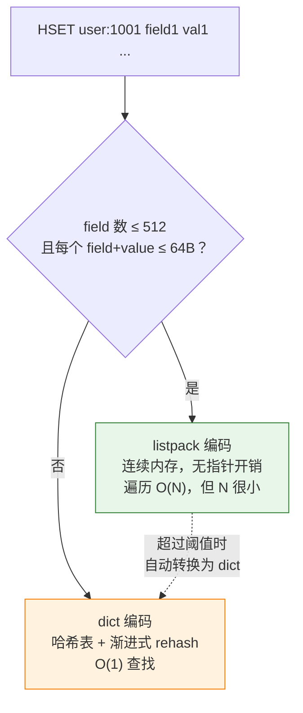
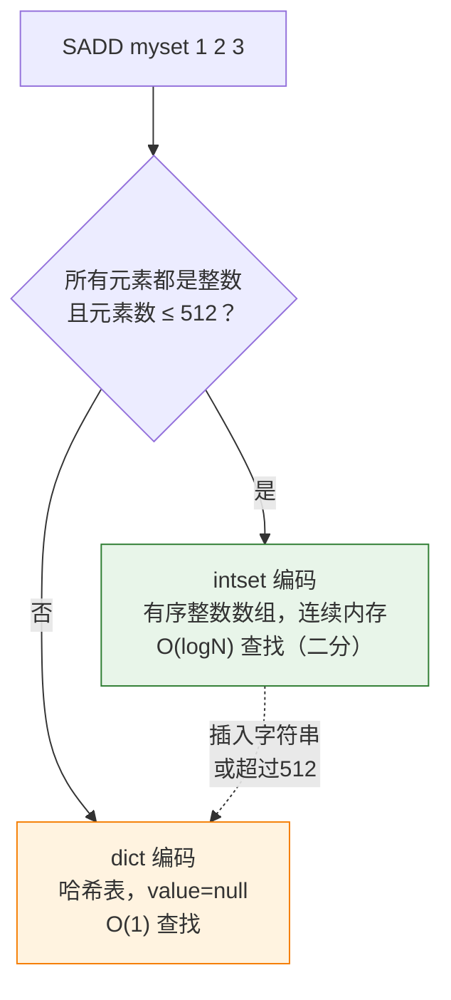
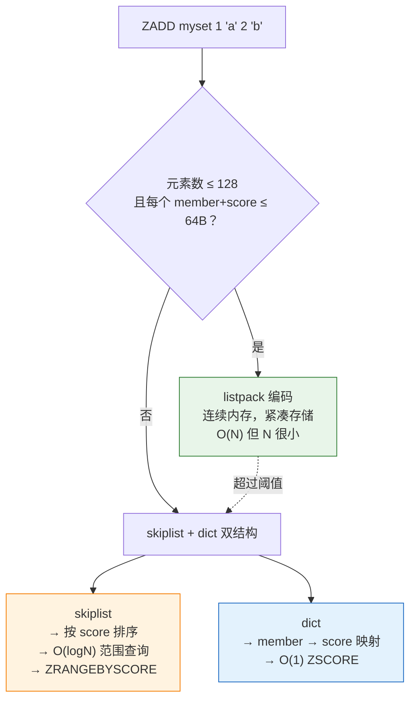
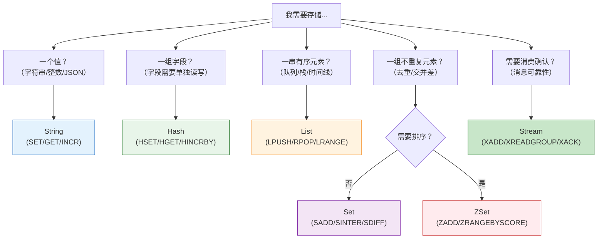

# 开篇——Redis 不只是"一个 key-value 存储"

如果你只用了 `SET` 和 `GET`，你只用了 Redis 20% 的能力。

Redis 提供了**五种核心数据类型**：String、Hash、List、Set、Sorted Set。每一种都是为特定场景设计的——就像编程语言中的 `int`、`list`、`map`、`set`，Redis 给你的是**网络可访问的通用数据结构**。

更关键的是：同一个数据类型，在数据量不同时，Redis 会在**多种内部编码之间动态切换**。小 Hash 用 ziplist 省内存，大 Hash 用 dict 提性能；小 ZSet 用 ziplist 紧凑存储，大 ZSet 用 skiplist + dict 双结构支撑。理解这些编码切换的阈值，是你避免"一个 ZSet 只有 200 个元素却占了几十 MB 内存"或"`DEL` 一个大 List 卡住 2 秒"的关键。



> **延伸阅读**：本文讲的是"每种类型用什么编码、什么时候切换"，如果你想深入理解 ziplist 的连锁更新问题、quicklist 的 8KB 分片设计、skiplist 的概率层数生成，请读伴生篇 [Redis 核心数据结构底层实现](/posts/中间件/redis-核心数据结构底层实现sdsziplistquicklistskiplist/)。

---

# 一、String——Redis 的万能积木

## 1.1 你看到的 vs Redis 实际存储的

String 是 Redis 最简单也最灵活的类型。但 "简单" 不代表 "简陋"——同一个 String 类型，内部有三种完全不同的编码：



**为什么 embstr 的分界线是 44 字节？**

Redis 使用 jemalloc 作为内存分配器。jemalloc 按固定尺寸 bin 分配内存，最小的 bin 是 64 字节。一个 `robj`（Redis 对象的包装结构）头占 16 字节，SDS 头（字符串元数据）占 3-4 字节，再预留 1 字节的 `\0` 结尾。算下来：

```
64 (jemalloc bin) - 16 (robj头) - 3 (sds头) - 1 (\0) = 44 字节 ← embstr 最大可用
```

embstr 把 robj 和 SDS 分配在**同一块连续内存**中——一次 `malloc`，CPU 缓存友好。超过 44 字节后，robj 和 SDS 分开分配（raw 编码），两次 `malloc`，多了一次内存跳转。

## 1.2 编码切换的触发条件

| 操作 | 原始编码 | 新编码 | 触发原因 |
|------|---------|--------|---------|
| `SET count 100` | — | **int** | value 可解析为整数 |
| `SET name Alice` | — | **embstr** | value ≤ 44 字节 |
| `SET bio "..."` (长文本) | — | **raw** | value > 44 字节 |
| `APPEND key "xxx"` | **int** | raw | int 不支持追加，转换为 raw |
| `INCR key` | **embstr** | int（如果解析成功） | embstr 尝试转为 int |
| `SETRANGE key 0 "x"` | **embstr** | raw | embstr 是只读的，写操作必须转 raw |

**关键认知**：int → embstr 的切换是双向的，但 embstr → raw 是**不可逆的**。一旦 String 变长到 raw 编码，即使后续 `SETRANGE` 缩短到 10 字节，它也不会变回 embstr。

## 1.3 实战场景

```bash
# 计数器（int 编码，内存占用最小）
SET page:home:visits 1000
INCR page:home:visits
OBJECT ENCODING page:home:visits  # → "int"

# 缓存 JSON 对象（embstr，一次 malloc 最划算）
SET user:1001 '{"name":"Alice","age":30}'
OBJECT ENCODING user:1001  # → "embstr"（如果 ≤ 44 字节）

# 分布式锁（embstr，锁 key 通常很短）
SET lock:order:12345 thread-1 NX PX 30000

# 长文本缓存（raw 编码）
SET article:9999 '<html>...很长的文章全文...</html>'
OBJECT ENCODING article:9999  # → "raw"
```

**内存估算**：存 1 亿个 key=20B, value=100B 的 String（均 embstr），粗略估计：

```
key (20B) + value (100B) + robj (16B) + SDS头 (4B) + dictEntry (24B) ≈ 164B/entry
1 亿 × 164B ≈ 16.4 GB（纯数据，不含 dict 的桶数组和过期元数据）
```

实际内存可能是理论值的 1.5-2 倍，因为要加上哈希表的负载因子、key 过期字典、jemalloc 内存碎片等。

---

# 二、Hash——当对象字段多到 String 存 JSON 不够用

## 2.1 为什么用 Hash 而不是 String 存 JSON？

```bash
# ❌ 方式 A：String 存整个 JSON
SET user:1001 '{"name":"Alice","email":"alice@example.com","age":30,"city":"Beijing"}'
# 想改 email → 读整个 JSON → 解析 → 改字段 → 序列化 → 写回 → 120+ 字节的网络 IO
# 想 INCR age → 对不起，String 不支持字段级操作

# ✅ 方式 B：Hash 存各个字段
HSET user:1001 name "Alice"
HSET user:1001 email "alice@example.com"
HSET user:1001 age 30
HGET user:1001 email          # 只读一个字段，十几字节 IO
HINCRBY user:1001 age 1       # 字段级原子操作
```

**决策规则**：如果你的对象的字段需要**分别读写、分别过期、或原子操作**，Hash 一定优于 String 存 JSON。

## 2.2 内部编码——小 Hash 用 listpack，大 Hash 用 dict



**两个阈值**（Redis 7.0+）：

```
hash-max-listpack-entries = 512  （field 数量）
hash-max-listpack-value  = 64    （单个 field+value 的总字节数）
```

两个条件**必须同时满足**才使用 listpack 编码。任一个超出 → dict 编码。

**切换代价**：listpack → dict 是 O(N) 的遍历转换。一旦转换为 dict，即使删除所有 field 只剩 1 个，**也不会退回 listpack**。

## 2.3 listpack vs ziplist（Redis 7.0 的重要变化）

如果你在网上搜"Redis Hash 内部编码"，看到的多是 ziplist。但 Redis 7.0 将 Hash（和 ZSet）的小数据编码从 **ziplist 替换为 listpack**。

| | ziplist（≤ Redis 6.x） | listpack（≥ Redis 7.0） |
|------|----------------------|------------------------|
| **连锁更新** | ❌ 存在——entry 的 `prevlen` 字段膨胀引发多米诺效应 | ✅ 解决——不存前驱长度，只存自己的长度 |
| **结构** | `<prevlen><encoding><data>` | `<encoding><data><backlen>` |
| **遍历方向** | 双向（靠 prevlen 回退） | 双向（靠 backlen 在末尾跳回） |
| **内存效率** | 略优（少 0-2B per entry） | 几乎相同 |

连锁更新的具体场景和影响见 [Redis 核心数据结构底层实现](/posts/中间件/redis-核心数据结构底层实现sdsziplistquicklistskiplist/) 中的 ziplist 部分。

## 2.4 实战场景

```bash
# 用户信息（小 Hash，listpack 编码）
HSET user:1001 name "Alice" email "alice@e.com" age "30"
HLEN user:1001             # → 3
OBJECT ENCODING user:1001  # → "listpack"

# 电商 SKU 库存（大 Hash，dict 编码）
# 10000 个 SKU，每个 SKU 是一个 field
HSET inventory:warehouse:1 SKU0001 100
HSET inventory:warehouse:1 SKU0002 50
# ... 加到 10000 个 field
OBJECT ENCODING inventory:warehouse:1  # → "dict"

# 购物车（每个用户的 cart 是独立 Hash）
HSET cart:user:1001 sku_001 2
HSET cart:user:1001 sku_002 1
HGETALL cart:user:1001      # 获取用户购物车全部内容
HINCRBY cart:user:1001 sku_001 1  # 加购 +1
```

---

# 三、List——消息队列的原型

## 3.1 List 的双向操作

```bash
# 队列（FIFO）：左边进，右边出
LPUSH queue:tasks "task1" "task2"
RPOP queue:tasks               # → "task1"（先进先出）

# 栈（LIFO）：左边进，左边出
LPUSH stack:undo "action1" "action2"
LPOP stack:undo                # → "action2"（后进先出）

# 阻塞消费（BRPOP = blocking RPOP，队列空时阻塞等待）
BRPOP queue:tasks 5            # 等 5 秒，有数据立刻返回；超时返回 nil
```

## 3.2 内部编码——quicklist 是唯一选择

从 Redis 3.2 开始，List 的编码统一为 **quicklist**——不再有 linkedlist 和 ziplist 的切换。

**quicklist 是什么？**

它是一个双向链表，但每个链表节点不是一个元素，而是一个 **listpack**（或 ziplist）：

```
quicklist
  → Node 1: listpack [A, B, C, D, E]
  → Node 2: listpack [F, G, H, I, J]
  → Node 3: listpack [K, L, M]
```

**设计权衡**：

- 纯 linkedlist 内存爆炸——每个元素需要 prev/next 指针（64 位各 8B），100 万元素 = 16MB 纯指针开销
- 纯 ziplist 有连锁更新——中间插入删除可能触发多米诺效应
- quicklist 折中——每个 listpack 控制在 8KB 以内，指针开销降到原来的 1/几十，连锁更新被限制在单个节点内

**配置参数**：

```
list-max-listpack-size = -2  （默认） → 每个节点约 8KB
# 正值 = 每个节点的元素数上限
# -1 = 4KB, -2 = 8KB, -3 = 16KB, -4 = 32KB, -5 = 64KB
```

## 3.3 实战场景

```bash
# 消息队列
LPUSH orders:pending '{"orderId":123}'
BRPOP orders:pending 0        # 阻塞等待，有新订单立刻消费

# 最新动态时间线（保留最近 100 条）
LPUSH timeline:user:1001 "发布了文章"
LPUSH timeline:user:1001 "关注了 Alice"
LTRIM timeline:user:1001 0 99  # 裁剪到 100 条
LRANGE timeline:user:1001 0 9  # 获取最新 10 条

# 消息可靠性 → 用 Stream（Redis 5.0+）
# List 不支持消费确认，如果消费失败消息就丢了
# 有消息确认需求的场景 → XADD/XREADGROUP/XACK
```

## 3.4 List 的陷阱

| 误用 | 后果 | 正确做法 |
|------|------|---------|
| `LINDEX mylist 10000` | O(N)，10 万元素遍历 5 万个节点 | List 不适合随机访问，用 Hash/ZSet 代替 |
| `LRANGE mylist 0 -1` | 全量读取，100 万条数据瞬间打满网络 | 分页读取 `LRANGE key 0 99`，或用 `SSCAN` |
| 用 List 做大文件的队列 | quicklist 节点存大字符串 → 节点数少 → 退化为 linkedlist | 大文件存 S3/OSS，List 里只放 url |

---

# 四、Set——去重、交并差、随机抽取

## 4.1 Set 的集合运算

```bash
# 基本操作
SADD tags:article:1001 Java Redis MySQL
SISMEMBER tags:article:1001 Redis  # → 1（是）
SCARD tags:article:1001             # → 3

# 集合运算
SADD user:1:tags Java Python Go
SADD user:2:tags Java C++ Rust
SINTER user:1:tags user:2:tags     # → ["Java"]（共同标签）
SUNION user:1:tags user:2:tags     # → 全部标签
SDIFF user:1:tags user:2:tags      # → ["Python","Go"]（user1 有 user2 没有）
```

## 4.2 内部编码——intset vs dict



**intset 的升级陷阱**：

```bash
SADD ids 1 2 3
OBJECT ENCODING ids  # → "intset"（int16，每个元素 2 字节）

SADD ids 32768       # 32768 超出 int16 范围 → 升级为 int32（每个元素 4 字节）
OBJECT ENCODING ids  # → "intset" 仍然是 intset，但内部从 int16→int32

SADD ids "hello"     # 插入了字符串！
OBJECT ENCODING ids  # → "dict"  💀 intset → dict 不可逆！
```

**intset 升级是不可逆的**。一旦从 int16 升级到 int32 再到 dict，即使把字符串元素删掉只剩整数，编码也回不去 intset。在生产环境中修改 Set 之前最好确认它不会意外升级。

## 4.3 实战场景

```bash
# 标签系统
SADD article:1001:tags Java Redis MySQL
SINTER article:1001:tags article:1002:tags  # 两篇文章共同标签

# 抽奖——随机抽取（SRANDMEMBER 不删除，SPOP 会删除）
SADD lottery:pool user1 user2 user3 ... user100000
SRANDMEMBER lottery:pool 3     # 随机抽 3 个（不放回），元素仍在 Set 中
SPOP lottery:pool 3            # 随机抽 3 个并移除

# UV 去重
SADD uv:2026-07-28 "192.168.1.1" "192.168.1.2"
PFADD uv:2026-07-28 "192.168.1.1" "192.168.1.3"
# 普通 Set → O(N) 内存（N=UV数），10 亿 UV → 几十 GB
# HyperLogLog → O(1) 内存（12KB），10 亿 UV → 误差 0.81% → 适合只需近似计数的场景
```

## 4.4 陷阱

`SMEMBERS` 是 O(N)，你 Set 里存了 10 万个元素，`SMEMBERS` 就返回 10 万个。在生产中遍历大 Set 用 `SSCAN` 游标分批获取：

```bash
SSCAN myset 0 COUNT 100  # 每次返回 100 个元素 + 下一游标
```

---

# 五、Sorted Set——排行榜的标准答案

## 5.1 ZSet 的双重有序性

ZSet 的每个元素由 **member（成员）** 和 **score（分数）** 组成。排序按 score（分数相同时按 member 的字典序）。

```bash
# 基本操作
ZADD leaderboard 100 "Alice" 85 "Bob" 92 "Charlie"
ZRANK leaderboard "Alice"       # → 2（排名，0-based，升序）
ZREVRANK leaderboard "Alice"    # → 0（倒序排名，Alice 最高）
ZSCORE leaderboard "Bob"        # → "85"（获取分数）
ZRANGE leaderboard 0 -1         # 按分数升序排列
ZREVRANGE leaderboard 0 2       # Top 3

# 范围查询（ZSet 的杀手锏）
ZRANGEBYSCORE leaderboard 80 100    # 分数 80-100 之间的所有人
ZREMRANGEBYRANK leaderboard 0 99    # 移除后 100 名（保 Top 100）
```

## 5.2 内部编码——小用 listpack，大用 skiplist + dict 双结构



**为什么 ZSet 需要双结构？**

这是 ZSet 最精妙的设计。跳表能高效回答"按 score 排序"的问题（`ZRANGE`、`ZRANGEBYSCORE`），但无法高效回答"某个 member 的 score 是多少"（`ZSCORE`）——在跳表中按 member 找 score 需要遍历。所以 Redis 加了一个 dict（哈希表），建立 member → score 的快速映射。

**二者共享 member 对象，不是两份拷贝**。skiplist 节点和 dict 节点指向同一个 member 字符串，内存上只存了一份。

## 5.3 ZSet vs 其他类型——什么时候选 ZSet？

| 场景 | 该用什么 | 为什么 |
|------|---------|--------|
| 排行榜（实时更新分数） | **ZSet** | `ZADD` 更新分数，`ZREVRANGE` 取 Top N |
| 按时间排序的任务队列 | **ZSet** | score = 触发时间戳，`ZRANGEBYSCORE 0 NOW()` 取到期任务 |
| 滑动窗口限流 | **ZSet** | member = requestId, score = timestamp，ZREMRANGEBYSCORE 清除旧窗口 |
| 标签系统（只需去重不需排序） | Set | ZSet 的双结构比 Set 多一个 skiplist |
| 购物车（不需要排序） | Hash | field=SKU, value=qty，HINCRBY 原子增减 |

## 5.4 实战场景

```bash
# 游戏排行榜
ZADD game:score 2500 "PlayerA" 3200 "PlayerB" 1800 "PlayerC"
ZINCRBY game:score 500 "PlayerA"    # PlayerA 加了 500 分 → 3000
ZREVRANGE game:score 0 9 WITHSCORES # Top 10

# 延迟队列
ZADD delay:queue 1752768000 "order:123:timeout"  # score = 到期的时间戳
# 定时任务：取所有已到期的
ZRANGEBYSCORE delay:queue 0 1752768000 LIMIT 0 100

# 按时间段查询日志
ZADD access:log 1752768000 "user:1:/api/login"
ZADD access:log 1752768300 "user:2:/api/order"
ZRANGEBYSCORE access:log 1752768000 1752768300  # 查询这一小时内的日志
```

## 5.5 ZSet 是内存大户

一个 100 万元素的 ZSet（skiplist + dict 编码），粗略内存：

```
skiplist: 100万节点 × (member + score + 多层next指针) ≈ 100万 × (~50B) ≈ 50MB
dict:     100万节点 × (dictEntry × 2 + member指针) ≈ 100万 × (~40B) ≈ 40MB
总计 ≈ 90MB
```

加上过期元数据、jemalloc 碎片等，实际可能是 **100-150MB**。对比下 100 万元素的 Set（dict-only）只有约 60MB。ZSet 比 Set 多 50%-100% 内存——这是双结构的代价。

---

# 六、编码切换速查 + OBJECT ENCODING 实操

## 6.1 一张表搞定全部编码切换

| 类型 | 小数据编码 | 大数据编码 | 切换阈值 | 能否逆向？ |
|------|----------|----------|---------|----------|
| **String** | int / embstr | raw | embstr > 44B → raw | int ↔ embstr 可逆，embstr→raw **不可逆** |
| **Hash** | listpack | dict | entries > 512 **或** value > 64B | **不可逆** |
| **List** | quicklist | quicklist | 统一编码 | 不涉及 |
| **Set** | intset | dict | 非全部整数 **或** entries > 512 | **不可逆**（intset 内部宽度升级也不可逆） |
| **ZSet** | listpack | skiplist + dict | entries > 128 **或** value > 64B | **不可逆** |

## 6.2 动手验证

```bash
# 1. 创建一个小 Hash，观察编码
127.0.0.1:6379> HSET user:1 name Alice age 30
(integer) 2
127.0.0.1:6379> OBJECT ENCODING user:1
"listpack"

# 2. 逐步添加 field，超过 512 个阈值
127.0.0.1:6379> EVAL "for i=1,513 do redis.call('HSET', 'user:1', 'field'..i, i) end" 0
127.0.0.1:6379> HLEN user:1
(integer) 515
127.0.0.1:6379> OBJECT ENCODING user:1
"dict"                    # ← 自动切换了！

# 3. 删掉大部分 field，编码不会回去
127.0.0.1:6379> EVAL "for i=100,515 do redis.call('HDEL', 'user:1', 'field'..i) end" 0
127.0.0.1:6379> HLEN user:1
(integer) 99
127.0.0.1:6379> OBJECT ENCODING user:1
"dict"                    # ← 还是 dict！不会退回 listpack

# 4. Set 的 intset → dict 不可逆
127.0.0.1:6379> SADD nums 1 2 3 4 5
(integer) 5
127.0.0.1:6379> OBJECT ENCODING nums
"intset"
127.0.0.1:6379> SADD nums "hello"
(integer) 1
127.0.0.1:6379> OBJECT ENCODING nums
"dict"                    # ← 插一个字符串就变成 dict
127.0.0.1:6379> SREM nums "hello"
(integer) 1
127.0.0.1:6379> OBJECT ENCODING nums
"dict"                    # ← 删掉字符串后还是 dict，回不去了
```

**工程启示**：
- 如果你知道数据会一直很小（Hash < 512 fields，Set 只有整数且 < 512 个），可以调大阈值让 Redis 保持紧凑编码，减少内存占用
- 但一旦数据会突破阈值，**编码切换的 O(N) 遍历转换**本身也是一次性开销——对于百万级元素，转换可能需要数百毫秒
- **不要在生产中手动触发大规模编码转换**——可能导致 Redis 短暂停服

---

# 七、选型决策树



---

# 八、总结

| 类型 | 用途 | 小编码 | 大编码 | 不可逆？ |
|------|------|--------|--------|---------|
| **String** | 计数、缓存、锁 | int / embstr | raw | embstr→raw 不可逆 |
| **Hash** | 对象存储、购物车 | listpack | dict | 是 |
| **List** | 队列、时间线 | quicklist | quicklist | — |
| **Set** | 去重、交并差、抽奖 | intset | dict | 是 |
| **ZSet** | 排行榜、延迟队列 | listpack | skiplist+dict | 是 |

**理解类型解决"存什么"，理解编码解决"为什么内存超了"。**

当你排查 Redis 内存问题时，`MEMORY USAGE key` 和 `OBJECT ENCODING key` 是前两个要敲的命令。一个 Hash 的 `HLEN` 只有 200 但 `MEMORY USAGE` 返回 2MB——查看 `OBJECT ENCODING`，你会发现它已经从 listpack 升级到 dict 了，而 dict 的内存远大于 listpack。但再检查阈值，可能只是因为某一个 field 的值超过了 64 字节。

> **延伸阅读**：[Redis 核心数据结构底层实现](/posts/中间件/redis-核心数据结构底层实现sdsziplistquicklistskiplist/) — 深入 SDS 空间预分配、ziplist 连锁更新、quicklist 8KB 分片与 skiplist 概率层数生成。
