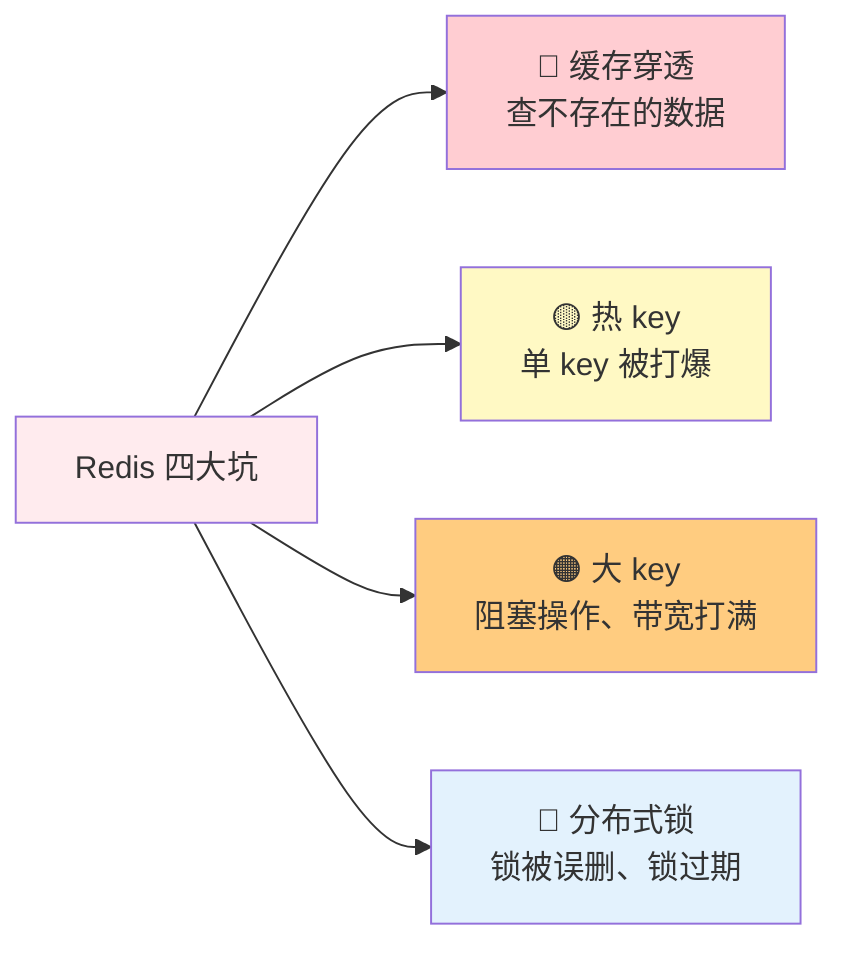
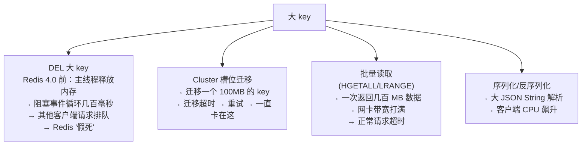

# 历史背景——Redis 的"暗面"

Redis 以简单、高性能著称，在中小规模场景下表现完美。但随着业务增长，简单的用法会逐渐暴露出设计上没有考虑到的"暗面"——这些问题通常在 QPS 从几千涨到几十万、单 key 从几百字节涨到几 MB 的拐点上集中爆发。

从事后诸葛的角度，这些"坑"其实不是 Redis 的 bug，而是**Redis 的设计前提和业务的使用方式之间出现了不匹配**。比如：Redis 的单线程前提是每个命令都要快 → 但 `DEL` 一个大 hash 可能需要几百毫秒；Redis 假设 key 是细粒度分散的 → 但热点 key 会把某个分片打爆；Redis 的锁操作本身是原子的 → 但"判断锁归属 + 删除锁"两步操作不是原子的。

理解每个坑的**根因**比记住解法更重要——因为解法可能随着 Redis 版本和业务规模变化，但根因是结构性的。



---

# 一、缓存穿透——查不存在的数据

## 1.1 What：什么是缓存穿透？

```
正常路径：请求 → 查缓存(hit) → 返回

攻击路径：请求 → 查缓存(miss) → 查 DB(miss) → 返回空
         ↑ 100 万次恶意请求，缓存永远 miss，100 万次全打到 DB
```

缓存穿透的核心特征是**缓存永远不可能命中**——因为被查询的数据在数据库中也不存在。缓存空值可以缓解，但恶意攻击者可以不断换不存在的 id（id=-1, id=-2, id=-3……），空值缓存同样无效。

## 1.2 How：三层防御体系

**第一层：参数校验（应用层）**
```java
// 过滤明显非法的请求
if (userId <= 0 || userId > MAX_USER_ID) {
    return error("非法参数");
}
```
这是性价比最高的层——在请求进入业务逻辑之前就拦截掉。但只能过滤规则性非法参数，覆盖不了"id 合法但在 DB 中不存在"的情况。

**第二层：缓存空值**
```java
// 将 "不存在" 这个结果也缓存起来
String value = redis.get(key);
if (value == null) {
    value = db.query(key);
    if (value == null) {
        redis.set(key, "NULL", 60);  // 空值缓存 60 秒
        return null;
    }
    redis.set(key, value, 3600);
}
return value;
```
优势是简单，代码改动极小。缺陷是：如果攻击者不断换 key，空值缓存一样会占满 Redis 内存。

**第三层：布隆过滤器（Bloom Filter）**
```java
// 布隆过滤器：用很小的内存判断 "这个 key 一定不存在"
// 说"不存在" → 100% 准确
// 说"可能存在" → 有误判率（默认 3%）
RBloomFilter<String> filter = redisson.getBloomFilter("user-filter");
filter.tryInit(1000000L, 0.03);  // 100 万数据，3% 误判率

// 流程：请求 → 先问布隆 → "不存在"直接返回 → "可能存在"才查缓存
if (!filter.contains("user:" + userId)) {
    return null;  // 一定不存在，省掉缓存和 DB 查询
}
```

## 1.3 Why：布隆过滤器的工作原理

布隆过滤器是一个很巧妙的结构：

1. 初始化一个很长的**位数组**（全 0）+ K 个不同的**哈希函数**
2. 添加元素时：用 K 个哈希函数分别算出 K 个位置，把这 K 个位都设为 1
3. 查询元素时：同样算出 K 个位置，如果**所有位置都是 1** → 返回"可能存在"；如果**任何一个是 0** → 返回"一定不存在"

```
添加 "user:1001"：
  hash1("user:1001")=5   → bit[5]=1
  hash2("user:1001")=13  → bit[13]=1
  hash3("user:1001")=7   → bit[7]=1

查询 "user:9999"（不存在）：
  hash1("user:9999")=5   → bit[5]=1 ✅
  hash2("user:9999")=3   → bit[3]=0 ❌ → 一定不存在！
```

**误判的来源**：随着添加的元素增多，位数组中越来越多的位被设为 1。当大部分位都是 1 时，不存在的 key 碰巧所有 K 个位置都是 1 的概率增大——这就是误判率（通常 1-3%）。

**注意**：布隆过滤器中的元素**不能删除**（删除一个元素可能把其他元素的哈希位清掉）。如果数据需要增删，用 Cuckoo Filter 或周期性重建布隆。

---

# 二、热 key 问题——单 key 被打爆

## 2.1 What：什么是热 key？

```
场景：某明星发布微博 → 微博内容缓存 key = "weibo:9527"
  → 100 万用户同时刷新 → 100 万 QPS 全命中同一个 key
    → 该 key 所在 Redis 分片 CPU 100%
      → Redis Cluster 中该分片响应缓慢
        → 超时扩散到整个集群（客户端不断重试，雪上加霜）
```

热 key 的本质是**访问倾斜**——在正常的 workload 下 Redis 运转良好，一旦某个 key 突然被短时间大量请求击中，单线程模型的弱点暴露无遗。

## 2.2 How：分层防御

| 方案 | 原理 | 代价 |
|------|------|------|
| **本地缓存**（Caffeine/Guava） | 热点数据缓存在 JVM 进程内，根本不走网络 | 一致性问题：本地缓存和 Redis 之间有延迟 |
| **Redis Cluster 多副本** | 热 key 复制到多个 Slave，读分散到各 Slave | 副本间有复制延迟（异步复制） |
| **key 分片** | `weibo:9527:0`, `weibo:9527:1`, `weibo:9527:2`… | 更新时需要更新所有副本，写操作复杂化 |
| **多级缓存** | L1 本地缓存(秒级) → L2 Redis(分钟级) → L3 DB | 架构复杂度上升，缓存一致性更难保证 |

## 2.3 Do：多级缓存实现

```java
// Caffeine 本地缓存 + Redis 两级缓存
Cache<String, Object> localCache = Caffeine.newBuilder()
    .expireAfterWrite(1, TimeUnit.SECONDS)   // 1 秒过期，降低本地延迟
    .maximumSize(10000)
    .recordStats()
    .build();

public Object get(String key) {
    // L1: 本地缓存（亚微秒级）
    Object value = localCache.getIfPresent(key);
    if (value != null) return value;
    
    // L2: Redis（毫秒级）
    value = redis.get(key);
    if (value != null) {
        localCache.put(key, value);  // 回填本地缓存
        return value;
    }
    
    // L3: DB
    value = db.query(key);
    if (value != null) {
        redis.set(key, value, 3600);
        localCache.put(key, value);
    }
    return value;
}
```

**为什么本地缓存 TTL 只有 1 秒？**
- 秒级过期让本地缓存的数据不一致最长只持续 1 秒
- 1 秒足够吸收掉热 key 的流量峰值（100 万 QPS × 1 秒 = 100 万次 Redis 请求被化解为 1 次）
- 对于"明星发微博"这种热点，热度本来也就持续几十秒到几分钟，1 秒过期足够

## 2.4 热 key 发现

```bash
# Redis 4.0+ 热点检测
redis-cli --hotkeys

# 流量监控法（线上实时）
redis-cli monitor | grep "GET" | sort | uniq -c | sort -rn | head -20

# 客户端埋点法（最准确）
// 在 Jedis/Lettuce 中统计每个 key 的 QPS，超过阈值触发告警
```

---

# 三、大 key 问题——看似无害，实则致命

## 3.1 What：什么是大 key？

| 类型 | 大 key 标准 | 实际危险阈值 |
|------|-----------|------------|
| **String** | > 10KB | > 1MB（占用带宽巨大） |
| **List/Hash/Set/ZSet** | 元素数 > 10000 | 元素数 > 10 万（阻塞事件循环） |
| **单个元素体积大** | 单个 field/value > 1KB | > 10KB（序列化/反序列化 CPU 高） |

## 3.2 Why：大 key 的三重危害



**DEL 一个 100 万元素的 List**：在 Redis 4.0 之前，`DEL` 释放内存的工作在主线程中执行。释放 100 万个小对象的内存结构需要遍历所有元素，一帧事件循环被阻塞几十到几百毫秒——对 Redis 来说这是"永久"。

## 3.3 How：四种拆分与删除策略

| 策略 | 做法 | 适用 |
|------|------|------|
| **String 分片** | 一个大 JSON `user:1001:profile` → 多个小 key `user:1001:name`, `user:1001:avatar` | 只读取部分字段时尤其有效 |
| **Hash 字段拆分** | `hash:user:1001` → `hash:user:1001:name`, `hash:user:1001:age` | 按字段维度拆分 |
| **List 按时间分片** | `events` → `events:2026-07-01`, `events:2026-07-02` | 按时间批次拆分 |
| **异步删除 UNLINK** | `UNLINK big-key`（Redis 4.0+） | **生产最佳实践，删除大 key 的唯一正确方式** |

```bash
# ✅ 异步删除：后台线程慢慢释放内存
UNLINK big-hash-key  

# ✅ 分批删除：scan + 小批 del（Redis 4.0 之前的老版本）
redis-cli --scan --pattern "prefix:*" | xargs -L 100 redis-cli DEL

# ✅ 逐步清理：每个命令删除几个元素，不阻塞
# 用 Lua 脚本每次 pop 10 个元素，配合定时任务逐步清空
```

## 3.4 大 key 检测

```bash
redis-cli --bigkeys                         # 扫描大 key（采样统计，不一定全）
redis-cli MEMORY USAGE key-name             # Redis 4.0+ 查看单个 key 内存占用
DEBUG OBJECT key-name                       # 查看序列化长度和编码
```

---

# 四、分布式锁——解锁的正确姿势

## 4.1 What：最经典的错误

```java
// ❌ 致命错误：先判断后删除——不是原子操作
String myToken = UUID.randomUUID().toString();
redis.set("lock", myToken, "NX", "EX", 30);  // 获得锁

// ... 执行业务逻辑 ...

// 判断时锁还是我的 → 判断通过 → 刚好在这时锁过期 → 锁被别人获取
if (redis.get("lock").equals(myToken)) {
    redis.del("lock");  // ← 删掉的是别人的锁！！！
}
// ↑ 两行代码之间的时间窗口 = 竟态窗口
```

这里有**两个独立的问题**：

1. **锁过期**：业务执行时间 > 锁的 TTL（异常/GC/网络慢 → 锁悄悄过期 → 第二个进程获取锁 → 两个进程并发执行临界区）
2. **锁误删**：进程 A 持锁，业务执行中锁过期 → 进程 B 获得锁 → 进程 A 执行完毕，删除锁 → 删掉的是 B 的锁 → 进程 C 又获取锁 → 三个进程并发！

## 4.2 How：原子解锁 + 自动续期

**Lua 脚本原子解锁**（解决锁误删）：

```lua
-- 比较 + 删除在同一个 Lua 脚本里，Redis 单线程保证原子性
if redis.call("GET", KEYS[1]) == ARGV[1] then
    return redis.call("DEL", KEYS[1])
else
    return 0  -- 锁不是我的，不删
end
```

**Watch Dog 自动续期**（解决锁过期）：

```java
// Redisson 的 RLock 内部有 Watch Dog 机制：
// 获取锁后启动一个后台定时任务，每 10 秒续期一次（TTL 刷新到 30 秒）
// 只要持有锁的 JVM 还活着，锁就永远不会过期
// 进程崩溃 → Watch Dog 停止 → 锁在 30 秒后自动释放

RLock lock = redisson.getLock("order:123");
lock.lock();  // 默认 TTL 30s，Watch Dog 自动续期
try {
    doWork();  // 即使执行了 5 分钟，锁也不会过期
} finally {
    lock.unlock();  // 内部走 Lua 脚本原子解锁 + 停止 Watch Dog
}
```

## 4.3 分布式锁安全四要素

| 要素 | 问题 | 解法 |
|------|------|------|
| **互斥** | 两个进程不能同时持有锁 | `SET NX` 原子创建 key + 唯一 token 标识持有者 |
| **防死锁** | 持锁进程崩溃 → 锁永远不被释放 | TTL 过期兜底 + Watch Dog 续期 |
| **解锁安全** | 不能删别人的锁 | Lua 脚本原子比较 token + 删除 |
| **高可用** | Redis 单点故障 → 所有锁失效 | RedLock（≥3 个 Redis 实例多数派）或换 ZK |

## 4.4 Redis 分布式锁 vs ZK 分布式锁

| | Redis | ZooKeeper |
|------|-------|----------|
| **实现原理** | SET NX + TTL + Lua 解锁 | 临时顺序节点 + Watch |
| **一致性保证** | 最终一致性（异步复制可能丢锁） | 强一致性（ZAB 协议） |
| **性能** | 高（微秒级） | 中（毫秒级，需要两阶段提交） |
| **安全级别** | 适用 99.9% 场景 | 极高安全场景（如金融交易） |
| **推荐库** | Redisson | Curator |

---

# 延伸阅读

**Do——动手验证：**
- 用 JMeter 或 wrk 对单个 Redis key 发起 10 万 QPS 请求，观察 Redis 的 CPU 和延迟变化
- 用 `redis-cli --bigkeys` 扫描生产库，找出潜在的大 key
- 安装 Redisson，写一个 Watch Dog 测试（sleep 60s 不手动续期，观察锁是否还持有）
- 用 Bloom Filter 预存 100 万用户 ID，测试 10 万个不存在的 ID 的拦截率

**Todo——深入方向：**
- [ ] Cuckoo Filter（支持删除）与 Bloom Filter 的性能对比
- [ ] Redis 7.0 的 `WAITAOF` 命令——在持久化层面加强锁的安全性
- [ ] RedLock 算法争议的完整分析（Martin Kleppmann vs antirez 的论战）
- [ ] 多级缓存的一致性方案对比（Cache-Aside vs Read-Through vs Write-Behind）

*本文参考资料：*
- Redis 官方文档 - Distributed Locks: https://redis.io/docs/latest/develop/use/patterns/distributed-locks/
- antirez, "Is Redlock safe?" (2016): http://antirez.com/news/101
- Martin Kleppmann, "How to do distributed locking" (2016): https://martin.kleppmann.com/2016/02/08/how-to-do-distributed-locking.html
- Redisson 官方文档 - Lock and Synchronization: https://redisson.org/docs/
- Redis 官方文档 - Redis Optimization: https://redis.io/docs/latest/develop/reference/optimization/
