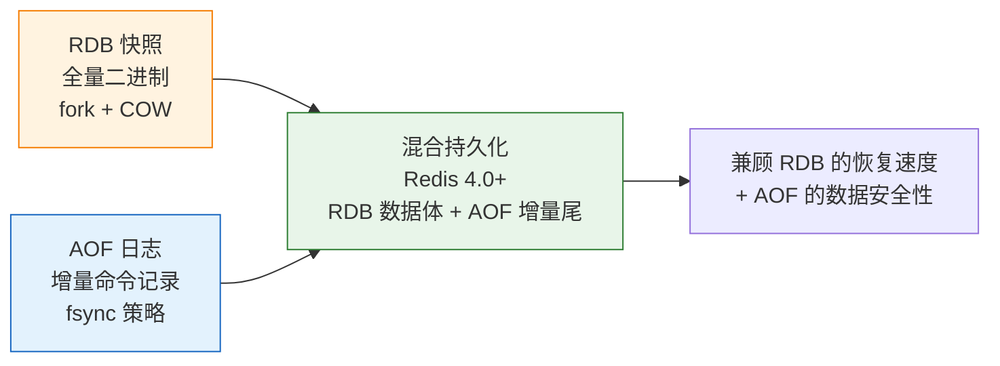
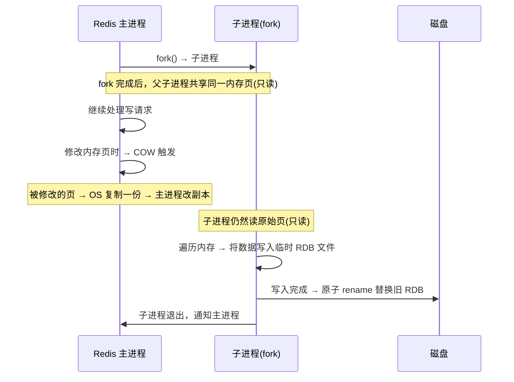
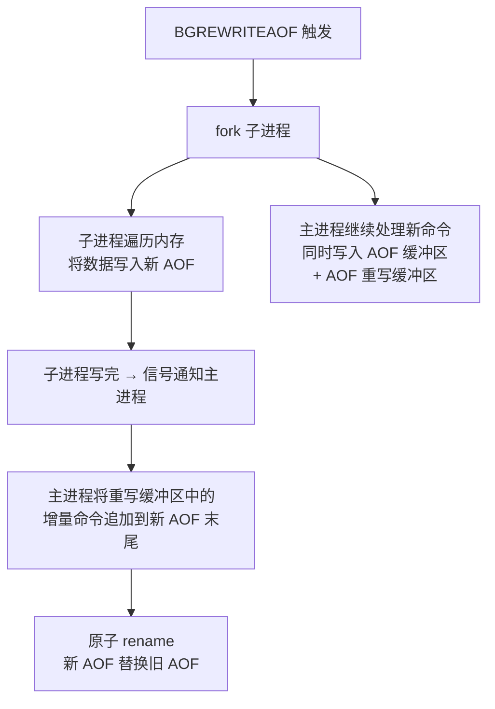

# 历史背景——Redis 为何需要持久化？

Redis 起初被设计为一个纯内存缓存，antirez 的想法很简单：数据就是应该在内存里，重启即丢失。但很快他发现用户把 Redis 当数据库用——用户数据、会话状态、任务队列……都放在了 Redis 里。其中很多数据是不能丢的。

于是 Redis 2.0 引入了 RDB 快照持久化，Redis 1.1 有了早期的 AOF（Append Only File）原型。两种持久化方式代表了两种设计哲学：**RDB（全量快照）追求恢复速度和文件紧凑，AOF（增量日志）追求数据安全和可恢复性**。Redis 4.0 用混合持久化把两者结合起来——这大概是 Redis 持久化历史上最重要的一次变化。

理解 RDB 和 AOF 不是"选哪个"的问题，而是"组合使用后各自的优缺点如何互补"的问题。



---

# 一、RDB——快照式存盘

## 1.1 What：RDB 是什么？

RDB 是 Redis 在**某个时间点**对**整个内存数据**做的一次全量快照，输出一个紧凑的二进制文件（`dump.rdb`）。它不是定时增量备份，是完整的时间点镜像。

```bash
# 自动触发条件
save 900 1      # 900 秒内 ≥ 1 次写操作 → 触发 BGSAVE
save 300 10     # 300 秒内 ≥ 10 次写操作 → 触发
save 60 10000   # 60 秒内 ≥ 10000 次写操作 → 触发

# 手动触发
BGSAVE          # 后台执行（生产唯一推荐的方式）
SAVE            # 前台阻塞执行（❌ 生产禁用——会卡死所有客户端请求！）
```

## 1.2 How：Copy-On-Write 的快照机制

RDB 的核心是利用 Linux 的 **fork() + Copy-On-Write** 来在不阻塞主进程的情况下生成快照：



**关键理解**：fork 的子进程看到的是"fork 那一刻"的内存快照。主进程后续的写入通过 COW 写到新内存页，子进程完全不受影响——它读到的始终是 fork 时刻的数据。

## 1.3 Why：RDB 的内存翻倍风险

COW 机制有一个隐藏的代价：如果主进程在子进程 dump RDB 期间修改了大量内存页，每一次修改都触发一次 COW 页拷贝。最坏情况下，**所有被修改的页都被复制了一份 → 内存使用瞬间翻倍**。

```
例子：
  Redis 用了 10GB 内存 → fork 子进程
  子进程 dump RDB 期间（可能持续 30 秒），主进程不断处理写请求
  如果期间修改了 8GB 的数据 → COW 额外分配了 8GB 内存
  → 物理内存总消耗 = 10GB (原) + 8GB (COW) = 18GB
  → 如果只给 Redis 留了 12GB 内存 → OOM Killer 出动！
```

**这就是为什么生产环境要给 Redis 预留 30-50% 物理内存**——不是给 Redis 自己用，而是给 fork 期间的 COW 用。

| RDB 优点 | RDB 缺点 |
|---------|---------|
| 文件紧凑（二进制格式，压缩比高） | 两次快照之间的数据**全部丢失** |
| 恢复速度快（直接加载二进制到内存） | fork() 时有内存翻倍风险 |
| 适合冷备、异地容灾、全量迁移 | 频繁 BGSAVE 时 fork 开销不可忽略 |
| 对性能影响集中在 fork 瞬间和 COW | 不适合秒级数据安全需求 |

---

# 二、AOF——增量命令日志

## 2.1 What：AOF 是什么？

AOF（Append Only File）记录的是 Redis 收到的**每一条写命令**。它是一个文本文件，可以用 `cat` 查看，可以逐行理解。

```
# AOF 文件示例内容：
*3\r\n$3\r\nSET\r\n$1\r\nkey\r\n$5\r\nvalue\r\n
*2\r\n$6\r\nSELECT\r\n$1\r\n0\r\n
```

Redis 重启时**逐条执行** AOF 中的命令来重建数据。所以恢复速度取决于 AOF 文件的大小（命令数量）。

## 2.2 How：三种 fsync 策略

写 AOF 文件时，数据首先进入 OS 的 Page Cache，不一定立刻落盘。`fsync` 强制将 Page Cache 刷到磁盘：

| 策略 | 行为 | 数据安全 | 对性能的影响 | 适用 |
|------|------|--------|------------|------|
| **always** | 每条写命令后立刻 fsync | ⭐⭐⭐⭐⭐ 一条不丢 | 性能大幅下降（每次 fsync 都是磁盘操作） | 金融、支付等极端场景 |
| **everysec** | 每秒 fsync 一次（**默认**） | ⭐⭐⭐⭐ 最多丢 1 秒数据 | 性能影响可控（1 秒 1 次 fsync） | **绝大多数生产场景的最佳选择** |
| **no** | 不主动 fsync，交给 OS | ⭐⭐ 数据可能大量丢失 | 几乎无影响 | 纯缓存场景或已有 RDB 兜底 |

**everysec 的工程权衡**：大多数应用可以容忍丢失最近 1 秒的数据（比如用户最近一次点击），但不能容忍丢失全部数据。everysec 在性能和安全之间找到了最优解。

## 2.3 AOF 重写——对抗文件膨胀

一个问题：AOF 记录了每一条写命令，如果对同一个 key 执行了 100 次 `SET counter 1..100`，AOF 里有 100 条记录。但数据最终只需要 `SET counter 100`。

**AOF Rewrite（重写）**解决了这个问题：

```bash
# AOF 文件增长过程：
# 原始：SET counter 1
#       SET counter 2
#       SET counter 3    ← 最终值 3，前两条浪费空间
#
# 重写后：SET counter 3（只保留最终状态）
```



**重写期间主进程一直在服务**，新写入的命令被记录在"重写缓冲区"中，最后追加到新 AOF 尾部。整个过程不丢一条命令。

**触发条件**（默认）：
```bash
auto-aof-rewrite-percentage 100   # AOF 文件比上次重写后增长了 100%
auto-aof-rewrite-min-size 64mb    # AOF 文件至少 64MB 才触发重写
```

## 2.4 RDB vs AOF 对照

| | RDB | AOF |
|------|-----|-----|
| **数据安全** | 两次快照间可能丢几分钟到几小时的数据 | `everysec` 最多丢 1 秒 |
| **恢复速度** | 快（直接加载二进制） | 慢（逐条重放命令，大文件可能几分钟） |
| **文件大小** | 小（二进制压缩） | 大（文本命令，重写后缩小） |
| **fork 开销** | 每次快照都 fork | 重写时才 fork，平时只是 append |
| **可读性** | 二进制不可读 | 文本文件，可 cat 查看和修复 |

---

# 三、混合持久化——Redis 4.0 的最优解

## 3.1 What：把 RDB 塞进 AOF

```bash
# redis.conf
aof-use-rdb-preamble yes   # 开启混合持久化（Redis 4.0+）
```

```
混合持久化的 AOF 文件结构：
┌──────────────────────────┐
│  RDB 二进制格式           │ ← 当前时刻的全量内存快照（类 RDB）
│  (主体数据，占 90%+ 体积)   │    恢复时直接加载，秒级完成
├──────────────────────────┤
│  AOF 文本格式             │ ← RDB 快照之后的增量写命令
│  (增量尾部，保护最新数据)    │    恢复时重放，保证最后几秒不丢
└──────────────────────────┘
```

## 3.2 How：触发时机

混合持久化在 **AOF 重写时**生效：
1. 触发 AOF 重写（文件增长 100% 或手动 `BGREWRITEAOF`）
2. 子进程 fork 出来后，将当前内存以 **RDB 二进制格式**写入新 AOF 头部
3. 重写期间主进程的增量命令以 **AOF 文本格式**追加到尾部
4. 最终文件：前半是 RDB 二进制，后半是 AOF 文本

## 3.3 Why：一举两得

- **恢复速度**：RDB 头部用二进制加载，比逐条重放 AOF 命令快 5-10 倍
- **数据安全**：AOF 尾部保证最后 fork 时刻之后的增量数据一条不丢
- **文件体积**：RDB 格式比 AOF 文本更紧凑，尾部增量很小

**这是一个极少见的"两边都赢"的设计**——没有明显缺点，Redis 4.0+ 生产环境强烈建议开启。

---

# 四、生产配置组合

## 4.1 按场景推荐

| 场景 | 配置组合 | 理由 |
|------|---------|------|
| **纯缓存（数据可重建）** | 关闭所有持久化 | 极致性能，数据不重要 |
| **需要数据安全** | `AOF everysec + 混合持久化` + 适度 RDB | **生产默认推荐** |
| **冷备/全量迁移** | 定期手动 `BGSAVE` + 异地备份 RDB | 用于灾难恢复的独立副本 |
| **极高安全** | `AOF always` | 性能大幅下降，只有金融场景需要 |

## 4.2 推荐配置

```bash
# === RDB：适度频繁，不要在业务高峰期 fork ===
save 3600 1       # 1 小时内有 1 次写入也触发
save 300 100      # 5 分钟内 100 次写入
save 60 10000     # 1 分钟内 10000 次写入

# === AOF：everysec + 混合持久化 ===
appendonly yes
appendfsync everysec
aof-use-rdb-preamble yes
auto-aof-rewrite-percentage 100
auto-aof-rewrite-min-size 64mb

# === 关键：给 COW 留够内存 ===
# 物理内存规划：Redis 数据量 × 1.5 + OS 开销
# 例：Redis 存 10GB 数据 → 物理内存至少 16GB
```

---

# 五、总结

| 机制 | 一句话 | 数据安全 | 恢复速度 |
|------|--------|---------|---------|
| **RDB** | fork + COW 全量快照 | 两次快照间全部丢失 | ⭐⭐⭐⭐⭐ |
| **AOF everysec** | 增量日志每秒刷盘 | 最多丢 1 秒 | ⭐⭐ |
| **混合持久化** | RDB 体 + AOF 尾 | 最多丢 1 秒 | ⭐⭐⭐⭐ |

# 延伸阅读

**Do——动手验证：**
- `redis-cli BGSAVE` 后 `tail -f redis.log` 观察 fork 和 COW 日志
- `redis-check-rdb dump.rdb` 验证 RDB 文件完整性
- `redis-check-aof --fix appendonly.aof` 修复损坏的 AOF 文件
- 用 `INFO Persistence` 观察 `aof_current_size` 和 `aof_base_size`，对比重写前后的文件大小

**Todo——深入方向：**
- [ ] AOF 重写的"写时复制缓冲区"内存管理细节
- [ ] Redis 7.0 的 Multi-Part AOF（多个 AOF 文件，按时间分组）设计与优势
- [ ] RDB 文件格式的二进制结构（REDIS + version + database sections + CRC64 checksum）
- [ ] 大规模 Redis（>100GB）的 BGSAVE 时间估算和 COW 内存监控

*本文参考资料：*
- Redis 官方文档 - Persistence: https://redis.io/docs/latest/operate/oss_and_stack/management/persistence/
- antirez, "Redis Persistence demystified" (blog post, 2010): http://oldblog.antirez.com/post/redis-persistence-demystified.html
- antirez, "AOF Advantages" and "RDB Advantages" from Redis Documentation
