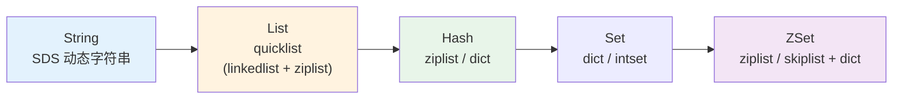
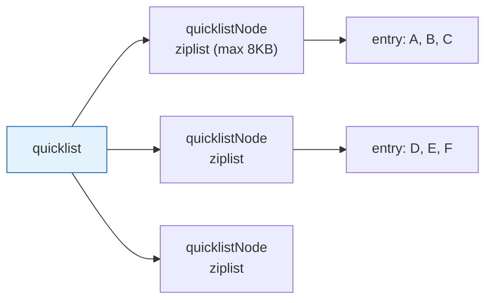
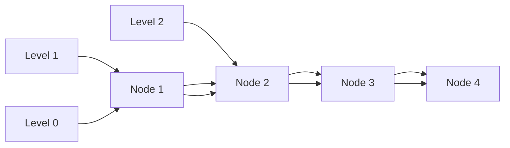

# 历史背景——Redis 为什么不用现成的库？

2009 年，Salvatore Sanfilippo（antirez）在开发一个实时统计系统时遇到了性能瓶颈。他需要一种能在亚毫秒级处理数十万次"写入键值 + 过期删除"的数据存储。MySQL 显然太重，memcached 只支持纯 KV 不够灵活（需要 List、Set 这样的复杂结构）。于是他决定自己写一个——这就是 Redis。

antirez 对性能的执念渗透到了每个数据结构的底层实现中。Redis 没有用任何现成的 STL/标准库（比如 C++ std::string 或 std::map），而是为每种数据结构**量身定制了内部编码**。甚至在数据量不同时，同一个 Redis 类型会在**不同的内部编码之间动态切换**——小数据用紧凑结构省内存，大数据用复杂结构提性能。

理解这些底层实现，不是为了炫技，而是因为当你遇到"一个 ZSET 有 200 个元素却占了几十 MB 内存"或者"DEL 一个 10 万元素的 LIST 导致 Redis 卡住 2 秒"的时候，你需要知道下面发生了什么。



---

# 一、SDS —— 为什么不用 C 字符串？

## 1.1 What：C 字符串的三个致命缺陷

```c
// 问题一：获取长度是 O(N)
size_t len = strlen("hello world");  // 遍历直到 \0

// 问题二：缓冲区溢出（无数安全漏洞的根源）
char dest[10];
strcpy(dest, "this string is way too long");  // 溢出！UB！

// 问题三：二进制不安全
// "hello\0world" — C 字符串遇到 \0 就截断
// Redis 经常要存储二进制数据（序列化的对象、图片缩略图等）
```

## 1.2 How：SDS 的设计

Redis 用 SDS（Simple Dynamic String）替换 C 字符串。从 Redis 3.2 开始，SDS 有 5 种长度变体（`sdshdr5`、`sdshdr8`、`sdshdr16`、`sdshdr32`、`sdshdr64`），根据字符串长度自动选择最小的头部：

```c
// 以 sdshdr16 为例（字符串长度在 256~65535 之间使用）
struct __attribute__ ((__packed__)) sdshdr16 {
    uint16_t len;   // 已用长度 → O(1) 获取
    uint16_t alloc; // 总容量（含已用 + 空闲） → 减少 realloc
    unsigned char flags; // 头类型标记（sdshdr5/8/16/32/64）
    char buf[];     // 实际字节数组（柔性数组）
};
```

## 1.3 Why：SDS 的四个关键设计决策

| 特性 | C 字符串 | SDS | 为什么重要 |
|------|---------|-----|----------|
| **取长度** | O(N) `strlen` | O(1) 读 `len` 字段 | `STRLEN` 命令需要 O(1) |
| **二进制安全** | ❌ 遇 `\0` 截断 | ✅ 不特殊处理任何字节 | Redis 要存序列化对象 |
| **空间预分配** | 无 | 扩容时 `newlen*2 + 1`（<1MB）或 `newlen + 1MB`（≥1MB） | 减少 `realloc` 次数 |
| **惰性释放** | 无 | 缩短字符串时不立即释放内存 | 字符串变来变去不用反复 `malloc/free` |

**空间预分配的工程智慧**：与其每次 append 都 `realloc`（N 次 append = N 次 `realloc`），不如多申请一点空间。这个逻辑在大多数语言的 `ArrayList` 里都能看到——Redis 在 C 层面实现了同样的策略。

---

# 二、ziplist —— 连续内存的极致压缩

## 2.1 What：ziplist 的内存布局

```
<zlbytes> <zltail> <zllen> <entry> <entry> ... <entry> <zlend>
  4B       4B       2B       ↑                       1B(0xFF)

每个 entry：
<prevlen>      <encoding>    <entry-data>
前一个entry长度  类型+本entry长度  实际数据
  1B或5B          1/2/5B
```

ziplist 的设计哲学是**用 CPU 时间换内存空间**：把所有元素紧密排列在一块连续内存中，省掉了指针的 8 字节开销（64 位系统上一个指针 8 字节）。但代价是——访问第 N 个元素需要从头遍历、中间插入会触发连锁移动。

## 2.2 Why：ziplist 的"连锁更新"灾难

ziplist 每个 entry 的 `prevlen` 字段记录前一个 entry 的大小。如果前驱 < 254 字节，`prevlen` 占 1 字节；如果 ≥ 254 字节，`prevlen` 占 5 字节。问题来了：

```
场景：
  你有几百个 253 字节的 entry（prevlen=1B）
  现在在中间插入一个 256 字节的 entry
    → 下一个 entry 的 prevlen 从 1B 膨胀为 5B → 该 entry 总大小也变了
      → 再下一个 entry 的 prevlen 也膨胀 → 再下一个也膨胀……
        → 整个 ziplist 像多米诺骨牌一样串行更新
```

这种**连锁更新（Cascade Update）**是 ziplist 最坏情况下的性能杀手。Redis 的设计回答是：**不要让 ziplist 变得太大**——通过阈值配置自动切换到更高效的结构。

## 2.3 Do：ziplist vs 替代结构的场景对比

| 场景 | ziplist 是否合适 |
|------|----------------|
| 少量元素（< 512） + 小数据（< 64B） | ✅ 理想场景，内存效率最高 |
| 头尾增删（LPUSH/RPOP） | ✅ 只要没触发连锁更新 |
| 中间插入/删除 | ❌ 大量数据移动 |
| 元素包含大字符串 | ❌ 单个元素 > 阈值即切换 |
| 随机访问（`LINDEX`） | ❌ 需遍历，O(N) |

---

# 三、quicklist —— Redis 3.2 后的 List 标准结构

## 3.1 What：quicklist 是什么？

`quicklist` 是 Redis 3.2 引入的 List 实现——一个双向链表，但每个链表节点不是一个元素，而是一个 **ziplist**（压缩列表）。



## 3.2 Why：为什么要折中？

quicklist 要解决的是一个经典矛盾：

- **纯 linkedlist**：每个节点是一个元素 → O(1) 头尾插入删除 → 但每个元素带两个 8B 指针 = 内存开销爆炸（List 有 100 万元素，光是 prev/next 指针就 16MB）
- **纯 ziplist**：连续内存无指针 → 内存效率极高 → 但中间插入/删除 = 移动数据 O(N) + 连锁更新风险
- **quicklist**：每个 ziplist 控制在 8KB 以内 → 指针开销降到 1/几十 → 中间插入只在 8KB 的 ziplist 内移动 → 连锁更新风险被封在单个节点内

`list-max-ziplist-size=-2`（默认 8KB）就是在调这个平衡点。8KB 恰好等于一个标准内存页，CPU 缓存能完整装下一个 ziplist。

---

# 四、skiplist —— 用概率替代平衡

## 4.1 What：跳表是什么？

跳表（Skip List）是多层有序链表：底层（Level 0）包含所有元素，每往上一层，元素数减少（概率约为 1/4），最高层跨越很大范围的元素。



查找时从最高层开始：如果目标在当前节点之后→在同一层前进；如果目标在当前节点和下一个节点之间→下降一层继续。查找复杂度 O(logN)，和平衡树相当。

## 4.2 Why：为什么不用红黑树？

| | 红黑树 | 跳表 |
|------|--------|------|
| **实现复杂度** | 高（插入/删除需要旋转和染色，边界 case 多） | 低（插入只需随机生成层数 + 改指针） |
| **范围查询** | 中序遍历，需要回溯和栈 | 找到起点 → 沿 Level 0 直接向后走，天然支持 |
| **并发友好** | 旋转涉及多个节点，加锁粒度粗 | 每层独立，可分段细粒度加锁 |
| **内存占用** | 每节点 3 个指针（left/right/parent）+ 颜色 | 平均 1.33 个 next 指针/节点（p=0.25） |

antirez 在博客里说过：跳表不是因为性能比红黑树好，而是因为**代码更少、bug 更少**。在实际中，Redis 的 ZSet 场景下范围查询（`ZRANGEBYSCORE`）是最频繁的操作，跳表天然支持——这也是选择跳表的关键理由。

## 4.3 How：层数生成

```c
// Redis 的随机层数生成（t_zset.c）
int zslRandomLevel(void) {
    int level = 1;
    // 每次 25% 概率升一层 → 期望层数 1.33
    while ((random() & 0xFFFF) < (ZSKIPLIST_P * 0xFFFF))
        level += 1;
    return (level < ZSKIPLIST_MAXLEVEL) ? level : ZSKIPLIST_MAXLEVEL;
}
// 层数分布：Level 1 = 75%，Level 2 = 18.75%，Level 3 = 4.7%，Level 4 = 1.2%...
```

**跳表用概率替代了平衡树的强制旋转**。在某些极端情况下（极小概率），跳表可能退化——但 99.99% 的情况下表现几乎完美。而且要连续 32 次随机都 < 0.25 才会到最大层数，概率约 0.25^32 ≈ 5.4 × 10⁻²⁰，比中彩票概率还低得多。

## 4.4 Do：ZSet 中的双结构

ZSet 实际上用了**两套数据结构**来保证不同的操作性能：

- **skiplist**：按 score 排序，O(logN) 的范围查询和插入
- **dict**：按 member → score 的哈希映射，O(1) 的按成员查 score（`ZSCORE` 命令）

两者指向的是**同一份 member 对象**（不是两份拷贝），只是索引方式不同。

---

# 五、底层切换规则速查

| 数据类型 | 小数据编码 | 大数据编码 | 切换阈值参数 |
|----------|-----------|-----------|------------|
| **Hash** | ziplist | dict | `hash-max-ziplist-entries=512`, `hash-max-ziplist-value=64` |
| **ZSet** | ziplist | skiplist + dict | `zset-max-ziplist-entries=128`, `zset-max-ziplist-value=64` |
| **Set** | intset | dict | `set-max-intset-entries=512` |
| **List** | quicklist | quicklist | `list-max-ziplist-size=-2` (8KB per node) |
| **String** | embstr (≤44B) / raw | raw | 自动判断，44 字节分界线（3.2+） |

**"元素超过阈值"时发生什么？**
Redis 在插入新元素后检查是否超出阈值，如果超出 → `convertTo` 对应的复杂结构（O(N) 遍历转换）。转换是**原地且不可逆的**——一旦变成 skiplist，即使把元素删到只剩 10 个也不会变回 ziplist。

---

# 六、总结

| 结构 | 核心思想 | 最佳场景 |
|------|--------|---------|
| **SDS** | 带长度元数据的二进制安全字符串，预分配+惰性释放 | Redis 所有字符串的内部载体 |
| **ziplist** | 连续内存压缩存储，用 CPU 换内存 | 小 Hash / 小 ZSet（< 512 元素） |
| **quicklist** | 链表包 ziplist 的混合体，8KB per node | List 类型，替代 linkedlist + ziplist |
| **skiplist** | 概率跳跃多层链表，O(logN) 范围查询 | ZSet 中的按 score 排序 |
| **dict** | 渐进式 rehash 哈希表 | Hash / Set 的大数据编码 |

# 延伸阅读

**Do——动手验证：**
- `DEBUG OBJECT key` 查看一个 key 当前的内部编码（embstr/ziplist/skiplist 等）
- `OBJECT ENCODING key` 直接查看编码类型
- 创建一个 Hash，用 `HLEN` 看元素数，逐步添加超过 512 后 `OBJECT ENCODING` 看编码切换
- 在 Redis 配置中调低 `hash-max-ziplist-entries=5`，观察小 Hash 编码切换的行为

**Todo——深入方向：**
- [ ] SDS 5 种变体的详细内存布局和选择策略
- [ ] dict 的渐进式 rehash 机制（`ht[0]` → `ht[1]` 的分批迁移）
- [ ] intset 的整数集合升级（int16 → int32 → int64）
- [ ] Redis 7.0 引入的 listpack（ziplist 替代品）解决了哪些连锁更新的问题

*本文参考资料：*
- Redis 源码 (`src/sds.h`, `src/ziplist.c`, `src/quicklist.c`, `src/t_zset.c`)
- antirez, "Redis Internal Data Structures": https://redis.io/docs/latest/develop/data-types/
- William Pugh, "Skip Lists: A Probabilistic Alternative to Balanced Trees" (CACM 1990)
- Redis 官方文档 - Data Types: https://redis.io/docs/latest/develop/data-types/
