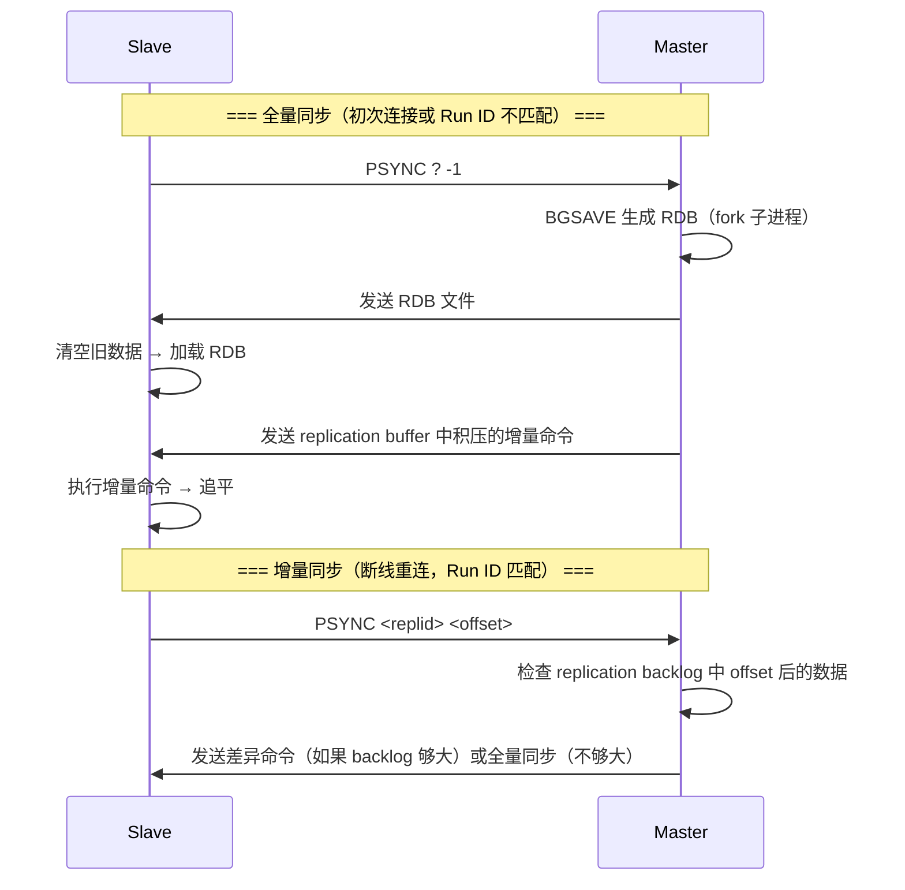
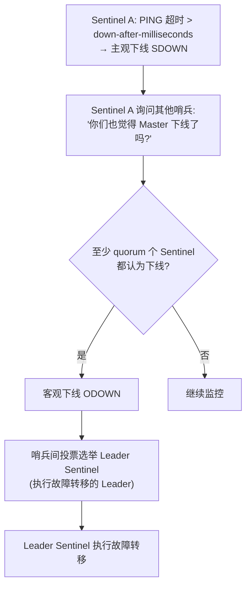
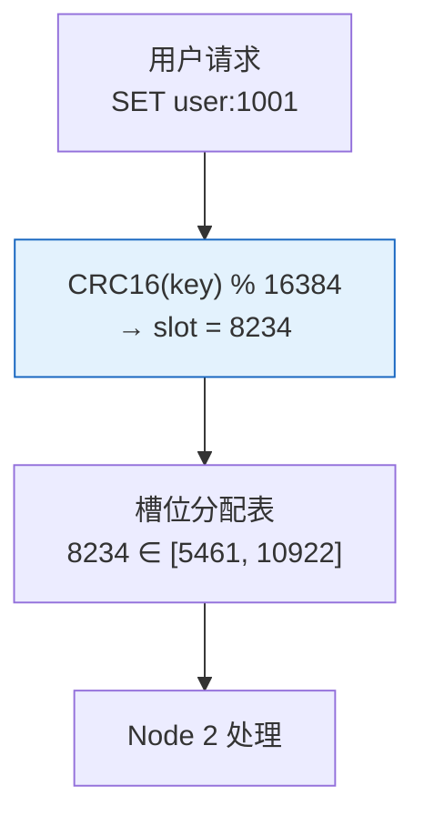

# 历史背景——从单机到 Cluster 的十年演化

Redis 诞生于 2009 年，最初只是一个单机内存 KV。但互联网应用的数据量增长太快了——2011 年新浪微博用 Redis 做 feed 缓存时就已经写满了几十台机器的内存。从单品到集群，Redis 的架构演化走了十年：

```
Redis 1.0 (2009) → 单机
Redis 2.4 (2011) → 引入 Sentinel（哨兵高可用）
Redis 2.6 (2012) → 主从复制完善（PSYNC 支持断点续传）
Redis 3.0 (2015) → Redis Cluster 正式 GA（分片 + 高可用合体）
Redis 7.0 (2022) → Cluster 分片迁移优化 + Sharded Pub/Sub
```

每一个版本的引入都对应了一种新的"单机困境"：哨兵解决了手动切主从不方便，Cluster 解决了单机内存装不下。理解这段演化路径，才能在实际场景中做出正确的选型——不是 Cluster 一定比哨兵好，而是**根据你的数据量和运维能力选择恰好合适的方案**。


---

# 一、主从复制——读写分离与数据冗余

## 1.1 What：主从复制是什么？

主从复制是 Redis 高可用的基础层。一个 Master 处理所有写请求，1-N 个 Slave 异步复制 Master 的数据，提供只读服务。

```
            ┌─── Slave 1 (只读)
Master ─────┼─── Slave 2 (只读)
            └─── Slave 3 (只读)

写入 → 只走 Master
大量读取 → 可分发到 Slave（读写分离）
```

## 1.2 Why：为什么用异步复制而不是同步？

Redis 选择**异步复制**是一个刻意的性能决策。如果采用同步复制（Master 等 Slave 写成功才返回），每个写请求的延迟就是 Master 延迟 + 最慢 Slave 的网络 RTT，对于亚毫秒级目标的 Redis 是不可接受的。

代价是**数据可能丢失**：Master 在数据写入 Slave 之前宕机，已写入 Master 的数据可能还没复制到任何 Slave。

## 1.3 How：全量同步 vs 增量同步



**全量同步的代价**：BGSAVE fork 子进程、生成 RDB、网络传输 RDB、Slave 加载 RDB ——整个过程可能耗时几十秒到几分钟（取决于数据量大小），期间 Master 和 Slave 的 CPU 和内存都有额外开销。

**增量同步的前提**：`replication backlog`（复制积压缓冲区）足够大。它是一个环形缓冲区，默认 1MB。如果 Slave 断线期间 Master 写入的新命令量超过了 1MB，积压缓冲区就被覆盖了 → 只能全量同步。

```bash
# 生产建议调大积压缓冲区
repl-backlog-size=64mb       # 默认 1MB，生产至少 32-64MB
repl-backlog-ttl=3600        # Slave 断开后保留缓冲区的时长（秒）
```

## 1.4 主从延迟的四个来源

| 原因 | 表现 | 解法 |
|------|------|------|
| **Slave 机器性能弱于 Master** | Slave 消费复制数据跟不上 Master 写入速度 | Slave 硬件规格不低于 Master |
| **网络带宽瓶颈** | 复制数据流占满 Slave 带宽 | 千兆网卡起步，复制流量独立网卡 |
| **大 Key 频繁写入** | 单个 SET 命令几百 KB → replication buffer 瞬间占满 | 拆分大 Key 为小 Key |
| **repl-diskless-sync=no** | 默认先落盘再传输，磁盘 IO 成为瓶颈 | 开启 `repl-diskless-sync yes`（无盘复制） |

---

# 二、哨兵模式——自动故障转移

## 2.1 What：哨兵做了什么？

哨兵（Sentinel）是一个独立的进程（通常和 Redis 部署在同一台机器上），多个哨兵组成哨兵集群。它的三个核心职责：

```
哨兵集群（至少 3 个节点，通常奇数）
  ├── 监控：每秒 PING Master 和 Slave，检测存活
  ├── 通知：Master 状态变更通过 Pub/Sub 通知客户端
  └── 自动故障转移：Master 下线 → 选新 Master → 让 Slave 指向新 Master → 通知客户端
```

## 2.2 How：主观下线到客观下线

单个哨兵的判断不靠谱（可能是哨兵自己网络出了问题），所以需要"投票"：



**`down-after-milliseconds` 和 `quorum` 的关系**：
- `down-after-milliseconds=30000`：30 秒 PING 无响应认为主观下线
- `quorum=2`（3 节点哨兵）：至少 2 个哨兵认为下线才客观下线
- **故障转移总延迟** ≈ `down-after-milliseconds` + 投票时间 + 选主时间 ≈ 10-45 秒

## 2.3 故障转移——Slave 中选新 Master

```
选举规则（优先级从高到低）：
  1. slave-priority 最低的（数字越小优先级越高，人为标记最优 Slave）
  2. 复制偏移量最大的（数据最接近原 Master）
  3. runid 最小的（确定性裁决，避免平局）

执行：
  1. Leader Sentinel 向选中的 Slave 发送 SLAVEOF NO ONE → 升级为 Master
  2. 向其余 Slave 发送 SLAVEOF <new-master-ip> <new-master-port>
  3. 更新客户端通知（+switch-master 频道 Pub/Sub 消息）
```

## 2.4 哨兵模式的局限性

- **不能水平扩展写**：所有写操作还是同一个 Master
- **切换有窗口**：10-45 秒的切换窗口，客户端重连期间服务不可用
- **主从数据不一致**：异步复制，Master 宕机时可能丢失最近几秒的数据
- **内存上限仍是单机**：主从复制每个 Slave 也存全量数据，容量瓶颈在单机

**当你的数据量超过单机内存时，哨兵无能为力。这时候需要 Cluster。**

---

# 三、Cluster 分片——16384 个哈希槽

## 3.1 What：Cluster 分片模型

Redis Cluster 将整个键空间划分为 **16384 个哈希槽**（slot）。每个节点负责一部分槽。数据分布规则非常简单：



**为什么是 16384 而不是 65536？**
16384 个槽位的状态信息通过 Gossip 协议在节点间传播。如果用 65536 个槽，心跳消息的体积会显著变大。16384 是 antirez 在"够用"和"心跳体积"之间的权衡——16384 比特的位图刚好 2048 字节，两个 TCP 包就传完了。

## 3.2 How：Cluster 核心机制

| 机制 | 说明 | 代码表现 |
|------|------|---------|
| **16384 槽位** | CRC16(key) % 16384 决定 key 到 slot，slot 到 node 的映射表 | 客户端缓存路由表，无需每次查 |
| **Gossip 协议** | 节点间定期交换状态（随机选几个节点聊），`cluster-node-timeout` 控制心跳间隔 | 去中心化，无单点故障 |
| **MOVED 重定向** | Key 不在当前节点 → 返回 `-MOVED 8234 192.168.1.3:6379` → 客户端更新路由缓存 + 重定向到正确节点 | 永久性路由变化 |
| **ASK 重定向** | Slot 正在迁移中 → 返回 `-ASK 8234 192.168.1.3:6379` → 客户端单次 ASKING + 重定向 | 临时性（迁移中），不影响路由缓存 |
| **主从自动切换** | Cluster 内置哨兵逻辑，每个 Master 可以有多个 Slave | 不需要额外部署哨兵进程 |

## 3.3 MOVED vs ASK——为什么要区分？

```
MOVED：Key 已经永久迁移到另一个节点
  → 客户端应该永久更新路由缓存

ASK：Key 正在迁移中（部分数据还在旧节点，部分已到新节点）
  → 这是临时的！客户端不应该更新缓存
  → 下次请求同一个 key 可能还在旧节点上
```

这个区分是 Cluster 支持**在线不停服迁移**的关键。没有 ASK，每次迁移槽位都会触发客户端的错误路由。

## 3.4 槽位迁移操作

```bash
# 新节点加入集群
redis-cli --cluster add-node 192.168.1.4:6379 192.168.1.1:6379

# 重新分配槽位（在线迁移）
redis-cli --cluster reshard 192.168.1.1:6379 \
  --cluster-from <source-node-id> \
  --cluster-to <target-node-id> \
  --cluster-slots 4096

# 迁移过程对客户端透明（MOVED/ASK 自动处理好）
```

---

# 四、三种方案全维度对比

| | 主从复制 | 哨兵 | Cluster |
|------|---------|------|---------|
| **高可用** | ❌ 手动切换 | ✅ 自动故障转移 | ✅ 自动故障转移 |
| **水平扩展（容量）** | ❌ 所有节点存全量数据 | ❌ 所有节点存全量数据 | ✅ 数据按 slot 分布到各节点 |
| **水平扩展（写 QPS）** | ❌ 写只能走 Master | ❌ 写只能走 Master | ✅ 每个 Master 处理自己负责的 slot |
| **运维复杂度** | ⭐ 简单 | ⭐⭐ 哨兵集群维护 | ⭐⭐⭐ 槽位分配、迁移、再平衡 |
| **客户端要求** | 无特殊要求 | Sentinel-aware 客户端 | Cluster-aware 客户端（JedisCluster/Lettuce） |
| **多 Key 操作** | ✅ 任意组合 | ✅ 任意组合 | ⚠️ 同一 slot 才能操作（用 `{hash_tag}` 保证） |
| **数据量上限** | 单机内存 | 单机内存 | 理论 16384 × 单节点内存（~PB 级） |
| **适用场景** | 缓存，读多写少 | 生产必备的基础 HA | 数据量大、QPS 高、需要水平扩展 |

**多 Key 操作的兼容指南**：
```bash
# 用 {} 哈希标签让相关 key 落入同一个 slot
SET user:{1001}:name "Alice"
SET user:{1001}:age "30"
# 这两个 key 的 slot = CRC16("user:{1001}") % 16384 → 同一 slot！
# 可以用 MGET / SINTER / 事务 / Lua 操作它们
```

---

# 五、选型决策树

```
你的数据量 > 单机内存?
  ├── 是 → Redis Cluster
  └── 否 → 你的写 QPS > 单机能力?
            ├── 是 → Redis Cluster（多 Master 写并行）
            └── 否 → 你需要自动故障转移?
                      ├── 是 → Redis Sentinel
                      └── 否 → 主从复制即可
```

# 延伸阅读

**Do——动手验证：**
- Docker Compose 搭建 3 Master + 3 Slave 的 Cluster 环境
- `redis-cli --cluster check` 检查集群状态
- 用 `redis-cli --cluster reshard` 手动迁移 100 个 slot，观察 `CLUSTER NODES` 输出的变化
- 模拟一次哨兵切换：`redis-cli -p 6379 DEBUG SLEEP 60` 让 Master 假死，观察哨兵日志

**Todo——深入方向：**
- [ ] Gossip 协议的具体消息格式和 `cluster-node-timeout` 的调优
- [ ] Cluster 模式下 `WAIT` 命令的同步复制语义（和主从复制的配合）
- [ ] Redis Cluster 的 Hash Tag 设计与跨 slot 事务的替代方案
- [ ] Redis 7.0 的 Sharded Pub/Sub——Pub/Sub 在 Cluster 中的分布式改造

*本文参考资料：*
- Redis 官方文档 - Cluster Tutorial: https://redis.io/docs/latest/operate/oss_and_stack/management/scaling/
- Redis 官方文档 - Sentinel: https://redis.io/docs/latest/operate/oss_and_stack/management/sentinel/
- Redis 官方文档 - Replication: https://redis.io/docs/latest/operate/oss_and_stack/management/replication/
- antirez, "Redis Cluster Specification" (2015): https://redis.io/docs/latest/operate/oss_and_stack/reference/cluster-spec/
