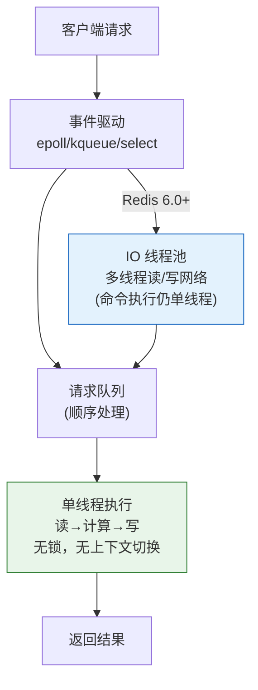
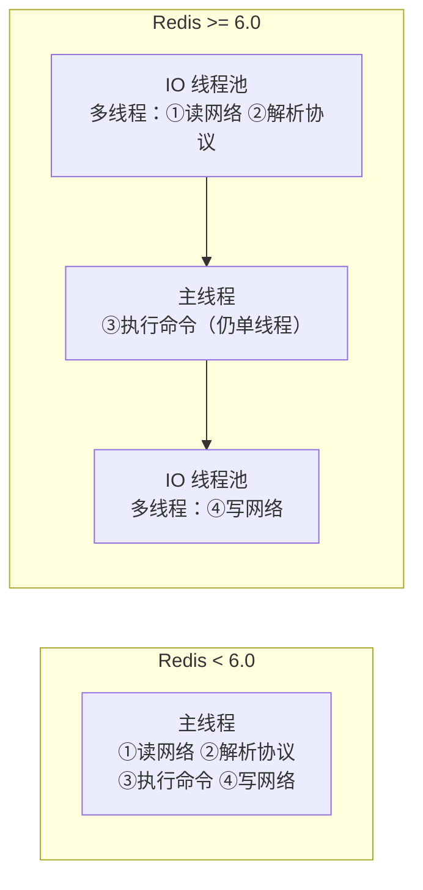
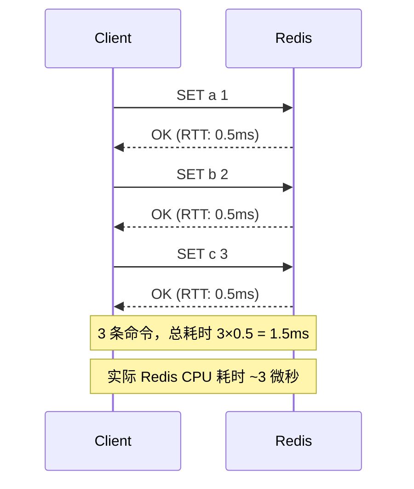
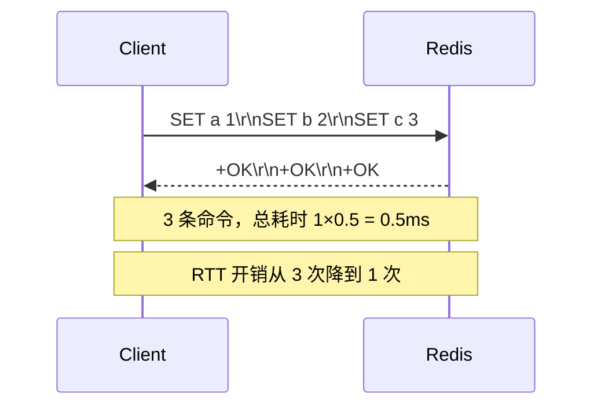

# 历史背景——"单线程还这么快"的根源

2011 年，antirez 在 Redis 的早期邮件列表中写了一篇后来被大量引用的文章，题为"Redis is single-threaded… and it's fine"。当时很多人质疑：多线程时代了，一个数据库用单线程怎么行？

antirez 的回应是一个重要的工程洞察：**Redis 的性能瓶颈从来不在 CPU 上，而在网络 IO 和内存带宽上**。普通的 GET/SET 操作在 Redis 内存数据结构上只需要微秒级——比一次网络往返（几百微秒到几毫秒）快 2-3 个数量级。所以瓶颈不是"Redis 算得不够快"，而是"网卡上的数据还没传过来"。

既然瓶颈在网络不在 CPU，那多线程带来的锁竞争、上下文切换和代码复杂度，收益几乎为零，代价却实打实。这个判断支撑了 Redis 整整 10 年的单线程架构——直到 Redis 6.0 才在多线程 IO 上做了受控的突破。



---

# 一、单线程模型——它在快在哪里？

## 1.1 What：Reactor + IO 多路复用

Redis 是一个经典的 **Reactor 模式**实现。核心循环非常简洁：

```
epoll_wait(所有客户端 socket)
  → socket A 可读 → 读数据 → 解析命令 → 执行 → 写响应
    → socket B 可读 → 读数据 → 解析命令 → 执行 → 写响应
      → socket C 可写 → 把响应发出去
        → 回到 epoll_wait 等待下一轮
```

一个线程，一个事件循环，处理所有连接。不是"一个连接一个线程"——这才是关键。Linux 的 `epoll` 可以在用户态批量收集就绪的文件描述符，避免了遍历成千上万个 fd（`select` 的老问题）。

## 1.2 Why：单线程的真正好处

| 优势 | 对比多线程 | 实际收益 |
|------|----------|---------|
| **无锁** | 不需要 mutex/rwlock/atomic | 代码更简单，bug 更少，无锁竞争开销 |
| **无上下文切换** | 多线程模型调度本身消耗 5-15% CPU | CPU 开销全给业务逻辑 |
| **原子性天然保证** | 多线程下每条命令都可能被其他命令插队 | 每个命令天然原子，不需事务包裹 |
| **代码简单** | race condition / deadlock / ABA 问题全免 | 新人接代码成本极低 |

**"每个命令天然原子"是什么意思？**
Redis 执行 `INCR counter` 时，从读取 counter 的值、加 1、到写回，整个过程在一个 `epoll` 事件处理周期内完成。中间不会有其他客户端的命令插入执行。在单线程模型中，**不需要 `WATCH` 或 `MULTI/EXEC` 就能保证单条命令的原子性**——这对计数器、限流器等场景至关重要。

## 1.3 单线程的真实瓶颈

单线程的快有明确的前提条件：**每个命令都要足够快**。当一个命令需要几百毫秒才能执行完，整个 Redis 就被卡住了——其他所有客户端的请求都在排队。

**四个真实瓶颈场景**：

| 场景 | 问题 | 后果 |
|------|------|------|
| **大 Key 操作** | `KEYS *` 遍历整个 keyspace | O(N) 全库扫描，N=1000 万时阻塞秒级 |
| **CPU 密集型命令** | 复杂的 `SORT` / `ZINTERSTORE` / `ZUNIONSTORE` | 集合运算消耗大量 CPU 时间 |
| **持久化 fork** | `BGSAVE` fork 子进程时复制页表 | 内存越大，fork 越慢（几十 GB 内存可能 100ms+） |
| **DEL 大 Key** | `DEL big-hash-key`（Redis 4.0 前） | 释放大内存 = 多线程阻塞，Redis 4.0+ 用 `UNLINK` 解决 |

**解决思路不是"Redis 变多线程"而是"设计时规避这些操作"**：
- `KEYS *` → `SCAN` 游标遍历
- `DEL big-key` → `UNLINK` 异步删除
- 大集合运算 → 在客户端侧分批进行

---

# 二、Redis 6.0 的多线程 IO

## 2.1 What：只多线程了网络，没多线程执行

许多人不理解 Redis 6.0 的这个设计——为什么只把网络 IO 多线程，命令执行还是单线程？原因很简单：



**读/写网络和解析协议占 Redis 总 CPU 时间的 30-40%**（消息体越大占比越高）。将这部分并行化直接释放了吞吐——但因为实际的数据操作（修改内存数据结构）仍然单线程，原子性保证丝毫无损。

## 2.2 How：配置建议

```bash
# redis.conf
io-threads 4                       # 开启 4 个 IO 线程
io-threads-do-reads yes            # 读也走多线程（默认只写走多线程）

# 建议：
#   - 4 核以下：不开 IO 线程（单线程足够）
#   - 4-8 核：io-threads 2-4
#   - 8+ 核：最大不要超过 8，线程太多调度开销抵消收益
```

**什么场景下多线程 IO 收益最大？**
- 大 Value（>1KB）的 GET/SET 操作——解析和组包耗时占比高
- 高并发短连接（TLS 握手也在 IO 线程中进行）——Redis 6.0+ TLS 支持
- 不适用场景：大量 Pipeline 小命令（本来就不怎么需要解包）

---

# 三、Pipeline —— 解决的不是 Redis 慢，是网络慢

## 3.1 What：为什么每个 RTT 都在浪费？

一次 Redis 命令的执行路径中，Redis 内存操作耗时 ~1 微秒，网络往返（RTT）耗时 ~500 微秒。**网络等待时间占了 99.8%**。



## 3.2 How：Pipeline 打包一把梭



```java
// Jedis Pipeline
Pipeline pipe = jedis.pipelined();
pipe.set("a", "1");
pipe.set("b", "2");
pipe.set("c", "3");
pipe.sync();  // 一次性发送全部命令 + 一次性接收全部响应

// 注意：Pipeline 不是事务，命令之间可能被其他客户端命令插队
```

## 3.3 Pipeline vs 批量命令 vs 事务

| | Pipeline | MSET/MGET | MULTI/EXEC |
|------|----------|-----------|----------|
| **原子性** | ❌ 命令间可能被插队 | ✅ 单命令天然原子 | ✅ 所有命令原子执行 |
| **灵活性** | ✅ 任意命令组合 | ❌ 只能同一种操作 | ✅ 任意命令组合 |
| **网络开销** | 1 次 RTT | 1 次 RTT | 1 次 RTT |
| **适用** | 多种操作的批量执行 | 同类操作批量读写 | 需要原子性的多命令组合 |
| **注意** | 减少 RTT，不保证原子性 | MSET 是原子操作 | Redis 事务无回滚（语法错误除外） |

---

# 四、性能调优速查

| 方向 | 建议 | 原理 |
|------|------|------|
| **客户端** | 用 Pipeline 批量发送 | 减少 RTT：100 条命令从 100×RTT 降至 1×RTT |
| **慢查询** | `slowlog-log-slower-than 10000` 监控 >10ms 的命令 | 及早发现 KEYS*/HGETALL 大 Key 等慢操作 |
| **大 Key 扫描** | `redis-cli --bigkeys` | 周期性扫描，拆分大 Key |
| **CPU 分散** | 单实例 QPS >10 万 → Cluster 分片 | 用多个单线程实例替代一个多线程实例 |
| **IO 线程** | 4-8 核 + 大 Value 场景 → `io-threads 2-4` | 只加速网络 IO，命令执行仍然单线程 |
| **内存** | 预留 30-50% 物理内存给 OS + fork | 防止 BGSAVE / AOF Rewrite 的 COW 导致 OOM |

---

# 五、总结

| 机制 | 解决了什么 | 代价/局限 |
|------|----------|---------|
| **Reactor + epoll** | C10K 连接管理 | 单命令不能慢 |
| **单线程执行** | 无锁 + 无切换 + 原子性 | 多核 CPU 无法被利用 |
| **6.0 IO 多线程** | 网络解包/组包并行 | 命令执行仍是单线程 |
| **Pipeline** | RTT 开销从 N 次降到 1 次 | 不保证原子性 |

# 延伸阅读

**Do——动手验证：**
- `redis-benchmark -t get,set -n 1000000 -P 1` vs `-P 16` 对比 Pipeline 效果
- `SLOWLOG GET 10` 查看最近的慢查询记录
- 用 `redis-cli --latency` 测量客户端到 Redis 的 RTT
- `CONFIG SET io-threads 4 && CONFIG SET io-threads-do-reads yes` 开启多线程 IO 后对比 benchmark

**Todo——深入方向：**
- [ ] Redis 7.0 引入的 ACL Log + 共享复制缓冲区（Shared Replication Buffer）对 IO 的影响
- [ ] RESP2 vs RESP3 协议差异——RESP3 的推送能力和多路复用
- [ ] Redis Stack 的 `RedisGears` / `RedisSearch` 是如何在多线程和单线程之间协调的
- [ ] unix socket vs TCP loopback 的性能差异（跨机 vs 同机通信）

*本文参考资料：*
- antirez, "An update about Redis developments in 2019" (Redis 6.0 multi-threading announcement)
- Redis 官方文档 - Pipelining: https://redis.io/docs/latest/develop/use/pipelining/
- Redis 官方文档 - Benchmark: https://redis.io/docs/latest/operate/oss_and_stack/performance/benchmarks/
- Redis Source Code (`src/networking.c`, `src/server.c`)
